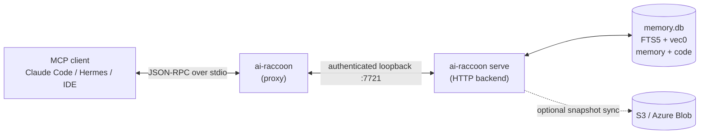

# AiRaccoon

[](https://github.com/Arasz/ai-raccoon/actions/workflows/build.yml)
[](https://github.com/Arasz/ai-raccoon/actions/workflows/publish.yml)
[](https://www.nuget.org/packages/ai-raccoon)

An MCP server that gives AI agents persistent, project-scoped memory and a searchable index of the project's own code. It runs locally on .NET 10 and SQLite, with hybrid keyword and semantic search, workspace sandboxes, a shared cross-project tier, and optional cloud sync.



## Breaking changes

What to do when you upgrade past each version. A version not listed here needs no action.

- 1.47.0: the bundled embedding model is now granite-embedding-small-english-r2, for memory and code alike. On first start after upgrading, every bank re-embeds once on its own (the bank refuses tool calls until that finishes, minutes on a large bank), and a code corpus on the old default switches with `ai-raccoon model code set default`. [ADR-0108](docs/adr/0108-one-bundled-engine-granite-small-fp16-on-the-gpu.md)
- 1.45.0: every failure exit code is renumbered into two-digit categories, for example a missing bank is now `31` (was `22`), and `repair project-ids --apply` now exits non-zero when it does not converge. If a script or CI job checks `ai-raccoon` exit codes, update it from the [old → new table](docs/adr/0107-categorized-two-digit-exit-codes.md#old--new-mapping).
- 1.44.0: `--attach` is removed. Delete it from your MCP client config, and **stop any server an older version started** before running the new one, because mixed versions are not supported. [How-to](docs/how-to/configure-ai-raccoon-server.md#backend-launch-attach-or-start-behind-the-identity-proof)
- 1.44.0: a launch against a `--data-root` that has no bank no longer creates one. For a new data root, create the bank once with `ai-raccoon --data-root <path> serve`. [How-to](docs/how-to/configure-ai-raccoon-server.md#backend-launch-attach-or-start-behind-the-identity-proof)
- 1.42.0: `--transport stdio` and `--transport https` are removed. In your MCP client config, replace `--transport stdio` with a bare `ai-raccoon`, and run `ai-raccoon serve` where you ran an HTTPS server. [How-to](docs/how-to/configure-ai-raccoon-server.md#launch-flags)
- 1.39.0: project ids are no longer folded together automatically. If one project wrote under several ids, merge them once with `ai-raccoon repair project-ids --map <file>`. [ADR-0102](docs/adr/0102-durable-alias-map-with-p3-enforcement.md)
- 1.38.0: `memory_search` requires `sessionId`. MCP agents pick it up from the tool schema, so only code that calls the tool directly has to add it. [ADR-0097](docs/adr/0097-search-quality-kind-column.md)

## What's new

- On Apple silicon the bundled engine can also run on the Neural Engine, opt-in with `ai-raccoon settings model device coreml`. (1.53.0) [ADR-0118](docs/adr/0118-opt-in-coreml-device-on-the-neural-engine.md) · [how-to](docs/how-to/configure-embedding-engines.md)
- On Windows and Linux x64 the bundled engine runs on the GPU through WebGPU again, from ONNX Runtime's own WebGPU-enabled core that now ships inside the package; linux-arm64 stays on the CPU. (1.52.0) [ADR-0115](docs/adr/0115-bundle-onnxruntimes-webgpu-core-for-windows-and-linux-x64.md) · [how-to](docs/how-to/configure-embedding-engines.md)
- The server went from up to a full core of CPU and a 6.8 GB footprint to about 2% of one core and 1.75 GB, and embeds on the GPU with 30-90x less CPU per embed, at unchanged search quality. (1.44.3-1.51.2) [report](docs/work/2026-09-25-performance-cpu-memory-gpu.md)
- On Windows and Linux x64 the bundled engine can run on CUDA, opt-in with `ai-raccoon settings model device cuda <path>`, unmeasured; the WebGPU plugin shipped in 1.51.0 is off again in 1.51.2. (1.51.0) [ADR-0112](docs/adr/0112-webgpu-plugin-off-macos-and-opt-in-cuda.md) · [how-to](docs/how-to/configure-embedding-engines.md)
- An encrypted bank tells a wrong key (exit `21`) from a corrupt file (exit `32`), using a key-check file next to the bank that never holds the key. (1.50.0) [ADR-0111](docs/adr/0111-key-check-sidecar-distinguishes-wrong-key-from-corrupt-bank.md)
- On Apple silicon the bundled engine can run through the MLX execution provider, opt-in with `ai-raccoon settings model device mlx`. (1.50.0) [ADR-0110](docs/adr/0110-opt-in-mlx-execution-provider-for-the-bundled-engine.md) · [how-to](docs/how-to/configure-embedding-engines.md)

Older releases: [What's new history](docs/reference/whats-new-history.md). A release tag is not proof of a nuget.org package, see [Releases and publishing](docs/reference/releases-and-publishing.md).

## Quick Start

Install the global tool:

```bash
dotnet tool install -g ai-raccoon
```

Activate the bundled embedding engine. A fresh bank has no memory engine until you run this, and `memory_search` stays keyword-only (it says so in its `warning`):

```bash
ai-raccoon model embedding set local
```

Add AiRaccoon to your agent's `.mcp.json`:

```json
{
  "mcpServers": {
    "ai-raccoon": { "command": "ai-raccoon" }
  }
}
```

The full walkthrough, including indexing your code, is [Get started with AiRaccoon](docs/tutorials/get-started-with-ai-raccoon.md).

## What it does

| Feature | What you get | Docs |
|---|---|---|
| Project-scoped memory | Notes partitioned by project id, in `~/.ai-raccoon` or `<project>/.ai-raccoon` | [Capabilities](docs/explanation/agent-memory-capabilities.md#storage-architecture-and-scope-partitioning) |
| Hybrid search | FTS5 keyword and vec0 vector search, fused with Reciprocal Rank Fusion, with relevance floors and per-hit evidence | [Search pipeline](docs/explanation/agent-memory-capabilities.md#hybrid-search-pipeline-fts5--vec0--rrf) · [Parameters](docs/reference/search-parameters.md) |
| Code corpus | A separate, never-synced index of 37 source extensions across C#, F#, Java, Kotlin, Scala, Python, Ruby, PHP, Lua, shell, TS/JS, Vue, Go, Rust, C/C++, Objective-C, Swift, HTML, CSS/SCSS, SQL, Terraform/HCL and Gherkin; `memory_search kind=code` or `kind=both`, `code_get` by hash | [How-to](docs/how-to/search-the-code-corpus.md) · [Dossier](docs/features/code-corpus/) |
| File watching | Watched directories re-ingest on change, honouring `ai-raccoon.ignore` ([template](docs/reference/ai-raccoon-ignore-template.ignore)) | [Dossier](docs/features/file-watcher/) |
| Workspace sandboxes | Isolated in-progress notes that consolidate into the project or get discarded | [Workspaces](docs/explanation/agent-memory-capabilities.md#workspace-sandbox-context-lifecycle) |
| Shared tier | Cross-project facts promoted by `memory_share`, exempt from decay | [Shared tier](docs/explanation/agent-memory-capabilities.md#propose-and-shared-promotion-tier) |
| Rating and decay | Retrieval raises a memory's rating; a background sweep expires what nobody uses | [Degradation](docs/explanation/agent-memory-capabilities.md#memory-rating-and-degradation-sweep-reaper) |
| Cloud sync | Optional S3 or Azure Blob snapshot sync with optimistic locking | [Architecture](docs/explanation/architecture.md#sync-cycle) |
| Encryption at rest | Page-level ChaCha20 via `AIRACCOON_DB_PASSPHRASE`, rekeyable | [Configure](docs/how-to/configure-ai-raccoon-server.md#manage-database-encryption) · [Rekey](docs/how-to/rekey-an-encrypted-bank.md) |
| Telemetry | OpenTelemetry metrics and traces, OTLP export, `memory_performance` | [Monitor](docs/how-to/monitor-and-export-telemetry.md) · [Metrics](docs/how-to/read-performance-metrics.md) |

Every MCP tool and its parameters are in the [tool reference](docs/reference/agent-memory-server.md); every command, option and exit code is in the [CLI reference](docs/reference/cli-reference.md).

## Embedding models

Memory and code each have their own engine. Both default to the same bundled model, so nothing is downloaded.

| Engine | Model | Dimensions | Notes |
|---|---|---|---|
| Bundled (default) | `granite-embedding-small-english-r2`, fp16 | 384 | Memory and code. WebGPU on macOS, CPU elsewhere |
| Downloaded | Any Hugging Face model with a `tokenizer.json` or a WordPiece/SentencePiece vocab, via `model download` | from the model | Memory or code |
| Remote | Any OpenAI-compatible `/v1/embeddings` endpoint | from the endpoint | Memory only |

Against the previous defaults, granite scores memory nDCG@10 0.632 (MiniLM 0.605) and code MRR@10 0.788 over 12 languages (MiniLM 0.643, code-daemon-embed-v1 0.391). With identifier-aware code search on top, code nDCG@5 went from 0.501 to 0.824. Sources: [ADR-0108](docs/adr/0108-one-bundled-engine-granite-small-fp16-on-the-gpu.md), [code retrieval eval](docs/work/2026-09-23-code-retrieval-eval-results.md). Setup and the full model table: [Configure embedding engines](docs/how-to/configure-embedding-engines.md) · [Benchmarks](docs/reference/embedding-benchmark.md).

## Running the server

```bash
ai-raccoon        # proxy (what MCP clients run): attaches to the backend, starting it if needed
ai-raccoon serve  # the HTTP backend: owns the bank, idle watchdog, token-authenticated loopback
ai-raccoon serve observability counters   # live counters via dotnet-counters
```

Ports, environment variables, encryption and upgrades: [Configure and run the server](docs/how-to/configure-ai-raccoon-server.md).

## Project layout

```text
src/AiRaccoon/                 # CLI, proxy and MCP tool handlers (thin)
src/AiRaccoon.Core/            # Domain: memory, search fusion, chunking, workspaces, rating
src/AiRaccoon.Infrastructure/  # SQLite store, embeddings, sync, maintenance jobs
tests/AiRaccoon.Tests/         # xUnit v3 suite (about 2,600 test methods)
benchmarks/                    # BenchmarkDotNet and retrieval benchmarks
scripts/                       # Python tooling, see docs/how-to/run-the-python-scripts.md
```

Design background: [Architecture](docs/explanation/architecture.md) and the [ADRs](docs/adr/README.md).

## Documentation

[Documentation tree](docs/README.md): [tutorials](docs/tutorials/README.md), [how-to](docs/how-to/README.md), [explanation](docs/explanation/README.md), [reference](docs/reference/README.md), [ADRs](docs/adr/README.md).

## Contributing & Security

- [CLAUDE.md](CLAUDE.md) holds repo conventions, including the mandatory TDD workflow.
- Before packing the tool from source, run `python3 scripts/download-embedding-model.py`. The bundled
  model's weights are downloaded, not committed, and `dotnet pack` stops without them.
- Report security issues privately per [SECURITY.md](SECURITY.md).

## License

[MIT](LICENSE). Copyright (c) 2026 Rafał Araszkiewicz.
