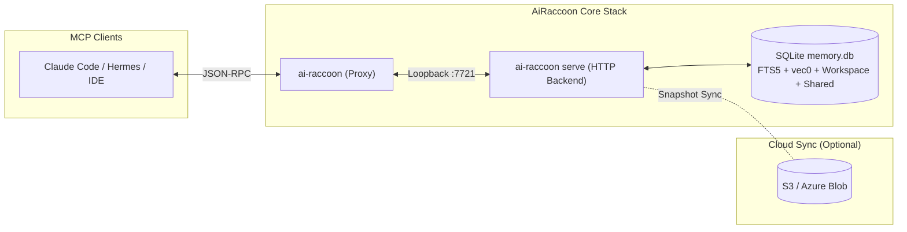
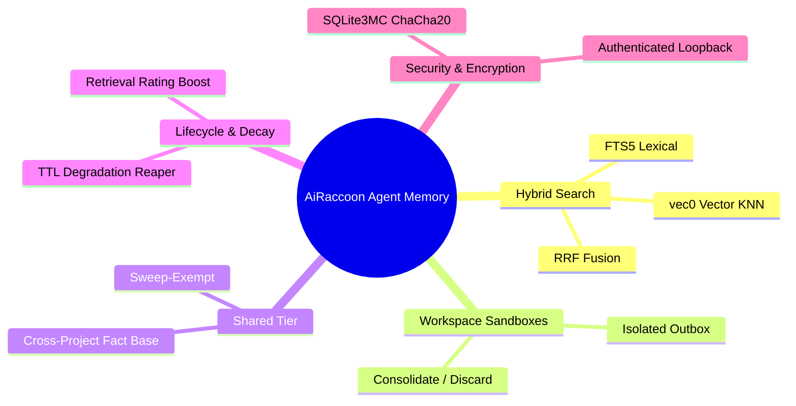

# AiRaccoon

[](https://github.com/Arasz/ai-raccoon/actions/workflows/build.yml)
[](https://github.com/Arasz/ai-raccoon/actions/workflows/nightly.yml)
[](https://github.com/Arasz/ai-raccoon/actions/workflows/publish.yml)
[](https://www.nuget.org/packages/ai-raccoon)

An MCP server providing AI agents with persistent, project-scoped memory. Built on .NET 10 with local-first SQLite, hybrid FTS5+vec0 search, workspace sandboxes, a shared promotion tier, and optional cloud sync.



## What's new

- **A re-ingested file no longer leaves stale chunks behind — direct ingest prunes what the file no longer contains.** (1.31.0) [#420](https://github.com/Arasz/ai-raccoon/pull/420)
- **Cloud snapshots are authenticity-checked (HMAC) before attach, and model activation verifies sha256 pins.** An encrypted bank synced by ≥1.31 cannot be pulled by <1.31; upgrade both ends of an encrypted sync pair together. (1.31.0) [#431](https://github.com/Arasz/ai-raccoon/pull/431) · [#429](https://github.com/Arasz/ai-raccoon/pull/429)
- **A model with wrong-by-construction token ids is refused instead of silently mis-embedding.** (1.31.0) [#423](https://github.com/Arasz/ai-raccoon/pull/423)
- **Hardening wave: exit codes 22/23 for missing-bank and settings errors ([#433](https://github.com/Arasz/ai-raccoon/pull/433), [#426](https://github.com/Arasz/ai-raccoon/pull/426)), fail-fast unpackaged auto-start ([#430](https://github.com/Arasz/ai-raccoon/pull/430)), reconcile-at-open ([#432](https://github.com/Arasz/ai-raccoon/pull/432)), scoped promotion_list ([#424](https://github.com/Arasz/ai-raccoon/pull/424)).** (1.31.0)
- **`model download` now derives sentencepiece special-token ids from the model itself — repos without `added_tokens_decoder` work.** (1.30.1) [#417](https://github.com/Arasz/ai-raccoon/issues/417)
- **A second corpus indexes your code, searchable via `memory_search kind=code` — never synced, never mixed with memory.** (1.30.0) [Feature](docs/features/code-corpus/) · [ADR-0085](docs/adr/0085-a-second-code-only-corpus-in-the-same-bank.md)
- **The server probe's retry is real — a warming server now gets all three attempts, not one.** (1.29.1)
- **Bring your own embedding model: manifest-driven engines, `ai-raccoon model download`, sentencepiece support.** (1.29.0) [ADR-0084](docs/adr/0084-arbitrary-embedding-models-are-manifest-described.md)
- **Every search parameter is now configurable — per call and per bank — no rebuild needed.** (1.28.0) [ADR-0083](docs/adr/0083-search-parameters-unified-source.md)
- **The CLI no longer opens the bank itself — `noise entries` and `watch registered` reach the server too, completing the single-writer rule.** (1.27.0) [ADR-0075](docs/adr/0075-only-the-server-writes-to-the-bank.md)
- **A repair now finishes on its own — it embeds what it re-ingested, instead of leaving it unsearchable.** (1.26.0) [ADR-0075](docs/adr/0075-only-the-server-writes-to-the-bank.md)
- **The memory now measures its own performance, and you can ask it.** (1.20.0) [ADR-0074](docs/adr/0074-a-capped-buffer-satisfies-the-channel-rule-and-reshapes-g4.md) · [How-to](docs/how-to/read-performance-metrics.md)
- **A long memory_write now matches on the chunk it stored, not the first page of the document.** (1.19.1) [ADR-0073](docs/adr/0073-a-write-embeds-the-chunk-it-stored.md)
- **The bank now compacts itself, and repairs entries too long to be searchable.** (1.17.0) [ADR-0070](docs/adr/0070-maintenance-is-a-list-of-jobs-with-a-ledger.md)
- **A long `memory_write` is now searchable across its whole length.** (1.15.0) [ADR-0064](docs/adr/0064-memory-write-chunks-like-everything-else.md)
- **Naming `shared` on a write asks for promotion instead of bypassing review.** (1.15.0) [ADR-0067](docs/adr/0067-naming-shared-asks-for-promotion.md)
- **Workspaces no longer require `full`.** (1.13.0) [ADR-0052](docs/adr/0052-the-workspace-lifecycle-is-a-write-not-a-destruction.md)
- **SECURITY — a delete could name another project, and wipe the shared tier.** (1.13.0) [ADR-0051](docs/adr/0051-a-context-never-names-another-project.md)
- **BREAKING — `memory_search`'s `minScore` is now `minRelativeScore`, and defaults to off.** (1.12.0) [ADR-0047](docs/adr/0047-relative-score-floor.md)
- **Section-anchored search works, and ranking improved with it.** (1.12.0) [ADR-0044](docs/adr/0044-section-fts-weight.md)
- **Noise filtering, rebuilt around what could be measured.** (1.12.0) [ADR-0040](docs/adr/0040-read-path-query-guard.md)
- **Honest write outcomes and one explicit TTL path.** (1.12.0) [ADR-0032](docs/adr/0032-truthful-write-outcome.md) · [ADR-0034](docs/adr/0034-explicit-ttl-is-authoritative.md)
- **Semantic promotion classifier removed.** (1.11.0) [Why it was removed](docs/work/2026-08-13-fixing-zero-shot-promotion-classifier.md)
- **Semantic Noise Filtering & Real-time TTLs.** (1.9.0) [ADR-0029](docs/adr/0029-pre-write-noise-filtering.md) · [ADR-0030](docs/adr/0030-realtime-heuristic-ttl.md)
- **FileType Handlers & Native JSON Support.** (1.8.0) [ADR-0027](docs/adr/0027-extensible-file-type-handlers-and-json-support.md)
- **Search-Quality Metric System.** (1.7.0) [Plan](docs/plans/2026-08-11-search-quality-metric-plan.md)
- **Persistent Propose Queue Discards.** (1.6.5) [ADR-0026](docs/adr/0026-persistent-discards-and-shared-exclusion.md)
- **Always-On HTTP Proxy.** (1.6.0) [ADR-0020](docs/adr/0020-always-on-http-stdio-proxy.md)

---

## Quick Start

Install the global CLI tool (`ai-raccoon`):

```bash
dotnet tool install -g ai-raccoon
```

Add AiRaccoon to your agent's `.mcp.json`:

```json
{
  "mcpServers": {
    "ai-raccoon": { "command": "ai-raccoon" }
  }
}
```

> 📖 **Full Walkthrough:** See [Get started with AiRaccoon](docs/tutorials/get-started-with-ai-raccoon.md) for migration guides, transport options (proxy, stdio, http), and initial setup steps.

---

## Agent Capabilities at a Glance



| Feature | Description | Reference Guide |
|---|---|---|
| **Scope Partitioning** | Local banks in `~/.ai-raccoon` or `<project>/.ai-raccoon`, partitioned by `project:<id>` | [Capabilities Overview](docs/explanation/agent-memory-capabilities.md#storage-architecture--scope-partitioning) |
| **Hybrid Search** | Reciprocal Rank Fusion (RRF) combining keyword and vector semantic search | [Search Pipeline Guide](docs/explanation/agent-memory-capabilities.md#hybrid-search-pipeline-fts5--vec0--rrf) |
| **Workspace Sandboxes** | Isolated edit outboxes with explicit consolidation or discard | [Workspace Guide](docs/explanation/agent-memory-capabilities.md#workspace-sandbox-context-lifecycle) |
| **Shared Tier** | Elevated cross-project facts exempt from degradation sweeps | [Shared Tier Guide](docs/explanation/agent-memory-capabilities.md#propose--shared-promotion-tier) |
| **Memory Degradation** | Retrieval-based rating boost with automated background TTL sweeps | [Degradation Guide](docs/explanation/agent-memory-capabilities.md#memory-rating-and-degradation-sweep-reaper) |
| **Cloud Sync** | Optional S3 / Azure Blob VACUUM snapshot sync with optimistic locking | [Architecture Explanation](docs/explanation/architecture.md#cloud-sync-cycle) |
| **Encryption at Rest** | Page-level ChaCha20 encryption via `AIRACCOON_DB_PASSPHRASE` | [Configuration Recipe](docs/how-to/configure-ai-raccoon-server.md#managing-database-encryption) |

> 📖 **Detailed Architecture:** Read the complete [Agent Memory Capabilities Explanation](docs/explanation/agent-memory-capabilities.md) and [Tool Contract Reference](docs/reference/agent-memory-server.md).

---

## Configuration & Server Execution

Run in proxy mode (default), stdio, or background HTTP serve mode:

```bash
ai-raccoon                    # Proxy mode (Default): relays to HTTP backend, auto-starting if needed
ai-raccoon --transport stdio  # In-process standalone server
ai-raccoon serve              # Long-lived daemon with idle watchdog and loopback token auth
```

> 📖 **Configuration Recipe:** Learn about environment variables, port binding, database encryption passphrases, and zero-downtime updates in [Configure and run the AiRaccoon server](docs/how-to/configure-ai-raccoon-server.md).

---

## Embeddings

AiRaccoon supports in-process ONNX models and remote OpenAI-compatible backends:

| Engine | Model | Latency | Benchmark MRR |
|---|---|---|---|
| **Local (Default)** | Bundled `all-MiniLM-L6-v2` (int8) | ~9 ms | 0.836 |
| **Remote OpenAI** | `text-embedding-3-small` / Ollama | ~25-120 ms | 0.854 - 0.858 |

> 📖 **Setup & Benchmarks:** See [Configure embedding engines](docs/how-to/configure-embedding-engines.md) and [Embedding Benchmark Data](docs/reference/embedding-benchmark.md).

---

## Observability & Telemetry

Inspect live performance or stream OpenTelemetry metrics and traces:

```bash
ai-raccoon serve observability pid        # Discover live server PID
ai-raccoon serve observability counters   # Launch dotnet-counters
ai-raccoon serve observability trace      # Capture dotnet-trace spans
```

> 📖 **Telemetry Guide:** See [Monitor and export server telemetry](docs/how-to/monitor-and-export-telemetry.md) and [OTLP Export Boundaries (ADR-0009)](docs/adr/0009-otlp-export.md).

---

## Architecture Overview

```text
src/AiRaccoon/                 # Thin MCP Server (Tool handlers)
src/AiRaccoon.Core/            # Pure Domain (Memory logic, RRF, Workspace, Rating)
src/AiRaccoon.Infrastructure/  # SQLite Store, Embeddings, S3/Azure Sync
tests/AiRaccoon.Tests/         # xunit.v3 test suite (1100+ tests)
```

> 📖 **Deep Dive:** Read [Architecture Explanation](docs/explanation/architecture.md).

---

## Documentation Index

Explore the complete [Documentation Tree](docs/README.md):

- [Tutorials](docs/tutorials/README.md) — Step-by-step guides for newcomers
- [How-To Recipes](docs/how-to/README.md) — Goal-oriented configuration and operations
- [Explanation](docs/explanation/README.md) — Architectural background and design concepts
- [Reference](docs/reference/README.md) — Tool contracts, CLI verbs, and benchmarks
- [ADRs](docs/adr/README.md) — Architectural Decision Records

---

## Contributing & Security

- Read [CLAUDE.md](CLAUDE.md) for repo conventions and mandatory TDD workflow.
- `scripts/` holds standalone Python tooling (embedding-model download, JSAA docs ingest,
  benchmark-corpus generation, and more) — see [Run the Python scripts](docs/how-to/run-the-python-scripts.md)
  for setup with `uv`.
- Report security issues privately per [SECURITY.md](SECURITY.md).

## License

[MIT](LICENSE). Copyright (c) 2026 Rafał Araszkiewicz.
