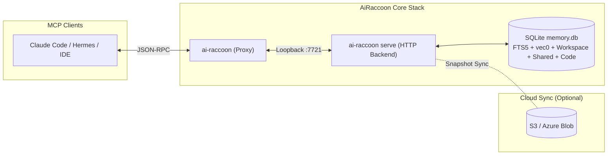
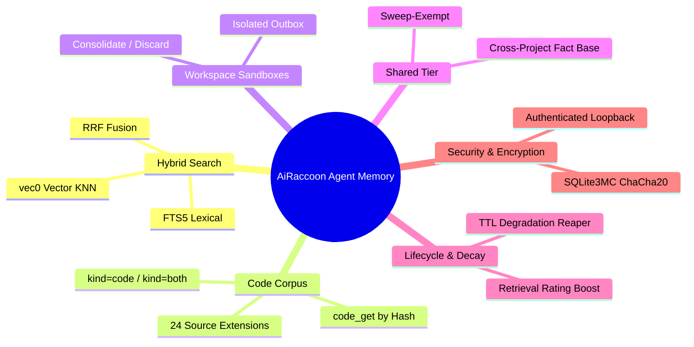

# AiRaccoon

[](https://github.com/Arasz/ai-raccoon/actions/workflows/build.yml)
[](https://github.com/Arasz/ai-raccoon/actions/workflows/publish.yml)
[](https://www.nuget.org/packages/ai-raccoon)

An MCP server providing AI agents with persistent, project-scoped memory. Built on .NET 10 with local-first SQLite, hybrid FTS5+vec0 search, workspace sandboxes, a shared promotion tier, and optional cloud sync.



## What's new

- **Run-once project-ids repair with P3 enforcement.** `repair project-ids --apply` now derives, applies, polls and re-derives until the bank reports a falsifiable verdict (converged or pinned-only with reasons); NULL-context and custom-scope rows fold byte-identical to their winners, telemetry stays out of verdicts, and the applied map persists so drops are refused and alias writes fold through from then on. (1.41.0) [ADR-0100](docs/adr/0100-repair-folds-all-committed-scopes.md) · [ADR-0101](docs/adr/0101-repair-verdicts-ignore-telemetry-workspaces-block.md) · [ADR-0102](docs/adr/0102-durable-alias-map-with-p3-enforcement.md) · [ADR-0103](docs/adr/0103-run-until-fixed-loop-with-falsifiable-verdict.md)
- **Pre-filled project-ids repair template.** (1.40.0) [ADR-0099](docs/adr/0099-empty-default-alias-map.md)
- **BREAKING: the public binary no longer folds any project id automatically.** `repair project-ids` folds are now a one-shot `--map <path>` file, transported to the server on `--apply`; a map-less dry run writes an editable, non-overwriting template at `<data-root>/project-id-map.template.json` with per-id attribution hints. Operators who relied on 1.38.0's automatic `job-search-ai-assistant`/`AI-RACCOON` folding must run one mapped repair. (1.39.0) [ADR-0099](docs/adr/0099-empty-default-alias-map.md)
- **BREAKING: `memory_search` requires `sessionId`, and each project resolves to exactly one project id.** Fragmented ids collapse onto one canonical id per project; results also carry `fusionStrength`/`legs`/`cosine` and `search_quality` records the search `kind`. (1.38.0) [ADR-0097](docs/adr/0097-search-quality-kind-column.md) · [ADR-0098](docs/adr/0098-telemetry-never-syncs.md)
- **Memory and code engines are now configured separately.** `model embedding set local|openai` selects the memory bank's engine; `model code set default|local` the code corpus's; `model download` stays fetch-only (it never activates). Configuration reads back under `settings model embedding show|reset` and `settings model code show|reset`. (1.35.0)
- **The code corpus accepts any embedding dimension.** `model code set local` no longer refuses non-768 manifests — activation reconciles `vec_code` to the manifest's dimension in the same transaction (the memory bank's D3 reconcile, shared), records it as `embedding.codeDimensions`, and the server-open + fingerprint paths reconcile too. Fresh banks still start at 768; existing banks are untouched until a different-dimension engine activates. (1.35.0) [ADR-0093](docs/adr/0093-vec-code-is-dimension-agnostic-through-the-shared-d3-reconciler.md) · [How-to](docs/how-to/configure-embedding-engines.md)
- **`memory_search` defaults to `kind=both`.** Hits the memory bank and code corpus, each ranked by its own hybrid (no cross-corpus fusion, `kind=memory` for the pre-1.34 envelope); with no code engine configured it degrades to keyword-only code results rather than refusing. (1.34.0) [ADR-0088](docs/adr/0088-code-search-surface-kind-envelope-no-fusion.md) · [How-to](docs/how-to/search-the-code-corpus.md)
- **`project_id_token_get` mints and registers a project id.** (1.33.2) [ADR-0089](docs/adr/0089-the-project-id-is-a-guidv7-and-that-is-not-access-control.md)
- **`memory_performance` now reports the maintenance-job, embed-drain, replace-lock and query-truncation series.** (1.33.2) [ADR-0091](docs/adr/0091-the-event-pump-never-blocks-a-producer.md)
- **Two knobs bound the embedding engine.** `settings model threads <n>` caps ORT intra-op threads; `settings maintenance embed-rows-per-run <n>` sets the per-tick drain. `doctor` shows the effective thread count. (1.33.0) [ADR-0091](docs/adr/0091-the-event-pump-never-blocks-a-producer.md)

> 📜 **Older releases:** See [What's new history](docs/reference/whats-new-history.md) for highlights from 1.6.0 through 1.32.0.

---

## Quick Start

Install the global CLI tool (`ai-raccoon`):

```bash
dotnet tool install -g ai-raccoon
```

Add AiRaccoon to your agent's `.mcp.json`:

```json
{
  "mcpServers": {
    "ai-raccoon": { "command": "ai-raccoon" }
  }
}
```

> 📖 **Full Walkthrough:** See [Get started with AiRaccoon](docs/tutorials/get-started-with-ai-raccoon.md) for migration guides, transport options (proxy, stdio, http), and initial setup steps.

---

## Agent Capabilities at a Glance



| Feature | Description | Reference Guide |
|---|---|---|
| **Scope Partitioning** | Local banks in `~/.ai-raccoon` or `<project>/.ai-raccoon`, partitioned by `project:<id>` | [Capabilities Overview](docs/explanation/agent-memory-capabilities.md#storage-architecture--scope-partitioning) |
| **Hybrid Search** | Reciprocal Rank Fusion (RRF) combining keyword and vector semantic search | [Search Pipeline Guide](docs/explanation/agent-memory-capabilities.md#hybrid-search-pipeline-fts5--vec0--rrf) |
| **Code Corpus** | A second, code-only corpus searchable via `memory_search kind=code` or `kind=both`; 24 source-file extensions; never synced, never mixed with memory | [Code Corpus Feature](docs/features/code-corpus/) · [ADR-0085](docs/adr/0085-a-second-code-only-corpus-in-the-same-bank.md) |
| **Workspace Sandboxes** | Isolated edit outboxes with explicit consolidation or discard | [Workspace Guide](docs/explanation/agent-memory-capabilities.md#workspace-sandbox-context-lifecycle) |
| **Shared Tier** | Elevated cross-project facts exempt from degradation sweeps | [Shared Tier Guide](docs/explanation/agent-memory-capabilities.md#propose--shared-promotion-tier) |
| **Memory Degradation** | Retrieval-based rating boost with automated background TTL sweeps | [Degradation Guide](docs/explanation/agent-memory-capabilities.md#memory-rating-and-degradation-sweep-reaper) |
| **Cloud Sync** | Optional S3 / Azure Blob VACUUM snapshot sync with optimistic locking | [Architecture Explanation](docs/explanation/architecture.md#cloud-sync-cycle) |
| **Encryption at Rest** | Page-level ChaCha20 encryption via `AIRACCOON_DB_PASSPHRASE` | [Configuration Recipe](docs/how-to/configure-ai-raccoon-server.md#managing-database-encryption) |

> 📖 **Detailed Architecture:** Read the complete [Agent Memory Capabilities Explanation](docs/explanation/agent-memory-capabilities.md) and [Tool Contract Reference](docs/reference/agent-memory-server.md).

---

## Configuration & Server Execution

Run in proxy mode (default), stdio, or background HTTP serve mode:

```bash
ai-raccoon                    # Proxy mode (Default): relays to HTTP backend, auto-starting if needed
ai-raccoon --transport stdio  # In-process standalone server
ai-raccoon serve              # Long-lived daemon with idle watchdog and loopback token auth
```

> 📖 **Configuration Recipe:** Learn about environment variables, port binding, database encryption passphrases, and zero-downtime updates in [Configure and run the AiRaccoon server](docs/how-to/configure-ai-raccoon-server.md).

---

## Embeddings

AiRaccoon supports in-process ONNX models and remote OpenAI-compatible backends. The memory and code corpora use independent engines.

| Engine | Model | Latency | Benchmark MRR |
|---|---|---|---|
| **Local (Default)** | Bundled `all-MiniLM-L6-v2` (int8) | ~9 ms | 0.836 |
| **Remote OpenAI** | `text-embedding-3-small` / Ollama | ~25-120 ms | 0.854 - 0.858 |
| **Code Corpus** | `faxenoff/code-daemon-embed-v1` (768-dim, fp32) | local | separate corpus |

> 📖 **Setup & Benchmarks:** See [Configure embedding engines](docs/how-to/configure-embedding-engines.md) and [Embedding Benchmark Data](docs/reference/embedding-benchmark.md).

---

## Observability & Telemetry

Inspect live performance or stream OpenTelemetry metrics and traces:

```bash
ai-raccoon serve observability pid        # Discover live server PID
ai-raccoon serve observability counters   # Launch dotnet-counters
ai-raccoon serve observability trace      # Capture dotnet-trace spans
```

> 📖 **Telemetry Guide:** See [Monitor and export server telemetry](docs/how-to/monitor-and-export-telemetry.md) and [OTLP Export Boundaries (ADR-0009)](docs/adr/0009-otlp-export.md).

---

## Architecture Overview

```text
src/AiRaccoon/                 # Thin MCP Server (Tool handlers)
src/AiRaccoon.Core/            # Pure Domain (Memory logic, RRF, Workspace, Rating)
src/AiRaccoon.Infrastructure/  # SQLite Store, Embeddings, S3/Azure Sync
tests/AiRaccoon.Tests/         # xunit.v3 test suite (~3700 tests)
```

> 📖 **Deep Dive:** Read [Architecture Explanation](docs/explanation/architecture.md).

---

## Documentation Index

Explore the complete [Documentation Tree](docs/README.md):

- [Tutorials](docs/tutorials/README.md) — Step-by-step guides for newcomers
- [How-To Recipes](docs/how-to/README.md) — Goal-oriented configuration and operations
- [Explanation](docs/explanation/README.md) — Architectural background and design concepts
- [Reference](docs/reference/README.md) — Tool contracts, CLI verbs, and benchmarks
- [ADRs](docs/adr/README.md) — Architectural Decision Records

---

## Contributing & Security

- Read [CLAUDE.md](CLAUDE.md) for repo conventions and mandatory TDD workflow.
- `scripts/` holds standalone Python tooling (embedding-model download, JSAA docs ingest,
  benchmark-corpus generation, and more) — see [Run the Python scripts](docs/how-to/run-the-python-scripts.md)
  for setup with `uv`.
- Report security issues privately per [SECURITY.md](SECURITY.md).

## License

[MIT](LICENSE). Copyright (c) 2026 Rafał Araszkiewicz.
