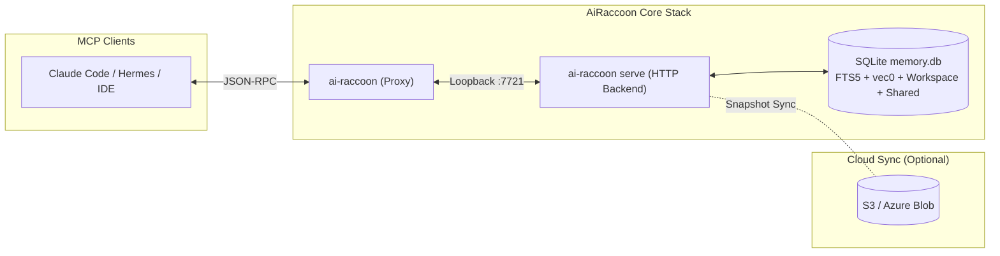
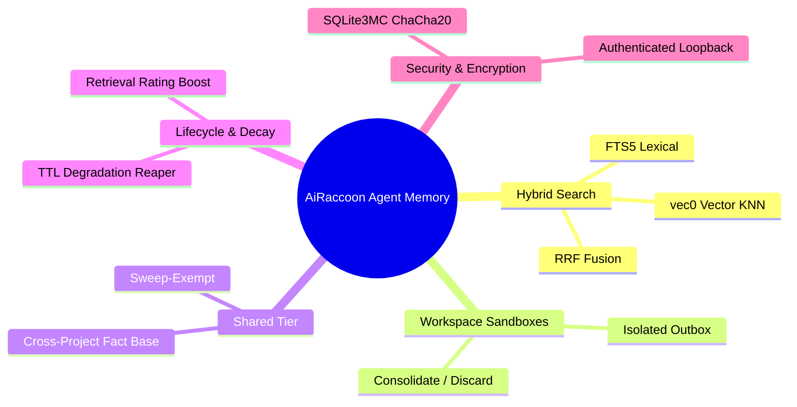

# AiRaccoon

[](https://github.com/Arasz/ai-raccoon/actions/workflows/build.yml)
[](https://github.com/Arasz/ai-raccoon/actions/workflows/nightly.yml)
[](https://github.com/Arasz/ai-raccoon/actions/workflows/publish.yml)
[](https://www.nuget.org/packages/ai-raccoon)

An MCP server providing AI agents with persistent, project-scoped memory. Built on .NET 10 with local-first SQLite, hybrid FTS5+vec0 search, workspace sandboxes, a shared promotion tier, and optional cloud sync.



## What's new

- **SECURITY — a delete could name another project, and wipe the shared tier (1.13.0).** `memory_delete_context` checked access mode against the `projectId` you passed, then built its row filter from the `context` string — whose `project:` branch bound `project_id` from *that string*, discarding the caller's, and whose `shared` branch carried no project predicate at all. Demonstrated end to end against a real server: from a project named `attacker`, `memory_delete_context(projectId: "attacker", context: "project:victim")` returned `{"deleted": 2}` and emptied the victim's project, leaving the attacker's own row untouched; `context: "shared"` destroyed the cross-project tier the same way. It needs mode `full`, which `memory_sweep` and `memory_workspace_consolidate` both require, so many installs have it. This is the same defect the 1.12.0 write-path fix closed — applied to the function it was found in rather than to the rule, leaving the delete path's copy of the mapping open a thousand lines away. One function now decides project confinement and both paths call it. [ADR-0051](docs/adr/0051-a-context-never-names-another-project.md)
- **The proxy's token-carrying HTTP client no longer follows redirects (1.13.0).** .NET strips `Authorization` across a host hop but not a custom header, so a redirect on the client that attaches `X-AiRaccoon-Token` would hand the loopback token to whoever answered. The `--restart` client was hardened against exactly this and its sibling was not — and neither had a test, so the hardened one was unprotected too. Both are now covered by a check derived from the source rather than a list.
- **`quiet.log` stops growing on framework heartbeat (1.13.0).** The file never rotates by design, while trace-level logging let `DefaultHttpClientFactory` record a cleanup cycle every 10 seconds whether or not any client was in use — 10 MB of it on one machine. The no-rotation ruling assumed sparse real events, not a metronome.
- **The rekey probe can no longer create a bank (1.13.0).** Its doc comment claimed "read-only, so a refusal leaves the file untouched" one line above `SqliteOpenMode.ReadWriteCreate`. Now `ReadWrite` — not `ReadOnly`, because a WAL bank needs a writable `-shm` to open, which would have traded a wrong comment for a broken probe.

- **BREAKING — `memory_search`'s `minScore` is now `minRelativeScore`, and defaults to off (1.12.0).** The floor was never a quality bar: scores are normalized so the top hit always scores 1.0, so it filtered relative to whatever came back. Measured against the test bank, `"how to braise a wombat in aspic"` scored `1.000, 0.972, 0.936, …` — indistinguishable from a real query. Worse, the old default of 0.7 silently truncated: at `limit=20`, 10 of 44 benchmark queries returned short; at `limit=50`, **all 44 did — 996 results against 2200 requested**. The parameter is renamed to say what it does and defaults to `0.0`, which is the value every internal caller already passed. A client still sending `minScore` is silently ignored, so update it — the bundled Hermes provider already is. [ADR-0047](docs/adr/0047-relative-score-floor.md)
- **Chunks are no longer split inside code blocks (1.12.0).** To bound chunk size, an over-budget fence was stripped of its delimiters and split as bare lines — so a chunk could begin inside a code block, and the block's real closing delimiter was then read as an *opening* one, inverting fence parity for the rest of the document. Shell comments became markdown headings. Measured on this repo's own docs: **70 of 4126 chunks ended in a different fence state than they began; now 0 of 4143.** An over-budget fence is re-fenced into bounded pieces instead, so every chunk is a well-formed markdown fragment. [ADR-0048](docs/adr/0048-a-chunk-is-a-well-formed-markdown-fragment.md)
- **A context no longer hides your memory (1.12.0).** `memory_write(context: …)` put the entry in a scope that `memory_search` only read when the caller passed the same label back — and `memory_stats` never listed those labels, so there was nothing to pass. Measured on a live server: an entry written this way returned `stored: true`, sat in the bank and in the search index, was readable by `memory_get` — and `memory_search` found nothing at any scope, including `all`. The project is the isolation boundary; a context is a label inside it. Omit `contextLabel` and a search covers every context in the project; pass one and it narrows to that context. [ADR-0045](docs/adr/0045-context-is-a-label-not-a-boundary.md)
  * The same predicate was hand-copied into nine queries, a trigger and a filter, so `memory_set_ttl` and `memory_share` still answered `unknown-hash` for an entry `memory_get` returned. It now has one definition, and a gate that fails on any copy of it. [ADR-0046](docs/adr/0046-project-membership-has-one-definition.md)
- **Section-anchored search works, and ranking improved with it (1.12.0).** `file#section` queries match against a `section` column that ingest never populated, so they could not resolve for any indexed document. With it populated, an anchored query went from rank 86 to rank 1. The column's search weight was then measured rather than assumed and dropped from 16 to 4 — better than both leaving it empty and keeping it at 16 (nDCG@5 0.5703 → 0.5733 → 0.5846). [ADR-0044](docs/adr/0044-section-fts-weight.md)
- **`serve --restart` stopped inventing a second server (1.12.0).** A probe that timed out was read as "nothing is listening", so a restart could report that another server took the port while never holding it, or call a still-running server stopped. Only a refused connection now counts as a free port. [ADR-0043](docs/adr/0043-a-probe-with-no-answer-is-not-an-empty-port.md)
- **Noise filtering, rebuilt around what could be measured (1.12.0).** The zero-shot embedding filter scored 0/50 recall against its own ADR's noise set and was removed with the learning subsystem it fed ([ADR-0033](docs/adr/0033-remove-zero-shot-noise-filter-and-noise-learning.md)). What replaced it is narrower and measured:
  * The write-path keeps only the deterministic background-process-log policy, and rejected content is kept in a noise store rather than discarded, so a future detector has training data ([ADR-0039](docs/adr/0039-noise-learning-substrate-and-shadow-mode.md), which supersedes ADR-0033 on the substrate). Shadow mode records what a detector *would* have rejected without rejecting anything.
  * A read-path guard refuses a `memory_search` query that is itself machine output and annotates one that merely contains log-like content ([ADR-0040](docs/adr/0040-read-path-query-guard.md)). Armed by default; `ai-raccoon queryguard disable` disarms it.
  * A structural/lexical detector — pure shape statistics, no embedding — joins the guard's warn tier as a third input. Off by default, never able to refuse: `ai-raccoon queryguard structural enable` ([ADR-0041](docs/adr/0041-structural-noise-detector.md)).
- **Honest write outcomes and one explicit TTL path (1.12.0).** `memory_write` used to report success for content it silently discarded. It now returns `stored`/`reason` — a refused write is reported, not lied about — and `noise.enabled` is a kill switch for pre-write rejection, mirroring `sweep.enabled`. `PromotionScorerTtlPolicy`'s write-time TTL heuristic is removed too — `memory_set_ttl` is the one explicit path. [ADR-0032](docs/adr/0032-truthful-write-outcome.md), [ADR-0033](docs/adr/0033-remove-zero-shot-noise-filter-and-noise-learning.md), [ADR-0034](docs/adr/0034-explicit-ttl-is-authoritative.md)
- **Chunks are never silently truncated again (1.12.0).** The chunk budget was counted in `o200k` tokens while the bundled model tokenizes BERT WordPiece and hard-truncates at its window — so **1356 of 3636 chunks (37.3%) of this repo's own docs had text the vector index could never see**, while still reporting `embed_state='embedded'`. A single unbalanced code fence was worse: it made the rest of a document one atomic chunk, of which 95% never reached the model. The budget is now derived from the embedding engine's own window minus its special tokens (254, not 256 — the encoder adds `[CLS]`/`[SEP]` before truncating), counted with the tokenizer that will actually embed, and no unit is atomic above the budget: an oversized one is split at token boundaries. Measured after: **0 chunks over the window**. [ADR-0036](docs/adr/0036-engine-aware-chunk-token-budget.md)
  * Known gap, detected but not fixed: `\n`/`\t` are not word separators for this tokenizer, so a ≥100-character run with no space or punctuation collapses to a single `[UNK]` and embeds as nothing. Measured at 1 affected entry in 15,246 on a real bank; `EventId 415` now reports it.
- **Semantic promotion classifier removed (1.11.0).** [Why it was removed](docs/work/2026-08-13-fixing-zero-shot-promotion-classifier.md)
- **Auto-Improving Dynamic Noise Vectors (1.10.0)** — *superseded; the centroid clustering it describes was removed in 1.12.0.* Measured silhouette on real noise was 0.047-0.142 with 93% singleton clusters, so the clusters carried no signal to learn from. See [ADR-0039](docs/adr/0039-noise-learning-substrate-and-shadow-mode.md) for what stayed.
- **Semantic Noise Filtering & Real-time TTLs (1.9.0)** — [ADR-0029](docs/adr/0029-pre-write-noise-filtering.md) and [ADR-0030](docs/adr/0030-realtime-heuristic-ttl.md)
  * **Write Performance Benchmarks** (`baseline -> change -> effect`) — measured when the zero-shot filter was still in place; the interception column now describes the deterministic policy that replaced it, and the recall figure below belongs to a filter that no longer ships. Measured in `WritePerformanceBenchmarkTests` (`tests/AiRaccoon.Tests/Integration/WritePerformanceBenchmarkTests.cs`) and documented in `docs/work/2026-08-13-v4-write-performance-benchmark-report.md`:
    | Metric | Valid Memory Write (Baseline) | Noise Interception | Effect / Expected Return |
    |---|---|---|---|
    | Avg Latency per Write | 11.77 ms | 0.94 ms | **12.5x speedup** on noise handling |
    | Throughput | 84.97 ops/sec | 1,063.8 ops/sec | Bypasses database disk writes, FTS5 & vec0 indexing |
    | Rejection Recall | 0% false positives | 100% (50/50 noise logs) | Completely blocks background process noise logs |
- **FileType Handlers & Native JSON Support (1.8.0)** — [ADR-0027](docs/adr/0027-extensible-file-type-handlers-and-json-support.md)
- **Search-Quality Metric System (1.7.0)** — [Plan](docs/plans/2026-08-11-search-quality-metric-plan.md)
- **Persistent Propose Queue Discards (1.6.5)** — [ADR-0026](docs/adr/0026-persistent-discards-and-shared-exclusion.md)
- **Always-On HTTP Proxy (1.6.0)** — [ADR-0020](docs/adr/0020-always-on-http-stdio-proxy.md)

---

## Quick Start

Install the global CLI tool (`ai-raccoon`):

```bash
dotnet tool install -g ai-raccoon
```

Add AiRaccoon to your agent's `.mcp.json`:

```json
{
  "mcpServers": {
    "ai-raccoon": { "command": "ai-raccoon" }
  }
}
```

> 📖 **Full Walkthrough:** See [Get started with AiRaccoon](docs/tutorials/get-started-with-ai-raccoon.md) for migration guides, transport options (proxy, stdio, http), and initial setup steps.

---

## Agent Capabilities at a Glance



| Feature | Description | Reference Guide |
|---|---|---|
| **Scope Partitioning** | Local banks in `~/.ai-raccoon` or `<project>/.ai-raccoon`, partitioned by `project:<id>` | [Capabilities Overview](docs/explanation/agent-memory-capabilities.md#storage-architecture--scope-partitioning) |
| **Hybrid Search** | Reciprocal Rank Fusion (RRF) combining keyword and vector semantic search | [Search Pipeline Guide](docs/explanation/agent-memory-capabilities.md#hybrid-search-pipeline-fts5--vec0--rrf) |
| **Workspace Sandboxes** | Isolated edit outboxes with explicit consolidation or discard | [Workspace Guide](docs/explanation/agent-memory-capabilities.md#workspace-sandbox-context-lifecycle) |
| **Shared Tier** | Elevated cross-project facts exempt from degradation sweeps | [Shared Tier Guide](docs/explanation/agent-memory-capabilities.md#propose--shared-promotion-tier) |
| **Memory Degradation** | Retrieval-based rating boost with automated background TTL sweeps | [Degradation Guide](docs/explanation/agent-memory-capabilities.md#memory-rating-and-degradation-sweep-reaper) |
| **Cloud Sync** | Optional S3 / Azure Blob VACUUM snapshot sync with optimistic locking | [Architecture Explanation](docs/explanation/architecture.md#cloud-sync-cycle) |
| **Encryption at Rest** | Page-level ChaCha20 encryption via `AIRACCOON_DB_PASSPHRASE` | [Configuration Recipe](docs/how-to/configure-ai-raccoon-server.md#managing-database-encryption) |

> 📖 **Detailed Architecture:** Read the complete [Agent Memory Capabilities Explanation](docs/explanation/agent-memory-capabilities.md) and [Tool Contract Reference](docs/reference/agent-memory-server.md).

---

## Configuration & Server Execution

Run in proxy mode (default), stdio, or background HTTP serve mode:

```bash
ai-raccoon                    # Proxy mode (Default): relays to HTTP backend, auto-starting if needed
ai-raccoon --transport stdio  # In-process standalone server
ai-raccoon serve              # Long-lived daemon with idle watchdog and loopback token auth
```

> 📖 **Configuration Recipe:** Learn about environment variables, port binding, database encryption passphrases, and zero-downtime updates in [Configure and run the AiRaccoon server](docs/how-to/configure-ai-raccoon-server.md).

---

## Embeddings

AiRaccoon supports in-process ONNX models and remote OpenAI-compatible backends:

| Engine | Model | Latency | Benchmark MRR |
|---|---|---|---|
| **Local (Default)** | Bundled `all-MiniLM-L6-v2` (int8) | ~9 ms | 0.836 |
| **Remote OpenAI** | `text-embedding-3-small` / Ollama | ~25-120 ms | 0.854 - 0.858 |

> 📖 **Setup & Benchmarks:** See [Configure embedding engines](docs/how-to/configure-embedding-engines.md) and [Embedding Benchmark Data](docs/reference/embedding-benchmark.md).

---

## Observability & Telemetry

Inspect live performance or stream OpenTelemetry metrics and traces:

```bash
ai-raccoon serve observability pid        # Discover live server PID
ai-raccoon serve observability counters   # Launch dotnet-counters
ai-raccoon serve observability trace      # Capture dotnet-trace spans
```

> 📖 **Telemetry Guide:** See [Monitor and export server telemetry](docs/how-to/monitor-and-export-telemetry.md) and [OTLP Export Boundaries (ADR-0009)](docs/adr/0009-otlp-export.md).

---

## Architecture Overview

```text
src/AiRaccoon/                 # Thin MCP Server (Tool handlers)
src/AiRaccoon.Core/            # Pure Domain (Memory logic, RRF, Workspace, Rating)
src/AiRaccoon.Infrastructure/  # SQLite Store, Embeddings, S3/Azure Sync
tests/AiRaccoon.Tests/         # xunit.v3 test suite (1100+ tests)
```

> 📖 **Deep Dive:** Read [Architecture Explanation](docs/explanation/architecture.md).

---

## Documentation Index

Explore the complete [Documentation Tree](docs/README.md):

- [Tutorials](docs/tutorials/README.md) — Step-by-step guides for newcomers
- [How-To Recipes](docs/how-to/README.md) — Goal-oriented configuration and operations
- [Explanation](docs/explanation/README.md) — Architectural background and design concepts
- [Reference](docs/reference/README.md) — Tool contracts, CLI verbs, and benchmarks
- [ADRs](docs/adr/README.md) — Architectural Decision Records

---

## Contributing & Security

- Read [CLAUDE.md](CLAUDE.md) for repo conventions and mandatory TDD workflow.
- Report security issues privately per [SECURITY.md](SECURITY.md).

## License

[MIT](LICENSE). Copyright (c) 2026 Rafał Araszkiewicz.
