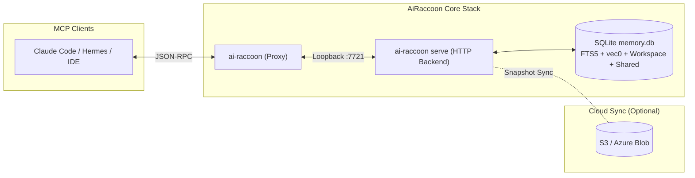
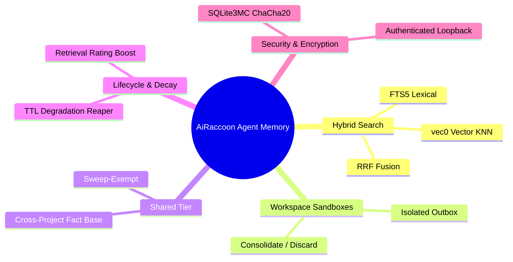

# AiRaccoon

[](https://github.com/Arasz/ai-raccoon/actions/workflows/build.yml)
[](https://github.com/Arasz/ai-raccoon/actions/workflows/nightly.yml)
[](https://github.com/Arasz/ai-raccoon/actions/workflows/publish.yml)
[](https://www.nuget.org/packages/ai-raccoon)

An MCP server providing AI agents with persistent, project-scoped memory. Built on .NET 10 with local-first SQLite, hybrid FTS5+vec0 search, workspace sandboxes, a shared promotion tier, and optional cloud sync.



## What's new

- **Auto-Improving Dynamic Noise Vectors & Dual-Classifier Promotion (1.10.0)** — [Plan](docs/plans/2026-08-13-v4-dynamic-noise-and-semantic-promotion-plan.md) and [Research](docs/plans/2026-08-13-dynamic-noise-vector-learning-research.md)
  * **Leader-Follower Centroid Clustering**: Automatically learns user-specific noise vectors over `sqlite-vec` (`vec_noise`) from 4 feedback channels (search quality, discards, unread TTL expirations, process log intercepts) with 5 mandatory safety bounds ($\cos(\mu_{noise}, \mu_{core}) \le 0.75$).
  * **Dual-Classifier Semantic Promotion Engine**: Replaces structural heuristic scoring for candidate promotion to `shared` with semantic vector classification (Approach A default, opt-in local ONNX instruct model Approach B & C).
- **Semantic Noise Filtering & Real-time TTLs (1.9.0)** — [ADR-0029](docs/adr/0029-pre-write-noise-filtering.md) and [ADR-0030](docs/adr/0030-realtime-heuristic-ttl.md)
  * **Write Performance Benchmarks** (`baseline -> change -> effect`): Measured in `WritePerformanceBenchmarkTests` (`tests/AiRaccoon.Tests/Integration/WritePerformanceBenchmarkTests.cs`) and documented in `docs/work/2026-08-13-v4-write-performance-benchmark-report.md`:
    | Metric | Valid Memory Write (Baseline) | Noise Interception (Zero-Shot) | Effect / Expected Return |
    |---|---|---|---|
    | Avg Latency per Write | 11.77 ms | 0.94 ms | **12.5x speedup** on noise handling |
    | Throughput | 84.97 ops/sec | 1,063.8 ops/sec | Bypasses database disk writes, FTS5 & vec0 indexing |
    | Rejection Recall | 0% false positives | 100% (50/50 noise logs) | Completely blocks background process noise logs |
- **FileType Handlers & Native JSON Support (1.8.0)** — [ADR-0027](docs/adr/0027-extensible-file-type-handlers-and-json-support.md)
- **Search-Quality Metric System (1.7.0)** — [Plan](docs/plans/2026-08-11-search-quality-metric-plan.md)
- **Persistent Propose Queue Discards (1.6.5)** — [ADR-0026](docs/adr/0026-persistent-discards-and-shared-exclusion.md)
- **Always-On HTTP Proxy (1.6.0)** — [ADR-0020](docs/adr/0020-always-on-http-stdio-proxy.md)

---

## Quick Start

Install the global CLI tool (`ai-raccoon`):

```bash
dotnet tool install -g ai-raccoon
```

Add AiRaccoon to your agent's `.mcp.json`:

```json
{
  "mcpServers": {
    "ai-raccoon": { "command": "ai-raccoon" }
  }
}
```

> 📖 **Full Walkthrough:** See [Get started with AiRaccoon](docs/tutorials/get-started-with-ai-raccoon.md) for migration guides, transport options (proxy, stdio, http), and initial setup steps.

---

## Agent Capabilities at a Glance



| Feature | Description | Reference Guide |
|---|---|---|
| **Scope Partitioning** | Local banks in `~/.ai-raccoon` or `<project>/.ai-raccoon`, partitioned by `project:<id>` | [Capabilities Overview](docs/explanation/agent-memory-capabilities.md#storage-architecture--scope-partitioning) |
| **Hybrid Search** | Reciprocal Rank Fusion (RRF) combining keyword and vector semantic search | [Search Pipeline Guide](docs/explanation/agent-memory-capabilities.md#hybrid-search-pipeline-fts5--vec0--rrf) |
| **Workspace Sandboxes** | Isolated edit outboxes with explicit consolidation or discard | [Workspace Guide](docs/explanation/agent-memory-capabilities.md#workspace-sandbox-context-lifecycle) |
| **Shared Tier** | Elevated cross-project facts exempt from degradation sweeps | [Shared Tier Guide](docs/explanation/agent-memory-capabilities.md#propose--shared-promotion-tier) |
| **Memory Degradation** | Retrieval-based rating boost with automated background TTL sweeps | [Degradation Guide](docs/explanation/agent-memory-capabilities.md#memory-rating-and-degradation-sweep-reaper) |
| **Cloud Sync** | Optional S3 / Azure Blob VACUUM snapshot sync with optimistic locking | [Architecture Explanation](docs/explanation/architecture.md#cloud-sync-cycle) |
| **Encryption at Rest** | Page-level ChaCha20 encryption via `AIRACCOON_DB_PASSPHRASE` | [Configuration Recipe](docs/how-to/configure-ai-raccoon-server.md#managing-database-encryption) |

> 📖 **Detailed Architecture:** Read the complete [Agent Memory Capabilities Explanation](docs/explanation/agent-memory-capabilities.md) and [Tool Contract Reference](docs/reference/agent-memory-server.md).

---

## Configuration & Server Execution

Run in proxy mode (default), stdio, or background HTTP serve mode:

```bash
ai-raccoon                    # Proxy mode (Default): relays to HTTP backend, auto-starting if needed
ai-raccoon --transport stdio  # In-process standalone server
ai-raccoon serve              # Long-lived daemon with idle watchdog and loopback token auth
```

> 📖 **Configuration Recipe:** Learn about environment variables, port binding, database encryption passphrases, and zero-downtime updates in [Configure and run the AiRaccoon server](docs/how-to/configure-ai-raccoon-server.md).

---

## Embeddings

AiRaccoon supports in-process ONNX models and remote OpenAI-compatible backends:

| Engine | Model | Latency | Benchmark MRR |
|---|---|---|---|
| **Local (Default)** | Bundled `all-MiniLM-L6-v2` (int8) | ~9 ms | 0.836 |
| **Remote OpenAI** | `text-embedding-3-small` / Ollama | ~25-120 ms | 0.854 - 0.858 |

> 📖 **Setup & Benchmarks:** See [Configure embedding engines](docs/how-to/configure-embedding-engines.md) and [Embedding Benchmark Data](docs/reference/embedding-benchmark.md).

---

## Observability & Telemetry

Inspect live performance or stream OpenTelemetry metrics and traces:

```bash
ai-raccoon serve observability pid        # Discover live server PID
ai-raccoon serve observability counters   # Launch dotnet-counters
ai-raccoon serve observability trace      # Capture dotnet-trace spans
```

> 📖 **Telemetry Guide:** See [Monitor and export server telemetry](docs/how-to/monitor-and-export-telemetry.md) and [OTLP Export Boundaries (ADR-0009)](docs/adr/0009-otlp-export.md).

---

## Architecture Overview

```text
src/AiRaccoon/                 # Thin MCP Server (Tool handlers)
src/AiRaccoon.Core/            # Pure Domain (Memory logic, RRF, Workspace, Rating)
src/AiRaccoon.Infrastructure/  # SQLite Store, Embeddings, S3/Azure Sync
tests/AiRaccoon.Tests/         # xunit.v3 test suite (1100+ tests)
```

> 📖 **Deep Dive:** Read [Architecture Explanation](docs/explanation/architecture.md).

---

## Documentation Index

Explore the complete [Documentation Tree](docs/README.md):

- [Tutorials](docs/tutorials/README.md) — Step-by-step guides for newcomers
- [How-To Recipes](docs/how-to/README.md) — Goal-oriented configuration and operations
- [Explanation](docs/explanation/README.md) — Architectural background and design concepts
- [Reference](docs/reference/README.md) — Tool contracts, CLI verbs, and benchmarks
- [ADRs](docs/adr/README.md) — Architectural Decision Records

---

## Contributing & Security

- Read [CLAUDE.md](CLAUDE.md) for repo conventions and mandatory TDD workflow.
- Report security issues privately per [SECURITY.md](SECURITY.md).

## License

[MIT](LICENSE). Copyright (c) 2026 Rafał Araszkiewicz.
