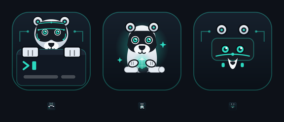
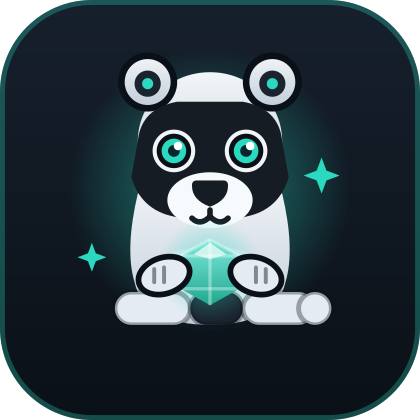
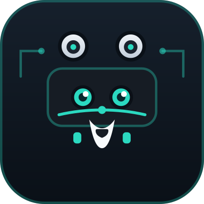

# Brand — the AiRaccoon mark (propositions)

<p align="center">
  
</p>

Three hand-authored SVG propositions for the AiRaccoon mark. Nothing is traced from a
photograph, so no third-party licence attaches to any of them. They are siblings of the
[ai-badger mark](https://github.com/Arasz/ai-badger/tree/main/docs/brand) — same canvas,
same palette, same "the two halves of the name in one picture" idea — so the two projects
read as one family while staying distinct.

Full-size renders: [`previews/`](previews/).

## Proposition A — Circuit Mask

<p align="center">
  
</p>

The raccoon's bandit mask *is* the circuit trace. The mask runs across the face as it
naturally does — dark band, white spectacles around the eyes — but the band carries teal
circuit traces with nodes, and the eyes are the trace's two lit endpoints. Below, the
terminal window with a prompt and a cursor: the MCP server at work. Paws hooked over the
window edge, the same gesture the badger uses to dig the framework into your repo —
here the raccoon reaches into the terminal to keep hold of what it stores.

**What it is saying.** The raccoon is the animal the project is named for, drawn as a
character that looks back at you. The bandit mask — the one feature everyone recognises —
is the technology, so the AI idea survives scaling down. The terminal is where the server
actually lives. This is the direct sibling of the badger mark: same composition grammar,
different animal, different story (memory rather than digging).

| | |
|---|---|
| **Canvas** | 256×256, rounded-square field, `rx="56"` |
| **Accent** | `#2BD9C0` teal — traces, eyes, prompt, hairlines |
| **Field** | `#16202C` → `#0A1017` vertical gradient |
| **Fur** | `#F2F5F8` → `#C0CCD9` vertical gradient (raccoon grey) |
| **Mask** | `#161C24` ink, white spectacles `#F2F5F8` |
| **Terminal** | `#111823` body, `#1C2634` title bar |
| **Best at** | 96 px and up |

## Proposition B — Memory Hoarder

<p align="center">
  
</p>

A raccoon cradling a glowing memory crystal. Raccoons hoard shiny things; this one
hoards memories. The crystal is faceted like a gem but glows teal — a retrieved memory,
polished and kept. The ringed tail curls across the front; the mask is still there but
softer, and the circuitry is gone entirely.

**What it is saying.** The character is the message: a warm, story-forward mark where the
raccoon's nature *is* the product's job (collect and keep what matters). The crystal is
the payload — the memory itself. This proposition leans on warmth and narrative over
hardware; it reads more "companion", less "appliance".

| | |
|---|---|
| **Canvas** | 256×256, rounded-square field, `rx="56"` |
| **Accent** | `#2BD9C0` teal — crystal, eyes, sparkles, halo |
| **Field** | `#16202C` → `#0A1017` vertical gradient |
| **Fur** | `#F2F5F8` → `#C0CCD9` vertical gradient |
| **Mask** | `#161C24` ink, white spectacles `#F2F5F8` |
| **Crystal** | `#7FE9DC` → `#1FA88F` vertical gradient, radial teal glow |
| **Best at** | 96 px and up |

## Proposition C — Mask Mark

<p align="center">
  
</p>

The mask alone, reduced to a flat glyph: one dark band that reads simultaneously as the
raccoon's bandit mask and as a memory module. The eyes are the module's two lit cells,
the bottom edge has contact pins, and a data-bus trace runs beneath the eyes with a node
at its centre. Ears and a white muzzle wedge keep the face legible at small sizes.

**What it is saying.** The mask is the raccoon's signature, and a memory module is the
product's signature — one shape says both. This is the proposition built for small sizes:
flat fills, no gradients in the mark itself, bold geometry that survives 16 px. It is the
answer to the badger mark's own "not yet drawn" small-size variant, and the best favicon
candidate of the three.

| | |
|---|---|
| **Canvas** | 256×256, rounded-square field, `rx="56"` |
| **Accent** | `#2BD9C0` teal — eyes, pins, trace, ears |
| **Field** | `#16202C` → `#0A1017` vertical gradient |
| **Mask/module** | `#161C24` ink, `#2BD9C0` hairline border |
| **Muzzle** | `#F7FAFC` white |
| **Best at** | 32 px and up; usable at 16 px |

## Choosing

- **A** if the brand should sit visibly next to ai-badger as the same family and the
  terminal-at-work story matters.
- **B** if the brand should be warmer and story-led — the product as a character that
  keeps your memories.
- **C** if the priority is a small, flat, favicon-grade mark that still says raccoon.

All three share the palette, so a chosen proposition can be re-drawn into either of the
others' territory later without a rebrand.

## Using the marks

**Clear space** — leave at least 1/8 of the mark's width empty on every side. The
rounded-square field is part of the mark; do not crop to the head.

**Do not** recolour the accent per context, stretch the square, add a drop shadow, or set
the raccoon over a photograph. If a variant is needed that these files do not cover, add
it to this directory rather than editing a copy at the call site.

## Not yet drawn

None of these blocks using the mark; each is worth doing when something actually needs it.

- **A wordmark lockup** — mark plus "AiRaccoon" set horizontally, for a social card. The
  letterforms must be converted to outlines rather than left as SVG `<text>`.
- **A monochrome variant** — one flat colour, for places that will not take a full-colour mark.
- **Raster exports** — PNG at 16/32/180/512 px, since GitHub social previews and OS app
  icons do not accept SVG.

## Editing

To preview a change on macOS without opening a design tool:

```bash
qlmanage -t -s 420 -o /tmp docs/brand/proposition-a-circuit-mask.svg
```

Check any edit at 16 px too — that is where geometry mistakes become visible.
