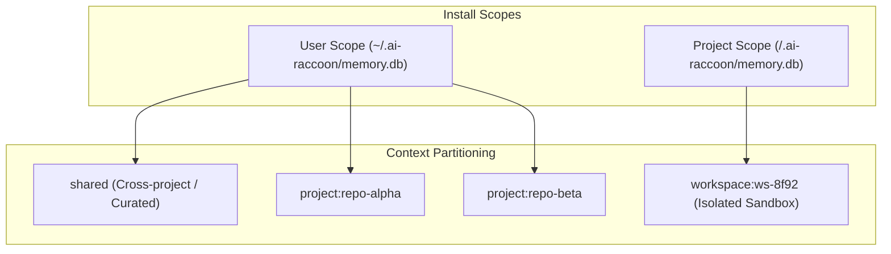
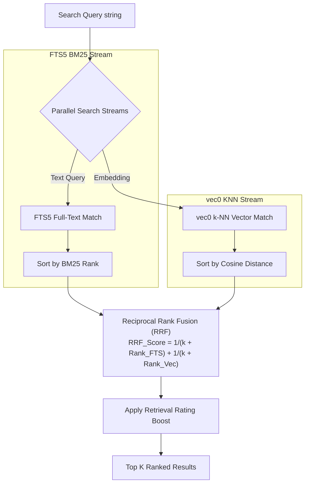
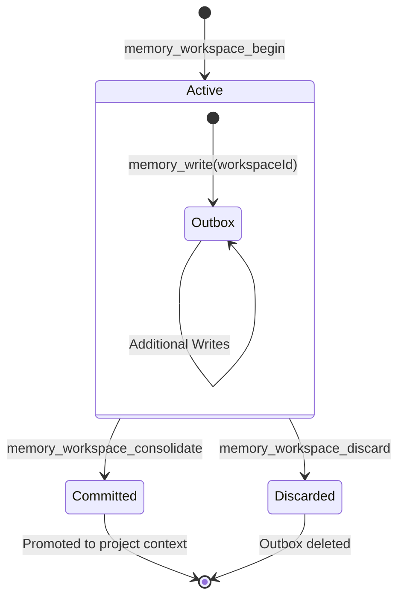
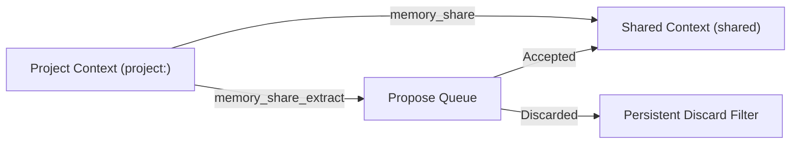
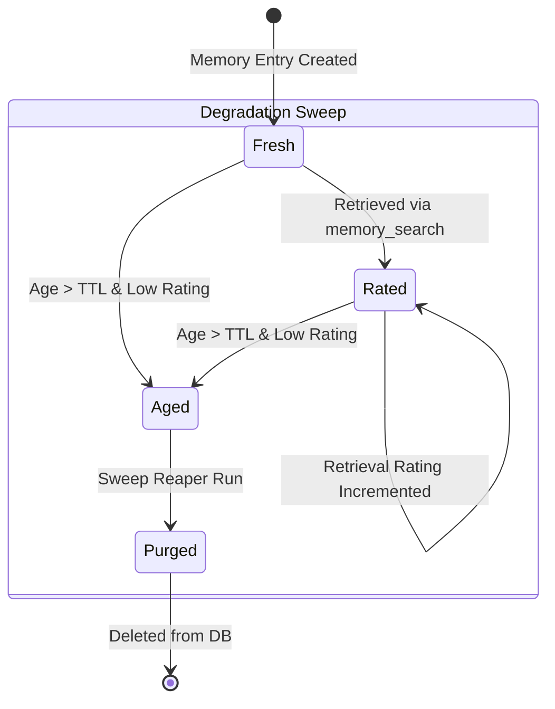
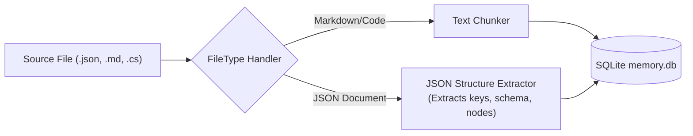

# Agent memory capabilities and tiered lifecycle

AiRaccoon's storage model, search pipeline, workspace sandboxes, and memory decay lifecycle.

---

## Storage architecture and scope partitioning

AiRaccoon stores memories in SQLite **banks** based on install scope:

1. **User scope (`~/.ai-raccoon`):** One global database shared across projects. Projects isolate memories via `project:<id>` context tags.
2. **Project scope (`<project>/.ai-raccoon`):** A dedicated local database bound to a single repository.

---

## Hybrid search pipeline (FTS5 + vec0 + RRF)

When an agent calls `memory_search`, AiRaccoon combines keyword BM25 matches and vector distances using Reciprocal Rank Fusion (RRF):

---

## Workspace sandbox context lifecycle

Workspace sandboxes let agents test multi-step edits in isolation without touching committed project memories:

- **Isolated outbox:** Writes with `workspaceId` land in `workspace:<id>`.
- **Consolidation:** `memory_workspace_consolidate` moves selected or all outbox entries into the project context.
- **Discard:** `memory_workspace_discard` deletes the outbox.

---

## Propose and shared promotion tier

Memories can move from project notes into cross-project shared facts:

- **`memory_share`:** Immediately promotes an entry hash to `shared`. Shared entries are visible across projects and exempt from degradation sweeps.
- **Propose queue:** `memory_share_extract` finds candidate memories worth sharing.
- **Persistent discards:** Rejected candidates are recorded permanently so the background extractor never re-proposes them ([ADR-0026](../adr/0026-persistent-discards-and-shared-exclusion.md)).

---

## Memory rating and degradation (Sweep reaper)

To stop unused notes from accumulating, project entries decay over time unless frequently retrieved:

- **Retrieval boost:** Hits in `memory_search` raise an entry's rating.
- **TTL expiration:** Entries given a TTL via `memory_set_ttl` become eligible for sweeps once aged.
- **Sweep reaper:** The background reaper (`ai-raccoon settings sweep`) periodically purges low-rated, aged project entries. Shared entries are protected.

---

## Extensible filetype handlers and JSON overlay

AiRaccoon supports custom file ingestion and JSON overlay extraction ([ADR-0027](../adr/0027-extensible-file-type-handlers-and-json-support.md)):

---

## Related documentation

- [ADR-0004: Dual vector structure signal](../adr/0004-dual-vector-structure-signal.md)
- [ADR-0007: Propose tier](../adr/0007-propose-tier.md)
- [ADR-0018: Promotion scoring v3](../adr/0018-promotion-scoring-v2.md)
- [ADR-0025: The sweep reaper](../adr/0025-the-sweep-reaper.md)
- [ADR-0026: Persistent discards and shared exclusion](../adr/0026-persistent-discards-and-shared-exclusion.md)
- [ADR-0027: Extensible file type handlers and JSON support](../adr/0027-extensible-file-type-handlers-and-json-support.md)
