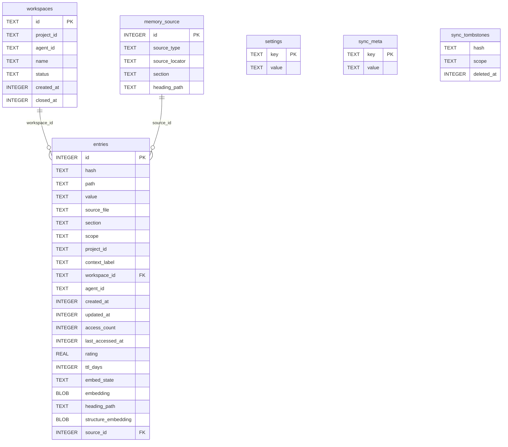
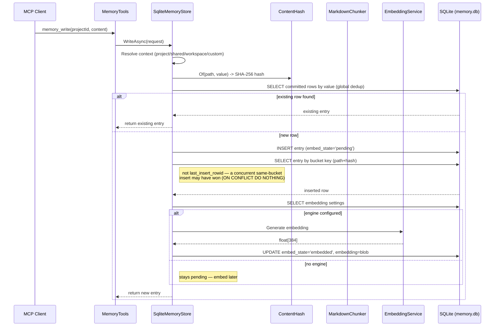
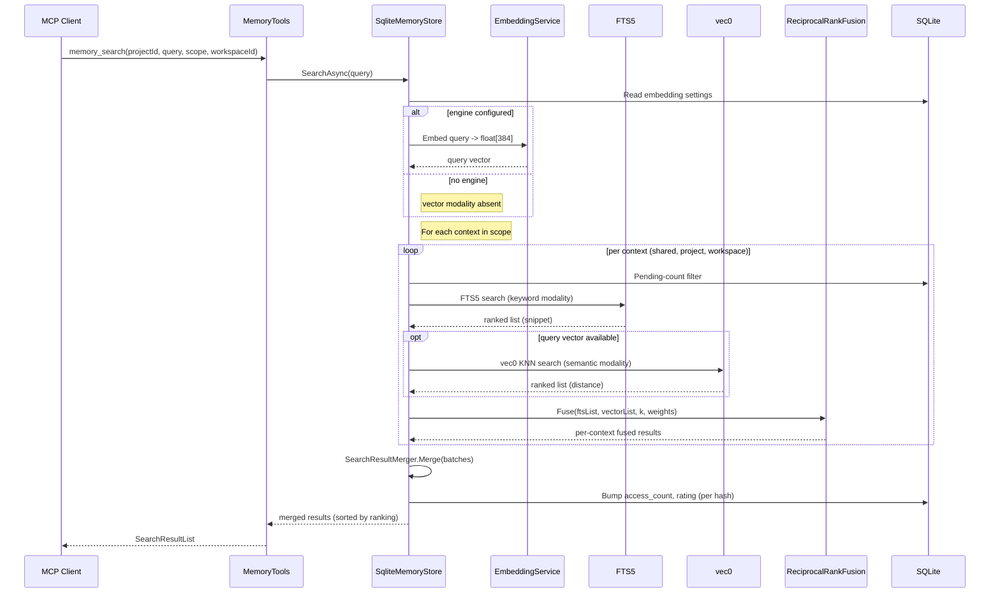
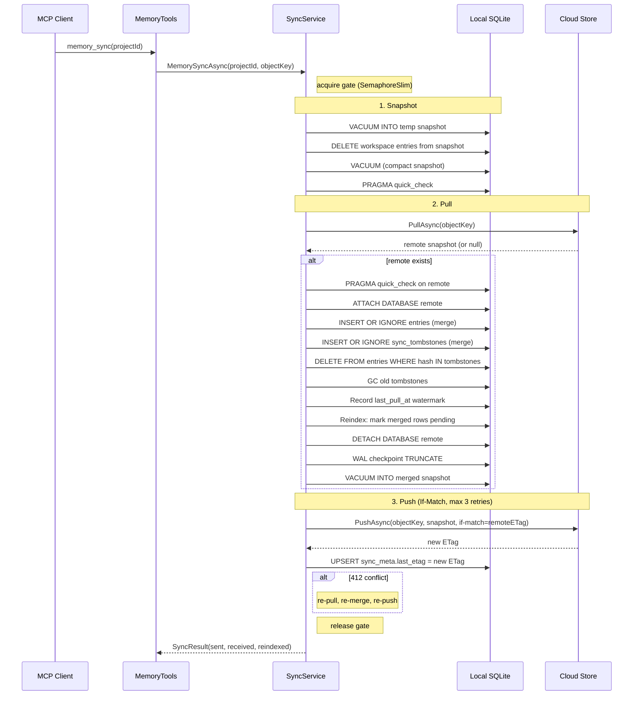
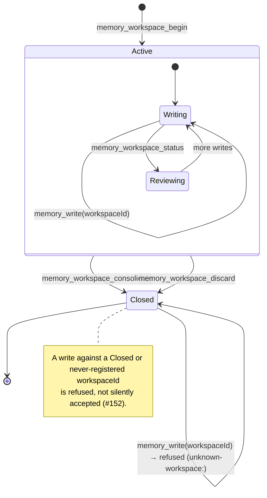
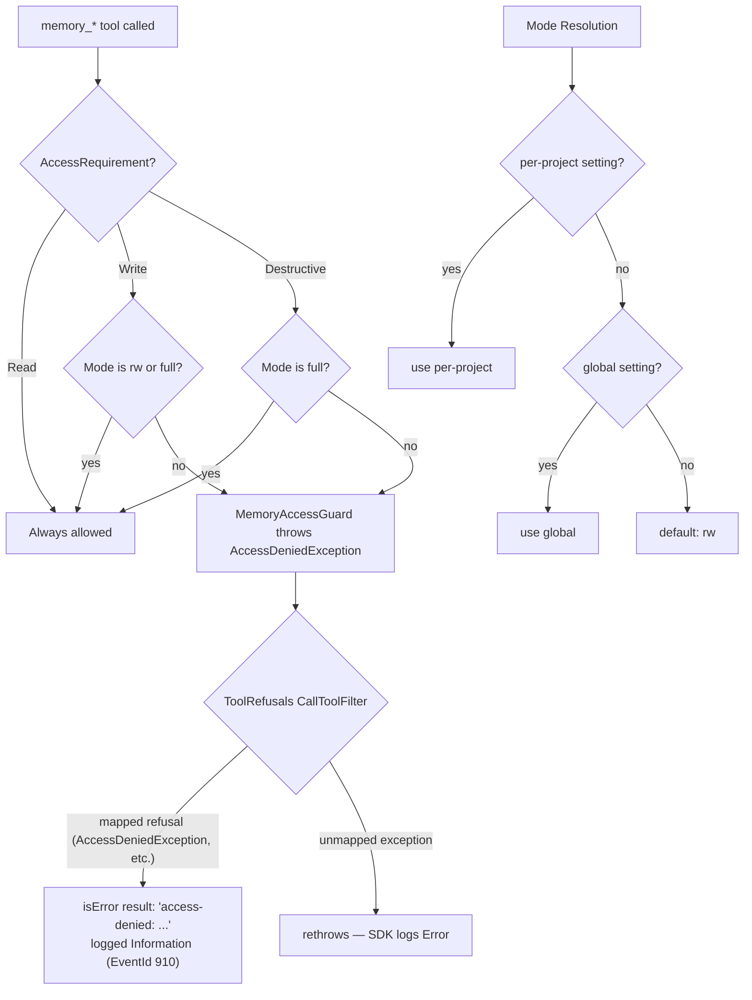

# AiRaccoon architecture

How the native .NET memory store works: the single-file SQLite schema, data flows,
search pipeline, sync cycle, workspace lifecycle, access control, and the algorithms
that power them. For the *why* behind the design decisions, see
[agent-memory-architecture.md](agent-memory-architecture.md). For the mechanical
contract (tool names, parameters, env vars), see
[`docs/reference/agent-memory-server.md`](../reference/agent-memory-server.md).

## Data model

All tables live in a single `memory.db` file — no external extensions, no meta
database, no provisioning. The schema is idempotent (IF NOT EXISTS on every DDL
statement) and safe to run on every bank open.



### Context partitioning

The `scope` + `project_id` + `context_label` + `workspace_id` columns partition
entries into five logical contexts:

| Context | scope | workspace_id | Synced | Swept |
|---|---|---|---|---|
| `shared` | `'shared'` | NULL | yes | exempt |
| `project:<id>` | `'project'` | NULL | yes | yes |
| `workspace:<id>` | NULL | set | never | no |
| `custom` (e.g. `docs:api`) | `'custom'` | NULL | yes | project sweep only |

The CHECK constraint `(workspace_id IS NULL AND scope IN ('shared','project','custom'))
OR (workspace_id IS NOT NULL AND scope IS NULL)` enforces the mutual exclusion at
the schema level.

### Propose tier (`promotion_queue`)

Candidates waiting for promotion review live in their own table, deliberately outside
`entries`: they are not searchable, not counted by `memory_stats`, and never swept.
`UNIQUE(project_id, hash)` makes re-propose an upsert (first `created_at` survives);
`idx_promotion_queue_project` / `idx_promotion_queue_score` serve the review order
(score DESC, created_at ASC) and the per-project eviction query (lowest score, oldest
first). Capacity is enforced by `PromotionQueueService` against the
`extract.queue-capacity.global` setting (default 1000) with `UniformCountEvictionPolicy`
— the biggest occupier loses its weakest row (docs/adr/0007).

Two invariants (docs/adr/0026) keep the queue honest: the upsert refuses rows whose hash
was discarded (`promotion_discards`) or whose exact value is already in the shared tier,
and every propose/promote pass starts by pruning such residue. Discards are the agent's
permanent, per-project "no" — never synced, never swept, written only by the
`memory_promotion_discard` path (promote claims and evictions never write them).

> **Evidence:** `src/AiRaccoon.Infrastructure/Sqlite/MemorySchema.cs:146-172`

> **Evidence:** `src/AiRaccoon.Infrastructure/Sqlite/MemorySchema.cs:21-119`

### Indexes and virtual tables

- `entries_fts` — FTS5 external-content index over `entries(value, source_file, section)`
  with triggers for INSERT, DELETE, and UPDATE of the indexed columns. Searches rank with
  `bm25(entries_fts, 1.0, 8.0, 16.0)`: a source-path match (ADR-0070) carries 8× and a
  section match (decision) 16× the signal of a body-text match (ADR 0003, plan C §3
  Wave 2c). Queries shaped like a source path
  (`docs/adr/0011-frontend-chassis-stack.md#decision`) match the source/section columns
  with AND semantics, so the exact chunk ranks first.
- `vec_entries` — vec0 virtual table (dimension 384, matching all-MiniLM-L6-v2)
  for semantic search. Triggers sync it with `embed_state` changes.
- `vec_structure` — vec0 virtual table over heading-path embeddings (rowid = entry
  id). Populated by `EntryEmbedder` at the embed transition — it derives the
  heading path per chunk and embeds distinct non-empty paths once per batch —
  with a healing pass that backfills banks embedded before the writer existed;
  insert, delete, and pending-clear triggers keep it in sync. Banks without
  structure vectors degrade to content-only fusion (docs/adr/0004).
- `idx_entries_scope_project` — the primary lookup path for context-filtered queries.
- `idx_entries_hash` — content dedup and per-hash lookups.
- `idx_entries_workspace` — workspace-scoped queries.
- `idx_entries_embed_state` — pending-embed queue scans.

Legacy banks (no `source_file`/`section` columns, single-column FTS) are migrated on
open: the columns are added and `entries_fts` is dropped, recreated in the three-column
shape, and repopulated from `entries` (ADR 0003). V5 banks additionally carry a
`memory_source` table (canonical source identity: type, locator, section, heading path)
with a `source_id` FK on entries; `source_file`/`section` remain on entries as
denormalized FTS-backing columns (see `docs/work/2026-08-11-memory-source-normalization-plan.md`).

> **Evidence:** `src/AiRaccoon.Infrastructure/Sqlite/MemorySchema.cs:59-117`

### Schema versioning

`MemorySchema.EnsureAsync` reads `PRAGMA user_version` before the DDL runs and walks an
ordered ladder (`MigrateToV1Async` → `MigrateToV2Async` → `MigrateToV3Async` →
`MigrateToV4Async` → `MigrateToV5Async`) up to `CurrentVersion` (currently 5) on every
read-write open (ADR 0011). A fresh bank is stamped at the current version directly and
never walks the ladder; a stamped bank at the current version skips it entirely.

The ladder only ever moves a bank forward. If the stored version is *ahead of* the
binary's own `CurrentVersion` — an older binary opening a bank a newer one already
migrated — `EnsureAsync` refuses the open with `UnsupportedSchemaVersionException` rather
than silently no-oping past the check, which is what let issue #200 write stale-shaped
rows into a newer bank undetected. The fix is updating the binary; there is no downgrade
path (ADR 0019).

> **Evidence:** `src/AiRaccoon.Infrastructure/Sqlite/MemorySchema.cs:220-240` (`CurrentVersion`,
> the forward-version guard)

## Write path



For file ingestion (`memory_ingest_file`, `memory_ingest_directory`), `SqliteMemoryStore`
opens the bank once for the whole call and hands the open connection to `FileIngestor`
(`src/AiRaccoon.Infrastructure/Ingestion/FileIngestor.cs`, extracted from the store in WI-8/PR
#161) — the compiler enforces one bank-open per ingest. `FileIngestor` first checks the path
against the project's declared ingest scope (`ingest.scope.<project>`, falling back to
`ingest.scope.global`) and refuses with `PathOutsideScopeException` when it falls outside — the
same rule and primitive `memory_watch_add` uses. An unscoped project refuses every ingest. Past
the scope check, a non-indexable file (not `.md`/`.markdown`/`.txt`, or hidden) is silently
skipped; an indexable file's content is split into **token-aware chunks** before hashing and
insertion. Each new chunk is embedded immediately through `EntryEmbedder` when an engine is
configured — no extension-host hook sits on this path (that pipeline was removed entirely,
ADR-0016); without an engine the chunk stays `pending` for `memory_embed_pending` to pick up
later. The chunker uses the o200k_base tokenizer with code-fence-aware splitting and an overlay
window for context continuity between chunks.

**Chunk bounds** are clamped to the configured embedding engine's maximum input
tokens: 256 for the bundled all-MiniLM-L6-v2, 8191 for OpenAI-compatible models.
When no engine is configured, the default is 256 tokens per chunk with a 48-token
overlay.

> **Evidence:** `src/AiRaccoon.Infrastructure/Sqlite/SqliteMemoryStore.cs:36-113`
> (`memory_write`), `src/AiRaccoon.Infrastructure/Ingestion/FileIngestor.cs:27-61`
> (ingest entry points, single open), `src/AiRaccoon.Infrastructure/Ingestion/FileIngestor.cs:175-191`
> (scope check), `src/AiRaccoon.Infrastructure/Ingestion/FileIngestor.cs:64-144`
> (chunk insertion), `src/AiRaccoon.Infrastructure/Embedding/EntryEmbedder.cs:53-69`
> (per-chunk embed), `src/AiRaccoon.Core/Memory/ContentHash.cs:12-23`
> (hashing), `src/AiRaccoon.Core/Chunking/MarkdownChunker.cs:11-46`
> (splitting), `src/AiRaccoon.Infrastructure/Chunking/TokenizerChunker.cs:7-14`
> (tokenizer)

## Query flow



### Hybrid fusion

The search pipeline runs **one query per in-scope context** (`shared`,
`project:<id>`, and optionally `workspace:<id>`). Within each context, two
modalities produce ranked lists:

1. **FTS5 (keyword):** the normalized query expression is matched against the
   `entries_fts` external-content index. Results carry a snippet from
   `snippet()`. If the FTS5 tokenizer rejects a pathological query, the
   keyword modality silently returns an empty list — search degrades, never
   crashes.

2. **vec0 (semantic, dual-vector):** when an embedding engine is configured, the
   query is embedded and KNN search runs against both `vec_entries` (content)
   and `vec_structure` (heading path). The two lists are fused with a fixed
   alpha (Wave 6, docs/adr/0004):
   `score = alpha × sim(q, content) + (1 − alpha) × sim(q, structure)`.
   Chunks without a heading path contribute zero structure similarity. Alpha
   defaults to 0.5 and is configurable per bank via the
   `retrieval.structureAlpha` setting; without an engine, the modality is
   simply absent, and without structure vectors the fusion degrades to
   content-only ordering.

**Per-modality candidate window:** `K = max(limit × 3, 100)` — this prevents
overlap candidates ranked beyond the caller's limit (e.g. rank 30 when
`limit=10`) from being starved out of the fusion.

Each context's two lists are fused with **Reciprocal Rank Fusion (RRF)**:
`score = Σ weight / (k + rank)`, then normalized to the max so the top result
is 1.0. The per-context batches are then merged with a second RRF pass at
uniform weight, and `minScore` + `limit` are applied.

### Search result identity

Every result carries `SourceFile` (the original relative path, e.g.
`docs/adr/0011-frontend-chassis-stack.md`), `ChunkIndex` (0-based position within the
source), and `TotalChunks` — persisted columns on `entries`, recomputed at the write
paths that can change a source-file group's membership (ingest, write, share/promote,
delete, sync merge) rather than per query
(docs/plans/2026-08-08-search-knn-perf.md §3.3). Rows without a source report `0`/`0`
(ADR 0003, plan C §3 Wave 2b).

`memory_search` also accepts `contextLabel`: when set, the project scope additionally
searches the project's `scope='custom'` rows under that label (plan C §3 Wave 2e).

> **Evidence:** `src/AiRaccoon.Infrastructure/Sqlite/SqliteMemoryStore.cs:115-217`
> (search), `src/AiRaccoon.Infrastructure/Sqlite/SqliteMemoryStore.cs:695-730`
> (dual-vector fusion), `src/AiRaccoon.Infrastructure/Embedding/StructureFusion.cs:1-50`
> (fusion math), `src/AiRaccoon.Infrastructure/Sqlite/ReciprocalRankFusion.cs:14-59`
> (RRF), `src/AiRaccoon.Infrastructure/Sqlite/SearchResultMerger.cs:12-24`
> (merger), `src/AiRaccoon.Infrastructure/Sqlite/SearchContexts.cs:9-29`
> (context resolution)

## Sync cycle

Sync pushes and pulls the bank's committed contexts (`shared` + every
`project:<id>`) to a cloud object store (S3-compatible or Azure Blob, selected by the
`sync.provider` settings row — default `s3`). Workspace rows are stripped
before they leave the bank — they are never synced. The cycle is serialised
by a `SemaphoreSlim(1,1)` gate.



**Settings never sync:** the `settings` table (cloud credentials, embedding endpoint/key)
is stripped from every snapshot before it's pushed and is never read from a pulled
remote — settings stay per-machine in both directions (ADR 0014).

**Tombstone GC:** tombstones older than `last_pull_at` are deleted after each
merge — they've done their job and the cloud copy has the deletion record.

**If-Match push:** the push carries the `remoteETag` from the pull. If another
client pushed in between, the store returns 412 Precondition Failed. The
service re-pulls, re-merges, and re-pushes up to 3 times before surfacing a
`SyncConflictException`.

> **Evidence:** `src/AiRaccoon.Infrastructure/Sync/SyncService.cs:42-187`
> (cycle), `src/AiRaccoon.Infrastructure/Sync/SyncService.cs:189-339`
> (merge), `src/AiRaccoon.Infrastructure/Sync/S3CloudStore.cs`
> (S3 backend)

## Workspace lifecycle



`memory_workspace_begin` inserts an `Active` row into the `workspaces` table and
returns a **v7 (time-sortable) UUID** as the workspace id. The agent writes into
the workspace by passing that id to `memory_write`; the write lands in
`workspace:<id>`, fully isolated from the project's committed memory.

**Consolidate:** `memory_workspace_consolidate(keep=["all"])` promotes every
entry from the workspace outbox into `project:<id>`. Passing specific hashes
promotes only those; everything else in the workspace context is deleted. The
workspace row is marked `Closed` with `closed_at` set — traceable after a
crash.

**Discard:** `memory_workspace_discard` deletes the entire workspace context
and marks the workspace `Closed` — nothing promoted, nothing kept.

**Guard:** a write naming a `workspaceId` that is `Closed` or was never registered is refused
with `unknown-workspace:` rather than landing silently — `RequireActiveWorkspaceAsync` checks
the row's status is `Active` before the insert proceeds (#152).

> **Evidence:** `src/AiRaccoon.Infrastructure/Workspace/WorkspaceService.cs:14-83`
> (lifecycle), `src/AiRaccoon/Tools/MemoryTools.cs:279-344` (tool boundary),
> `src/AiRaccoon.Infrastructure/Sqlite/SqliteMemoryStore.cs:671-681`
> (`RequireActiveWorkspaceAsync` guard)

## Access mode resolution

Three-tier access control, enforced at the tool boundary before any store
operation:



`MemoryAccessGuard.EnsureAsync` is the only source of the deny branch (`AccessDeniedException`);
every tool call — deny or not — additionally passes through the `ToolRefusals` CallToolFilter
(#151, PR #163), which turns a mapped refusal into a normal `isError` result logged at
`Information` instead of an escaping exception logged at `Error`. See
[`docs/reference/agent-memory-server.md#error-shapes`](../reference/agent-memory-server.md#error-shapes)
for the full refusal-prefix table.

The global default is `rw`. It is set with `ai-raccoon access default set {ro|rw|full}`
(`access.mode.global` in the settings table); unset rows resolve to `rw`. A per-project
override (`access.mode.project:<id>`) takes precedence over the global setting.

| Mode | Reads | Writes | Destructive (delete, sweep, consolidate) |
|---|---|---|---|
| `ro` | ✓ | ✗ | ✗ |
| `rw` (default) | ✓ | ✓ | ✗ |
| `full` | ✓ | ✓ | ✓ |

> **Evidence:** `src/AiRaccoon.Core/Access/AccessMode.cs:6-8` (enum),
> `src/AiRaccoon.Core/Access/AccessModePolicy.cs:14-22` (resolution),
> `src/AiRaccoon/Access/MemoryAccessGuard.cs:26-44` (enforcement, throws
> `AccessDeniedException`), `src/AiRaccoon/Tools/ToolRefusals.cs` (the CallToolFilter
> that turns the exception into an `isError` result)

## Algorithms

### Path-scoped SHA-256 content identity

`ContentHash.Of(path, value)` computes `SHA-256(UTF8(path) || UTF8(value))`
with **no separator** between path and value bytes. This means identical content
under different paths yields different hashes — the logical path is part of the
identity. The result is lowercase hex.

For `memory_write` (which has no caller-supplied path), a stable path is derived
from the content itself: `SHA-256(UTF8(content)).md`. This keeps the slot
stable — identical content written twice maps to the same logical path.

> **Evidence:** `src/AiRaccoon.Core/Memory/ContentHash.cs:12-23`

### Reciprocal Rank Fusion (RRF)

Each modality list contributes `weight / (k + rank)` to a result's fused score.
Default `k = 60`, default weights = 1:1. The fused scores are normalised to
their maximum so the top result is always 1.0, and results below `minScore`
(default 0.7) are filtered out — but at the default `limit=20` the threshold
cannot bite until past rank ~28, so `minScore` is measured inert at the shipped
defaults rather than an active relevance control (see [ADR-0006](../adr/0006-rrf-parameter-optimization.md)).

The first modality list that carries a result supplies the payload (so FTS5's
`snippet()` wins when both modalities retrieve the same hash). An empty list
contributes nothing — a result is scored by whichever modality retrieved it.

> **Evidence:** `src/AiRaccoon.Infrastructure/Sqlite/ReciprocalRankFusion.cs:14-59`

### Rating and degradation

**Rating** follows a half-life decay model:

```
rating = baseScore × 0.5^(ageDays / halfLifeDays) × (1 + accessCount × multiplier)
```

Defaults: `baseScore = 0.5`, `halfLifeDays = 30`, `multiplier = 0.1`. `ageDays` is
measured from **creation**, not from last use.

Two properties of this follow from *where* the formula is called, and both surprise
people, so they are worth stating plainly:

- **The stored `rating` is written only by `BumpAccessAsync`, on a search hit.** An entry
  no search ever returns keeps the schema default `0.5` — above the `0.3` threshold —
  indefinitely. Never being used does not decay an entry; it preserves it.
- **A search hit recomputes the value from creation age rather than nudging it up.**
  Because the half-life is 30 days, the recomputed rating for an entry older than roughly
  26 days lands *below* the threshold. So searching an old entry is what makes it
  sweepable, and the access multiplier is far too small to offset the decay term — at a
  year old it would take tens of thousands of accesses to climb back over `0.3`.

`rating` also does not take part in retrieval ranking. It is read in exactly two places:
the degradation gate below, and `memory_set_ttl`'s `canEverExpire` response.

> This is a known gap rather than a design position: the intended model is that disuse
> should decay a memory and use should protect it. See
> `docs/plans/2026-08-09-memory-decay-implementation-plan.md` for the rulings and the
> staged plan. **Nothing in that plan is implemented yet** — this section describes what
> the code does today.

**Degradation** (`memory_sweep`) evaluates each entry against its per-entry TTL
and the sweep threshold:

```
ShouldDegrade = ttlDays IS SET AND rating < threshold AND ageDays > ttlDays
```

There is no global TTL knob: an entry without a `ttl_days` value set by
`memory_set_ttl` is never a candidate — so a bank that has never called that tool has
nothing to sweep. `shared` entries are never swept.

The sweep deletes only within the scope it enumerated (`project`), so a same-hash sibling
in an active workspace or a custom context is left alone; `hash` does not encode scope, so
`(project_id, hash)` is not a row identity. The background reaper additionally honours the
per-project access mode that `memory_sweep` enforces at the tool boundary: a project not
in `full` mode is skipped rather than reaped ([ADR-0025](../adr/0025-the-sweep-reaper.md)).

> **Evidence:** `src/AiRaccoon.Core/Rating/RatingPolicy.cs:12-24` (rating),
> `src/AiRaccoon.Core/Degradation/DegradationPolicy.cs:6-7` (degradation),
> `src/AiRaccoon.Infrastructure/Sqlite/SqliteMemoryStore.cs:745-766` (bump)

### Token-aware chunking

File ingestion splits content into chunks bounded by the configured embedding
engine's maximum input tokens:

1. **Normalise** line endings (`\r\n` → `\n`, `\r` → `\n`).
2. **Build units:** each line is a unit; code fences (``` ``` and `~~~`) are
   atomic — their boundaries never split a fence block.
3. **Token-count** each unit using the `o200k_base` Tiktoken tokenizer.
4. **Accumulate** units until adding the next would exceed `maxTokens`, then
   emit a chunk.
5. **Overlay** the tail of the previous chunk (up to `overlayTokens`) onto the
   start of the next, so context carries across chunk boundaries.

> **Evidence:** `src/AiRaccoon.Core/Chunking/MarkdownChunker.cs:11-46` (split),
> `src/AiRaccoon.Infrastructure/Chunking/TokenizerChunker.cs:7-14` (tokenizer)

## Layering

```
src/AiRaccoon/              Thin MCP server — tool definitions, transport, DI
  Tools/MemoryTools.cs      9 [McpServerTool] methods, no business logic
                            (22 tools in all, across the seven Tools/*.cs classes)
  Access/MemoryAccessGuard  Enforces access modes at the tool boundary
  Setup/McpServerSetup.cs   --transport CLI flag → stdio/HTTP host selection
  Setup/Serve/              proxy (the default) and serve: ProxyRunner, ProxyForwarder,
                            BackendLauncher, ServerProbe, McpTokenFile/Gate, ServeRunner,
                            IdleWatchdog (ADR-0020)

src/AiRaccoon.Core/         Pure domain layer — zero framework deps
  Memory/                   IMemoryStore port, records, ContentHash, SearchQuery, ContextNaming,
                            SharedExtractionService, SharedExtractionRunner (extraction orchestration)
  Chunking/                 IChunker base, IMarkdownChunker, IJsonChunker, MarkdownChunker (pure splitter)
  Access/                   AccessMode enum, AccessModePolicy, AccessRequirement, AccessDeniedException
  Ingestion/                IFileTypeHandler, IFileTypeMatcher, IngestPath, IngestScopeKeys/List,
                            PathOutsideScopeException, PathNotFoundException
  Rating/                   RatingPolicy
  Degradation/              DegradationPolicy
  Workspace/                Workspace record, ConsolidationResult
  Encryption/               SshKeyDerivation, OpenSshPrivateKeyParser, EncryptionData
  Validation/               ValidatorConfiguration (FluentValidation wiring)
  Watch/                    IWatchService port, WatchConfig, WatchState, WatchPath

src/AiRaccoon.Infrastructure/   Adapters — Dapper over SQLite, sync, embedding
  Sqlite/                   SqliteMemoryStore, MemorySchema, ReciprocalRankFusion,
                            SearchContexts, SearchResultMerger, EntryBucket
  Sqlite/Encryption/        EncryptionKeyResolver, EncryptionSourceSidecar, key Providers
  Embedding/                EmbeddingService, OnnxEmbeddingGenerator, BundledModel, EntryEmbedder
  Ingestion/                FileIngestor (scope containment, chunking, chunk insertion; WI-8),
                            FileTypeMatcher, MarkdownFileTypeHandler, JsonFileTypeHandler, IFileIngestor
  Sync/                     SyncService, SyncCloudStoreFactory, S3CloudStore, AzureBlobCloudStore, NullCloudStore, FakeCloudStore
  Chunking/                 O200kTokenizer (o200k_base), JsonFileTypeChunker
  Workspace/                WorkspaceService
  Watch/                    WatchService, WatchPipeline, WatchScheduler, WatchHostedService
  Promotion/                PromotionQueueService (propose-tier queue, ADR-0007)
  Extraction/               ExtractionHostedService (background shared-extraction loop, #55)
  Maintenance/              BankMaintenanceHostedService (WAL checkpoint + VACUUM/ANALYZE, #79)
  Encryption/               BitwardenCliSecretManager (Bitwarden key source)
  Degradation/              SweepService
  Options/                  SyncOptions, InfrastructureOptions
```

> **Evidence:** `src/AiRaccoon/Tools/MemoryTools.cs:17` (thin MCP layer),
> `src/AiRaccoon.Infrastructure/Sqlite/SqliteMemoryStore.cs:22-31` (store
> constructor), `src/AiRaccoon.Core/Memory/IMemoryStore.cs` (port)
