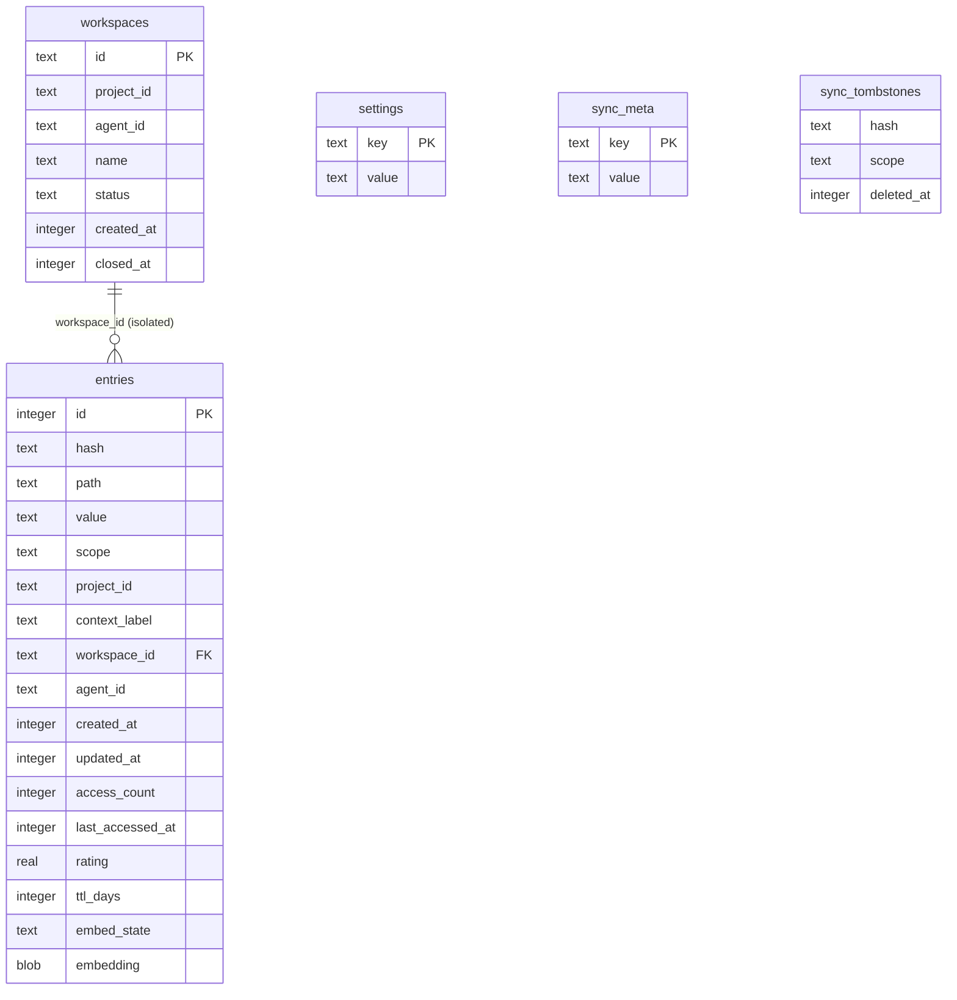
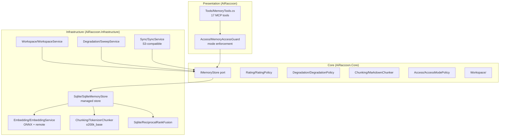
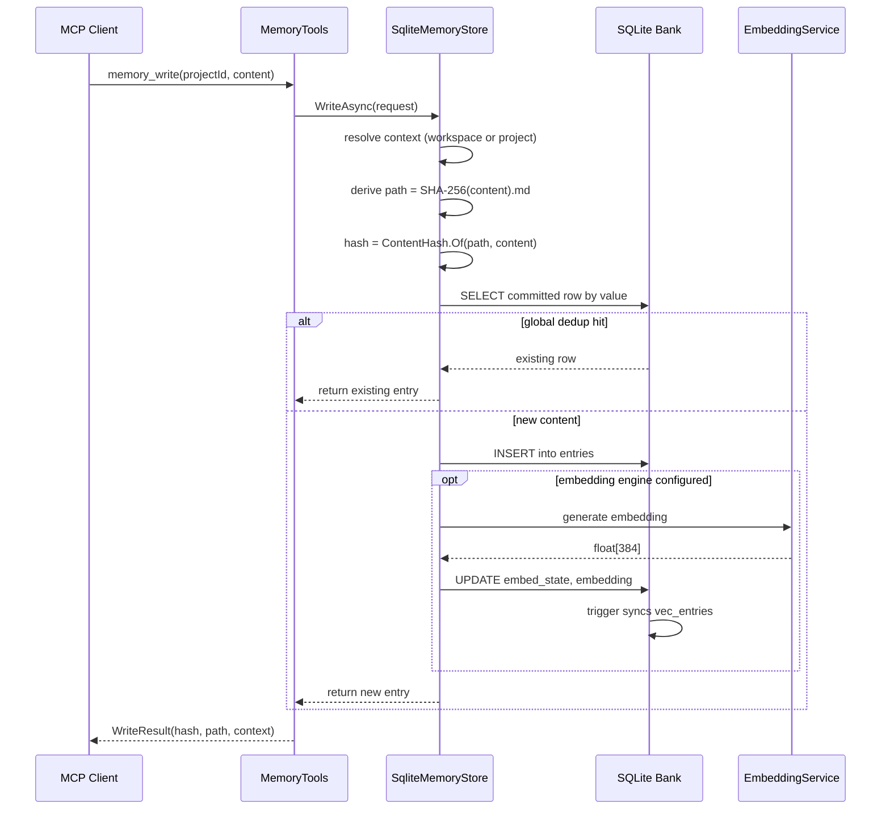
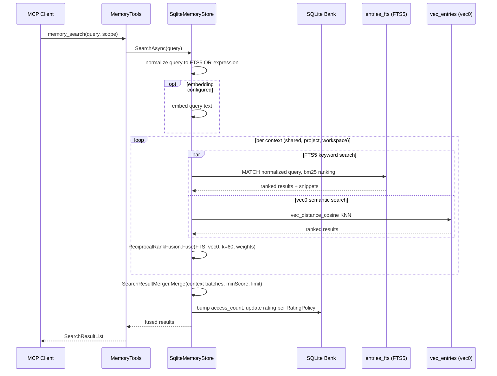
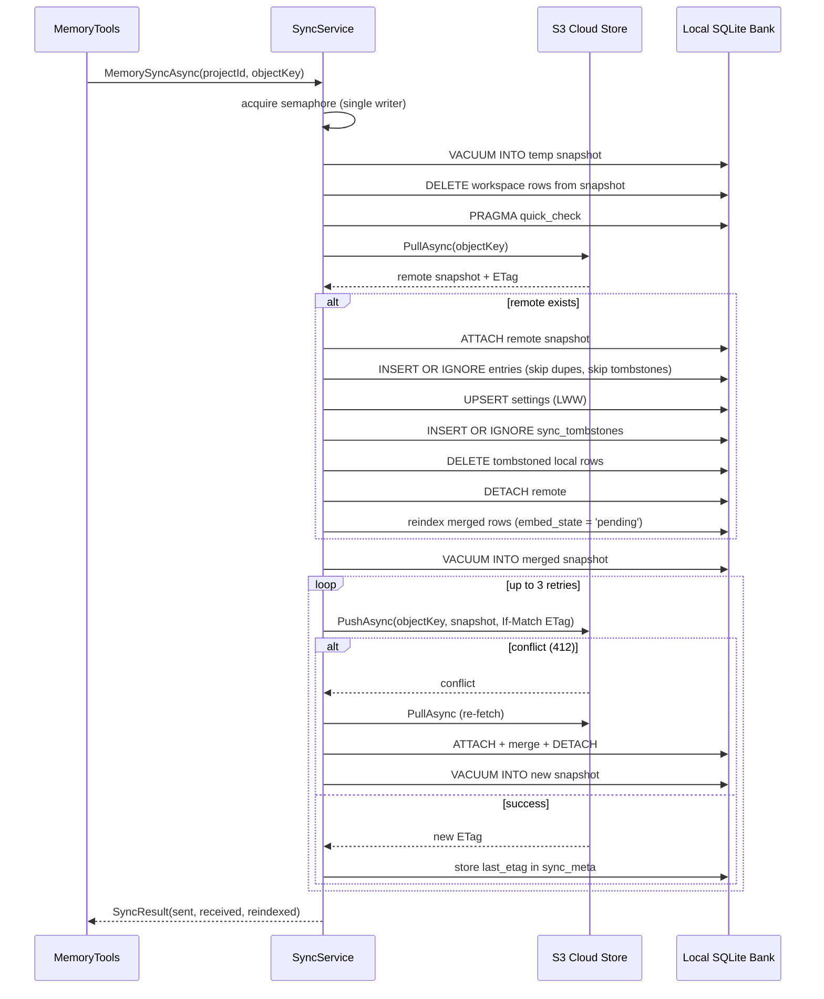
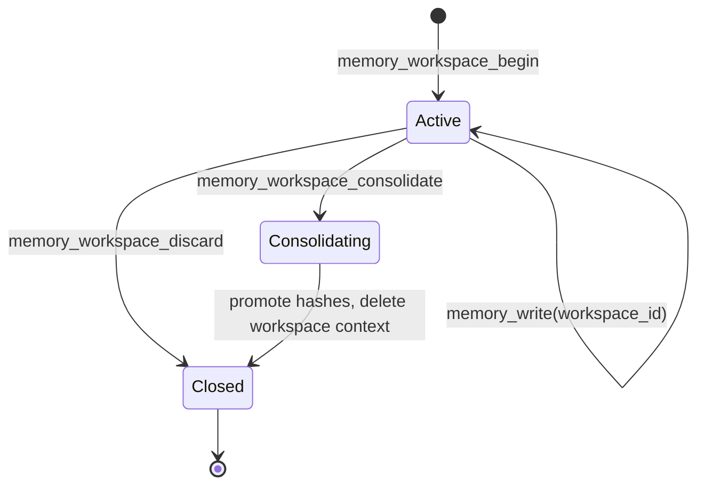
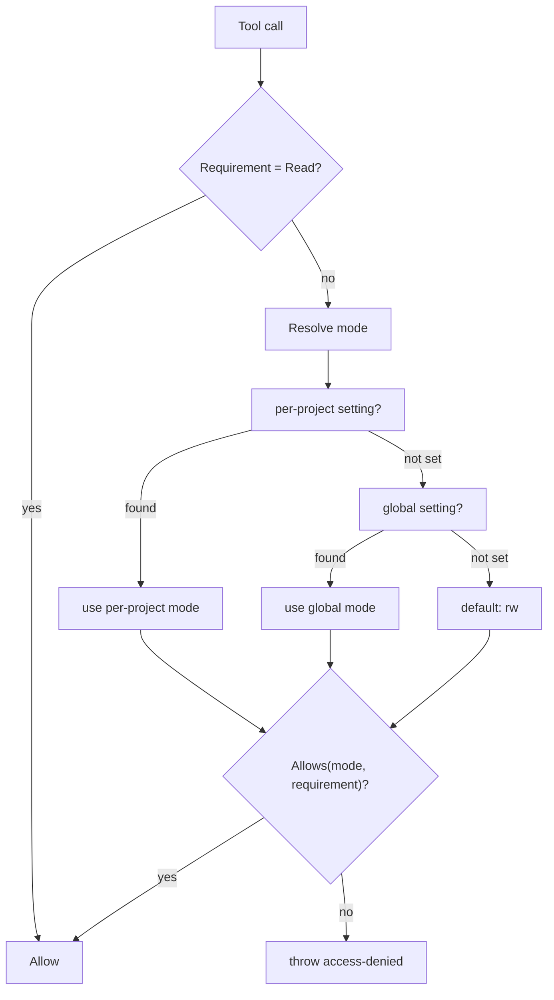

# Architecture

How the AiRaccoon memory system is built: a single-file SQLite bank, a managed .NET
store layer, hybrid FTS5+vec0 search, S3-compatible sync, workspace sandboxes, and a
degradation policy. This page explains the *shape* of the system — for the tool contract
see `docs/reference/agent-memory-server.md`, for the design decisions that led here see
`docs/explanation/agent-memory-architecture.md`.

## Data model

One SQLite file per install scope. Four core tables plus two virtual tables (FTS5, vec0)
and sync metadata.



- **`entries`** holds every piece of stored content. Scope (`shared`, `project`, or `custom`)
  partitions committed rows; `workspace_id` isolates sandbox rows. The `CHECK` constraint
  enforces mutual exclusion: a row is either committed (scope set, workspace null) or
  isolated (workspace set, scope null).
- **`settings`** stores access modes, embedding configuration, and sweep thresholds as
  key-value pairs.
- **`sync_meta`** tracks sync watermarks (last ETag, last pull timestamp).
- **`sync_tombstones`** records deletions so remote merges can replicate them.
- **`entries_fts`** is an external-content FTS5 virtual table over `entries(value)` with
  triggers keeping it in sync on insert/update/delete.
- **`vec_entries`** is a vec0 virtual table (`float[384]`) populated via trigger when
  `embed_state` transitions to `embedded`. Marking `pending` or deleting the row removes
  the vec entry.

## Layers



## Write path

Every write flows through content-hash dedup, chunk-aware ingestion with token-bounded
splitting, and embedding when an engine is configured.



### Content identity (FR-NM-7)

Hashes are path-scoped SHA-256: `SHA256(UTF8(path) || UTF8(value))` with no separator.
Identical content under different paths produces different hashes. For `memory_write`
(which carries no caller path), the path is derived from the content itself:
`SHA256(content).md` — so identical content always maps to the same slot.

### Dedup

Before inserting a new row, the store checks committed rows (`workspace_id IS NULL`)
within the same project for identical content (`value = @value`). A hit returns the
existing entry — no duplicate row. This is per-project, not cross-project.

### Token-aware chunking

File ingestion (`memory_ingest_file`, `memory_ingest_directory`) chunks content through
a line-granular markdown splitter backed by the `o200k_base` tokenizer. Fenced code
blocks (` ``` ` and `~~~`) are atomic units — a boundary never falls inside one.
Chunk size is clamped to the configured embedding engine's token window (default
256 tokens, overlay 48). Content is indexed only from `.md`, `.markdown`, and `.txt`
files; hidden files (dot-prefixed) are skipped.

## Search flow

Hybrid search fuses two ranked lists per in-scope context, then merges across contexts.



### RRF fusion

Reciprocal rank fusion (RRF) combines the FTS5 keyword list and the vec0 semantic list.
Each result's score is a weighted sum:

```
score(hash) = Σ weight / (k + rank)
```

where `k` defaults to 60, weights default to 1 for each modality, and ranks are
1-based. The fused score is normalized so the top result is 1.0. The FTS5 list's
`snippet()` payload wins when both modalities retrieve the same entry.

The per-modality candidate window is `max(limit * 3, 100)` — wider than the caller's
limit — so overlap candidates ranked 20–100 are not starved. The caller's `minScore`
(0.7 default) and `limit` apply at the final merger pass.

When no embedding engine is configured, the vec0 modality is absent and search
degrades to FTS5-only (never a crash). A pathological FTS5 query that trips the
tokenizer similarly degrades to vector-only.

## Sync cycle

Sync produces a VACUUM snapshot of the local bank, strips workspace rows, pulls the
remote snapshot, merges via ATTACH, and pushes with If-Match for conflict detection.



### Merge strategy

- **Entries**: `INSERT OR IGNORE` by content-hash, skipping workspace rows and
  tombstoned hashes. Incoming embeddings are reset to `pending` so the local
  engine re-embeds them.
- **Settings**: `INSERT ON CONFLICT DO UPDATE` (last-writer-wins).
- **Tombstones**: `INSERT OR IGNORE`, then `DELETE` local rows matching remote
  tombstones. Tombstones older than the last pull watermark are garbage-collected.

### Cloud store

Sync goes through an S3-compatible object store (`ICloudStore`). Configuration
is via environment variables: `AIRACCOON_SYNC_ENDPOINT`, `AIRACCOON_SYNC_BUCKET`,
`AIRACCOON_SYNC_ACCESS_KEY`, `AIRACCOON_SYNC_SECRET_KEY`. When unconfigured,
a `NullCloudStore` is used and `memory_sync` returns a "not configured" error.

## Workspace lifecycle

Workspaces are sandboxed contexts that isolate an agent's in-flight work. They
never sync to the cloud and are never swept.



1. **Begin** (`memory_workspace_begin`): Creates a v7 GUID workspace ID and
   inserts a row into the `workspaces` table with `status = 'Active'`.
2. **Write** (`memory_write` with `workspace_id`): Content lands in the
   workspace's isolated context (`workspace:<id>`) — invisible to committed
   searches and absent from sync.
3. **Consolidate** (`memory_workspace_consolidate` with `keep` hashes or `['all']`):
   Promotes each kept hash into the project's committed context via
   `memory_add_content`, preserving the entry's logical path. Then deletes the
   entire workspace context and marks the workspace `Closed`.
4. **Discard** (`memory_workspace_discard`): Deletes the workspace context and
   all its entries without promoting anything. Marks the workspace `Closed`.

A workspace that was begun but never closed survives a crash — the `workspaces`
row persists with its `status = 'Active'` and entries remain queryable by
`memory_workspace_status`.

## Access mode resolution

Three access modes gate tool operations at the MCP boundary:



| Mode | Allows | Setting key |
|---|---|---|
| `ro` | Read only | — |
| `rw` | Read + Write (default) | — |
| `full` | Read + Write + Destructive (delete, sweep, forget) | — |

The default mode is `rw`. Per-project settings (`access.mode.project:<id>`) override
the global setting (`access.mode.global`). Forgetting knobs (sweep threshold, per-entry
TTL overrides) require `full` mode.

## Algorithms

### Reciprocal rank fusion (RRF)

```
score(hash) = Σ weight_m / (k + rank_m)
```

- `weight_m`: modality weight (default 1 for both FTS5 and vec0).
- `k`: RRF cutoff (default 60). Higher `k` dilutes rank differences.
- `rank_m`: 1-based position in the modality's ranked list.
- Final scores are normalized: `score / max_score` so the top result is 1.0.

### Path-scoped SHA-256

```
ContentHash.Of(path, value) = SHA256(UTF8(path) || UTF8(value))
```

No separator between path and value bytes — the concatenation boundary is implicit.
This is safe because identical content under different paths yields different hashes.

### Rating policy

```
rating = baseScore * 0.5^(ageDays / halfLifeDays) * (1 + accessCount * accessMultiplier)
```

- `baseScore`: 0.5
- `halfLifeDays`: 30 (rating halves every 30 days without access)
- `accessMultiplier`: 0.1 (each access adds 10% of the base)
- Age is computed from `created_at`, access count from `access_count`
- Rating caps at the natural ceiling dictated by access count — no artificial clamp

Rating is computed on every search hit (`BumpAccessAsync`), written to the on-row
`rating` column.

### Degradation policy

An entry degrades when **both** conditions hold:

```
ShouldDegrade(rating, ageDays, threshold, ttlDays) = rating < threshold AND ageDays > ttlDays
```

- Default sweep: `threshold = 0.3`, `ttlDays = 30`
- Per-entry TTL overrides (`ttl_days` column) replace the global TTL
- Shared-context entries are **never** sweep candidates (FR-MEM-1.15)
- `memory_sweep` with `dry_run = true` (default) lists candidates; with
  `dry_run = false` deletes them

### Token-aware chunking

The `MarkdownChunker` splits text by lines, grouping fenced code blocks as atomic
units. It builds chunks greedily up to `maxTokens` (default 256), sliding an overlay
of `overlayTokens` (default 48) into each subsequent chunk so boundaries don't sever
context. The `TokenizerChunker` wraps this with an `o200k_base` tokenizer — the
chunk size is clamped to the configured embedding engine's documented token window
when the engine knows it.

### FTS5 query normalization

User query text is tokenized into alphanumeric runs (`[\p{L}\p{N}_]+`), FTS5
reserved words (`and`, `or`, `not`, `near`) are dropped, and tokens are joined
with `OR` for high recall. Punctuation never reaches the FTS5 grammar — a user
query cannot make `MATCH` throw.

### Snippet fallback

Vector-only hits have no FTS5 snippet. The `SnippetFallback` extracts a ~200-char
window from the entry value. The window start is derived from the entry hash
(`SHA256(hash) % maxStart`), so the same entry always yields the same snippet
and long values don't always open on their head.
