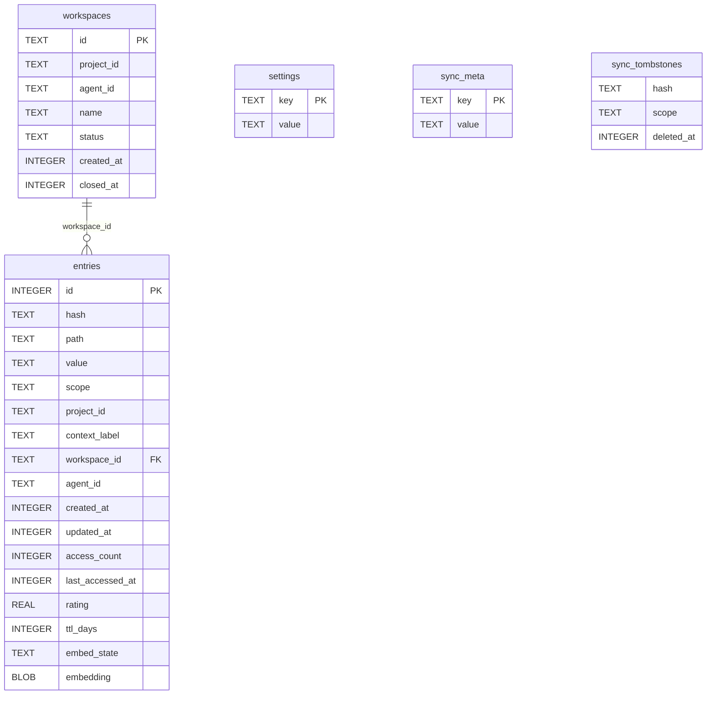
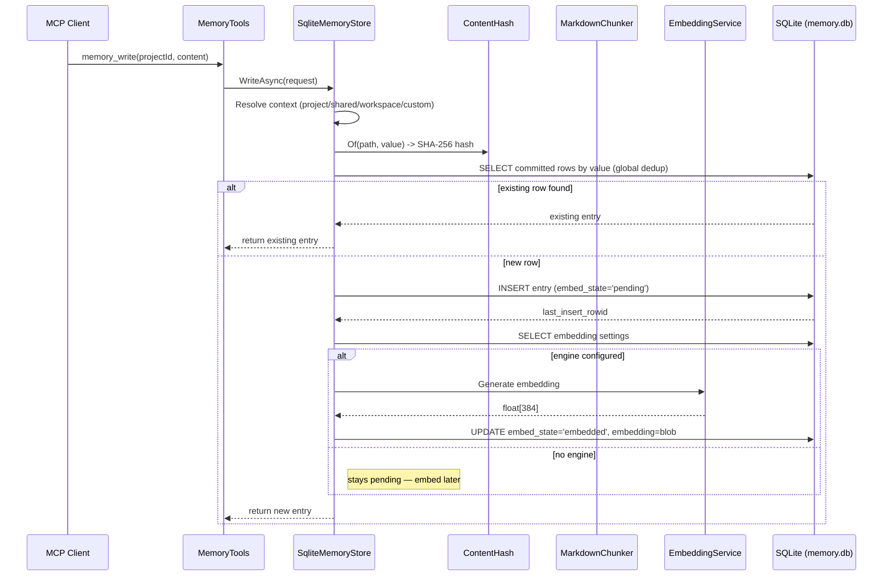
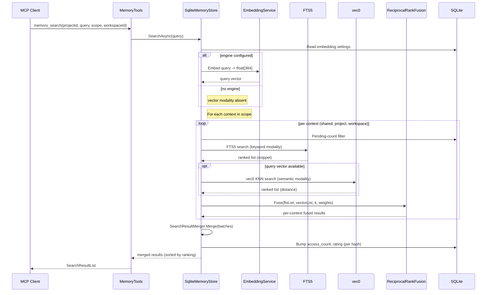
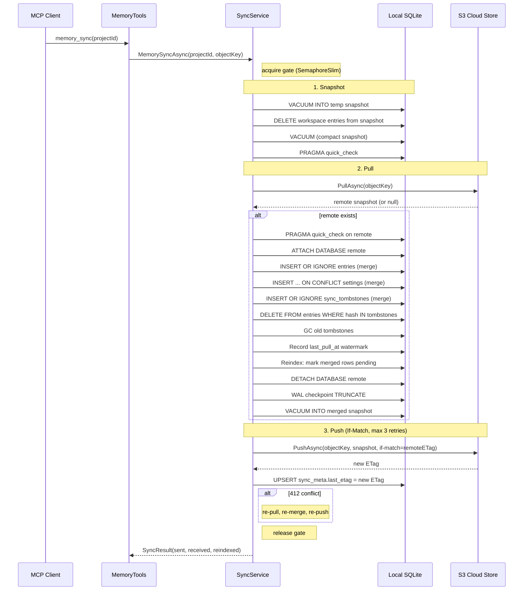
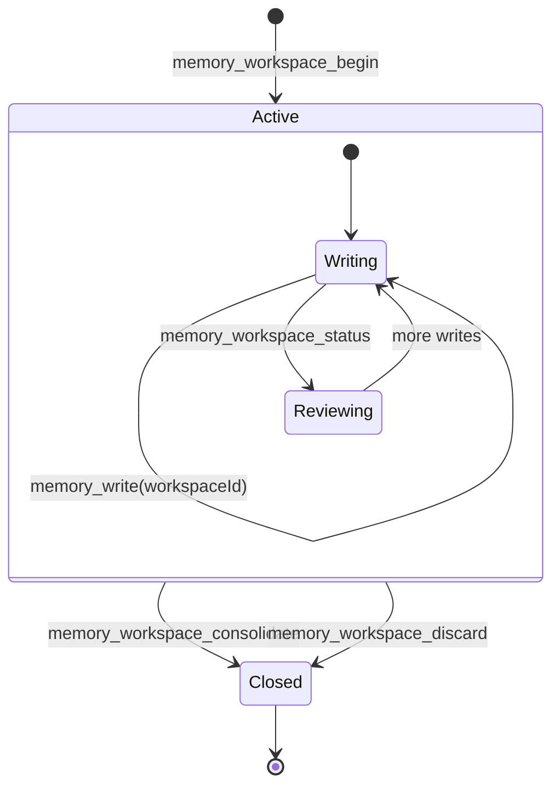
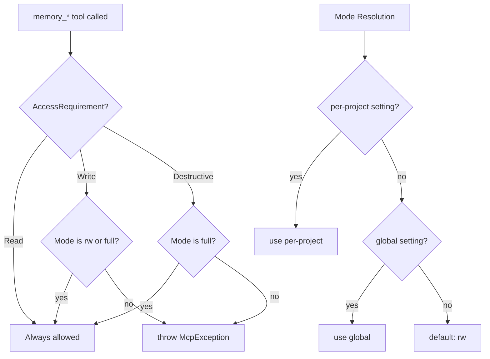

# AiRaccoon architecture

How the native .NET memory store works: the single-file SQLite schema, data flows,
search pipeline, sync cycle, workspace lifecycle, access control, and the algorithms
that power them. For the *why* behind the design decisions, see
[agent-memory-architecture.md](agent-memory-architecture.md). For the mechanical
contract (tool names, parameters, env vars), see
[`docs/reference/agent-memory-server.md`](../reference/agent-memory-server.md).

## Data model

All tables live in a single `memory.db` file — no external extensions, no meta
database, no provisioning. The schema is idempotent (IF NOT EXISTS on every DDL
statement) and safe to run on every bank open.



### Context partitioning

The `scope` + `project_id` + `context_label` + `workspace_id` columns partition
entries into five logical contexts:

| Context | scope | workspace_id | Synced | Swept |
|---|---|---|---|---|
| `shared` | `'shared'` | NULL | yes | exempt |
| `project:<id>` | `'project'` | NULL | yes | yes |
| `workspace:<id>` | NULL | set | never | no |
| `custom` (e.g. `docs:api`) | `'custom'` | NULL | yes | project sweep only |

The CHECK constraint `(workspace_id IS NULL AND scope IN ('shared','project','custom'))
OR (workspace_id IS NOT NULL AND scope IS NULL)` enforces the mutual exclusion at
the schema level.

> **Evidence:** `src/AiRaccoon.Infrastructure/Sqlite/MemorySchema.cs:21-119`

### Indexes and virtual tables

- `entries_fts` — FTS5 external-content index over `entries(value, source_file, section)`
  with triggers for INSERT, DELETE, and UPDATE of the indexed columns. Searches rank with
  `bm25(entries_fts, 1.0, 8.0, 16.0)`: a source-path match (ADR-0070) carries 8× and a
  section match (decision) 16× the signal of a body-text match (ADR 0003, plan C §3
  Wave 2c). Queries shaped like a source path
  (`docs/adr/0011-frontend-chassis-stack.md#decision`) match the source/section columns
  with AND semantics, so the exact chunk ranks first.
- `vec_entries` — vec0 virtual table (dimension 384, matching all-MiniLM-L6-v2)
  for semantic search. Triggers sync it with `embed_state` changes.
- `vec_structure` — vec0 virtual table over the Wave 6 heading-path embeddings
  (rowid = entry id). Populated for the committed corpus (the Wave 6 backfill tool
  was removed after the corpus regen); a delete trigger keeps orphans out. Banks
  without structure vectors degrade to content-only fusion (docs/adr/0004).
- `idx_entries_scope_project` — the primary lookup path for context-filtered queries.
- `idx_entries_hash` — content dedup and per-hash lookups.
- `idx_entries_workspace` — workspace-scoped queries.
- `idx_entries_embed_state` — pending-embed queue scans.

Legacy banks (no `source_file`/`section` columns, single-column FTS) are migrated on
open: the columns are added and `entries_fts` is dropped, recreated in the three-column
shape, and repopulated from `entries` (ADR 0003).

> **Evidence:** `src/AiRaccoon.Infrastructure/Sqlite/MemorySchema.cs:59-117`

## Write path



For file ingestion (`memory_ingest_file`, `memory_ingest_directory`), the path
diverges: the file content is split into **token-aware chunks** before hashing
and insertion. The chunker uses the o200k_base tokenizer with code-fence-aware
splitting and an overlay window for context continuity between chunks.

**Chunk bounds** are clamped to the configured embedding engine's maximum input
tokens: 256 for the bundled all-MiniLM-L6-v2, 8191 for OpenAI-compatible models.
When no engine is configured, the default is 256 tokens per chunk with a 48-token
overlay.

> **Evidence:** `src/AiRaccoon.Infrastructure/Sqlite/SqliteMemoryStore.cs:41-93`
> (write), `src/AiRaccoon.Infrastructure/Sqlite/SqliteMemoryStore.cs:652-716`
> (chunk insertion), `src/AiRaccoon.Core/Memory/ContentHash.cs:12-23`
> (hashing), `src/AiRaccoon.Core/Chunking/MarkdownChunker.cs:11-46`
> (splitting), `src/AiRaccoon.Infrastructure/Chunking/TokenizerChunker.cs:7-14`
> (tokenizer)

## Query flow



### Hybrid fusion

The search pipeline runs **one query per in-scope context** (`shared`,
`project:<id>`, and optionally `workspace:<id>`). Within each context, two
modalities produce ranked lists:

1. **FTS5 (keyword):** the normalized query expression is matched against the
   `entries_fts` external-content index. Results carry a snippet from
   `snippet()`. If the FTS5 tokenizer rejects a pathological query, the
   keyword modality silently returns an empty list — search degrades, never
   crashes.

2. **vec0 (semantic, dual-vector):** when an embedding engine is configured, the
   query is embedded and KNN search runs against both `vec_entries` (content)
   and `vec_structure` (heading path). The two lists are fused with a fixed
   alpha (Wave 6, docs/adr/0004):
   `score = alpha × sim(q, content) + (1 − alpha) × sim(q, structure)`.
   Chunks without a heading path contribute zero structure similarity. Alpha
   defaults to 0.5 and is configurable per bank via the
   `retrieval.structureAlpha` setting; without an engine, the modality is
   simply absent, and without structure vectors the fusion degrades to
   content-only ordering.

**Per-modality candidate window:** `K = max(limit × 3, 100)` — this prevents
overlap candidates ranked beyond the caller's limit (e.g. rank 30 when
`limit=10`) from being starved out of the fusion.

Each context's two lists are fused with **Reciprocal Rank Fusion (RRF)**:
`score = Σ weight / (k + rank)`, then normalized to the max so the top result
is 1.0. The per-context batches are then merged with a second RRF pass at
uniform weight, and `minScore` + `limit` are applied.

### Search result identity

Every result carries `SourceFile` (the original relative path, e.g.
`docs/adr/0011-frontend-chassis-stack.md`), `ChunkIndex` (0-based position within the
source), and `TotalChunks` — computed per source partition at query time, so per-chunk
writes need no write-side bookkeeping. Rows without a source report `0`/`0` (ADR 0003,
plan C §3 Wave 2b).

`memory_search` also accepts `contextLabel`: when set, the project scope additionally
searches the project's `scope='custom'` rows under that label (plan C §3 Wave 2e).

> **Evidence:** `src/AiRaccoon.Infrastructure/Sqlite/SqliteMemoryStore.cs:95-152`
> (search), `src/AiRaccoon.Infrastructure/Sqlite/SqliteMemoryStore.cs:215-259`
> (dual-vector fusion), `src/AiRaccoon.Infrastructure/Embedding/StructureFusion.cs:1-50`
> (fusion math), `src/AiRaccoon.Infrastructure/Sqlite/ReciprocalRankFusion.cs:14-59`
> (RRF), `src/AiRaccoon.Infrastructure/Sqlite/SearchResultMerger.cs:12-24`
> (merger), `src/AiRaccoon.Infrastructure/Sqlite/SearchContexts.cs:9-29`
> (context resolution)

## Sync cycle

Sync pushes and pulls the bank's committed contexts (`shared` + every
`project:<id>`) to S3-compatible object storage. Workspace rows are stripped
before they leave the bank — they are never synced. The cycle is serialised
by a `SemaphoreSlim(1,1)` gate.



**Tombstone GC:** tombstones older than `last_pull_at` are deleted after each
merge — they've done their job and the cloud copy has the deletion record.

**If-Match push:** the push carries the `remoteETag` from the pull. If another
client pushed in between, the store returns 412 Precondition Failed. The
service re-pulls, re-merges, and re-pushes up to 3 times before surfacing a
`SyncConflictException`.

> **Evidence:** `src/AiRaccoon.Infrastructure/Sync/SyncService.cs:42-187`
> (cycle), `src/AiRaccoon.Infrastructure/Sync/SyncService.cs:189-339`
> (merge), `src/AiRaccoon.Infrastructure/Sync/S3CloudStore.cs`
> (S3 backend)

## Workspace lifecycle



`memory_workspace_begin` inserts an `Active` row into the `workspaces` table and
returns a **v7 (time-sortable) UUID** as the workspace id. The agent writes into
the workspace by passing that id to `memory_write`; the write lands in
`workspace:<id>`, fully isolated from the project's committed memory.

**Consolidate:** `memory_workspace_consolidate(keep=["all"])` promotes every
entry from the workspace outbox into `project:<id>`. Passing specific hashes
promotes only those; everything else in the workspace context is deleted. The
workspace row is marked `Closed` with `closed_at` set — traceable after a
crash.

**Discard:** `memory_workspace_discard` deletes the entire workspace context
and marks the workspace `Closed` — nothing promoted, nothing kept.

> **Evidence:** `src/AiRaccoon.Infrastructure/Workspace/WorkspaceService.cs:14-83`
> (lifecycle), `src/AiRaccoon/Tools/MemoryTools.cs:279-344` (tool boundary)

## Access mode resolution

Three-tier access control, enforced at the tool boundary before any store
operation:



The global default is `rw`. It is set with `ai-raccoon access default set {ro|rw|full}`
(`access.mode.global` in the settings table); unset rows resolve to `rw`. A per-project
override (`access.mode.project:<id>`) takes precedence over the global setting.

| Mode | Reads | Writes | Destructive (delete, sweep, consolidate) |
|---|---|---|---|
| `ro` | ✓ | ✗ | ✗ |
| `rw` (default) | ✓ | ✓ | ✗ |
| `full` | ✓ | ✓ | ✓ |

> **Evidence:** `src/AiRaccoon.Core/Access/AccessMode.cs:6-8` (enum),
> `src/AiRaccoon.Core/Access/AccessModePolicy.cs:14-22` (resolution),
> `src/AiRaccoon/Access/MemoryAccessGuard.cs` (enforcement)

## Algorithms

### Path-scoped SHA-256 content identity

`ContentHash.Of(path, value)` computes `SHA-256(UTF8(path) || UTF8(value))`
with **no separator** between path and value bytes. This means identical content
under different paths yields different hashes — the logical path is part of the
identity. The result is lowercase hex.

For `memory_write` (which has no caller-supplied path), a stable path is derived
from the content itself: `SHA-256(UTF8(content)).md`. This keeps the slot
stable — identical content written twice maps to the same logical path.

> **Evidence:** `src/AiRaccoon.Core/Memory/ContentHash.cs:12-23`

### Reciprocal Rank Fusion (RRF)

Each modality list contributes `weight / (k + rank)` to a result's fused score.
Default `k = 60`, default weights = 1:1. The fused scores are normalised to
their maximum so the top result is always 1.0. Results below `minScore` (default
0.7) are filtered out.

The first modality list that carries a result supplies the payload (so FTS5's
`snippet()` wins when both modalities retrieve the same hash). An empty list
contributes nothing — a result is scored by whichever modality retrieved it.

> **Evidence:** `src/AiRaccoon.Infrastructure/Sqlite/ReciprocalRankFusion.cs:14-59`

### Rating and degradation

**Rating** follows a half-life decay model:

```
rating = baseScore × 0.5^(ageDays / halfLifeDays) × (1 + accessCount × multiplier)
```

Defaults: `baseScore = 0.5`, `halfLifeDays = 30`, `multiplier = 0.1`. The rating
is recalculated each time a search returns the entry (via `BumpAccessAsync`).

**Degradation** (`memory_sweep`) evaluates each entry against two thresholds:

```
ShouldDegrade = rating < 0.3 AND age > 30 days
```

Entries are only candidates when they are both old enough *and* rated low
enough — a frequently accessed entry stays even past its TTL. `shared` entries
are never swept.

> **Evidence:** `src/AiRaccoon.Core/Rating/RatingPolicy.cs:12-24` (rating),
> `src/AiRaccoon.Core/Degradation/DegradationPolicy.cs:6-7` (degradation),
> `src/AiRaccoon.Infrastructure/Sqlite/SqliteMemoryStore.cs:718-740` (bump)

### Token-aware chunking

File ingestion splits content into chunks bounded by the configured embedding
engine's maximum input tokens:

1. **Normalise** line endings (`\r\n` → `\n`, `\r` → `\n`).
2. **Build units:** each line is a unit; code fences (``` ``` and `~~~`) are
   atomic — their boundaries never split a fence block.
3. **Token-count** each unit using the `o200k_base` Tiktoken tokenizer.
4. **Accumulate** units until adding the next would exceed `maxTokens`, then
   emit a chunk.
5. **Overlay** the tail of the previous chunk (up to `overlayTokens`) onto the
   start of the next, so context carries across chunk boundaries.

> **Evidence:** `src/AiRaccoon.Core/Chunking/MarkdownChunker.cs:11-46` (split),
> `src/AiRaccoon.Infrastructure/Chunking/TokenizerChunker.cs:7-14` (tokenizer)

## Layering

```
src/AiRaccoon/              Thin MCP server — tool definitions, transport, DI
  Tools/MemoryTools.cs      17 [McpServerTool] methods, no business logic
  Access/MemoryAccessGuard  Enforces access modes at the tool boundary
  Setup/McpServerSetup.cs   MCP_TRANSPORT env → stdio/HTTP

src/AiRaccoon.Core/         Pure domain layer — zero framework deps
  Memory/                   IMemoryStore port, records, ContentHash, SearchQuery
  Chunking/                 IChunker port, MarkdownChunker (pure splitter)
  Access/                   AccessMode enum, AccessModePolicy, AccessRequirement
  Rating/                   RatingPolicy, IMemoryExtension pipeline
  Degradation/              DegradationPolicy
  Workspace/                Workspace record, ConsolidationResult
  Common/                   ContextNaming

src/AiRaccoon.Infrastructure/   Adapters — Dapper over SQLite, sync, embedding
  Sqlite/                   SqliteMemoryStore, MemorySchema, ReciprocalRankFusion,
                            SearchContexts, SearchResultMerger
  Embedding/                EmbeddingService, OnnxEmbeddingGenerator, BundledModel
  Sync/                     SyncService, S3CloudStore, FakeCloudStore
  Chunking/                 TokenizerChunker (o200k_base)
  Workspace/                WorkspaceService
  Degradation/              SweepService
  Rating/                   RetrievalRatingExtension (no-op, kept for extension host)
  Options/                  SyncOptions, InfrastructureOptions
```

> **Evidence:** `src/AiRaccoon/Tools/MemoryTools.cs:17` (thin MCP layer),
> `src/AiRaccoon.Infrastructure/Sqlite/SqliteMemoryStore.cs:20-25` (store
> constructor), `src/AiRaccoon.Core/Memory/IMemoryStore.cs` (port)
