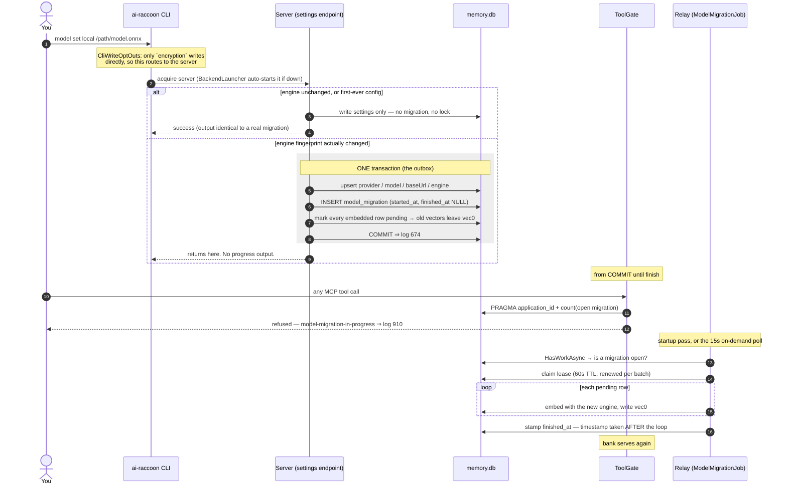

# How a model migration works, start to finish

Changing the embedding engine makes every stored vector stale. ADR-0076 handles that as a
**transactional outbox**: one transaction commits the new settings *and* the durable record of the
work they owe, and a relay drains it afterwards. This document traces that flow through the code as
it stands in 1.21.1, and answers the question the design keeps provoking — *why does every tool call
open the bank?*

For the decisions themselves see [ADR-0076](../adr/0076-model-set-is-an-outbox-drained-by-an-on-demand-relay.md)
and its parent [ADR-0075](../adr/0075-only-the-server-writes-to-the-bank.md).

## Why `ToolGate` opens the bank on every call

**"Is a migration open?" is durable state in the bank, not process state.** `ToolGate` holds no
connection of its own — it is a per-call gate injected with `IModelMigrationStore`, and the only
implementation reads the `model_migration` table.

Three reasons it cannot be an in-process flag:

1. **It must survive a crash.** That is the outbox's entire purpose; a flag dies with the process
   that set it.
2. **More than one server process can exist.** ADR-0020 keeps a `--transport stdio` escape hatch, so
   a flag in one process would not see a migration started by another.
3. **A stale *"no migration open"* is the dangerous direction.** It serves searches against a
   half-migrated bank — precisely the silent degradation ADR-0076 exists to prevent. A stale *"yes"*
   merely refuses, which is recoverable and visible.

### What the check costs

| step | statements |
|---|---|
| `OpenBankSkippingEnsureAsync` — pooled checkout; `EnableExtensions` / `LoadVector` are free, no SQL | 0 |
| `MemorySchema.EnsureCheapAsync` — `PRAGMA application_id`; falls back to full `EnsureAsync` only on a digest mismatch | 1 |
| `SELECT count(*) FROM model_migration WHERE id = 1 AND finished_at IS NULL` | 1 |

Roughly **two statements plus a pooled checkout, per tool call** — down from 8 before 1.21.1.

**The remaining cost is the checkout itself, and it is deliberate.** Two ways to remove it were
examined and rejected:

- **Piggyback on the connection the operation already opens.** Nothing here carries an ambient
  "current connection", and `ToolGate.RequireAsync` is called from ~30 sites across nine tool
  classes. The one place a free ride looked plausible — `MemoryAccessGuard.EnsureAsync`, called
  immediately after — only touches the bank for Write/Destructive, and returns without any bank
  access for `Read`. Reads are exactly what ADR-0076 most needs to refuse, so there is nothing to
  share with on the path that matters.
- **Move the check into `SqliteConnectionFactory`'s shared open path.** This deadlocks:
  `ModelMigrationJob` — the relay that *drains* the migration — opens its connection through that
  same path, so an unconditional refusal would stop the relay from opening the connection it needs
  to end the migration it exists to end.

> **Evidence:** `src/AiRaccoon.Infrastructure/Sqlite/SqliteMemoryStore.ModelMigration.cs`,
> `MemorySchema.EnsureCheapAsync`, and ADR-0076's *"ToolGate's migration check cost"* amendment.

## The flow

## The three crash points

| crash lands | state left behind | who repairs it |
|---|---|---|
| before `COMMIT` | nothing happened — settings unchanged, no row | nobody needs to |
| after `COMMIT`, before the relay ever runs | the outbox row survives | the **next server's startup pass**, with no kick involved |
| mid-drain | lease expires after 60s; remaining rows still `pending` | the next pass finishes **exactly the remainder** |

Verified on a copy of a real 25,917-entry bank: a hard SIGKILL at 12,288 rows recovered on restart
and completed the remainder with no duplicates and nothing lost.

## Two choices worth noticing

**Marking every row pending happens *inside* the transaction.** The old vectors therefore leave the
searchable index the instant the change commits. A crash immediately after `COMMIT` degrades search
to keyword-only for those rows rather than mixing two models' vectors — which would return quietly
worse results with no error anywhere. Degraded-and-visible beats wrong-and-silent.

**`ModelMigrationJob` declares `Interval => null` and implements `HasWorkAsync`.** That is what makes
it *on-demand*: it is due because work exists, not because a clock elapsed. Scheduling stays the
runner's business, which is the contract `IMaintenanceJob` already stated. The maintenance loop was
split for this — a 15-second poll asking "is anything due?", alongside the unchanged 60-minute heavy
pass for checkpoint and vacuum. Those are two responsibilities that had been sharing one timer.

## What will surprise you

**`model set` with the engine you are already on does nothing** — and neither does the first-ever
`model set` on a bank that never had one. Both report success, and neither opens a migration, locks
the bank, or re-embeds anything. That is correct (nothing was made stale), but **the CLI output is
indistinguishable from a real migration**, so it is also a trap: re-running `model set local` twice
looks exactly like a passing test even if the migration machinery were entirely broken. To force a
real migration, change to a genuinely different engine fingerprint — the same model by an explicit
path counts.

**A migration is minutes, not seconds — and hours for a big model.** On a 25,917-entry bank the
drain took **~6 minutes** with the bundled MiniLM, and the bank refused every read and write for all
of it. A larger engine changes the order of magnitude: bge-m3 (1024-d, fp32, 2.27 GB) measured
**~1.85 entries/s on 23,520 entries — about 3.4 hours**. Plan it as a maintenance window sized to the
model, not to the row count.

**When the dimension changes, the vector index is rebuilt first** — by the drain, and (since
#432) also once at server open, so a `model set` run with no server up does not leave vec0 at
the old width. A matching dimension performs no DDL. `vec_entries` and
`vec_structure` are dropped and recreated at the new width in one `BEGIN IMMEDIATE` transaction
before the first row is embedded, then refilled through the existing triggers as the drain runs —
they are never repopulated from the stored blobs, which still hold old-dimension vectors at that
point. A kill-9 mid-transaction rolls back; the outbox stays open and the next pass redoes it.

**Until 1.21.1 the recorded duration was wrong.** `finished_at` was stamped from a timestamp captured
*before* the drain loop, so that 357-second migration recorded as 6 seconds. Data integrity was never
affected — only the recorded duration. It was invisible at small scale, which is why it took a real
bank to find.
