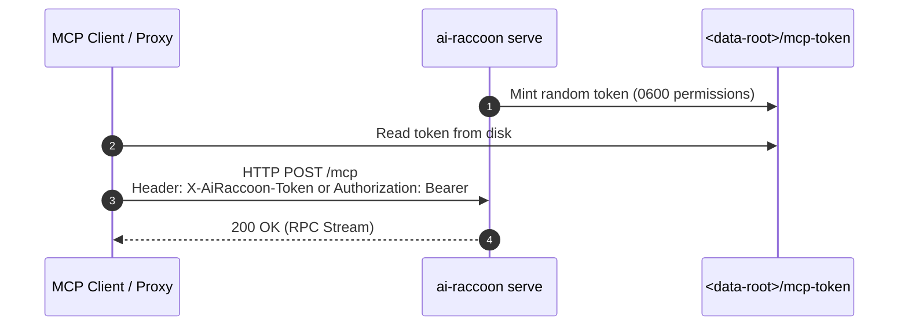
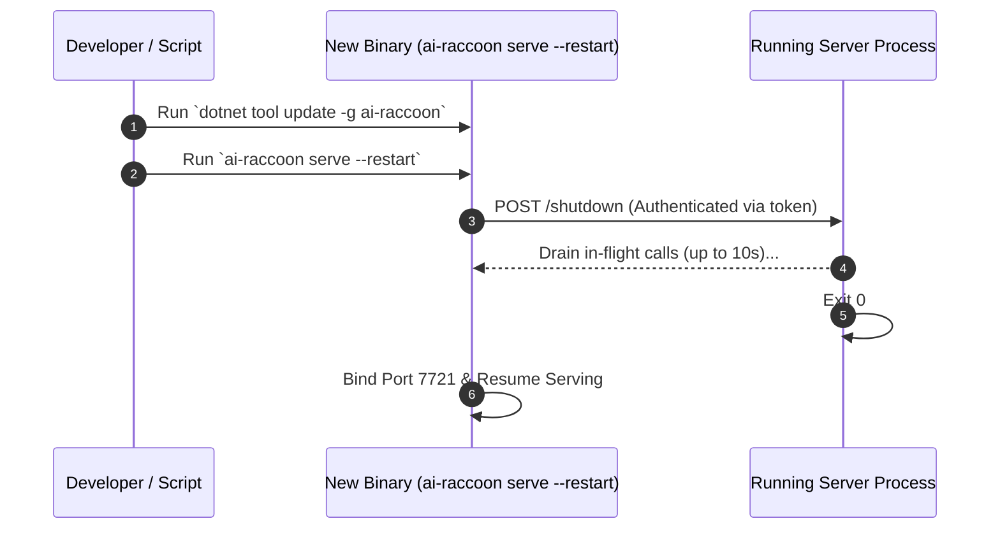

# Configure and run the AiRaccoon server

Set server flags, manage database passphrases, run background daemons, and trigger zero-downtime updates.

---

## Configuration summary

AiRaccoon stores settings directly in the SQLite `memory.db` settings table. Environment variables are reserved for boot parameters and passphrases.

### Environment variables

| Variable | Purpose | Default |
|---|---|---|
| `AIRACCOON_DB_PASSPHRASE` | Passphrase for page-level SQLite3MC encryption | `(unset - plaintext)` |
| `OTEL_EXPORTER_OTLP_ENDPOINT` | Endpoint for OTLP metrics and trace export | `(unset - disabled)` |

### Launch flags

| Flag | Description | Allowed Values | Default |
|---|---|---|---|
| `--transport` | Communication transport | `proxy`, `stdio`, `http`, `https` | `proxy` |
| `--data-root <path>` | Directory for `memory.db` and state | Any valid directory path | `~/.ai-raccoon` |
| `--install-scope` | Scope partition for database storage | `user`, `project` | `user` |
| `--port <n>` | HTTP listen port for serve mode | `1-65535` (`0` for random free port) | `7721` |

---

## Manage database encryption

AiRaccoon uses **SQLite3MC** (ChaCha20/sqleet cipher) for page-level encryption at rest.

### Enable encryption

Set the passphrase variable before launching:

```bash
export AIRACCOON_DB_PASSPHRASE="your-secure-passphrase"
ai-raccoon
```

When encrypted, FTS5 and vec0 virtual tables stay encrypted on disk without breaking hybrid search.

---

## Serve mode lifecycle and authentication

In serve mode (or default proxy mode), the background server authenticates loopback calls with a local token.



### Idle watchdog

By default, `ai-raccoon serve` shuts down after 4 hours without traffic to free memory:

```bash
# Custom idle timeout (e.g. 30 minutes)
ai-raccoon serve --idle-timeout 30m

# Disable idle watchdog (run indefinitely)
ai-raccoon serve --idle-timeout 0
```

---

## Zero-downtime server updates

Updating the global tool replaces the binary on disk, but the running server keeps using the old version until restarted. Run `serve --restart` for a clean, zero-downtime handoff:



Command sequence:

```bash
# 1. Update global tool binary
dotnet tool update -g ai-raccoon

# 2. Trigger graceful restart
ai-raccoon serve --restart > serve.log 2>&1 &

# 3. Verify new server PID and version
ai-raccoon serve observability pid
curl -s http://127.0.0.1:7721/observability
```

---

## Connecting over HTTP directly

If your agent environment cannot spawn processes directly, connect over HTTP:

1. Launch server: `ai-raccoon serve --port 7721`
2. Read loopback token from `~/.ai-raccoon/mcp-token`
3. Send HTTP requests directly:

```bash
curl -X POST http://127.0.0.1:7721/mcp \
  -H "X-AiRaccoon-Token: $(cat ~/.ai-raccoon/mcp-token)" \
  -H "Content-Type: application/json" \
  -d '{"jsonrpc":"2.0","id":1,"method":"initialize","params":{"protocolVersion":"2024-11-05","capabilities":{},"clientInfo":{"name":"curl-test","version":"1.0.0"}}}'
```

---

## Tune what gets stored and what gets searched

Four settings families gate the write path, the read path and the reaper. All are bank-global
and all are stored in the `settings` table, so they survive restarts and apply to every project.

### Write-path noise filtering

Rejects machine-generated content before it reaches the bank; the rejected text is kept in the
noise store rather than discarded ([ADR-0039](../adr/0039-noise-learning-substrate-and-shadow-mode.md)).

```bash
ai-raccoon noise show        # enabled: True
ai-raccoon noise disable     # accept every write, even ones a policy would reject
ai-raccoon noise enable      # the default
ai-raccoon noise entries     # summarize what has been rejected
```

### Read-path query guard

Refuses a `memory_search` query that is itself machine output, and annotates one that merely
contains log-like content ([ADR-0040](../adr/0040-read-path-query-guard.md)). Armed by default.

```bash
ai-raccoon queryguard show             # enabled: True  shadow: False  structural: False  threshold: 0.98939822280316
ai-raccoon queryguard disable          # every query runs untouched
ai-raccoon queryguard shadow enable    # record what the guard would have done, without acting on it
```

Shadow mode is the safe way to measure your own traffic before arming anything: verdicts are
logged and then discarded, so no caller sees a refusal or an annotation.

The structural detector ([ADR-0041](../adr/0041-structural-noise-detector.md)) is a third input
to the *warn* tier only — pure shape statistics, no embedding, and never able to refuse. It ships
off:

```bash
ai-raccoon queryguard structural enable
ai-raccoon queryguard structural threshold set 0.95   # 0..1; lower annotates more
ai-raccoon queryguard structural disable
```

### The sweep reaper

Deletes low-rated, aged project entries on a cadence ([ADR-0025](../adr/0025-the-sweep-reaper.md)).
On by default; shared-tier entries are exempt, and a project not in `full` access mode is skipped.

```bash
ai-raccoon sweep show                  # enabled: True  interval: 24 h  threshold: 0.3
ai-raccoon sweep disable               # the kill switch
ai-raccoon sweep interval-hours 168
ai-raccoon sweep threshold set 0.55
```

### Retrieval fusion

```bash
ai-raccoon retrieval alpha show        # 0.5
ai-raccoon retrieval alpha set 0.7     # 0..1; weights the structure vector against the content vector
```

### Self-instrumentation (metrics)

Controls the background writer for AiRaccoon's own performance measurements (see
[Read back performance metrics](read-performance-metrics.md)). Recording itself cannot be turned
off — these three settings only tune the writer, not whether it runs.

| Setting | Key | Default |
|---|---|---|
| Buffer capacity | `metrics.buffer-capacity.global` | `1000` measurements |
| Flush interval | `metrics.flush-interval-seconds.global` | `30` seconds |
| Hot-table retention | `metrics.retention-days.global` (best-effort — holding more is not a violation) | `28` days |

**No CLI verb sets these yet** — unlike the families above, there is no `ai-raccoon metrics …`
command. They live in the settings table with hard-coded defaults
(`AiRaccoon.Core.Memory.MetricsConfigKeys`). A row written directly into `settings` is honoured:
`MetricsFlusher` re-reads the flush interval before every tick (so a change applies on the next
one, no restart needed) but reads buffer capacity only once at startup; `MetricsRetentionJob`
re-reads the retention window on every maintenance pass. There is just no supported command that
writes any of these rows today.

---

## Related documentation

- [ADR-0020: Always-on HTTP stdio proxy](../adr/0020-always-on-http-stdio-proxy.md)
- [ADR-0022: Authenticated loopback restart](../adr/0022-authenticated-loopback-restart.md)
- [Security threat model](../../SECURITY.md)
