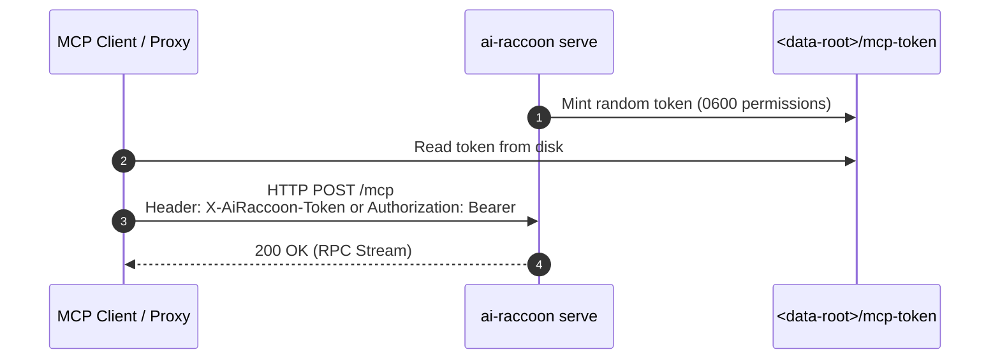
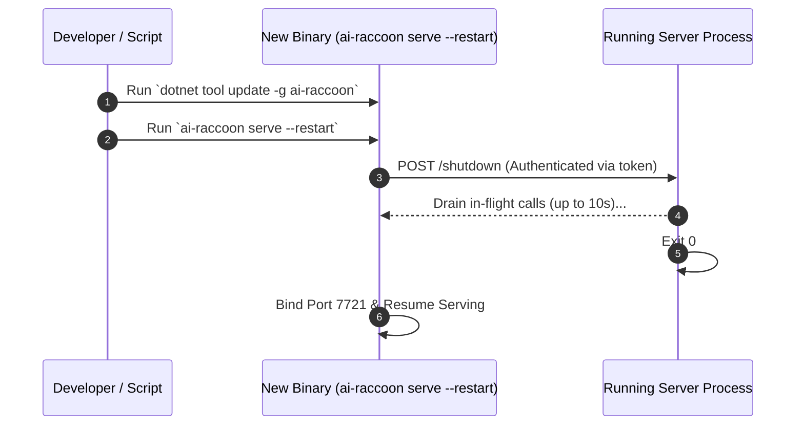

# Configure and run the AiRaccoon server

Set server flags, manage database passphrases, run background daemons, and trigger zero-downtime updates.

---

## Configuration summary

AiRaccoon stores settings directly in the SQLite `memory.db` settings table. Environment variables are reserved for boot parameters and passphrases.

### Environment variables

| Variable | Purpose | Default |
|---|---|---|
| `AIRACCOON_DB_PASSPHRASE` | Passphrase for page-level SQLite3MC encryption | `(unset - plaintext)` |
| `OTEL_EXPORTER_OTLP_ENDPOINT` | Endpoint for OTLP metrics and trace export | `(unset - disabled)` |

### Launch flags

| Flag | Description | Allowed Values | Default |
|---|---|---|---|
| `--transport` | Communication transport | `proxy`, `stdio`, `http`, `https` | `proxy` |
| `--data-root <path>` | Directory for `memory.db` and state | Any valid directory path | `~/.ai-raccoon` |
| `--install-scope` | Scope partition for database storage | `user`, `project` | `user` |
| `--port <n>` | HTTP listen port for serve mode | `1-65535` (`0` for random free port) | `7721` |

---

## Manage database encryption

AiRaccoon uses **SQLite3MC** (ChaCha20/sqleet cipher) for page-level encryption at rest.

### Enable encryption

Set the passphrase variable before launching:

```bash
export AIRACCOON_DB_PASSPHRASE="your-secure-passphrase"
ai-raccoon
```

When encrypted, FTS5 and vec0 virtual tables stay encrypted on disk without breaking hybrid search.

---

## Serve mode lifecycle and authentication

In serve mode (or default proxy mode), the background server authenticates loopback calls with a local token.



### Idle watchdog

By default, `ai-raccoon serve` shuts down after 4 hours without traffic to free memory:

```bash
# Custom idle timeout (e.g. 30 minutes)
ai-raccoon serve --idle-timeout 30m

# Disable idle watchdog (run indefinitely)
ai-raccoon serve --idle-timeout 0
```

---

## Zero-downtime server updates

Updating the global tool replaces the binary on disk, but the running server keeps using the old version until restarted. Run `serve --restart` for a clean, zero-downtime handoff:



Command sequence:

```bash
# 1. Update global tool binary
dotnet tool update -g ai-raccoon

# 2. Trigger graceful restart
ai-raccoon serve --restart > serve.log 2>&1 &

# 3. Verify new server PID and version
ai-raccoon serve observability pid
curl -s http://127.0.0.1:7721/observability
```

---

## Connecting over HTTP directly

If your agent environment cannot spawn processes directly, connect over HTTP:

1. Launch server: `ai-raccoon serve --port 7721`
2. Read loopback token from `~/.ai-raccoon/mcp-token`
3. Send HTTP requests directly:

```bash
curl -X POST http://127.0.0.1:7721/mcp \
  -H "X-AiRaccoon-Token: $(cat ~/.ai-raccoon/mcp-token)" \
  -H "Content-Type: application/json" \
  -d '{"jsonrpc":"2.0","id":1,"method":"initialize","params":{"protocolVersion":"2024-11-05","capabilities":{},"clientInfo":{"name":"curl-test","version":"1.0.0"}}}'
```

---

## Who writes to the bank

**The server is the only process that writes to the bank** (ADR-0075). Every `ai-raccoon settings …`
command you type below runs in the CLI, but the write itself is performed by the server.

**This is invisible in normal use, with one thing worth knowing: a settings command starts the
server if it is not already running.** So the first `settings` command after a reboot takes a
moment longer than the rest, and it leaves a server running afterwards. That is deliberate — it is
the same launcher `serve` uses, with a 30-second budget.

Two commands are exceptions and still act directly:

| command | why |
|---|---|
| `serve` | it *is* the server |
| `encryption …` | it rekeys the bank file itself, and moving it is tracked separately |

`ai-raccoon model set` used to be a third exception. It is not any more — it routes through the
server like everything else, so `encryption` is now the only command that writes the bank directly.

### Changing the embedding model

`model set` is the one settings command that owes real work afterwards: changing the engine makes
every stored vector stale. It is handled as an **outbox** (ADR-0076), which is worth knowing about
because it is visible:

1. One transaction commits the new engine settings, a durable migration record, **and** marks every
   embedded row pending — so the old vectors leave the search index the moment it commits.
2. The command returns. There is no progress output; re-embedding happens in the background.
3. **While a migration is open, every tool call is refused** with `model-migration-in-progress`.
   **Budget for this: it is minutes, not seconds, on a real bank.** Measured on a 25,917-entry
   bank, the re-embed took **~6 minutes**, and the bank refused every read and write for all of it.
   Plan a model change like a maintenance window rather than a settings tweak.
   That is deliberate: the alternative is serving searches against a half-migrated bank.
4. A relay finishes the re-embed and marks the record complete. Only then does the bank serve again.

**If the server dies mid-migration, the next one finishes it** — the record survives the crash and
the startup pass picks it up. You do not need to re-run `model set`. Verified on a real bank: a
`kill -9` at 12,288 of 25,917 rows recovered on restart and finished exactly the remainder, with no
duplicates and nothing lost.

One thing that will not do what you expect: **`model set` with the engine you are already on does
nothing.** It reports success, but there is no migration, no re-embed and no refusal window —
correctly, since nothing has been made stale. The same is true of the first-ever `model set` on a
bank that never had an engine. If you are trying to force a re-embed, changing the engine to an
identical model by a different path is what actually triggers one.

The reason the old vectors are dropped at commit rather than replaced one by one: a bank holding
half one model's vectors and half another's returns quietly worse results with no error anywhere.
Dropping them degrades search to keyword-only until the re-embed lands, which is visible and
recoverable.

If the server cannot be reached, a settings command **fails loudly rather than falling back to
writing directly**, with a distinct exit code per failure shape. A write that could not be
delivered never reports success:

| Exit code | Meaning |
|---|---|
| `17` | the server refused the loopback token — it may serve another data root |
| `18` | the server could not be reached or auto-started within the acquire budget |
| `23` | the server answered but failed with a 5xx — a server-side fault, distinct from `15` (`InvalidArgument`, "you mistyped") |

**Why it works this way.** Two processes writing one SQLite file is a lock-contention problem nobody
chose; it accumulated one command family at a time. Routing every settings write through the server
removes that contention, and it is what makes the encryption rekey's connection-pool clear
meaningful — clearing a pool only affects the process doing the clearing.

---

## Tune what gets stored and what gets searched

Four settings families gate the write path, the read path and the reaper. All are bank-global
and all are stored in the `settings` table, so they survive restarts and apply to every project.

### Write-path noise filtering

Rejects machine-generated content before it reaches the bank; the rejected text is kept in the
noise store rather than discarded ([ADR-0039](../adr/0039-noise-learning-substrate-and-shadow-mode.md)).

```bash
ai-raccoon settings noise show        # enabled: True
ai-raccoon settings noise disable     # accept every write, even ones a policy would reject
ai-raccoon settings noise enable      # the default
ai-raccoon noise entries              # summarize what has been rejected — reads noise_entries, not settings
```

### Read-path query guard

Refuses a `memory_search` query that is itself machine output, and annotates one that merely
contains log-like content ([ADR-0040](../adr/0040-read-path-query-guard.md)). Armed by default.

```bash
ai-raccoon settings queryguard show             # enabled: True  shadow: False  structural: False  threshold: 0.98939822280316
ai-raccoon settings queryguard disable          # every query runs untouched
ai-raccoon settings queryguard shadow enable    # record what the guard would have done, without acting on it
```

Shadow mode is the safe way to measure your own traffic before arming anything: verdicts are
logged and then discarded, so no caller sees a refusal or an annotation.

The structural detector ([ADR-0041](../adr/0041-structural-noise-detector.md)) is a third input
to the *warn* tier only — pure shape statistics, no embedding, and never able to refuse. It ships
off:

```bash
ai-raccoon settings queryguard structural enable
ai-raccoon settings queryguard structural threshold set 0.95   # 0..1; lower annotates more
ai-raccoon settings queryguard structural disable
```

### The sweep reaper

Deletes low-rated, aged project entries on a cadence ([ADR-0025](../adr/0025-the-sweep-reaper.md)).
On by default; shared-tier entries are exempt, and a project not in `full` access mode is skipped.

```bash
ai-raccoon settings sweep show                  # enabled: True  interval: 24 h  threshold: 0.3
ai-raccoon settings sweep disable               # the kill switch
ai-raccoon settings sweep interval-hours 168
ai-raccoon settings sweep threshold set 0.55
```

### Retrieval fusion

```bash
ai-raccoon settings retrieval alpha show        # 0.5
ai-raccoon settings retrieval alpha set 0.7     # 0..1; weights the structure vector against the content vector
```

#### The no-fusion-regression rule (off by default)

[ADR-0006](../adr/0006-rrf-parameter-optimization.md) declares that the hybrid never ranks the
expected chunk below the best single modality. It holds across the tuning queries — and
[#367](https://github.com/Arasz/ai-raccoon/issues/367) found a real bank where it does not: a chunk
ranked **1st** by keyword search alone came back **18th** under the default hybrid.

This setting enforces that rule as an ordering. It has **no tunable parameter** — it is on or off:

```bash
ai-raccoon settings retrieval fusion show       # enabled: False  (default: False — off serves the baseline fusion)
ai-raccoon settings retrieval fusion enable
ai-raccoon settings retrieval fusion disable
```

**It ships off, deliberately.** The offline query corpus cannot adjudicate a fusion change —
[ADR-0072](../adr/0072-a-term-budget-for-long-queries-is-not-adjudicable.md) records a change that
was measured and *not* shipped for exactly this reason, because choosing from a three-query held-out
set is fitting noise. So enabling it is how the evidence gets collected, not a setting you are
expected to leave alone.

**When enabled it records what it changed.** Each search computes both the baseline ordering and the
adjusted one, serves the adjusted one, and writes three measurements to the `metrics` table:
whether the top result changed, how far the baseline's top result moved, and how much of the top 5
shifted. `metrics.correlation_id` joins back to `search_quality`, so a run can be scored against the
usefulness grades it produced. That extra work is why it is gated rather than always on.

Turning it off restores the previous behaviour exactly — the baseline path is unchanged when the
flag is absent or false.

### Self-instrumentation (metrics)

Controls the background writer for AiRaccoon's own performance measurements (see
[Read back performance metrics](read-performance-metrics.md)). Recording itself cannot be turned
off — these three settings only tune the writer, not whether it runs.

| Setting | Key | Default |
|---|---|---|
| Buffer capacity | `metrics.buffer-capacity.global` | `1000` measurements |
| Flush interval | `metrics.flush-interval-seconds.global` | `30` seconds |
| Hot-table retention | `metrics.retention-days.global` (best-effort — holding more is not a violation) | `28` days |

```bash
ai-raccoon settings performance list                  # buffer capacity, flush interval, retention — with take-effect timing
ai-raccoon settings performance buffer-capacity 2000   # takes effect on the next server restart
ai-raccoon settings performance flush-interval 10      # takes effect on the next flush tick
ai-raccoon settings performance retention 60           # takes effect on the next maintenance pass
```

The three knobs take effect on different cadences, and each command's own output states which:
`MetricsFlusher` re-reads the flush interval inside its periodic loop, so a change applies on the
next tick with no restart needed, but reads buffer capacity only once, at the top of its startup
loop — a change there needs the server restarted; `MetricsRetentionJob` re-reads the retention
window on every maintenance pass. `buffer-capacity` and `retention` are bounded
(`MetricsConfigKeys.MaxBufferCapacity`, `MaxRetentionDays`) — an unbounded buffer capacity is an
allocation an operator could otherwise set arbitrarily large, and an unbounded retention window
overflows the reaper's `DateTimeOffset.AddDays` arithmetic.

---

## Diagnose a bank's schema

`CREATE TABLE IF NOT EXISTS` is silent when an object of that name already exists with a **different
shape**. Opening a bank proves its objects *exist*; it never proves they have the right columns,
types or constraints. A bank that diverged unintentionally — an aborted migration, hand surgery, a
partial restore — keeps that shape indefinitely and fails later at query time, far from the cause.

```bash
ai-raccoon doctor                          # verifies the configured bank
ai-raccoon --data-root /path/to/dir doctor # verifies a bank elsewhere (a copy, a restore)
```

A healthy bank:

```
user_version: 10 (this binary: 10)
application_id: -519479064 (expected: -519479064)
doctor verifies schema shape only; it never repairs a bank
status: HEALTHY
```

The same bank with one index dropped by hand:

```
status: SHAPE MISMATCH (1 finding(s))
  - idx_entries_scope_project: missing index
```

Note what the second example shows: `user_version` is correct **and** `application_id` matches, so
neither the version ladder nor the schema digest considers anything wrong — while an index is
missing. That gap is the reason this verb exists.

**It reports; it never repairs.** A wrongly-shaped table may hold data the correct shape cannot
represent, so recreating it is a data-loss decision, not a schema decision — one for you to make
with the bank in front of you.

It opens the bank **read-only** and does not modify it, so it is safe to run against a live bank or
a backup. Exit code is `0` when healthy and non-zero on a mismatch, so it composes into a script:

| Exit code | Meaning |
|---|---|
| `0` | HEALTHY |
| `1` | the encryption key could not be resolved |
| `2` | the bank could not be opened read-only |
| `19` | SHAPE MISMATCH — the bank's actual schema differs from this binary's DDL |
| `20` | the bank's `user_version` is newer than this binary supports |
| `22` | no bank file exists at the resolved path — distinct from HEALTHY, so a wrong `--data-root` is never mistaken for a healthy bank |

If the bank is encrypted and the passphrase cannot be resolved, that is reported as a *read* failure
and is distinguishable from a shape problem — a locked bank is not a broken one.

## Repair chunk ordering on an existing bank

`chunk_index` records where a chunk sits **in its document**. Until 1.23.0 it was derived from row
insertion order instead, and ingest only ever inserted — so a paragraph edited into the *middle* of a
watched file was numbered *last*. Measured on a real 25,995-entry bank: 908 of 1,343 source files had
been re-ingested incrementally, and every one checked was out of document order.

That matters because the adjacent-chunk boost ([ADR-0005](../adr/0005-source-affinity-ranking.md))
tests whether two results are neighbours. Wrong ordering means it rewards chunks that are not.

New ingests are correct from 1.23.0 onward. Rows already in your bank are not — repair them
explicitly:

```bash
ai-raccoon repair chunk-index            # dry run: reports what it would change, writes nothing
ai-raccoon repair chunk-index --apply    # performs the repair
```

**Nothing repairs itself.** This is not in the maintenance job list, so upgrading does not silently
rewrite your bank — you choose when it runs, and the default is a report.

It is **UPDATE-only**: it never inserts or deletes a row. Where a chunk's position genuinely cannot
be known — the source file has been moved or deleted, or the entry was written directly by
`memory_write` and has no file — it sets `chunk_index = -1`, meaning *position unknown*, rather than
guessing. The ranker skips those rows when testing adjacency instead of treating `-1` as a neighbour
of `0`.

### Read the dry run before you apply it

**On a bank with any history, the repair will mark a large fraction of rows *position unknown*, and
you should decide whether that is the trade you want.**

It positions a row by re-chunking the source file with the **current** chunker and matching on
content hash. A row produced by an *older* chunker has different boundaries, so its hash does not
match anything the current chunker produces, and it is honestly marked `-1` rather than guessed at.
This project has changed chunk boundaries several times ([ADR-0036](../adr/0036-engine-aware-chunk-token-budget.md),
[ADR-0048](../adr/0048-a-chunk-is-a-well-formed-markdown-fragment.md), and others), so most rows on
an older bank predate the boundaries in force today.

Measured on a real 25,995-entry bank:

| | rows | share |
|---|---|---|
| would be repositioned | 4,710 | 18% |
| would be marked position-unknown (`-1`) | 16,074 | 62% |

A row at `-1` is **skipped** by the adjacent-chunk boost rather than mis-boosted. That removes the
wrong adjacency this fix exists to eliminate — but it also removes any adjacency signal for those
rows, which is a different behaviour from having a correct one. Whether that is an improvement on
your bank is not something the repair can tell you, and it has not been measured across a query set.

So: **run the dry run, read the two numbers, and decide.** If most of your bank would go to `-1`,
re-ingesting the affected sources under the current chunker is the more thorough fix — that is what
[`repair reingest`](#re-ingesting-files-chunk-index-repair-could-only-mark-unknown) below does, and
this repair is not a substitute for it.

Run it against a **copy** first if you want to see the scale of the change on your own data:

```bash
ai-raccoon --data-root /path/to/copy --port 7799 repair chunk-index
```

## Re-ingesting files chunk-index repair could only mark unknown

`repair chunk-index` never guesses: a row an older chunker produced gets `chunk_index = -1` because
its content hash does not match anything the current chunker emits. That is honest, but it leaves
those chunks with no adjacency signal at all. `repair reingest` is the thorough fix for that
subset — it re-ingests the file itself, so the affected chunks get real positions instead of `-1`.

```bash
ai-raccoon repair reingest            # dry run: reports what it would re-ingest, changes nothing
ai-raccoon repair reingest --apply    # performs the re-ingest
```

**When to reach for this instead of `repair chunk-index`.** Use `repair chunk-index` first — it is
cheap (a pure `UPDATE`) and fixes every row it can. Reach for `repair reingest` only for the files
`repair chunk-index`'s dry run reported as `-1`, and only if you want those chunks to have a real
position rather than being skipped by the adjacency boost. It targets exactly that subset: a source
file that still exists on disk with at least one stored row the current chunker cannot reproduce by
hash. A `memory_write` entry that merely cites a file as its source, and a row whose source file is
gone, are never touched — there is nothing to re-ingest from either.

**Per-row metadata is discarded for every row it replaces, on purpose.** Re-ingesting deletes a
file's chunks and re-inserts them under the current chunker, which cuts new chunk boundaries, so the
new chunks hash differently from the old ones. There is no 1:1 row to carry `rating`, `access_count`,
or `last_accessed_at` onto — this is an accepted consequence of a real re-chunk, not a bug, and there
is deliberately no fuzzy carry-over. Both the dry run and `--apply` print how many rows this affects
before it happens.

**Cost.** Re-ingesting re-embeds every affected chunk. On a large bank this can be thousands of
chunks; the dry run reports the scale (files, rows, chunks to embed) before you commit to it.
Embedding is left pending after `--apply` commits, the same way the file watcher's own replace does —
run `memory_embed_pending` afterward rather than holding the bank's write lock through the embedding
engine.

## Related documentation

- [ADR-0020: Always-on HTTP stdio proxy](../adr/0020-always-on-http-stdio-proxy.md)
- [ADR-0022: Authenticated loopback restart](../adr/0022-authenticated-loopback-restart.md)
- [Security threat model](../../SECURITY.md)
