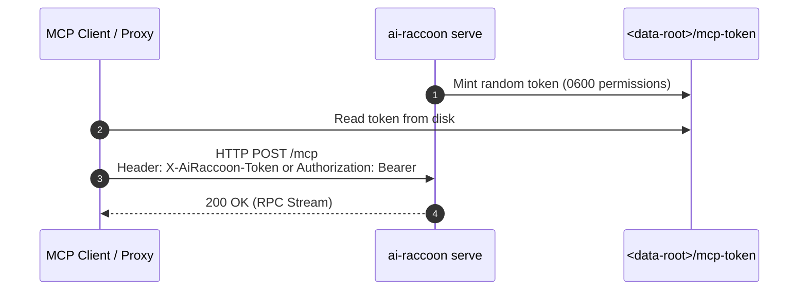
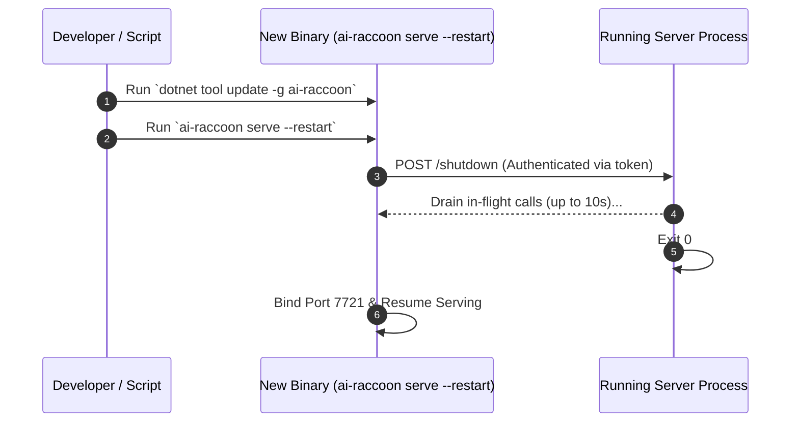

# Configure and run the AiRaccoon server

Set server flags, manage database passphrases, run background daemons, and trigger zero-downtime updates.

---

## Configuration summary

AiRaccoon stores settings directly in the SQLite `memory.db` settings table. Environment variables are reserved for boot parameters and passphrases.

### Environment variables

| Variable | Purpose | Default |
|---|---|---|
| `AIRACCOON_DB_PASSPHRASE` | Passphrase for page-level SQLite3MC encryption | `(unset - plaintext)` |
| `OTEL_EXPORTER_OTLP_ENDPOINT` | Endpoint for OTLP metrics and trace export | `(unset - disabled)` |

### Launch flags

| Flag | Description | Allowed Values | Default |
|---|---|---|---|
| `--transport` | Communication transport | `proxy`, `stdio`, `http`, `https` | `proxy` |
| `--data-root <path>` | Directory for `memory.db` and state | Any valid directory path | `~/.ai-raccoon` |
| `--install-scope` | Scope partition for database storage | `user`, `project` | `user` |
| `--port <n>` | HTTP listen port for serve mode | `1-65535` (`0` for random free port) | `7721` |

---

## Manage database encryption

AiRaccoon uses **SQLite3MC** (ChaCha20/sqleet cipher) for page-level encryption at rest.

### Enable encryption

Set the passphrase variable before launching:

```bash
export AIRACCOON_DB_PASSPHRASE="your-secure-passphrase"
ai-raccoon
```

When encrypted, FTS5 and vec0 virtual tables stay encrypted on disk without breaking hybrid search.

---

## Serve mode lifecycle and authentication

In serve mode (or default proxy mode), the background server authenticates loopback calls with a local token.



### Idle watchdog

By default, `ai-raccoon serve` shuts down after 4 hours without traffic to free memory:

```bash
# Custom idle timeout (e.g. 30 minutes)
ai-raccoon serve --idle-timeout 30m

# Disable idle watchdog (run indefinitely)
ai-raccoon serve --idle-timeout 0
```

---

## Zero-downtime server updates

Updating the global tool replaces the binary on disk, but the running server keeps using the old version until restarted. Run `serve --restart` for a clean, zero-downtime handoff:



Command sequence:

```bash
# 1. Update global tool binary
dotnet tool update -g ai-raccoon

# 2. Trigger graceful restart
ai-raccoon serve --restart > serve.log 2>&1 &

# 3. Verify new server PID and version
ai-raccoon serve observability pid
curl -s http://127.0.0.1:7721/observability
```

---

## Connecting over HTTP directly

If your agent environment cannot spawn processes directly, connect over HTTP:

1. Launch server: `ai-raccoon serve --port 7721`
2. Read loopback token from `~/.ai-raccoon/mcp-token`
3. Send HTTP requests directly:

```bash
curl -X POST http://127.0.0.1:7721/mcp \
  -H "X-AiRaccoon-Token: $(cat ~/.ai-raccoon/mcp-token)" \
  -H "Content-Type: application/json" \
  -d '{"jsonrpc":"2.0","id":1,"method":"initialize","params":{"protocolVersion":"2024-11-05","capabilities":{},"clientInfo":{"name":"curl-test","version":"1.0.0"}}}'
```

---

## Related documentation

- [ADR-0020: Always-on HTTP stdio proxy](../adr/0020-always-on-http-stdio-proxy.md)
- [ADR-0022: Authenticated loopback restart](../adr/0022-authenticated-loopback-restart.md)
- [Security threat model](../../SECURITY.md)
