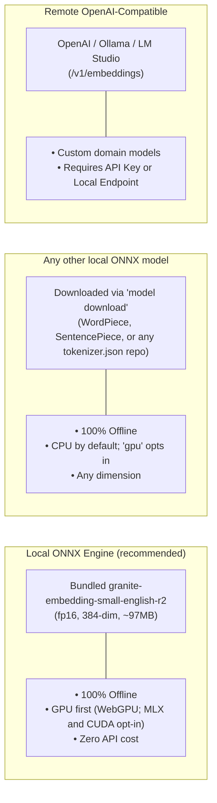
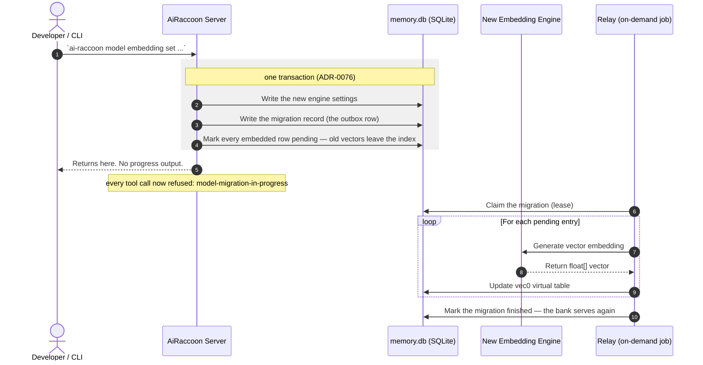

# Configure embedding engines

Select, configure, and switch embedding models for vector search.

> **A fresh bank has no memory engine.** Memory search runs keyword-only until you run
> `ai-raccoon model embedding set local` (Recipe 1, the recommended engine). The `warning`
> on a `memory_search` result says so, and `doctor` reports the same state.

---

## Supported embedding engines

AiRaccoon embeds with one of three engine kinds. Memory and the code corpus each pick their own
independently (Recipe 5); a fresh bank starts with neither configured.



### Supported models

| Engine kind | Model | Dimensions | Context window | Used for | Activate with |
|---|---|---:|---:|---|---|
| Local, bundled (default) | `granite-embedding-small-english-r2` (fp16, Apache-2.0) | 384 | 8,190 tokens (chunked to 254 for memory, 510 for code) | Memory + code | `model embedding set local` / `model code set default` |
| Local, downloaded | Any Hugging Face repo whose `config.json` reports a `bert*`/`new`/`gte*` model type with a `vocab.txt` (WordPiece), an `xlm-roberta`/`roberta`/`t5` type (SentencePiece), or that simply ships a `tokenizer.json` (BPE/byte-level, including decoder-style models pooled last-token) | Whatever the manifest declares | Whatever the manifest declares | Memory or code | `model download <repo-id>`, then `model embedding set local <dir>` / `model code set local <dir>` |
| Remote, OpenAI-compatible | Any `/v1/embeddings` endpoint: OpenAI (`text-embedding-3-small`/`-large`), Ollama, LM Studio, etc. | Endpoint-reported, or `--dims` | Provider's own (8,191 assumed) | Memory only — the code corpus is local-only | `model embedding set openai <model> [base-url] --api-key --dims` |

Named examples this project's own research has downloaded or scored: `BAAI/bge-m3`,
`ibm-granite/granite-embedding-english-r2`, `Alibaba-NLP/gte-modernbert-base`,
`jinaai/jina-embeddings-v2-base-code`, the `Qwen3-Embedding` family, and `google/embeddinggemma-300m`
(gated under the [Gemma Terms](https://ai.google.dev/gemma/terms) — see Recipe 4). Any other repo
that satisfies one of the three tokenizer families above is supported the same way;
`model download <repo-id> --dry-run` says so before anything is fetched.

**Before ADR-0108 (pre-1.47.0):** memory used a bundled `all-MiniLM-L6-v2` (int8, 23 MB) and the
code corpus downloaded `faxenoff/code-daemon-embed-v1` (179 MB) by default. Both lost to
granite-small on every retrieval eval run against them — see
[Embedding benchmark](../reference/embedding-benchmark.md) for the numbers and
[ADR-0108](../adr/0108-one-bundled-engine-granite-small-fp16-on-the-gpu.md) for the decision.

### Performance & latency comparison

The bundled granite-embedding-small-english-r2 (fp16) beats the engines it replaced on every
retrieval eval measured, and runs faster on the GPU than they ran on the CPU
([ADR-0108](../adr/0108-one-bundled-engine-granite-small-fp16-on-the-gpu.md)):

| Engine | Model | Where it runs | Memory nDCG@10 |
|---|---|---|---:|
| Local, bundled (current default) | `granite-embedding-small-english-r2` (fp16) | GPU (WebGPU: measured on macOS; on Windows and Linux x64 through the bundled WebGPU core, measured on Linux x64 with a software Vulkan driver only), else CPU | 0.632 |
| Local, bundled (default before 1.47.0) | `all-MiniLM-L6-v2` (int8) | CPU only | 0.605 |

Full quality and latency numbers for every engine measured, including the remote OpenAI/Ollama
comparison, live in [Embedding benchmark](../reference/embedding-benchmark.md).

---

## Engine configuration recipes

### Recipe 1: Use local bundled ONNX model (recommended)

Switch to or restore the bundled ONNX model:

```bash
ai-raccoon model embedding set local
```

*The local model needs no network access and runs in-process via ONNX Runtime.*

The bundled model is granite-embedding-small-english-r2 (fp16, 384 dimensions, Apache-2.0), and
the code corpus uses the same one (Recipe 5). It replaced all-MiniLM-L6-v2 in 1.47.0, and a bank
embedded with the old model re-embeds once on its own after the upgrade
([ADR-0108](../adr/0108-one-bundled-engine-granite-small-fp16-on-the-gpu.md)).

On macOS, Windows and Linux x64 a local session tries a GPU execution provider before falling back to
the CPU; linux-arm64 and linux-musl-x64 have no WebGPU build and run on the CPU. Which provider it tries, and what the host needs for that provider to actually find a device,
depends on the RID ([ADR-0108](../adr/0108-one-bundled-engine-granite-small-fp16-on-the-gpu.md),
[ADR-0110](../adr/0110-opt-in-mlx-execution-provider-for-the-bundled-engine.md),
[ADR-0112](../adr/0112-webgpu-plugin-off-macos-and-opt-in-cuda.md),
[ADR-0115](../adr/0115-bundle-onnxruntimes-webgpu-core-for-windows-and-linux-x64.md)):

| RID | GPU providers tried, in order | Host dependencies |
|---|---|---|
| `osx-arm64` | `mlx` (opt-in) → WebGPU (built in) → CPU | None for WebGPU. MLX needs Apple Silicon and the plugin's native runtime, bundled only in this RID's package. |
| `win-x64` | `cuda` (opt-in) → WebGPU (bundled core) → CPU | WebGPU needs a GPU driver with D3D12 support. CUDA needs an NVIDIA driver, CUDA 13 and — unverified — cuDNN 9. |
| `win-arm64` | WebGPU (bundled core) → CPU | Same as win-x64. The CUDA provider only ships for x64, so `cuda` here refuses and falls through. |
| `linux-x64` | `cuda` (opt-in) → WebGPU (bundled core) → CPU | WebGPU needs the Vulkan loader, `libvulkan.so.1` (`apt install libvulkan1` or the distro equivalent), plus the vendor's own Vulkan driver. CUDA needs an NVIDIA driver, CUDA 13 and — unverified — cuDNN 9. |
| `linux-arm64` | CPU | ONNX Runtime publishes no WebGPU build for linux-arm64. No CUDA provider ships for arm64; `cuda` refuses and falls through. |
| `linux-musl-x64` | CPU only | None — there is no WebGPU or CUDA build for musl. |

**Windows and Linux x64 run WebGPU from a bundled core.** ONNX Runtime's NuGet core has no WebGPU on
those platforms. The separate WebGPU plugin that 1.51.0 used aborted the process on its first run
([onnxruntime#28329](https://github.com/microsoft/onnxruntime/issues/28329)), so 1.51.2 turned it
off. Since 1.52.0 the package ships the core ONNX Runtime publishes for Node.js in place of the
NuGet one: the same 1.30.0 release and commit, with WebGPU compiled in ([ADR-0115](../adr/0115-bundle-onnxruntimes-webgpu-core-for-windows-and-linux-x64.md)).
The opt-in `cuda` device still loads through the plugin mechanism the upstream issue was reported
against. It is available, but expect the same abort until that issue is fixed; if the server dies on
the first embed after you set it, run `ai-raccoon settings model device auto`.

`settings model device` changes which of these an operator opts into, taking effect on the next
server restart:

```bash
ai-raccoon settings model device auto            # default: the bundled model on the GPU, other models on the CPU
ai-raccoon settings model device gpu             # every local model on the GPU where the platform has one
ai-raccoon settings model device cpu             # never the GPU
ai-raccoon settings model device mlx             # bundled model only, osx-arm64 only — see below
ai-raccoon settings model device cuda <path>      # every local model, opt-in, needs a provider library — see below
```

`auto` keeps downloaded models on the CPU because a quantized (int8) model produces slightly
different vectors on the GPU than the ones already stored from the CPU. Switch to `gpu` only for
a model whose bank you are happy to have embedded on the GPU from the start.

**Reading the "execution provider" line.** Every embedding session logs which provider it landed
on (`CUDA`, `WebGPU`, `MLX` or `CPU`), with the landing provider's own refusal reason first when it
had one — for example WebGPU's own `"CPU (GPU refused: …)"` — followed by a suffix for each opt-in
candidate (MLX, then CUDA) it tried and lost, in that fixed order regardless of what it landed on:
`"WebGPU (CUDA refused: provider library not found: <path>)"`, or, on a host with no usable GPU
driver, `"CPU (GPU refused: …) (CUDA refused: …)"`. On linux-arm64 the WebGPU reason reads
`"this platform's ONNX Runtime core has no WebGPU"`. A session never throws because a GPU attempt failed — it always finishes on
some provider, and the log line says which one and why the others were skipped. Force the CPU
outright with `ai-raccoon settings model device cpu`.

**`mlx` is opt-in and bundled-engine-only** ([ADR-0110](../adr/0110-opt-in-mlx-execution-provider-for-the-bundled-engine.md)):
it runs the bundled engine through the onnxruntime MLX plugin execution provider instead of
WebGPU, on a rewritten copy of the graph that lets the plugin claim the whole thing as one fused
subgraph. It needs macOS on Apple Silicon and the plugin's native runtime, which only the
osx-arm64 package carries (about 43 MB compressed) — a build that never fetched that runtime, or a
non-Apple-Silicon machine, falls straight through to the existing WebGPU-then-CPU path and says so
in the "execution provider" line (`WebGPU (MLX refused: …)` or `CPU (MLX refused: …)`). Setting it
for a downloaded (non-bundled) model is a no-op: no rewritten graph exists for it, so that model
keeps running wherever `auto`/`gpu`/`cpu` already put it.

An MLX session pads each row to the next multiple of 64 tokens and caps MLX's buffer cache at
512 MiB ([ADR-0114](../adr/0114-mlx-length-buckets-and-a-capped-buffer-cache.md)); vectors are
unchanged. Without the cap, MLX keeps buffers for every row length it has run, and the process
footprint (the Memory column in Activity Monitor, not RSS) can reach most of the machine's RAM
during a re-embed. The server logs `MLX buffer cache capped at 512 MiB` once per MLX session, or a
warning if the cap could not be set.

#### CUDA (opt-in, x64 only, untested on real hardware)

CUDA is never bundled — its native provider is over 270 MB, past the size nuget.org allows for a
package — so it is a library you install yourself and point the tool at
([ADR-0112](../adr/0112-webgpu-plugin-off-macos-and-opt-in-cuda.md)). It applies to every local
model, not only the bundled one.

1. Install the CUDA execution provider, matching the tool's ONNX Runtime core **exactly**:
   `Microsoft.ML.OnnxRuntime.Gpu.Linux` or `Microsoft.ML.OnnxRuntime.Gpu.Windows`, version
   `1.30.0`. A different version will not register against this build's core. The provider also
   needs `onnxruntime_providers_shared`, which the tool already ships beside itself — no separate
   install for that part — and refuses to load if the two do not match.
2. Point the tool at the provider library:

   ```bash
   ai-raccoon settings model device cuda /abs/path/to/libonnxruntime_providers_cuda.so   # Linux
   ai-raccoon settings model device cuda C:\path\to\onnxruntime_providers_cuda.dll        # Windows
   ```

3. Restart the server. A session now tries CUDA first, falls back to WebGPU, then the CPU, and the
   "execution provider" log line says which one it landed on.

The path is refused up front, with nothing written, when it does not exist, when `cuda` is given
with no path, or when a path is given for any other device. A session also refuses a stored path
that is not absolute — the CLI always writes one, so this only matters for a hand-edited settings
file — with "provider library path must be absolute: `<path>`". `cuda` needs an NVIDIA driver and
CUDA 13 on the host. The cuDNN version ONNX Runtime 1.30 needs against CUDA 13 is not published
yet on its own — [ONNX Runtime's CUDA execution provider requirements
table](https://onnxruntime.ai/docs/execution-providers/CUDA-ExecutionProvider.html) lists 1.27.x
through 1.29.x against CUDA 13.0 and cuDNN 9.x, and does not yet list 1.30 — so cuDNN 9 is the
expected requirement by that pattern, but it is unverified for 1.30 specifically.

Nobody has run this on real NVIDIA hardware. Registering the provider as a plugin against the
tool's ONNX Runtime core is expected to work, on the strength of the shared plugin entry points
the MLX provider already uses, but that expectation is unverified. If it does not work,
the session falls back to WebGPU or the CPU and the log line names the refusal reason. It may also
abort the process on the first embed, like the retired WebGPU plugin (see above); switch back with
`ai-raccoon settings model device auto` if it does. Report
anything unexpected on the repository.

`win-arm64` and `linux-arm64` have no CUDA provider build; `settings model device cuda <path>`
still stores the setting there, but the session refuses the CUDA attempt and falls through to
WebGPU on win-arm64 and the CPU on linux-arm64. `linux-musl-x64` has neither CUDA nor WebGPU and stays CPU-only
regardless of this setting.

#### Checking a Linux GPU host

`scripts/gpu-host-probe.sh` checks both GPU paths on any Linux machine with a shell, such as a
Kaggle or Colab notebook (prefix it with `!`) or a Lightning AI Studio:

```bash
curl -fsSL https://raw.githubusercontent.com/Arasz/ai-raccoon/main/scripts/gpu-host-probe.sh | bash
```

It prints the GPU, driver and Vulkan devices, builds the tests, installs the CUDA 13 runtime
wheels and the `1.30.0` CUDA provider, fetches the bundled WebGPU core, then runs the WebGPU session test (it lands on WebGPU only when the
host exposes a Vulkan driver) and the CUDA session test with `AIRACCOON_TEST_CUDA_LIBRARY` set. The
closing `PROBE SUMMARY` block says which paths ran and, for a WebGPU fallback, why.

### Recipe 2: Configure OpenAI embeddings

Use official OpenAI text embeddings:

```bash
ai-raccoon model embedding set openai text-embedding-3-small --api-key "sk-..."
```

### Recipe 3: Configure Ollama or local LLM server

Point to a local Ollama or LM Studio OpenAI-compatible endpoint:

```bash
ai-raccoon model embedding set openai bge-m3 http://localhost:11434/v1 --api-key "ollama"
```

Declare the output dimension whenever it is not 384 — sqlite-vec cannot infer it, and
the vector index has to be rebuilt to match:

```bash
ai-raccoon model embedding set openai text-embedding-3-large --api-key "sk-..." --dims 3072
```

`model embedding set` probes the endpoint before it commits. A `--dims` the endpoint contradicts,
an endpoint that returns something other than 384 with no `--dims`, or an endpoint that
cannot be reached are all refused with nothing written.

### Recipe 4: Run an arbitrary Hugging Face model locally

Download a model into `<data-root>/models/<slug>`, verified against the SHA-256 pins
Hugging Face publishes as LFS oids, then activate it as a second step:

```bash
ai-raccoon model download BAAI/bge-m3 --dry-run   # resolve, print files, sizes and pins
ai-raccoon model download BAAI/bge-m3 --yes       # >500 MB needs --yes
ai-raccoon model embedding set local <data-root>/models/bge-m3
```

The download writes `ai-raccoon.manifest.json` beside the model files, describing its
dimensions, context window, tokenizer family, pooling and normalization — read from the
repo's own `config.json`, `tokenizer_config.json`, `1_Pooling/config.json` and
`modules.json` rather than guessed. **A model directory without that manifest is
refused**; only the legacy `model embedding set local <file>.onnx` path keeps the bundled defaults.

Any repo that ships a Hugging Face `tokenizer.json` downloads too, whatever its architecture:
ModernBERT (`ibm-granite/granite-embedding-english-r2` and its small sibling,
`Alibaba-NLP/gte-modernbert-base`), `jinaai/jina-embeddings-v2-base-code`, Qwen3-Embedding and
EmbeddingGemma. AiRaccoon reads that file itself, with no native tokenizer library, and matches
Hugging Face's token ids exactly. Community ONNX exports keep several variants side by side, so
pick the one you want with `--file`:

```bash
ai-raccoon model download onnx-community/embeddinggemma-300m-ONNX --file onnx/model_quantized.onnx
ai-raccoon model download onnx-community/Qwen3-Embedding-0.6B-ONNX --file onnx/model_int8.onnx --yes
```

Some models were trained with prompts in front of queries and documents. The download copies
them from the repo's `config_sentence_transformers.json` into the manifest's `queryInstruction`
and `documentInstruction`. ONNX mirrors often leave that file out, so check the base model's card
and set the two fields by hand when they are missing. For EmbeddingGemma they are
`"task: search result | query: "` and `"title: none | text: "`. Changing either field changes the
engine fingerprint, which re-embeds the bank.

EmbeddingGemma is covered by the [Gemma Terms of Use](https://ai.google.dev/gemma/terms), not an
open-source licence. Downloading it for your own use is fine, and the terms claim no rights in the
vectors it produces. Redistributing the weights carries the notice and pass-through duties in
section 3.1 of those terms.

**`pooling.mode` comes from the graph, not only from those files.** A repo with no
`1_Pooling/config.json` leaves the mode to be inferred, and some models pool *inside* their
own ONNX graph — their token-embeddings output is `[batch, dimensions]`, already a vector, so
no token-level mode can be applied to it. After the download verifies the graph it reads that
output's declared rank, and a rank-2 output writes `pooling.mode: model-output` with
`onnx.embeddingOutput` naming it. A manifest written before this existed says something else
(`cls`, typically) and the engine logs event 417 on every load; **activating that directory
corrects the file once** and logs event 424 — activation re-embeds anyway, so the correction
costs nothing there, and the vectors are identical either way (the graph's own pooling was
always what ran). The sha256 pins are not the manifest's own and are left untouched.

**Known refusal — a fairseq-offset tokenizer with no `added_tokens_decoder`.** Whether a
sentencepiece repo is fairseq-offset is decided from data, never the tokenizer class: once the
sentencepiece model file is downloaded, its own piece count is compared against config.json's
`vocab_size`. When the two agree, the piece table's own numbering already IS the model's
vocabulary — the tokenizer_class string doesn't matter, and the download derives special-token
ids straight from the piece table (this is the default path for any sentencepiece repo with no
`added_tokens_decoder`). When `vocab_size` is larger than the piece count — some
xlm-roberta-family repos prepend fairseq's own four specials in front of the sentencepiece
pieces, so their `<s>` is 0 and `<unk>` is 3 while the piece table numbers them 1 and 0 — and the
repo also ships no `added_tokens_decoder`, the piece table is the only available source and its
numbering is the wrong one; writing those ids would embed the wrong `<s>` and `<unk>` for every
sequence without any error. The download refuses instead, naming the measured `vocab_size` and
piece-count difference. Hand-write `ai-raccoon.manifest.json` with the model's real
special-token ids and `tokenizer.options.vocabOffset`, then `model embedding set local` the directory as
usual.

Downloading never activates: `model embedding set local` (or `model code set local` for
the code corpus) is always the explicit next step.

Activation re-checks the pins, not just the manifest: every pinned tokenizer/ONNX file is
re-hashed against the bytes on disk, so a file swapped in place after download (manifest
untouched) is refused rather than silently embedded. The non-LFS provenance files
(`config.json`, `tokenizer_config.json`) are pinned into the manifest the same way and
covered by the same check.

### Recipe 5: Activate the code corpus's embedding engine

The code corpus (`kind=code`/`kind=both` search) has its **own** embedding engine,
configured independently of everything above — activating it never touches
`embedding.provider`/`embedding.model`/`embedding.engine`, and vice versa.

```bash
ai-raccoon model code set default
```

That is the whole recipe. It activates the bundled model (the same one memory uses, so one session
serves both) and marks the code corpus's rows pending for the code-reindex job. Nothing is
downloaded. Before 1.47.0 this command downloaded `faxenoff/code-daemon-embed-v1`; a corpus still
on that model keeps it until you run the command again.

It is the one command every surface that can notice a missing code engine quotes: the
`code engine not configured` search warning, `ai-raccoon doctor`, the MCP server
instructions and the `memory_search` tool description all name this exact string
(`CodeEngineSetup.DefaultModelCommand` — one constant, not six copies).

**Why this one activates when `model download` never does.** `model download` is a fetch
verb and stays one. `model code set default` lives in the `model code set` family, which is the
activating family, and it deliberately does both halves: the surfaces above have to hand a
user something they can paste, and "download, then run a second command with a path you
work out yourself" is a hint people do not complete (#422).

The long way round still works, and is what you want for a non-default model:

```bash
ai-raccoon model download faxenoff/code-daemon-embed-v1
ai-raccoon model code set local <data-root>/models/faxenoff__code-daemon-embed-v1
```

`faxenoff/code-daemon-embed-v1`'s HF repo ships no `added_tokens_decoder` in its
`tokenizer_config.json`; `model download` derives the special-token ids from the
sentencepiece model file's own piece table instead (issue #417, verified against a real
download) — still refusing, naming the missing piece, if a declared token isn't in that
table (D1: never guessed).

The code chunker's budget is 510 content tokens — the model's **measured** window (512)
minus its two special tokens. Activation refuses a manifest whose window is *narrower* than
that, because that engine would silently truncate every chunk at embed time; a *wider*
window is accepted, since under-filled chunks cost recall, not correctness. (Until #422
this gate demanded exactly 126 tokens, derived from an exploration note claiming a
128-token cap the ONNX graph does not have, and the flagship model could not be activated
without hand-editing its manifest. The measurement is on issue #422.)

`vec_code` is a vec0 table like the memory bank's: fresh banks start at `float[768]` (the
default model's dimension), and activation reconciles it to whatever dimension the manifest
declares, in the same transaction — there is no configure-time dimension gate (vec-code-unfix-dim).
A missing/invalid manifest is refused with the loader's own error.

On success the settings write (`embedding.codeModel`/`embedding.codeEngine`/
`embedding.codeDimensions`), the `vec_code` reconcile and invalidating every
already-embedded code row to `pending` commit together in one
transaction — `vec_code` empties in that same commit, so there is no window where it
holds vectors from the old engine. There is **no outbox and no migration wait**: the
command returns immediately, memory tools are never blocked, and `kind=code` search
degrades to FTS5-only until the `code-reindex` maintenance job re-embeds the pending
rows on its own cadence.

```bash
ai-raccoon settings model show          # includes codeModel/codeEngine when set
ai-raccoon settings model code reset    # deletes ONLY the code engine rows
ai-raccoon settings model reset         # the memory engine's reset; never touches code rows
```

---

## Re-embedding lifecycle

This section covers the **memory** engine (`model embedding set local`/`model embedding set openai`) only.
`model code set local` (Recipe 5) does not use this outbox/relay/ToolGate machinery at
all — it invalidates the code corpus in one plain transaction and returns; the
`code-reindex` maintenance job drains it in the background with no tool-blocking window.

Switching embedding engines re-embeds all memories in the active bank. When the new
engine's dimension differs, the drain's **first** step rebuilds `vec_entries` and
`vec_structure` at the new width in one transaction, then refills them as it re-embeds.

**Budget the time before you switch.** The bank refuses every tool call until the drain
finishes. Measured on a 23,520-entry bank: the bundled MiniLM re-embeds in minutes;
bge-m3 (1024-d, fp32, 2.27 GB) runs at ~1.85 entries/s — about **3.4 hours**. A dimension
change costs this in both directions.



The command returns before the re-embedding happens — but that is not the same as the *change* being
quick. Three things follow, and the first is the one that catches people out:

- **The bank refuses tool calls until the migration completes — for minutes, not seconds.** Measured
  on a 25,917-entry bank: **~6 minutes**, refusing every read and write throughout. Plan a model
  change as a maintenance window rather than a settings tweak; it scales with the size of the bank.
  Searching a half-migrated bank
  would return quietly worse results; refusing is the honest alternative.
- **A crash does not lose the migration.** The record is durable, so the next server's startup pass
  finishes it — you do not re-run `model embedding set`.
- **Search degrades to keyword-only in the meantime**, because the stale vectors are dropped when
  the transaction commits rather than being overwritten one at a time.

---

## Related documentation

- [Embedding benchmark data & harness](../reference/embedding-benchmark.md)
- [ADR-0004: Dual vector structure signal](../adr/0004-dual-vector-structure-signal.md)
