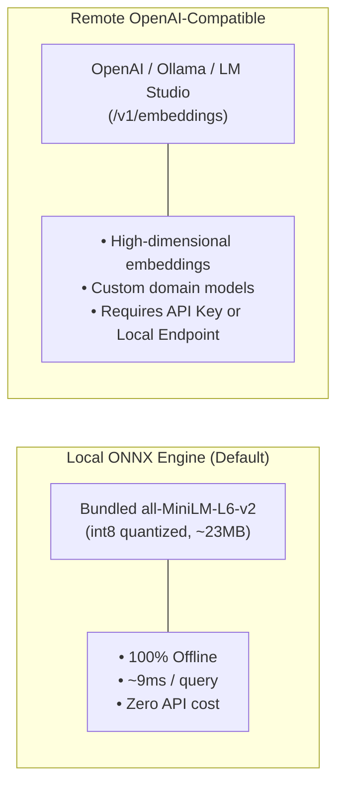
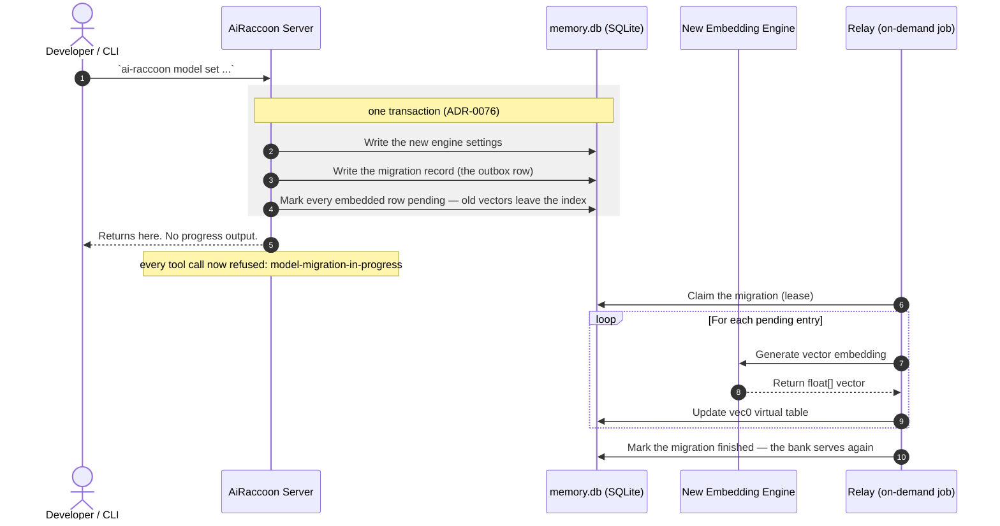

# Configure embedding engines

Select, configure, and switch embedding models for vector search.

---

## Supported embedding engines

AiRaccoon supports two vector embedding engines:



### Performance & latency comparison

| Engine | Model | Latency | Offline | MRR Score |
|---|---|---|---|---|
| **Local (Default)** | `all-MiniLM-L6-v2` (int8) | ~9 ms | Yes | 0.836 |
| **Remote OpenAI** | `text-embedding-3-small` | ~60-120 ms | No | 0.854 |
| **Remote Local LLM** | `bge-m3` (via Ollama) | ~25-50 ms | Yes | 0.858 |

---

## Engine configuration recipes

### Recipe 1: Use local bundled ONNX model (Default)

Switch to or restore the bundled ONNX model:

```bash
ai-raccoon model set local
```

*The local model needs no network access and runs in-process via ONNX Runtime.*

### Recipe 2: Configure OpenAI embeddings

Use official OpenAI text embeddings:

```bash
ai-raccoon model set openai text-embedding-3-small --api-key "sk-..."
```

### Recipe 3: Configure Ollama or local LLM server

Point to a local Ollama or LM Studio OpenAI-compatible endpoint:

```bash
ai-raccoon model set openai bge-m3 http://localhost:11434/v1 --api-key "ollama"
```

Declare the output dimension whenever it is not 384 — sqlite-vec cannot infer it, and
the vector index has to be rebuilt to match:

```bash
ai-raccoon model set openai text-embedding-3-large --api-key "sk-..." --dims 3072
```

`model set` probes the endpoint before it commits. A `--dims` the endpoint contradicts,
an endpoint that returns something other than 384 with no `--dims`, or an endpoint that
cannot be reached are all refused with nothing written.

### Recipe 4: Run an arbitrary Hugging Face model locally

Download a model into `<data-root>/models/<slug>`, verified against the SHA-256 pins
Hugging Face publishes as LFS oids, then activate it as a second step:

```bash
ai-raccoon model download BAAI/bge-m3 --dry-run   # resolve, print files, sizes and pins
ai-raccoon model download BAAI/bge-m3 --yes       # >500 MB needs --yes
ai-raccoon model set local <data-root>/models/bge-m3
```

The download writes `ai-raccoon.manifest.json` beside the model files, describing its
dimensions, context window, tokenizer family, pooling and normalization — read from the
repo's own `config.json`, `tokenizer_config.json`, `1_Pooling/config.json` and
`modules.json` rather than guessed. **A model directory without that manifest is
refused**; only the legacy `model set local <file>.onnx` path keeps the bundled defaults.

**Known refusal — a fairseq-offset tokenizer with no `added_tokens_decoder`.** An
xlm-roberta-family repo (`tokenizer_class: XLMRoberta*`) numbers its vocabulary as the
sentencepiece pieces shifted behind fairseq's own four specials, so its `<s>` is 0 and its
`<unk>` is 3 — while the sentencepiece model file numbers them 1 and 0. When such a repo also
ships no `added_tokens_decoder`, the only available source is the piece table, whose numbering
is the wrong one; writing those ids would embed the wrong `<s>` and `<unk>` for every sequence
without any error. The download refuses instead. Hand-write `ai-raccoon.manifest.json` with the
model's real special-token ids and `tokenizer.options.vocabOffset`, then `model set local` the
directory as usual.

Downloading never activates: `model set local` is always the explicit next step.

### Recipe 5: Activate the code corpus's embedding engine

The code corpus (`kind=code`/`kind=both` search) has its **own** embedding engine,
configured independently of everything above — activating it never touches
`embedding.provider`/`embedding.model`/`embedding.engine`, and vice versa.

```bash
ai-raccoon model download faxenoff/code-daemon-embed-v1
ai-raccoon model set code local <data-root>/models/faxenoff__code-daemon-embed-v1
```

`faxenoff/code-daemon-embed-v1`'s HF repo ships no `added_tokens_decoder` in its
`tokenizer_config.json`; `model download` derives the special-token ids from the
sentencepiece model file's own piece table instead (issue #417, verified against a real
download) — still refusing, naming the missing piece, if a declared token isn't in that
table (D1: never guessed).

> **Separate, pre-existing gap:** the repo's `config.json` gives it a 512-token context
> window, but the code corpus's chunker is hard-pinned to a 126-token budget (no
> manifest-aware chunking yet, v2 — `SqliteCodeEngineStore.ActivateCodeEngineAsync`
> refuses on purpose rather than silently over/under-filling every chunk). A plain
> `model download` therefore writes a manifest that `model set code local` still
> refuses, naming the mismatch. Until v2 lands, edit the downloaded
> `ai-raccoon.manifest.json`'s `contextWindowTokens` down to `128` (as
> `tests/AiRaccoon.Tests/Resources/ManifestFixtures/code-daemon-embed-v1.json` does) before
> running `model set code local` — the rest of the recipe then works as documented.

`vec_code` is a fixed `float[768]` index — unlike the memory engine, there is **no**
dimension-reconcile phase, so `model set code local` refuses a manifest whose
`dimensions` is not `768` before anything commits, naming the declared value and the
required `768`. A missing/invalid manifest is refused the same way, with the loader's
own error.

On success the settings write (`embedding.codeModel`/`embedding.codeEngine`) and
invalidating every already-embedded code row to `pending` commit together in one
transaction — `vec_code` empties in that same commit, so there is no window where it
holds vectors from the old engine. There is **no outbox and no migration wait**: the
command returns immediately, memory tools are never blocked, and `kind=code` search
degrades to FTS5-only until the `code-reindex` maintenance job re-embeds the pending
rows on its own cadence.

```bash
ai-raccoon settings model show          # includes codeModel/codeEngine when set
ai-raccoon settings model code reset    # deletes ONLY the code engine rows
ai-raccoon settings model reset         # the memory engine's reset; never touches code rows
```

---

## Re-embedding lifecycle

This section covers the **memory** engine (`model set local`/`model set openai`) only.
`model set code local` (Recipe 5) does not use this outbox/relay/ToolGate machinery at
all — it invalidates the code corpus in one plain transaction and returns; the
`code-reindex` maintenance job drains it in the background with no tool-blocking window.

Switching embedding engines re-embeds all memories in the active bank. When the new
engine's dimension differs, the drain's **first** step rebuilds `vec_entries` and
`vec_structure` at the new width in one transaction, then refills them as it re-embeds.

**Budget the time before you switch.** The bank refuses every tool call until the drain
finishes. Measured on a 23,520-entry bank: the bundled MiniLM re-embeds in minutes;
bge-m3 (1024-d, fp32, 2.27 GB) runs at ~1.85 entries/s — about **3.4 hours**. A dimension
change costs this in both directions.



The command returns before the re-embedding happens — but that is not the same as the *change* being
quick. Three things follow, and the first is the one that catches people out:

- **The bank refuses tool calls until the migration completes — for minutes, not seconds.** Measured
  on a 25,917-entry bank: **~6 minutes**, refusing every read and write throughout. Plan a model
  change as a maintenance window rather than a settings tweak; it scales with the size of the bank.
  Searching a half-migrated bank
  would return quietly worse results; refusing is the honest alternative.
- **A crash does not lose the migration.** The record is durable, so the next server's startup pass
  finishes it — you do not re-run `model set`.
- **Search degrades to keyword-only in the meantime**, because the stale vectors are dropped when
  the transaction commits rather than being overwritten one at a time.

---

## Related documentation

- [Embedding benchmark data & harness](../reference/embedding-benchmark.md)
- [ADR-0004: Dual vector structure signal](../adr/0004-dual-vector-structure-signal.md)
