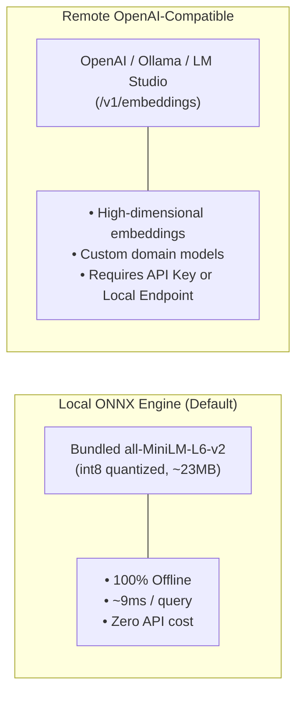
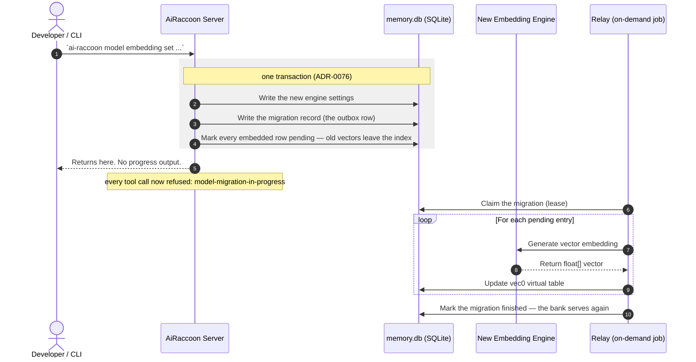

# Configure embedding engines

Select, configure, and switch embedding models for vector search.

---

## Supported embedding engines

AiRaccoon supports two vector embedding engines:



### Performance & latency comparison

| Engine | Model | Latency | Offline | MRR Score |
|---|---|---|---|---|
| **Local (Default)** | `all-MiniLM-L6-v2` (int8) | ~9 ms | Yes | 0.836 |
| **Remote OpenAI** | `text-embedding-3-small` | ~60-120 ms | No | 0.854 |
| **Remote Local LLM** | `bge-m3` (via Ollama) | ~25-50 ms | Yes | 0.858 |

---

## Engine configuration recipes

### Recipe 1: Use local bundled ONNX model (Default)

Switch to or restore the bundled ONNX model:

```bash
ai-raccoon model embedding set local
```

*The local model needs no network access and runs in-process via ONNX Runtime.*

### Recipe 2: Configure OpenAI embeddings

Use official OpenAI text embeddings:

```bash
ai-raccoon model embedding set openai text-embedding-3-small --api-key "sk-..."
```

### Recipe 3: Configure Ollama or local LLM server

Point to a local Ollama or LM Studio OpenAI-compatible endpoint:

```bash
ai-raccoon model embedding set openai bge-m3 http://localhost:11434/v1 --api-key "ollama"
```

Declare the output dimension whenever it is not 384 — sqlite-vec cannot infer it, and
the vector index has to be rebuilt to match:

```bash
ai-raccoon model embedding set openai text-embedding-3-large --api-key "sk-..." --dims 3072
```

`model embedding set` probes the endpoint before it commits. A `--dims` the endpoint contradicts,
an endpoint that returns something other than 384 with no `--dims`, or an endpoint that
cannot be reached are all refused with nothing written.

### Recipe 4: Run an arbitrary Hugging Face model locally

Download a model into `<data-root>/models/<slug>`, verified against the SHA-256 pins
Hugging Face publishes as LFS oids, then activate it as a second step:

```bash
ai-raccoon model download BAAI/bge-m3 --dry-run   # resolve, print files, sizes and pins
ai-raccoon model download BAAI/bge-m3 --yes       # >500 MB needs --yes
ai-raccoon model embedding set local <data-root>/models/bge-m3
```

The download writes `ai-raccoon.manifest.json` beside the model files, describing its
dimensions, context window, tokenizer family, pooling and normalization — read from the
repo's own `config.json`, `tokenizer_config.json`, `1_Pooling/config.json` and
`modules.json` rather than guessed. **A model directory without that manifest is
refused**; only the legacy `model embedding set local <file>.onnx` path keeps the bundled defaults.

**`pooling.mode` comes from the graph, not only from those files.** A repo with no
`1_Pooling/config.json` leaves the mode to be inferred, and some models pool *inside* their
own ONNX graph — their token-embeddings output is `[batch, dimensions]`, already a vector, so
no token-level mode can be applied to it. After the download verifies the graph it reads that
output's declared rank, and a rank-2 output writes `pooling.mode: model-output` with
`onnx.embeddingOutput` naming it. A manifest written before this existed says something else
(`cls`, typically) and the engine logs event 417 on every load; **activating that directory
corrects the file once** and logs event 424 — activation re-embeds anyway, so the correction
costs nothing there, and the vectors are identical either way (the graph's own pooling was
always what ran). The sha256 pins are not the manifest's own and are left untouched.

**Known refusal — a fairseq-offset tokenizer with no `added_tokens_decoder`.** Whether a
sentencepiece repo is fairseq-offset is decided from data, never the tokenizer class: once the
sentencepiece model file is downloaded, its own piece count is compared against config.json's
`vocab_size`. When the two agree, the piece table's own numbering already IS the model's
vocabulary — the tokenizer_class string doesn't matter, and the download derives special-token
ids straight from the piece table (this is the default path for any sentencepiece repo with no
`added_tokens_decoder`). When `vocab_size` is larger than the piece count — some
xlm-roberta-family repos prepend fairseq's own four specials in front of the sentencepiece
pieces, so their `<s>` is 0 and `<unk>` is 3 while the piece table numbers them 1 and 0 — and the
repo also ships no `added_tokens_decoder`, the piece table is the only available source and its
numbering is the wrong one; writing those ids would embed the wrong `<s>` and `<unk>` for every
sequence without any error. The download refuses instead, naming the measured `vocab_size` and
piece-count difference. Hand-write `ai-raccoon.manifest.json` with the model's real
special-token ids and `tokenizer.options.vocabOffset`, then `model embedding set local` the directory as
usual.

Downloading never activates: `model embedding set local` (or `model code set local` for
the code corpus) is always the explicit next step.

Activation re-checks the pins, not just the manifest: every pinned tokenizer/ONNX file is
re-hashed against the bytes on disk, so a file swapped in place after download (manifest
untouched) is refused rather than silently embedded. The non-LFS provenance files
(`config.json`, `tokenizer_config.json`) are pinned into the manifest the same way and
covered by the same check.

### Recipe 5: Activate the code corpus's embedding engine

The code corpus (`kind=code`/`kind=both` search) has its **own** embedding engine,
configured independently of everything above — activating it never touches
`embedding.provider`/`embedding.model`/`embedding.engine`, and vice versa.

```bash
ai-raccoon model code set default
```

That is the whole recipe. It downloads `faxenoff/code-daemon-embed-v1` (187 MB) into
`<data-root>/models/faxenoff__code-daemon-embed-v1` if it is not already there, and then
activates it. Run it again later and it only re-activates — nothing is re-fetched, and a
manifest whose `pooling.mode` the graph contradicts is corrected in that same pass.

It is the one command every surface that can notice a missing code engine quotes: the
`code engine not configured` search warning, `ai-raccoon doctor`, the MCP server
instructions and the `memory_search` tool description all name this exact string
(`CodeEngineSetup.DefaultModelCommand` — one constant, not six copies).

**Why this one activates when `model download` never does.** `model download` is a fetch
verb and stays one. `model code set default` lives in the `model code set` family, which is the
activating family, and it deliberately does both halves: the surfaces above have to hand a
user something they can paste, and "download, then run a second command with a path you
work out yourself" is a hint people do not complete (#422).

The long way round still works, and is what you want for a non-default model:

```bash
ai-raccoon model download faxenoff/code-daemon-embed-v1
ai-raccoon model code set local <data-root>/models/faxenoff__code-daemon-embed-v1
```

`faxenoff/code-daemon-embed-v1`'s HF repo ships no `added_tokens_decoder` in its
`tokenizer_config.json`; `model download` derives the special-token ids from the
sentencepiece model file's own piece table instead (issue #417, verified against a real
download) — still refusing, naming the missing piece, if a declared token isn't in that
table (D1: never guessed).

The code chunker's budget is 510 content tokens — the model's **measured** window (512)
minus its two special tokens. Activation refuses a manifest whose window is *narrower* than
that, because that engine would silently truncate every chunk at embed time; a *wider*
window is accepted, since under-filled chunks cost recall, not correctness. (Until #422
this gate demanded exactly 126 tokens, derived from an exploration note claiming a
128-token cap the ONNX graph does not have, and the flagship model could not be activated
without hand-editing its manifest. The measurement is on issue #422.)

`vec_code` is a vec0 table like the memory bank's: fresh banks start at `float[768]` (the
default model's dimension), and activation reconciles it to whatever dimension the manifest
declares, in the same transaction — there is no configure-time dimension gate (vec-code-unfix-dim).
A missing/invalid manifest is refused with the loader's own error.

On success the settings write (`embedding.codeModel`/`embedding.codeEngine`/
`embedding.codeDimensions`), the `vec_code` reconcile and invalidating every
already-embedded code row to `pending` commit together in one
transaction — `vec_code` empties in that same commit, so there is no window where it
holds vectors from the old engine. There is **no outbox and no migration wait**: the
command returns immediately, memory tools are never blocked, and `kind=code` search
degrades to FTS5-only until the `code-reindex` maintenance job re-embeds the pending
rows on its own cadence.

```bash
ai-raccoon settings model show          # includes codeModel/codeEngine when set
ai-raccoon settings model code reset    # deletes ONLY the code engine rows
ai-raccoon settings model reset         # the memory engine's reset; never touches code rows
```

---

## Re-embedding lifecycle

This section covers the **memory** engine (`model embedding set local`/`model embedding set openai`) only.
`model code set local` (Recipe 5) does not use this outbox/relay/ToolGate machinery at
all — it invalidates the code corpus in one plain transaction and returns; the
`code-reindex` maintenance job drains it in the background with no tool-blocking window.

Switching embedding engines re-embeds all memories in the active bank. When the new
engine's dimension differs, the drain's **first** step rebuilds `vec_entries` and
`vec_structure` at the new width in one transaction, then refills them as it re-embeds.

**Budget the time before you switch.** The bank refuses every tool call until the drain
finishes. Measured on a 23,520-entry bank: the bundled MiniLM re-embeds in minutes;
bge-m3 (1024-d, fp32, 2.27 GB) runs at ~1.85 entries/s — about **3.4 hours**. A dimension
change costs this in both directions.



The command returns before the re-embedding happens — but that is not the same as the *change* being
quick. Three things follow, and the first is the one that catches people out:

- **The bank refuses tool calls until the migration completes — for minutes, not seconds.** Measured
  on a 25,917-entry bank: **~6 minutes**, refusing every read and write throughout. Plan a model
  change as a maintenance window rather than a settings tweak; it scales with the size of the bank.
  Searching a half-migrated bank
  would return quietly worse results; refusing is the honest alternative.
- **A crash does not lose the migration.** The record is durable, so the next server's startup pass
  finishes it — you do not re-run `model embedding set`.
- **Search degrades to keyword-only in the meantime**, because the stale vectors are dropped when
  the transaction commits rather than being overwritten one at a time.

---

## Related documentation

- [Embedding benchmark data & harness](../reference/embedding-benchmark.md)
- [ADR-0004: Dual vector structure signal](../adr/0004-dual-vector-structure-signal.md)
