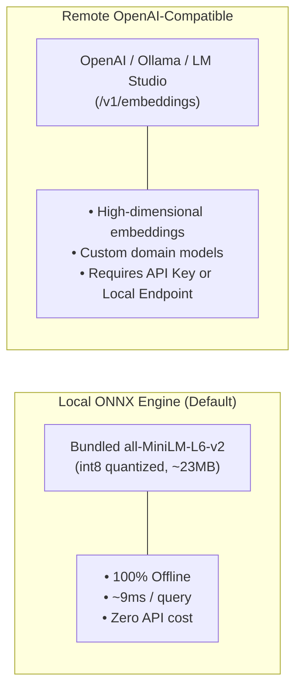
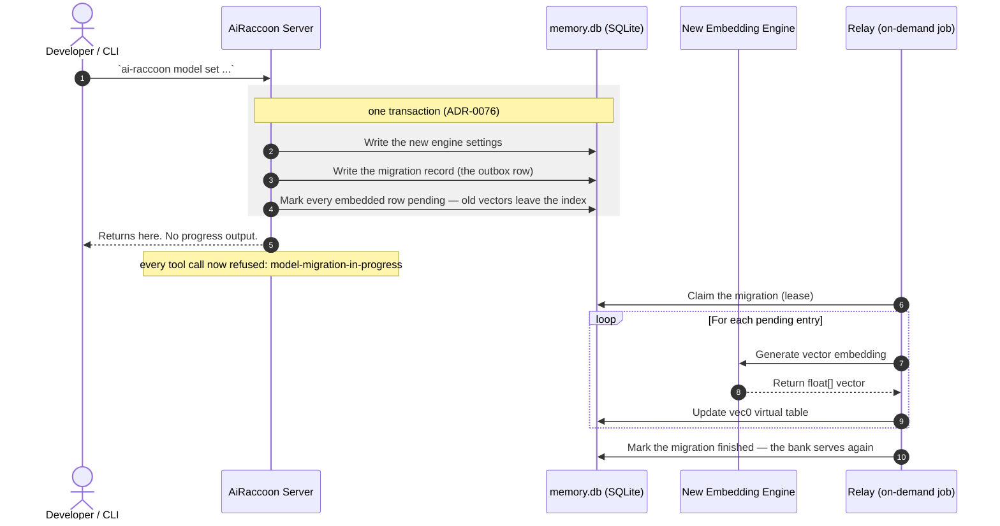

# Configure embedding engines

Select, configure, and switch embedding models for vector search.

---

## Supported embedding engines

AiRaccoon supports two vector embedding engines:



### Performance & latency comparison

| Engine | Model | Latency | Offline | MRR Score |
|---|---|---|---|---|
| **Local (Default)** | `all-MiniLM-L6-v2` (int8) | ~9 ms | Yes | 0.836 |
| **Remote OpenAI** | `text-embedding-3-small` | ~60-120 ms | No | 0.854 |
| **Remote Local LLM** | `bge-m3` (via Ollama) | ~25-50 ms | Yes | 0.858 |

---

## Engine configuration recipes

### Recipe 1: Use local bundled ONNX model (Default)

Switch to or restore the bundled ONNX model:

```bash
ai-raccoon model set local
```

*The local model needs no network access and runs in-process via ONNX Runtime.*

### Recipe 2: Configure OpenAI embeddings

Use official OpenAI text embeddings:

```bash
ai-raccoon model set openai text-embedding-3-small --api-key "sk-..."
```

### Recipe 3: Configure Ollama or local LLM server

Point to a local Ollama or LM Studio OpenAI-compatible endpoint:

```bash
ai-raccoon model set openai bge-m3 http://localhost:11434/v1 --api-key "ollama"
```

---

## Re-embedding lifecycle

Switching embedding engines re-embeds all memories in the active bank:



The command returns before the re-embedding happens, so it is quick and silent. Three things follow:

- **The bank refuses tool calls until the migration completes.** Searching a half-migrated bank
  would return quietly worse results; refusing is the honest alternative.
- **A crash does not lose the migration.** The record is durable, so the next server's startup pass
  finishes it — you do not re-run `model set`.
- **Search degrades to keyword-only in the meantime**, because the stale vectors are dropped when
  the transaction commits rather than being overwritten one at a time.

---

## Related documentation

- [Embedding benchmark data & harness](../reference/embedding-benchmark.md)
- [ADR-0004: Dual vector structure signal](../adr/0004-dual-vector-structure-signal.md)
