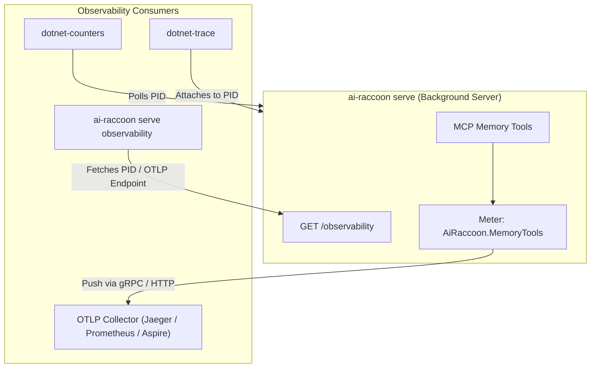

# Monitor and export server telemetry

Inspect live server metrics, capture diagnostic traces, and export OpenTelemetry (OTLP) data.

> This page covers the Meter/ActivitySource/OTLP path below — unchanged by AiRaccoon's
> self-instrumentation. For what the server can tell you about its own performance **without** a
> collector — a persisted `metrics` table, read back with the `memory_performance` MCP tool — see
> [Read back performance metrics](read-performance-metrics.md). The two are complementary, not
> alternatives: this page's Meter keeps exporting the same counters and spans either way.

---

## Telemetry architecture

AiRaccoon exposes native OpenTelemetry metrics and traces through the `AiRaccoon.MemoryTools` meter and activity source.



---

## Live inspection verbs

The `ai-raccoon serve observability` command queries the server's loopback `/observability` endpoint for live process metadata:

```bash
# Discover live process ID (PID)
ai-raccoon serve observability pid

# Launch dotnet-counters monitoring
$(ai-raccoon serve observability counters)

# Collect diagnostic traces
$(ai-raccoon serve observability trace)

# Check active OTLP endpoint
ai-raccoon serve observability otlp
```

### Monitored metrics & spans

| Command | Metric / Trace Coverage |
|---|---|
| `counters` | CPU, GC heap size, thread pool, working set, tool call counters split by `project_id` |
| `trace` | Spans for every tool call with `tool`, `project_id`, `result`, and `error_type` |
| `otlp` | Full batch export of metrics and trace spans to an OpenTelemetry collector |

---

## Configure OTLP export

OTLP export runs in **serve mode** only and stays disabled until configured:

### Step 1: Set the OTLP endpoint

Set the standard OpenTelemetry environment variable before starting the server:

```bash
export OTEL_EXPORTER_OTLP_ENDPOINT=http://127.0.0.1:4317
ai-raccoon serve > serve.log 2>&1 &
```

### Step 2: Verify active export

Confirm the server picked up the configuration:

```bash
ai-raccoon serve observability otlp
# Output: http://127.0.0.1:4317
```

---

## Privacy and security invariants

Per [ADR-0009](../adr/0009-otlp-export.md) and [SECURITY.md](../../SECURITY.md):

- **Plaintext attributes:** Spans and counters carry `project_id`, `tool`, `result`, and `error_type`.
- **Zero payload leakage:** Memory text content, search queries, prompts, and vector embeddings **never** enter traces or metric tags.

---

## Related documentation

- [Read back performance metrics](read-performance-metrics.md) — the self-instrumentation path
  that needs no collector
- [ADR-0002: OpenTelemetry observability](../adr/0002-opentelemetry-observability.md)
- [ADR-0009: OTLP export privacy and boundaries](../adr/0009-otlp-export.md)
- [Security threat model](../../SECURITY.md#what-leaves-the-process-when-otlp-export-is-on)
