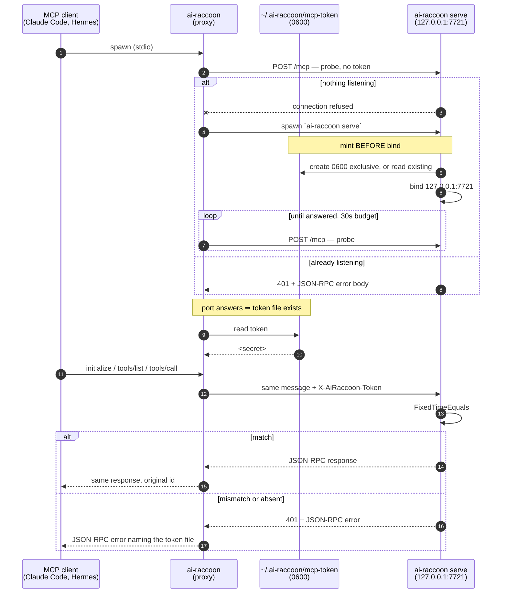
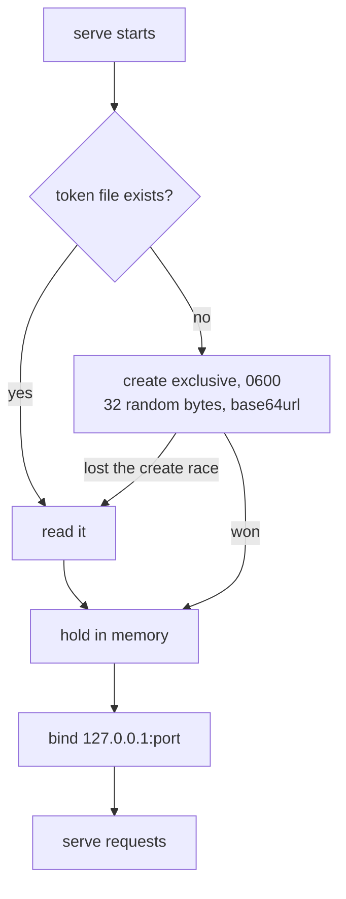

# Loopback token for `/mcp` — flow

Design for the shared secret that guards the always-on HTTP server introduced by
[ADR-0020](../adr/0020-always-on-http-stdio-proxy.md). Written before implementation.

## Why this exists

There is no authentication on `/mcp` today — `grep RequireAuthorization|AddAuthentication|Bearer`
over `src/` returns nothing. The only control is the loopback bind (`McpServerSetup.cs:95`), and
`SECURITY.md:50-51` names the other half of the mitigation explicitly:

> Keep the HTTP endpoint **opt-in** and loopback-only for the same reason: an unauthenticated
> `localhost` listener is reachable by any local process.

ADR-0020 removes the "opt-in" half: after it, a server is running whenever any agent has touched
memory. That leaves 22 tools — including `memory_delete`, `memory_sweep`, and the settings table
holding cloud-sync credentials — reachable by every local process on the machine: every npm
postinstall, every other agent, anything that can open a socket to 127.0.0.1.

A shared secret closes it. This is a token compared in constant time — not key derivation, not
token signing, not session protection — so it stays inside the no-hand-rolled-crypto invariant.
Generation is `RandomNumberGenerator.GetBytes`; comparison is
`CryptographicOperations.FixedTimeEquals`. Both are platform primitives.

**The zero-config property survives.** The token file is read by the proxy itself, so no MCP client
config changes and nobody types a secret anywhere.

## The flow

## Mint

Three properties this ordering buys, each load-bearing:

- **Mint strictly before bind.** Once the port answers, the token file is on disk. The proxy
  therefore never has to poll for the file or handle "server up, token not yet written" — it reads
  the file only after a successful probe. Getting this backwards reintroduces a startup race that
  is invisible in testing and intermittent in production.
- **Exclusive create, then fall back to read.** Two `serve` processes racing to mint converge on
  one token instead of one overwriting the other's. Note this is a second, independent race from
  the port-bind race that `ServeRunner` already handles (`ServeRunner.cs:47-50,69-81`): a process
  that loses the *bind* race exits before serving, but a process that loses the *create* race must
  still end up with the same secret.
- **Reuse an existing file, never rotate on start.** A server restart keeps the token, so a running
  proxy's cached token stays valid across a backend restart — which ADR-0020 relies on, because its
  reconnect path re-acquires a backend without re-reading anything.

**Rotation is deliberate and manual:** delete the file and restart `serve`. There is no automatic
expiry. An automatic one would buy nothing here — the threat is a local process reading a
world-readable socket, not a leaked long-lived credential — and would cost every proxy a
re-read-and-retry path.

## Validate

Middleware on `/mcp` only. Compare `X-AiRaccoon-Token` against the in-memory secret with
`CryptographicOperations.FixedTimeEquals` over the UTF-8 bytes; absent, wrong length or mismatched
all take the same 401 path.

**`/observability` stays open, deliberately.** It returns a process id and OTLP on/off
(`ServerInfo.cs:4-16`) — no memory content, no settings, nothing that reads or writes the bank. It
is how `serve observability` finds a live server at all (ADR-0008), and gating it would mean the
monitoring CLI needs the data root of a server it is trying to discover. The exposure it adds over
an open port is a PID.

### The 401 must keep the probe working — this is the subtle part

`ServeRunner`'s probe identifies our server by POSTing `/mcp` with a deliberately non-JSON body and
accepting status ∈ {400, 405, 406} **and** `jsonrpc` in the body (`ServeRunner.cs:148-178`). A
naive 401 breaks that: the probe stops recognising a live ai-raccoon server, so every proxy start
tries to spawn a second one, which then loses the bind race and exits 3, and the proxy reports the
backend as unavailable while it is running perfectly.

Two rules keep it working, and both need a test:

1. **401 joins the accepted set** — the discriminator becomes status ∈ {400, 401, 405, 406} plus a
   `jsonrpc` body.
2. **The 401 body is a JSON-RPC error object**, so the "it speaks JSON-RPC" half of the
   discriminator still holds.

Rule 1 is what makes the probe work **across data roots**, which is not hypothetical: the existing
test `BusyPortWithAiRaccoonServer_Attaches_AndFirstKeepsOwnership` (`ServeRunnerTests.cs:101-133`)
deliberately probes with a *different* `--data-root`, so the probing process reads a different token
file — or none — and cannot authenticate. It must still recognise the server. The probe therefore
stays unauthenticated by design: it proves "an ai-raccoon server is here", never "I may use it".

## Failure modes

| Situation | What happens | What the operator sees |
|---|---|---|
| Token file missing when the proxy needs it | Proxy fails before forwarding | One stderr line naming the file path and `ai-raccoon --transport stdio` |
| Proxy's token does not match the server's — a `serve` started against a different data root owns the port | Every forward 401s | JSON-RPC error naming both the file and the port, so the data-root mismatch is diagnosable rather than looking like a dead server |
| Another local user's process calls `/mcp` | 401 | Nothing; that is the feature |
| File exists but is empty or unreadable | Treated as absent — fail, do not mint a second token | Same as missing |
| Backend restarts mid-session | Token unchanged, reconnect succeeds | Nothing |

## Known gap: file permissions are POSIX-only

`0600` is enforced with `UnixFileMode` on the create. **On Windows it does not apply** — the file
inherits the data-root directory's ACL, which for a per-user profile directory is normally
owner-only, but that is the directory's property and not something this design asserts. Recorded as
a real limitation rather than papered over: on Windows the token raises the bar from "any local
process" to "any process running as this user", which is weaker than the POSIX guarantee.

Fixing it properly means setting an explicit ACL on the file, which is platform-specific code with
its own test surface. Out of scope here; worth its own decision if Windows becomes a supported
target for always-on serve.

## What this does not do

- **Not authentication of the user** — it proves the caller can read a file in the data root.
  On a single-user machine that is the intended bar.
- **Not transport security.** Traffic stays plaintext on loopback. TLS on 127.0.0.1 would protect
  against nothing that can already read the token file.
- **Not authorization.** Every holder gets the full tool surface; the `ro`/`rw`/`full` access mode
  remains the only privilege split.
- **Not protection against a process running as the same user** that chooses to read the token file.
  That is out of reach for any local shared secret and is why this is a bar-raiser, not a boundary.
