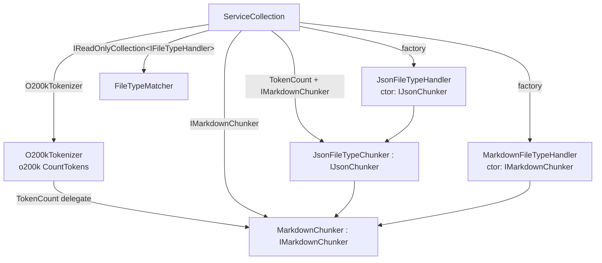

# Architecture Fix Plan — Ingestion Extensibility + Dependencies Refactor (v1.8.0 review)

Date: 2026-08-13
Review: `docs/reviews/2026-08-13-architecture-review-ingestion-and-deps-refactor.md`
Goal: fix all MUST-FIX / SHOULD-FIX / dead-code findings from the review, focusing on isolation, composability, performance.

## Decisions

### D1 — F1 + extraction: split the chunker abstraction and pull markdown out of the tokenizer

`IChunker` stays as the **base** contract (the type `FileIngestor` and
`IFileTypeHandler.Chunker` already depend on), and two marker sub-interfaces make the
handler→chunker binding type-safe. Crucially, the markdown split logic already lives in
Core as the pure static `MarkdownChunker`; `TokenizerChunker` only adds the o200k token
count. So we make the split explicit:

```csharp
// Core/Chunking/IChunker.cs  (unchanged)
public interface IChunker { IReadOnlyList<string> Chunk(string text, int maxTokens, int overlayTokens = 0); }

// Core/Chunking/IMarkdownChunker.cs  (new)
public interface IMarkdownChunker : IChunker { }

// Core/Chunking/IJsonChunker.cs  (new)
public interface IJsonChunker : IChunker { }
```

- `MarkdownChunker` (Core): **static class → sealed instance `IMarkdownChunker`**,
  ctor `MarkdownChunker(TokenCount countTokens)`, `Chunk(text, maxTokens, overlayTokens)`
  wrapping the existing fence-aware split. Its tests already use a fake counter, so the
  conversion is behaviour-preserving.
- `TokenizerChunker` (Infra): shrink to a **token counter only** — it no longer chunks, so
  rename to `O200kTokenizer` (plain-names: a chunker that doesn't chunk is a lie).
  It owns the `TiktokenTokenizer` and exposes `int CountTokens(string)`.
- `JsonFileTypeChunker : IJsonChunker`, ctor `(TokenCount countTokens, IMarkdownChunker fallbackChunker)`.
- `MarkdownFileTypeHandler(IMarkdownChunker chunker)`, `JsonFileTypeHandler(IJsonChunker chunker)`.
- `IFileTypeHandler.Chunker` stays typed `IChunker` — `FileIngestor` keeps calling
  `handler.Chunker.Chunk(...)` without knowing the format.

Net: markdown chunking becomes a first-class pure Core component; Infrastructure contributes
only the tokenizer (which needs `Microsoft.ML.Tokenizers`) and the JSON chunker.

### D2 — F7/F8: move the two handler interfaces back to Core; keep `IFileIngestor` in Infrastructure

- `IFileTypeHandler` and `IFileTypeMatcher` depend only on `AiRaccoon.Core.Chunking` —
  **move them back to `AiRaccoon.Core.Ingestion`** (namespace + file), restoring ADR-0027.
- `IFileIngestor` **stays in `AiRaccoon.Infrastructure.Ingestion`** and keeps its
  `SqliteConnection` parameter. It is not a leak — it is load-bearing: the caller opens the
  bank once and hands the connection in so ingestion can join an existing write transaction
  (`SqliteMemoryStore.ReplaceFileAsync` re-ingests on the same connection with
  `embedInline:false`, `SqliteMemoryStore.cs:415-416`). Add a one-line doc comment saying so.
- Net: we do not de-leak the connection; we scope it.

### D3 — F6/F2: kill the remaining DI abstraction bypasses

- `SqliteMemoryStore` injects `IEntryEmbedder` directly instead of `IEmbeddingService` +
  `new EntryEmbedder(embeddings)`.
- `JsonFileTypeChunker` gets the single `(TokenCount, IMarkdownChunker)` ctor; drop the dual
  ctor and the `new TokenizerChunker()` default.

### D4 — Dead code: delete, don't keep

- Delete `JsonFileTypeChunker.ExtractSchemaSummary` **and** its only test
  (`JsonFileTypeChunkerTests.ExtractSchemaSummary_ExtractsNodeSchema`) — zero production callers.
- Delete `FileTypeMatcher.SupportedExtensions` (zero callers; already dropped from the interface).
- Keep `FileTypeMatcher.IsSupported` (asserted by `FileTypeMatcherTests`).

### D5 — F4: JSON structural chunks have no overlay — document the difference

`JsonFileTypeChunker` is new code this wave, so F4 is in scope. JSON chunks are key/item-bounded,
so markdown-style overlap would mean duplicating whole properties — a semantic difference, not a
silent bug. A comment on `ChunkObject`/`ChunkArray` states structural chunks are non-overlapping by
design (and why), and that `overlayTokens` is forwarded only to the line-based fallback (oversized
single properties/items, empty result) — so the difference from `MarkdownChunker.Split` is
explicit. A QA test pins the no-overlap behavior on the structural path.

### D6 — F9: pre-existing, not a regression — ADR note only

`git log --follow` confirms `SharedExtractionService`/`SharedExtractionRunner` were in
`Core/Memory` long before this wave (memory_share_extract #50, 1.1.0 #78, …). The deps refactor
only extracted their interfaces (an improvement), it did not move them. Record a note (ADR or
architecture.md) that Core intentionally hosts this orchestration; no move this wave.

---

## Target DI graph



One `O200kTokenizer` singleton backs the `TokenCount` delegate, which both `MarkdownChunker` and
`JsonFileTypeChunker` receive — count and fallback can no longer disagree.

---

## Work plan (TDD order)

### Step 1 — RED: prove the mis-wiring (F1)

New `tests/AiRaccoon.Tests/Unit/Ingestion/IngestionCompositionTests.cs`: build the real graph
(`RegisterCoreMemoryServices`) and assert the Markdown handler's `Chunker` is a `MarkdownChunker`
and the JSON handler's is a `JsonFileTypeChunker`. RED today (both get `JsonFileTypeChunker`).

### Step 2 — chunker interfaces + extraction (F1, F2)

- Add `IMarkdownChunker.cs`, `IJsonChunker.cs` in `src/AiRaccoon.Core/Chunking/`.
- Convert `MarkdownChunker` (Core) static → instance `IMarkdownChunker` (ctor `TokenCount`).
- Rename `TokenizerChunker` (Infra) → `O200kTokenizer`; remove `Chunk`/`IChunker`, keep `CountTokens`.
- `JsonFileTypeChunker : IJsonChunker`, single ctor `(TokenCount, IMarkdownChunker)`.
- `MarkdownFileTypeHandler(IMarkdownChunker)`, `JsonFileTypeHandler(IJsonChunker)`;
  `Chunker` property stays `IChunker`.

### Step 3 — DI wiring (F1)

`AppRegistrations.RegisterFileIngestionServices` → replace the two `IChunker` registrations and
the handler registrations with:

```csharp
services.AddSingleton<O200kTokenizer>();
services.AddSingleton<TokenCount>(sp => sp.GetRequiredService<O200kTokenizer>().CountTokens);
services.AddRequiredSingleton<IMarkdownChunker, MarkdownChunker>();
services.AddRequiredSingleton<IJsonChunker, JsonFileTypeChunker>();
services.AddSingleton<IFileTypeHandler>(sp => new MarkdownFileTypeHandler(sp.GetRequiredService<IMarkdownChunker>()));
services.AddSingleton<IFileTypeHandler>(sp => new JsonFileTypeHandler(sp.GetRequiredService<IJsonChunker>()));
services.AddSingleton<IReadOnlyCollection<IFileTypeHandler>>(sp => sp.GetServices<IFileTypeHandler>().ToList());
services.AddRequiredSingleton<IFileIngestor, FileIngestor>();
services.AddRequiredSingleton<IFileTypeMatcher, FileTypeMatcher>();
```

Step 1 goes GREEN.

### Step 4 — move the two handler interfaces back to Core (F7)

- Move `IFileTypeHandler.cs`, `IFileTypeMatcher.cs` → `src/AiRaccoon.Core/Ingestion/`,
  namespace `AiRaccoon.Core.Ingestion`.
- Add `using AiRaccoon.Core.Ingestion;` to `FileTypeMatcher.cs`, `JsonFileTypeHandler.cs`,
  `MarkdownFileTypeHandler.cs`, `AppRegistrations.cs` (`FileIngestor.cs` already has it).
- `IFileIngestor.cs` stays in Infrastructure; add the doc comment on the connection param.

### Step 5 — ADR-0027 amendment (F7 traceability)

- Decision 1: rename `IFileTypeChunker` → `IMarkdownChunker` + `IJsonChunker`; note the
  extraction (`MarkdownChunker` is the markdown chunker, `O200kTokenizer` the counter).
- Add: `IFileIngestor` is an Infrastructure seam (holds the open `SqliteConnection`).

### Step 6 — F6: inject `IEntryEmbedder` into `SqliteMemoryStore`

- `SqliteMemoryStore` ctor: `IEmbeddingService embeddings` → `IEntryEmbedder embedder`;
  `_embedder` becomes the injected instance (drop `new EntryEmbedder(embeddings)`).
- `TestData.CreateMemoryStore`: keep the `IEmbeddingService embeddings` param, build **one**
  `var embedder = new EntryEmbedder(embeddings)` and pass it to **both** `FileIngestor` and
  `SqliteMemoryStore` (today it news two).

### Step 7 — F3/F4/F5: dead code + documentation

- Delete `JsonFileTypeChunker.ExtractSchemaSummary` + `BuildNodeSchema` + their test.
- Delete `FileTypeMatcher.SupportedExtensions`.
- Add the no-overlay doc comment on `ChunkObject`/`ChunkArray` (D5).

### Step 8 — test call-site updates (mechanical)

- `TestData.CreateMemoryStore`: `IChunker chunker` → `IMarkdownChunker markdownChunker,
  IJsonChunker? jsonChunker = null`; coalesce json to a real default. Build the matcher with the
  two handlers.
- ~18 `CreateMemoryStore(..., new TokenizerChunker(), ...)` call sites: `new TokenizerChunker()` →
  `new MarkdownChunker(new O200kTokenizer().CountTokens)` (or a `TestData.RealMarkdownChunker()`
  helper). Consider adding that helper to keep call sites one-liners.
- ~15 test doubles `StubChunker : IChunker` → `: IMarkdownChunker`.
- Rename fallout: `TokenizerChunkerTests.cs` → `O200kTokenizerTests` (count-only),
  `ChunkingFeatureTests.cs` (3 refs), `FileIngestorJsonIntegrationTests.cs`,
  `ChunkerComparisonTests.cs`, `SearchFixtureBank.cs` (benchmark), `JsonFileTypeChunkerTests.cs`
  (4 `new JsonFileTypeChunker()` sites → pass `TokenCount` + `MarkdownChunker`).
- `MarkdownChunkerTests.cs`: `MarkdownChunker.Split(...)` → `new MarkdownChunker(CharCount).Chunk(...)` (8 sites).

### Step 9 — F9 record (no code move)

One-line note in `docs/explanation/architecture.md` (or a short ADR) that Core hosts
`SharedExtractionService`/`SharedExtractionRunner` as orchestration over Core store interfaces.

### Step 10 — verify

- `dotnet build`, then `dotnet test --filter "FullyQualifiedName~Ingestion|FullyQualifiedName~Chunking"`.
- Full sweep is the pipeline's job (invariant: *pipeline-runs-the-rest*).

---

## Acceptance criteria (done-means-proven)

1. `IngestionCompositionTests` resolves the real graph: Markdown → `MarkdownChunker`,
   JSON → `JsonFileTypeChunker` (RED before Step 3, GREEN after).
2. No `new TokenizerChunker()` / `new EntryEmbedder(...)` / `new FileTypeMatcher(...)` in `src/`.
3. `MarkdownChunker` is an injectable `IMarkdownChunker` in Core; `O200kTokenizer` is Infra-only.
4. `IFileTypeHandler` + `IFileTypeMatcher` back in `AiRaccoon.Core.Ingestion`; Core still
   references no persistence/HTTP/cloud package.
5. `IFileIngestor` remains the only ingestion abstraction naming `SqliteConnection`, doc-commented.
6. `ExtractSchemaSummary`, `SupportedExtensions` gone (and their tests).
7. JSON no-overlap documented; F9 recorded; ADR-0027 matches the code.
