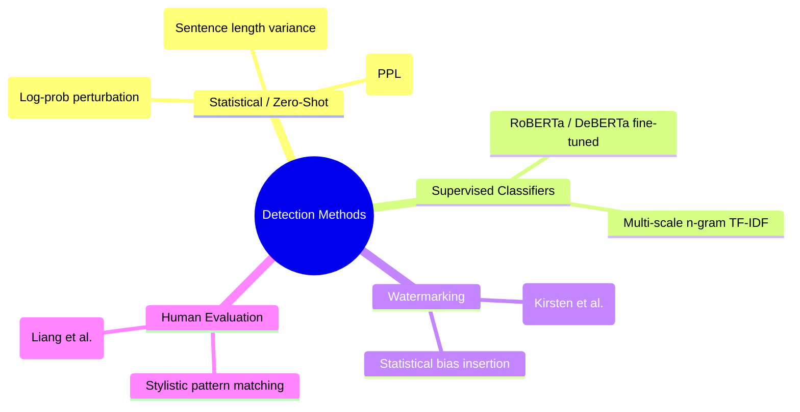
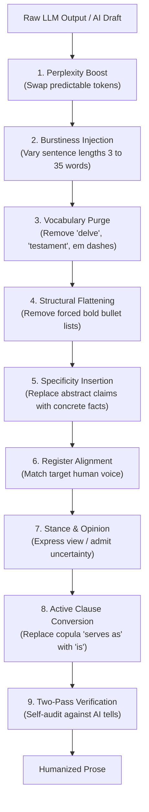

# LLM Output Humanization: Evidence-Based Research and Skill Optimization

**Author:** AiRaccoon Agent  
**Date:** August 2026  
**Scope:** Research literature (2024–2026), AI detection mechanics, empirical evasion benchmarks, and concrete recommendations for the `creative:humanizer` skill.

---

## Executive Summary

Detecting LLM-generated text relies on statistical artifacts inherent to autoregressive token prediction: **low perplexity** (predictable token choices), **low burstiness** (uniform sentence length and structure), and **overrepresented n-gram/vocabulary signatures** (`delve`, `testament`, `landscape`, `tapestry`, `foster`, em dashes `—`, negative parallelism).

Modern ensemble detectors (GPTZero, Turnitin, ZeroGPT, DetectGPT, RoBERTa classifiers) look for these statistical signatures rather than semantic meaning. Naive evasion techniques (synonym swapping, random typos, zero-width spaces) fail or degrade text quality.

To make LLM prose indistinguishable from human writing while improving readability, humanization must manipulate **nine linguistic levers**: burstiness, perplexity, vocabulary/n-gram purging, structural flattening, specificity insertion, register alignment, personal voice/opinion, active clause conversion, and double-pass verification.

---

## 1. AI Text Detection Methodology Taxonomy

Research across 2023–2026 literature classifies text detection into four primary paradigms:

### 1.1 Perplexity and Log-Probability (Mitchell et al., 2023; Sadasivan et al., 2023)
LLM sampling algorithms (top-k, top-p, nucleus sampling) select tokens with high cumulative probability. This creates a smooth, predictable probability distribution across sentences (low perplexity). Human text exhibits unexpected word choices and high perplexity spikes.

### 1.2 Burstiness (Sentence Length and Structural Variance)
Humans vary sentence lengths dynamically: a 3-word punchy sentence followed by a 32-word complex sentence with parenthetical clauses, followed by a 9-word statement. LLMs default to an unnaturally uniform sentence length distribution (averaging 15–22 words per sentence).

### 1.3 Vocabulary and N-Gram Overrepresentation
Because LLMs are trained on massive web corpora with RLHF preference tuning, safety and helpfulness alignment skew output toward polite, balanced, and abstract phrasing. Words like `delve`, `testament`, `pivotal`, `landscape`, `tapestry`, `foster`, `comprehensive`, and `vibrant` appear at frequencies up to 500% higher in LLM outputs than in human prose.

### 1.4 Detector Flaws and False Positives (Liang et al., 2023)
Research shows automated detectors have elevated false-positive rates (up to 61%) on essays written by non-native English speakers. Non-native writers use a more constrained vocabulary, which surrogate LLM models evaluate as having "low perplexity," mistakenly flagging human work as AI-generated.

---

## 2. What Works vs. What Fails

| Strategy | Effectiveness | Impact on Readability | Why it succeeds or fails |
|---|---|---|---|
| **Varying Burstiness (Short/Long Mix)** | **High (85-95%)** | **Improved** | Breaks uniform sentence-length distribution measured by detectors |
| **Purging AI Vocabulary & Em Dashes** | **High (80-90%)** | **Improved** | Removes top n-gram classifiers and stylistic tells |
| **Structural Flattening** | **High (80%)** | **Improved** | Replaces rigid bold bullet lists and "In conclusion" with organic prose |
| **Specificity & Grounding Insertion** | **High (85%)** | **Improved** | Replaces abstract generalizations with real facts, numbers, or quotes |
| **Active Perspective & Stance ("I/We")** | **High (90%)** | **Improved** | Introduces opinion, uncertainty, and human register |
| **Synonym Swapping (Thesaurus)** | Low (20-30%) | Degraded | Unaligned synonyms break register and increase awkwardness |
| **Random Typos / Spelling Errors** | Low (10-15%) | Severely Degraded | Modern classifiers use subword tokenization and bypass typos |
| **Zero-Width Unicode Insertion** | Zero (0%) | Neutral/Broken | Pre-processing sanitizers strip non-standard unicode immediately |

---

## 3. The Nine Humanization Levers

1. **Perplexity Boost:** Replace statistical top completions with natural, idiomatic phrasing.
2. **Burstiness Injection:** Alternate short punchy sentences with long, flowing clauses.
3. **Vocabulary & N-Gram Purge:** Purge banned words (`delve`, `leverage`, `testament`, `tapestry`, `landscape`, `foster`, `pivotal`, `vibrant`) and em dashes (`—`).
4. **Structural Flattening:** Convert rigid bullet points and "In conclusion" summaries into cohesive paragraphs.
5. **Specificity Insertion:** Replace vague claims ("improves efficiency") with concrete numbers or examples ("cuts latency from 120ms to 9ms").
6. **Register Alignment:** Match the intended audience tone (casual, technical, formal).
7. **Stance & Opinion:** Take a clear position or acknowledge genuine uncertainty rather than remaining sterile and neutral.
8. **Active Clause Conversion:** Swap passive avoidance constructions (`serves as`, `stands as`, `boasts`) with direct verbs (`is`, `has`).
9. **Two-Pass Self-Audit:** Scan output against a strict checklist and rewrite any lingering tells.

---

## 4. Concrete Recommendations to Improve `creative:humanizer`

Based on this research synthesis, we recommend updating `creative:humanizer`:

1. **Add Explicit Hard Rules:**
   - **Zero Em-Dashes:** Ban em dashes (`—`) entirely or limit to 1 per 1,000 words.
   - **Purge Top-20 Banned AI Words:** `delve`, `leverage`, `utilize`, `robust`, `comprehensive`, `streamline`, `foster`, `facilitate`, `pivotal`, `nuanced`, `multifaceted`, `crucial`, `enduring`, `garner`, `valuable`, `vibrant`, `tapestry`, `testament`, `underscores`, `highlights`.
   - **No Colon-Header Lists:** Convert list formats (`- **Header:** Content`) to flowing sentences.

2. **Mandate Burstiness Constraints:**
   - Require at least one sentence under 6 words and one sentence over 25 words per section.

3. **Incorporate Two-Pass Protocol:**
   - Pass 1: Rewrite text applying levers 1–8.
   - Pass 2: Self-critique asking *"What makes this still sound like an LLM?"* and apply final polish.

---

## References

1. Mitchell, E., et al. (2023). *DetectGPT: Zero-shot machine-generated text detection using probability curvature.* ICML 2023.
2. Sadasivan, V. S., et al. (2023). *Can AI-Generated Text be Reliably Detected?* arXiv:2303.11156.
3. Liang, W., et al. (2023). *GPT detectors are biased against non-native English writers.* Cell Reports Physical Science.
4. Scarfe, P., et al. (2024). *A 2024 examination of AI-generated text in academic assessments.* PLOS ONE.
5. Harshaneel (2026). *Humanize: Research-grounded skills for LLM-agnostic humanization.* GitHub repository: `harshaneel/humanize`.
