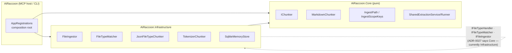
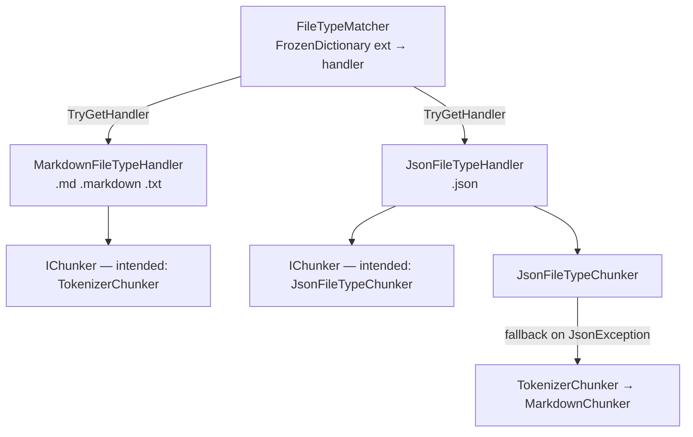
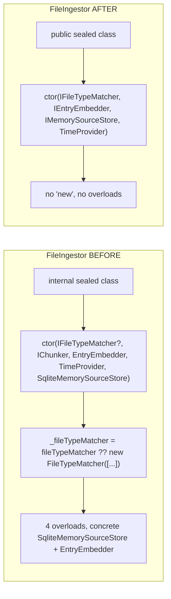

# Architecture Quality Review — Ingestion Extensibility + Dependencies Refactor

Date: 2026-08-13
Scope: commits `b62d8059`, `d6a9bb65`, `12fb1569`, `af38d804`, `7675b06e` (v1.8.0 wave)
Lens: **isolation, composability, performance** (per request)
Method: read `.ai-badger/invariants/*`, ADR-0027, `docs/explanation/architecture.md`, then traced the live DI graph in `src/AiRaccoon/Setup/AppRegistrations.cs` against the changed source.

**Verdict: B (conditional) — one MUST-FIX in the DI graph, one layering regression to reconcile with the ADR.**

---

## 0. Layering snapshot

The wave is net-positive on composability (see Change 4) but introduces one boundary
regression: two domain abstractions were moved *out of* `AiRaccoon.Core` into
`AiRaccoon.Infrastructure`, contradicting ADR-0027 which places them in Core.



`AiRaccoon.Core.csproj` still references only `FluentValidation`,
`CommunityToolkit.Diagnostics`, `System.Numerics.Tensors` — no persistence/HTTP/cloud
SDK, so the reference-allowlist invariant holds. The drift is *namespace placement*, not
a package leak.

---

## Change 1 — Extensible file-type handlers + JSON chunking (`b62d8059`)

Adds `IFileTypeHandler`, `IFileTypeMatcher`, `FileTypeMatcher`, `MarkdownFileTypeHandler`,
`JsonFileTypeHandler`, `JsonFileTypeChunker`. Composability shape:



### F1 — MUST-FIX: `IChunker` is registered twice; both handlers resolve to the JSON chunker

`src/AiRaccoon/Setup/AppRegistrations.cs:136-138`:

```csharp
services.AddRequiredSingleton<IChunker, TokenizerChunker>();                                            // reg #1
services.AddSingleton<JsonFileTypeChunker>(sp => new JsonFileTypeChunker(sp.GetRequiredService<TokenizerChunker>()));
services.AddSingleton<IChunker>(sp => sp.GetRequiredService<JsonFileTypeChunker>());                     // reg #2 — wins
```

`Microsoft.Extensions.DependencyInjection` returns the **last** registration for a
service type, so `GetRequiredService<IChunker>()` returns `JsonFileTypeChunker` for
*every* consumer — including `MarkdownFileTypeHandler(IChunker chunker)`
(`MarkdownFileTypeHandler.cs:8`). The documented intent (ADR-0027 Decision 2:
"Markdown delegating to the existing `TokenizerChunker`") is not expressed in the graph.

**Impact (all three lenses):**
- **Composability:** the two handlers are indistinguishable to DI; their chunker choice is an accident of registration order, not a declared seam.
- **Performance:** every `.md`/`.txt` file ingest now runs `JsonDocument.Parse` first, throws a `JsonException`, and only then falls back to `TokenizerChunker` (`JsonFileTypeChunker.cs:39-54`). One exception per markdown file on a hot ingest path.
- **Isolation/correctness:** behavior is preserved *only* because markdown is not valid JSON. A `.txt` file whose content happens to parse as JSON (a bare `123`, a JSON blob) would be chunked as JSON, silently diverging from the Markdown contract.

The comparison test (`ChunkerComparisonTests.cs:14-15`) constructs handlers with
explicit chunkers (`new MarkdownFileTypeHandler(new TokenizerChunker())`), so it never
exercises the DI graph and cannot catch this.

**Fix** — wire each handler to its own chunker explicitly (matches the existing factory style):

```csharp
services.AddSingleton<IFileTypeHandler>(sp => new MarkdownFileTypeHandler(sp.GetRequiredService<TokenizerChunker>()));
services.AddSingleton<IFileTypeHandler>(sp => new JsonFileTypeHandler(sp.GetRequiredService<JsonFileTypeChunker>()));
// drop the second IChunker registration (reg #2)
```

Prove it with a RED test that resolves the host graph and asserts
`MarkdownFileTypeHandler.Chunker is TokenizerChunker` (invariant: *prove-the-check-fails*).

### F2 — SHOULD-FIX: `JsonFileTypeChunker` bypasses DI and duplicates its tokenizer

`src/AiRaccoon.Infrastructure/Chunking/JsonFileTypeChunker.cs:18-30`:

```csharp
public JsonFileTypeChunker(Func<string, int>? countTokens = null, IChunker? fallbackChunker = null)
{
    var defaultTokenizer = new TokenizerChunker();   // new + delegate capture
    _countTokens = countTokens ?? defaultTokenizer.CountTokens;
    _fallbackChunker = fallbackChunker ?? defaultTokenizer;
}
public JsonFileTypeChunker(TokenizerChunker tokenizer) { ... }
```

Two constructors; the default one news up a `TokenizerChunker` rather than accepting the
DI-registered `IChunker`/`TokenizerChunker`, and captures `CountTokens` as a
`Func<string,int>` delegate — extracting a method off a concrete type instead of depending
on an abstraction. The `(Func<string,int>, IChunker)` overload is a second seam that can
produce a tokenizer different from the DI one. Collapse to a single
`JsonFileTypeChunker(IChunker fallbackChunker)` (or `(IChunker, Func<string,int>)` when a
custom counter is genuinely needed) and let DI supply the tokenizer.

### F3 — NIT: `ExtractSchemaSummary` is orphaned (dead code, over-engineering)

`JsonFileTypeChunker.cs:60-76` — `public static string ExtractSchemaSummary(...)` has no
callers anywhere in `src/` or `tests/`. The commit message promises "preserves key
structure and schema context", but the structural path (`ChunkObject`/`ChunkArray`) never
injects a schema summary — it only regroups raw `GetRawText()` properties. Either wire it
in or delete it (invariant: *ask-if-simpler*, *derive-or-delete*).

### F4 — NIT: `overlayTokens` ignored on the structural path

`ChunkObject`/`ChunkArray` (`JsonFileTypeChunker.cs:112-199`) never read `overlayTokens`
— JSON structural chunks are emitted with **no overlap**, unlike `MarkdownChunker.Split`.
Consequence for retrieval quality: context continuity at JSON chunk boundaries is lost,
inconsistent with the documented "48-token overlay" behavior for markdown. Acceptable for
now, but it is a silent contract difference worth a code comment or a decision record.

### F5 — NIT: `FileTypeMatcher.SupportedExtensions` re-allocates per access

`src/AiRaccoon.Infrastructure/Ingestion/FileTypeMatcher.cs:34`:

```csharp
public IReadOnlySet<string> SupportedExtensions => _handlersByExtension.Keys.ToHashSet(StringComparer.OrdinalIgnoreCase);
```

The getter materializes a fresh `HashSet` on every access (the exact "property allocation
leak" trap). No current caller (it was dropped from the interface during the deps
refactor), so it is low-impact — but if kept, expose the pre-computed frozen key set.

---

## Change 2 — `IFileTypeMatcher` into `SqliteMemoryStore` / `FileIngestor` (`d6a9bb65`)

```mermaid
sequenceDiagram
    participant AR as AppRegistrations
    participant SM as SqliteMemoryStore
    participant FI as FileIngestor
    participant FM as FileTypeMatcher
    AR->>FM: AddRequiredSingleton&lt;IFileTypeMatcher, FileTypeMatcher&gt;
    AR->>FI: AddRequiredSingleton&lt;IFileIngestor, FileIngestor&gt; (ctor: IFileTypeMatcher)
    AR->>SM: AddRequiredSingleton&lt;IMemoryStore, SqliteMemoryStore&gt; (ctor: IFileIngestor)
    SM->>FI: IngestFileAsync(connection, ...)
    FI->>FM: TryGetHandler(path) → handler
```

This is the fix for the earlier DI-abstraction-bypass: `FileIngestor` previously
self-constructed `new FileTypeMatcher([...])` inside its constructor; now it receives
`IFileTypeMatcher` from DI. Good. One residual:

### F6 — SHOULD-FIX: `SqliteMemoryStore` news up `EntryEmbedder` instead of injecting it

`src/AiRaccoon.Infrastructure/Sqlite/SqliteMemoryStore.cs:30`:

```csharp
private readonly EntryEmbedder _embedder = new(embeddings);
```

`IEntryEmbedder` **is** registered (`AppRegistrations.cs:170`), and the injected
`IEmbeddingService embeddings` is used *only* to build this concrete field (verified: every
later use goes through `_embedder`). This is the "DI abstraction bypass" trap: the store
can't be tested with a fake `IEntryEmbedder`, and the seam `IEntryEmbedder` exists in the
graph but is ignored by its biggest consumer. Inject `IEntryEmbedder` directly.

---

## Change 3 — Restore `IMemoryStore` registration (`12fb1569`)

One-line fix — `AppRegistrations.RegisterStores` regained
`services.AddRequiredSingleton<IMemoryStore, SqliteMemoryStore>()` (`AppRegistrations.cs:160`),
which the deps refactor had dropped. Correct and minimal.

> Note: this commit also landed a stray `.bak-*` snapshot
> (`.claude/settings.json.bak-20260812-131153`, `.mcp.json.bak-*`) that `b1e35728` cleaned
> up afterward — resolved, no action.

---

## Change 4 — Dependencies refactor + DI-graph restoration (`af38d804` + `7675b06e`)

The big one: extracted interfaces (`ISharedExtractionService`, `ISharedExtractionRunner`,
`IEmbeddingService`, `IEntryEmbedder`, `IFileIngestor`, `ISweepService`, …), collapsed
`FileIngestor` from an `internal` class with **four** overloaded constructors into a single
primary-constructor `public sealed` service, and re-wired the composition root.



This is a genuine composability win and the cleanest part of the wave.

### F7 — SHOULD-FIX: the abstractions moved Core → Infrastructure, contradicting ADR-0027

The deps refactor renamed
`src/AiRaccoon.Core/Ingestion/IFileTypeHandler.cs` → `src/AiRaccoon.Infrastructure/Ingestion/IFileTypeHandler.cs`
and `IFileTypeMatcher.cs` likewise, switching their namespace from `AiRaccoon.Core.Ingestion`
to `AiRaccoon.Infrastructure.Ingestion` (verified via `git show af38d804`).

ADR-0027 Decision 1 (`docs/adr/0027-...md:15-27`) explicitly places these in
`AiRaccoon.Core`. The root cause is the next finding — the interfaces were pulled down
because their sibling abstraction now leaks SQLite. Reconcile one of two ways:

- **move back to Core** and de-leak the connection (below), or
- **update ADR-0027** to record that file-type dispatch is an Infrastructure concern, with
  a one-line rationale in the ADR.

Either is fine; silent drift is not (invariant: *check-sources-not-yourself*,
*traceable-releases*).

### F8 — SHOULD-FIX: `IFileIngestor` leaks `SqliteConnection` into its contract

`src/AiRaccoon.Infrastructure/Ingestion/IFileIngestor.cs:11-15`:

```csharp
Task<int> IngestFileAsync(SqliteConnection connection, string projectId, string path, ...);
```

The abstraction's method signature names a concrete `Microsoft.Data.Sqlite` type. That is
what anchors the whole ingestion family to Infrastructure and what forced the F7 move. The
single-store pragmatism is defensible, but it means the "domain abstraction in Core, impl
in Infrastructure" shape can never hold for ingestion. If the project wants the clean
shape the ADR describes, the connection must become an implementation detail (e.g. the
store opens the connection and passes a thin store-owned handle, or ingestion folds into
`IMemoryStore` which already exposes connection-agnostic `IngestFileAsync`).

### F9 — NIT: application orchestration is accumulating in the "pure" layer

`SharedExtractionService` and `SharedExtractionRunner` (the *implementations*) live in
`AiRaccoon.Core/Memory/`. `SharedExtractionRunner` is an application/use-case service —
it drives `IMemoryStore`, `IPromotionQueue`, `ISharedExtractionService` across an async
round-trip (`SharedExtractionRunner.cs:19-66`) — not pure domain logic. It passes the
reference-allowlist (no framework deps) so it is technically legal, but it signals Core is
drifting from "pure domain" toward "domain + orchestration". Worth a decision record if
this is intentional.

---

## Findings summary

| # | Grade | File:line | Summary |
|---|---|---|---|
| F1 | **MUST-FIX** | `AppRegistrations.cs:136-138` | `IChunker` double-registration → Markdown handler gets the JSON chunker |
| F2 | SHOULD-FIX | `JsonFileTypeChunker.cs:18-30` | dual ctor + `new TokenizerChunker()` (DI bypass) |
| F6 | SHOULD-FIX | `SqliteMemoryStore.cs:30` | `new EntryEmbedder(...)` instead of injecting `IEntryEmbedder` |
| F7 | SHOULD-FIX | `IFileTypeHandler.cs` / `IFileTypeMatcher.cs` | interfaces moved Core → Infrastructure, contradicts ADR-0027 |
| F8 | SHOULD-FIX | `IFileIngestor.cs:11-15` | `SqliteConnection` leaks into the ingestion contract |
| F3 | NIT | `JsonFileTypeChunker.cs:60-76` | `ExtractSchemaSummary` dead code |
| F4 | NIT | `JsonFileTypeChunker.cs:112-199` | `overlayTokens` ignored on JSON structural path |
| F5 | NIT | `FileTypeMatcher.cs:34` | `SupportedExtensions` allocates a `HashSet` per access |
| F9 | NIT | `SharedExtractionService/Runner.cs` | application orchestration in the pure layer |

## What passed

- **Isolation:** `FileIngestor` takes an already-open connection — one-bank-open-per-ingest
  is enforced by the compiler; path-containment lives in Core (`IngestPath`, `IngestScopeKeys`)
  and is shared with `memory_watch_add`.
- **Layering:** Core keeps a clean package graph (no persistence/HTTP/cloud).
- **Composition:** `FileIngestor` collapse (4 ctors + `new` defaults → 1 primary ctor) and
  the `IFileTypeMatcher`/`IFileIngestor`/`IMemoryStore` registrations are correct; guard
  clauses use `Guard.IsNotNull` where present (`FileTypeMatcher.cs:16`).
- **Performance:** chunk-size is clamped to the configured engine's context window
  (`FileIngestor.cs:167-184`); embed is batched and heading-path-distinct
  (`EntryEmbedder.cs:154-181`).

## Gate recommendation

Fix **F1** before treating v1.8.0 as complete, and add a RED-then-GREEN test that resolves
the host graph and asserts the handler→chunker wiring. F2/F6/F7/F8 are SHOULD-FIX for the
next wave (or fold F7 into an ADR-0027 amendment now). F3–F5, F9 are cleanup.
