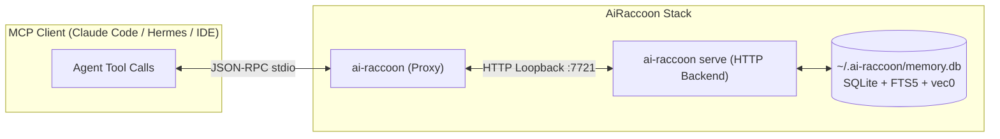
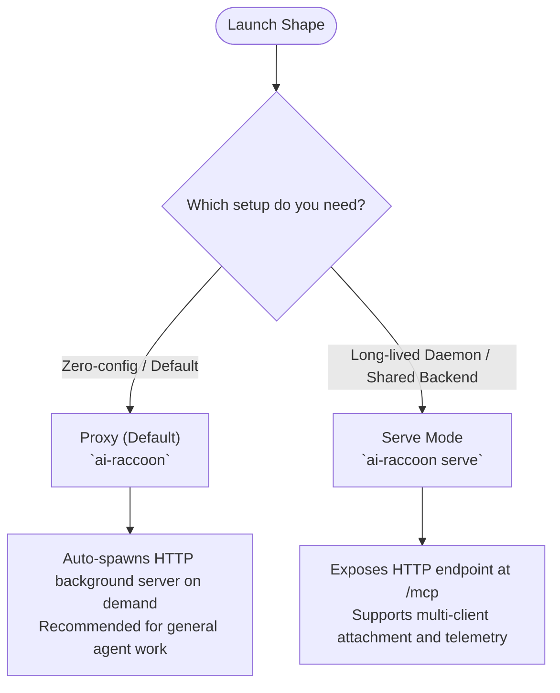

# Get started with AiRaccoon

Install, run, and connect AiRaccoon to your coding agent in under two minutes.

## Overview

AiRaccoon is an MCP memory server that gives AI agents persistent, project-scoped memory over SQLite.



---

## Step 1: Install the CLI tool

Install `ai-raccoon` with the .NET 10 SDK:

```bash
dotnet tool install -g ai-raccoon
```

### Migrating from `arasz.ai-raccoon`

If you used the preview package `arasz.ai-raccoon`, uninstall it first. The package moved to `ai-raccoon`, but both use the same binary name (`ai-raccoon`). Your existing memory database under `~/.ai-raccoon` stays untouched:

```bash
dotnet tool uninstall -g arasz.ai-raccoon
dotnet tool install -g ai-raccoon
```

---

## Step 2: Pick a launch shape

AiRaccoon has two launch shapes. The default bare run is a proxy that
starts the HTTP backend on demand. `serve` runs that backend by hand
(long-lived daemon, explicit port). Pick the proxy unless you need the
backend to outlive your client or to serve several clients at once:



1. **Proxy (Default / Recommended):**
   ```bash
   ai-raccoon
   ```
   Probes port `7721`, starts a background `ai-raccoon serve` process if nothing is listening, and relays JSON-RPC messages. Details in [ADR-0020](../adr/0020-always-on-http-stdio-proxy.md). The proxy speaks MCP over stdio on its own stdin and stdout, so the client config stays a bare command with no args.

2. **Serve (Long-lived daemon):**
   ```bash
   ai-raccoon serve --port 7721
   ```
   Serves a streamable HTTP endpoint on `http://127.0.0.1:7721/mcp`, guarded by
a loopback token. Background it with `ai-raccoon serve > serve.log 2>&1 &`.
The old stdio standalone server was removed outright
(see [ADR-0104](../adr/0104-remove-the-stdio-full-server-mode.md)). Its value fails
at parse now, so do not pass it.

---

## Step 3: Add to your `.mcp.json`

Add AiRaccoon to your project or global `.mcp.json`:

```json
{
  "mcpServers": {
    "ai-raccoon": {
      "command": "ai-raccoon"
    }
  }
}
```

When your agent starts up, it connects through the proxy to the backend memory store automatically.

---

## Step 4: Verify the round trip

Confirm the install actually works by asking your agent to write and then find a memory:

1. Ask it to call `memory_write` with `projectId="get-started"` and `content="AiRaccoon install verification note"`.
2. Ask it to call `memory_search` with `projectId="get-started"` and `query="install verification"`.

A successful search returns the note you just wrote in its `results`. If it comes back empty, re-check Step 3's `.mcp.json` entry and confirm your agent actually connected to the `ai-raccoon` server.

---

## Next Steps

- [Configure and run the AiRaccoon server](../how-to/configure-ai-raccoon-server.md) — Passphrases, port binding, and zero-downtime restarts.
- [Configure embedding engines](../how-to/configure-embedding-engines.md) — Local ONNX models vs remote OpenAI-compatible endpoints.
- [Agent Memory Capabilities](../explanation/agent-memory-capabilities.md) — Hybrid search, workspaces, and shared promotion tier.
- [Agent Memory Server Reference](../reference/agent-memory-server.md) — Complete tool contract and CLI verbs.
