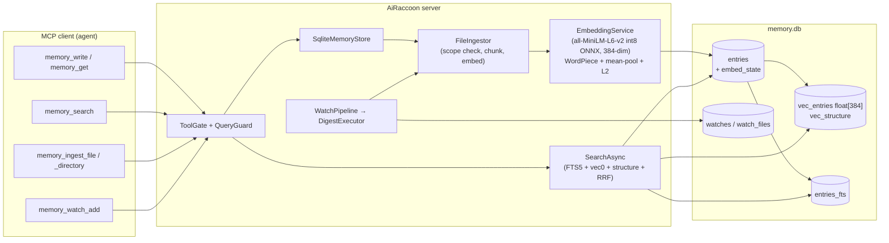
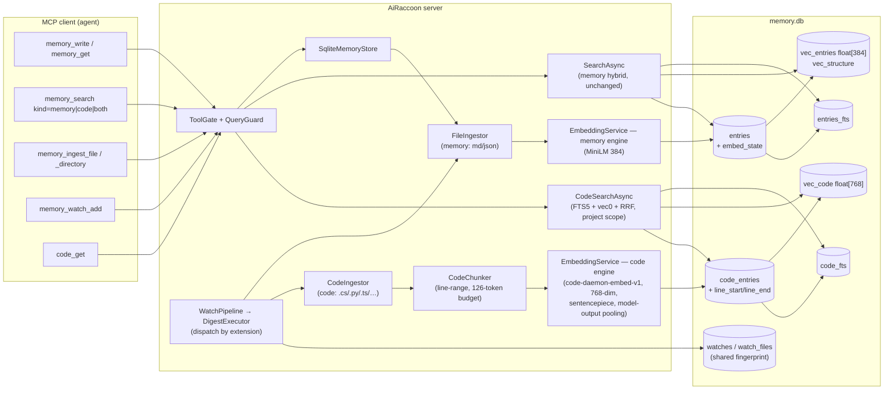
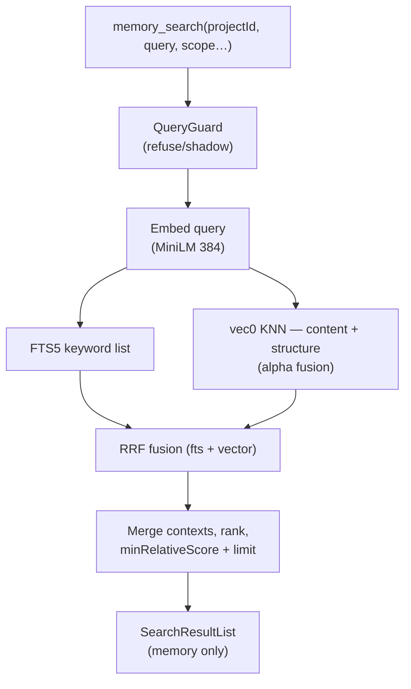
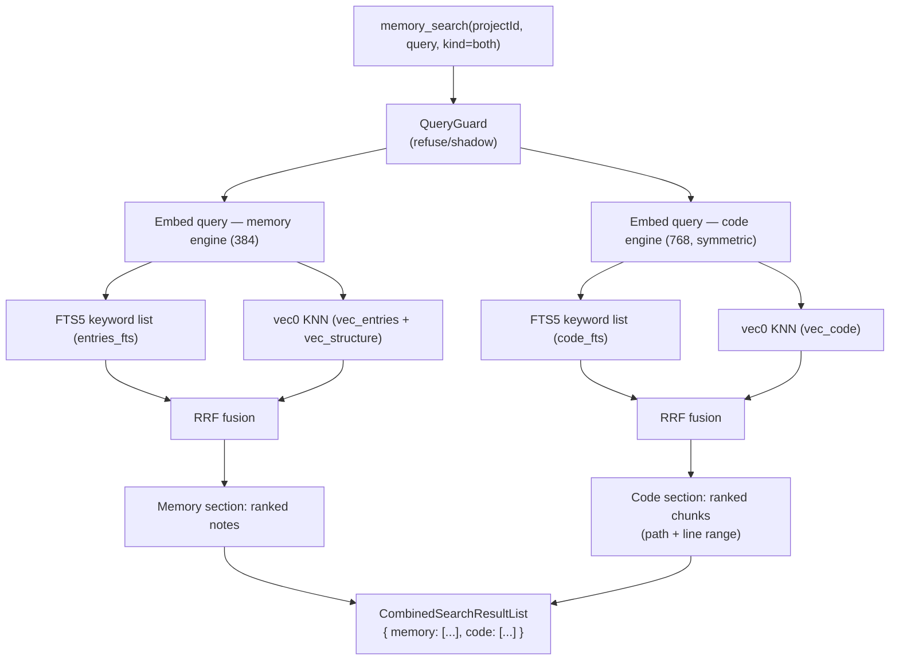
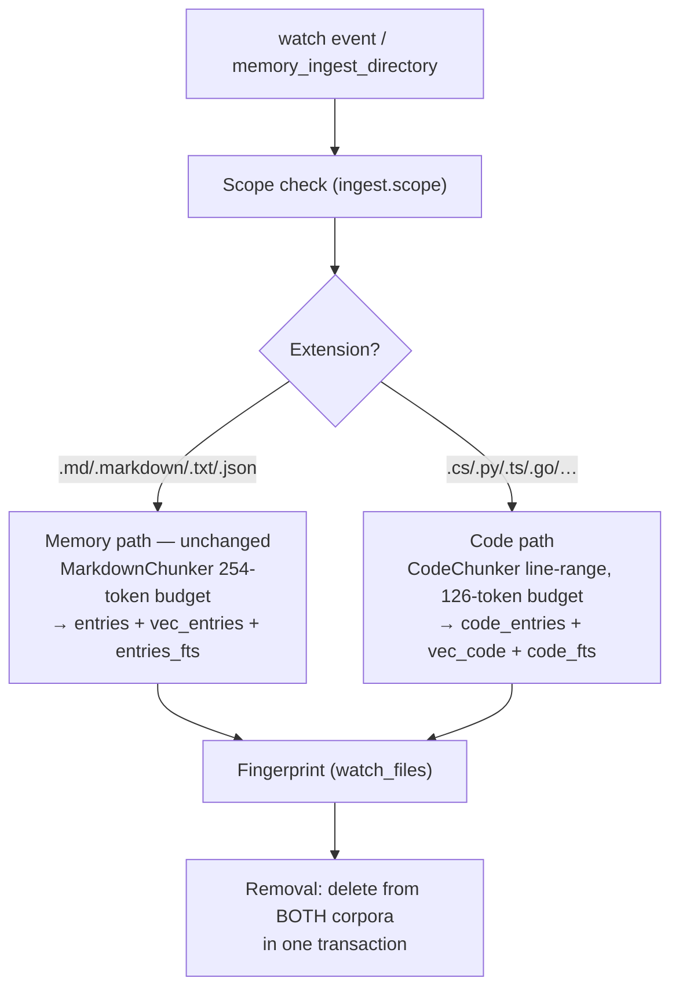

# Exploration: code retrieval with code-daemon-embed-v1

**Date:** 2026-08-21
**Task:** code-embedding-exploration (research + plan + spike; no production code change)
**Question:** Can — and should — AiRaccoon index a repository's *code* (not just notes about it)
and search it with a code-specialised embedding model? Separate pipe or memory? Unified search
or code-only tools?

## 0. TL;DR — the opinion

**Useful: yes, with two conditions.** The model is a purpose-built dense channel for a hybrid
retriever over short code units and short keyword-bag queries — the exact architecture
AiRaccoon already runs for memory. A spike in this worktree proved it runs in the current
stack (OnnxRuntime 1.29.0 CPU, `Microsoft.ML.Tokenizers` SentencePiece, 187 MB INT8 ONNX,
unit-norm 768-dim output, discriminates related from unrelated code, ~56 texts/s on this M4).
The conditions: (1) the engine-generalization work already planned in
`support-for-other-embedding-models` (manifest-driven tokenizer/pooling/dims) is a hard
prerequisite — this model is sentencepiece + `model-output` pooling + 768 dims, none of which
the current engine supports; (2) the model is a single-author, 66-download, 2-week-old repo —
worth a registry pin (SHA-256) and an eval-harness measurement before any default flips.

**Code is not memory.** It should live in a separate corpus — its own tables in the same
`memory.db`, fed by the same watch/ingest machinery — not as `entries` rows. Different
dimension (768 vs 384), different degradation semantics (code is re-derivable from disk,
memory is not), different retention (no promotion tier, no TTL, no sync).

**Search: both, unified as the primary.** `memory_search` gains a `kind` parameter
(`memory` | `code` | `both`); `both` returns one envelope with typed sections
(`memory: [...]`, `code: [...]`) so one call answers "what do I know AND where is it in
code". A thin `code_get` mirrors `memory_get`. Cross-corpus fusion into one ranked list is
deliberately NOT proposed — a code hit and a note hit are different answer types with no
meaningful shared score.

## 1. The model — facts (card + repo, verified where marked)

Source: model card README at https://huggingface.co/faxenoff/code-daemon-embed-v1 (read in
full 2026-08-21), `config.json`, `tokenizer_config.json`, `manifest.json`, and a local spike
(`scratch/code-embed-spike/` in this task's worktree).

| Fact | Value | Grade |
|---|---|---|
| Shape | 46.8M params, 4-layer XLM-RoBERTa (strided-truncated from multilingual-e5-base 12L), hidden 768, 12 heads, vocab 22,739 SentencePiece unigram, 514 position embeddings | READ (card) |
| Output | 768-dim, mask-mean-pooled AND L2-normalized **inside the ONNX graph** — output `[B, 768]` ready to use, no pooling code | VERIFIED (spike: L2 = 1.000000) |
| Context | hard 128-token cap — the graph does not truncate; truncation is the caller's job | VERIFIED (spike: 520-token input embedded happily; must truncate at serving time) |
| Symmetry | no `query:`/`passage:` prefix; queries and documents encoded identically | READ (card) |
| Inputs/outputs | `input_ids` + `attention_mask`, both int64 `[B, seq]`; one output (misleadingly named `last_hidden_state`, actually the pooled vector) | VERIFIED (spike) |
| Special token ids | card: raw-SentencePiece indexing `pad=0 unk=1 bos=2 eos=3`; `config.json` says `bos=0 eos=2 pad=1` (stale copy from the e5 base — **the card wins**) | VERIFIED (spike: `<s>`→2, `</s>`→3, `<pad>`→0, `<unk>`→1) |
| Weights | INT8 from quantization-aware training (Q/DQ nodes carry trained scales); **do not run PTQ/calibration over it** — card measured hit@1 .200 → .133 | READ (card warning) |
| Artifact | `model_int8qdt.onnx` 187,490,530 B (repo's own manifest: dim 768, max_tokens 128, int8); `sentencepiece.bpe.model` 626,759 B; fp8 variant (64 MB) exists for GPU | MEASURED (HF tree API) |
| License / provenance | MIT; single author `faxenoff`, 66 downloads, 0 likes, repo created ~2026-08-05 | MEASURED (HF API) |
| Design fit | trained to be the *dense half of a hybrid retriever* on training queries imitating real captured agent traffic — short keyword bags, behaviour descriptions, identifier fragments; listwise-KL distillation from Qwen3-Reranker-4B (the card claims a runtime reranker measured net-negative on top of it) | READ (card) |
| Throughput (card) | TensorRT RTX 5060: 5,464–72,587 texts/s by bucket; OpenVINO Intel Core Ultra: CPU 237–702, iGPU 420–1,092, NPU 169–565 texts/s | READ (card) |
| Throughput (this machine) | Apple M4 (10c, 24 GB), ORT CPU EP INT8, batch 64 × seq 122: **56 texts/s** | MEASURED (spike) |

**Spike evidence (worktree `scratch/code-embed-spike/`):**

- Special-token ids confirm the card, contradict `config.json` (which is a stale copy of the
  e5 base's). The `.model` file itself assigns `2/3/0/1`; `SentencePieceTokenizer.Create`
  reproduces them.
- One batch, two rows: output `2x768`, both rows L2-norm 1.000000 — pooling + normalization
  really are fused in the graph.
- Discrimination sanity (cosine): same method with a comment added **0.948**; unrelated
  method **0.222**; NL query "how does the pipeline accept new filesystem events" vs the
  relevant `Enqueue` method **0.322** vs the unrelated method **0.133** — the vector space
  separates code by meaning and ranks the right function for a behavioural query.
- `<s></s>` presence moves cosine by ~0.03 (0.9705 no-vs-with) — mask-aware pooling dominates;
  adding them (XLM-R convention) is the faithful choice.
- Throughput 56 texts/s at the longest bucket on CPU. For watch-based incremental indexing
  this is fine: a 10k-unit repo ≈ 3 min initial index, per-commit deltas in seconds. Full
  re-indexes of very large repos (700k units ≈ 3.5 h on this CPU) are the GPU/OpenVINO story,
  not the local-default story.

## 2. Why it fits (and where it does not)

**The fit is structural, not aspirational.** The card's target workload is a sentence-for-
sentence description of AiRaccoon's existing pipeline: index every function/method/type as
one short text + one vector; search with short keyword-shaped queries ("git watcher head
change reindex", "acquire database lock for project hash"); run the dense channel next to a
BM25-style lexical channel and fuse. AiRaccoon has the fusion (FTS5 + vec0 + RRF), the
watch-based incremental ingestion, the chunking machinery, and the eval harness. What is
missing is only: (a) the engine generalization to run a second, differently-shaped model
(the other task's WP1–WP4), and (b) a code-shaped chunker and corpus.

**What the agent gains.** Today a coding agent answers "where does X happen in code" by
grepping or by structural tools (symbol search, call graphs). Those are exact-match or
structural; they fail on behavioural queries where the identifier is unknown ("acquire
database lock for project hash" — you don't know the method name). A code corpus answers
those, and — the user's actual goal — **next to memory**: one call returns both the stored
context ("we decided to use X because Y") and the code location that implements it. That
removes a whole tool-chaining pattern (memory_search → grep → read_file) from the agent's
loop.

**Where it does not fit.** Long documents (hard 128-token cap — irrelevant for code units,
fatal for prose), general English prose, anything needing a cross-encoder rerank (already
distilled in). It is NOT a replacement for the memory model — it is a second, code-only
channel.

## 3. The three questions, answered

### Q1 — Could we extend our memory to provide that function?

Yes — as a **second corpus inside the same bank**, not as a feature of the memory corpus.
The bank is already a single SQLite file with per-modality index tables (`entries` +
`entries_fts` + `vec_entries` + `vec_structure`); a code corpus is the same shape with its
own tables. Reusing the bank means the whole operational surface (access gate, settings,
maintenance jobs, metrics, backup/sync boundary) applies unchanged.

### Q2 — Separate pipe, or treat it as memory?

**Separate tables, same machinery.** The user's instinct is right, and the schema facts
force it anyway:

| Concern | Code-as-memory (entries) | Code-as-corpus (own tables) |
|---|---|---|
| Embedding dimension | 768 ≠ 384 — cannot share `vec_entries` | own `vec_code float[768]` |
| Degradation semantics | sweep would delete re-derivable code; TTL/promotion/rating are meaningless | no sweep/TTL/promotion on code |
| Sync | code chunks would bloat cloud snapshots and leak source into the shared tier | `code_entries` is a different table — sync (which copies `entries`) ignores it by construction |
| Search noise | memory_search would return code chunks mixed with notes | `kind` separates the sections |
| Re-derivability | code is a cache of disk; losing it costs a re-ingest, not knowledge | same, stated explicitly |

What IS reused (the "features we have"): the watch registration + fingerprint machinery
(`watches`/`watch_files` — one watch row, the digest executor dispatches each changed file
by extension to the memory or code path, and deletes from both on removal), the scope check,
the embed-outbox/pending machinery (`embed_state`), the FTS5 + vec0 + RRF fusion code, the
maintenance-jobs ledger, the eval harness.

### Q3 — Unified search, or code-only tools?

**Both, with unified as the primary:**

- `memory_search` gains `kind: "memory" | "code" | "both"` (default `memory` — the current
  shape and behaviour are untouched, so the retrieval gates and every existing client stay
  green). `kind="both"` runs the memory search and the code search and returns
  `{ memory: [...], code: [...] }` in one envelope.
- A `code_get(hash)` tool mirrors `memory_get` (read one chunk's full source). `code_search`
  standalone is just `kind="code"` — no separate tool needed (MCP-thin: tools map 1:1 to
  backend surface).
- **No cross-corpus fusion.** One ranked list mixing notes and code has no meaningful shared
  score, and it would drag the well-tuned memory ranking (nDCG floors) into a new tuning
  surface. Two sections, each ranked by its own hybrid, let the agent decide.

## 4. Refactor proposition

### 4.1 Prerequisite (hard dependency)

The engine generalization from `docs/work/2026-08-21-arbitrary-embedding-models-plan.md`
(worktree `support-for-other-embedding-models`, WP1–WP4) — specifically:

- **D1 manifest** with numeric special-token map — code-daemon's ids (2/3/0/1) are already
  verified to match the card; the spike's tokenizer setup is exactly what the manifest would
  encode.
- **`pooling.mode = model-output`** (D1 enum already includes it) — the graph returns the
  pooled, normalized vector; the generator must NOT mean-pool again.
- **SentencePiece tokenizer family** (D5 — required family, `SentencePieceTokenizer.Create`
  works; note the bos/eos double-reservation parity fixture from D6 applies here too).
- **Dynamic vec0 dimension** (D3/WP4) — code tables are created at `float[768]`; memory
  tables stay at 384. The two corpora never share a vec table, so the dimension reconcile
  stays per-corpus.
- **Manifest chunk budget** (D6 — `ctx − 2`, i.e. 126 tokens for this model; the memory
  chunker's 254-token budget must not apply to code chunks).
- **Fingerprint** (D7 — per-file sha256s; a model re-download re-embeds).

### 4.2 New schema (same `memory.db`)

```
code_entries (id PK, hash, path, value, source_file, line_start, line_end,
              project_id, created_at, updated_at, embed_state, embedding BLOB,
              chunk_index, total_chunks)
code_fts     (FTS5 external-content over value, source_file)
vec_code     (vec0 float[768] distance_metric=cosine)  -- no structure table in v1
```

No `scope`/`workspace_id`/`agent_id`/`rating`/`ttl_days`/`heading_path`: code is
project-scoped by construction, re-derivable, and has no structure modality in v1 (the
structure analogue for code — namespace/symbol path — is a v2 idea, see §6).
`watch_files` fingerprints are shared with the memory path (one fingerprint per path, both
corpora digest from it).

### 4.3 New services / changed services

| Piece | Change |
|---|---|
| `EmbeddingService` | Resolves the code engine separately: `embedding.codeModel` (settings row) alongside `embedding.model`; two `InferenceSession`s in-process (INT8 46.8M ≈ 50 MB resident — fine). Both routes go through the same manifest machinery from WP1–WP4. |
| `CodeChunker` (new) | Line-range chunker, token budget 126 (128 − `<s></s>`). v1: blank-line + brace-balance heuristic split, no AST; emits `line_start`/`line_end`. Reuses `TokenBudget.Trim` for the tail. |
| `CodeFileTypeHandler` + matcher | Extension map for code files (`.cs`, `.py`, `.ts`, `.go`, `.rs`, …), parallel to `FileTypeMatcher`'s markdown/json handlers — **registered against the code path, not the memory path**. |
| `WatchDigestExecutor` | Dispatch by extension: changed file → memory ingest (unchanged) and/or code ingest; removal deletes from both corpora in the same transaction. One watch row serves both. |
| `CodeIngestor` (new) | Same shape as `FileIngestor` (open connection handed in, scope check, chunk insert, embed inline or pending). |
| `CodeSearchService` / store partials | Per-corpus hybrid: FTS5 (`code_fts`) + vec0 KNN (`vec_code`) + the existing `ReciprocalRankFusion`; project scope only; no structure modality. Query embedded with the code engine (symmetric — no prefix). |
| `MemoryTools` | `memory_search` gains `kind`; new result envelope `CombinedSearchResultList { Memory, Code }`; new `code_get` tool. Query-guard + gate apply to code queries identically (it is still a search over project data). |
| Maintenance | New ledger row `code-reindex` (model/dimension change → re-embed code corpus via the existing invalidation triggers); no sweep/TTL job for code. |

### 4.4 What stays untouched

`entries`/`vec_entries`/`vec_structure`/`entries_fts` and every memory tool's wire shape;
the retrieval tuning surface (`retrieval.*` settings apply to memory; code gets its own
`codeRetrieval.*` defaults later, v1 reuses the same RRF constants); sync (code corpus
excluded by table separation); promotion/workspaces; degradation; encryption-at-rest (the
bank file is already encrypted wholesale — new tables inherit it).

## 5. Diagrams

### 5.1 Architecture — before



### 5.2 Architecture — after



### 5.3 Data flow — search, before



### 5.4 Data flow — search, after (`kind=both`)



### 5.5 Data flow — ingest/watch, after (dispatch by extension)



## 6. Risks and open questions for the owner

1. **Model provenance** (medium): single author, 66 downloads, MIT, 2 weeks old. Mitigation:
   registry pin (committed SHA-256, per D8 of the engine plan) + eval-harness measurement on
   a bank copy before any default. The fp8 variant (64 MB) exists but is GPU-oriented; INT8
   QAT is the CPU artifact — never PTQ it (card-measured hit@1 .200 → .133).
2. **Chunker shape without an AST** (medium): v1 line-range heuristics approximate function
   boundaries; the model was trained on real code units. The eval harness settles whether
   heuristic chunks are good enough; tree-sitter-based symbol extraction is the v2 lever if
   not. For Python (indentation-based), blank-line splitting is weaker — corpus choice for
   the v1 eval should include a Python repo to see it.
3. **Second model cost**: +187 MB download, ~50 MB resident, ~56 texts/s on this M4 CPU.
   Incremental watch indexing makes this a background cost; the initial index of a large repo
   is the only real wait.
4. **Search surface stability**: `kind` is additive; `memory_search` defaults to `memory` so
   the retrieval gates and clients are untouched. Decide whether the combined envelope is a
   new MCP tool name (`memory_search` with a mode, vs a separate `search` tool) — proposal
   here: keep `memory_search`, add `kind`.
5. **Sync boundary**: code corpus excluded from cloud sync by table separation — confirm that
   is the wanted behaviour (a code index is machine-local by nature; a second machine
   re-ingests from its own repo).
6. **Eval before build**: the honest sequence is (a) engine generalization WP1–WP4 lands,
   (b) a scratch spike wires the code corpus against a bank copy with 2–3 real repos, (c)
   the eval harness (eval-set + nDCG@5) compares code search with/without the heuristic
   chunker and against a MiniLM baseline on the same chunks — only then (d) the full corpus
   feature. This doc is the design for (b)–(d).

## 7. Evidence

- Model card: https://huggingface.co/faxenoff/code-daemon-embed-v1 (read 2026-08-21)
- HF tree + blob sizes: `https://huggingface.co/api/models/faxenoff/code-daemon-embed-v1?blobs=true` (2026-08-21)
- `config.json` / `tokenizer_config.json` / `manifest.json` (same repo, resolved 2026-08-21)
- Spike: `scratch/code-embed-spike/` (this task's worktree; not committed) — special-token
  ids, 2×768 unit-norm output, cosine matrix, throughput on Apple M4
- Current architecture: `docs/explanation/architecture.md` (§Data model, Write path, Query
  flow), `src/AiRaccoon.Infrastructure/Sqlite/MemorySchema.cs:81-141` (entries + vec0 384
  DDL), `src/AiRaccoon.Infrastructure/Embedding/OnnxEmbeddingGenerator.cs` (MiniLM path),
  `src/AiRaccoon.Infrastructure/Watch/WatchStore.cs` + `WatchDigestExecutor.cs` (watch
  machinery), `src/AiRaccoon.Infrastructure/Ingestion/FileTypeMatcher.cs` (handler registry),
  `src/AiRaccoon/Tools/MemoryTools.cs:98-187` (memory_search surface)
- Prerequisite plan: `docs/work/2026-08-21-arbitrary-embedding-models-plan.md` (task
  `support-for-other-embedding-models`, rev 2) — D1/D3/D5/D6/D7, WP1–WP4
