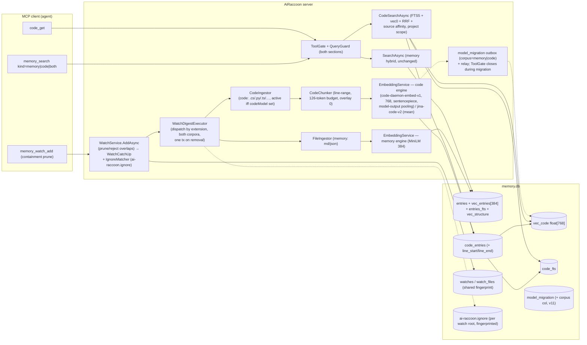

# Code corpus for AiRaccoon — architecture lane (MoE)

**Date:** 2026-08-21
**Task:** code-search-implementation-plan (implementation plan only; no code in this task)
**Lane:** architecture (of four: architecture / engineer / QA / ops)
**Prerequisite (assumed fully implemented):** `docs/work/2026-08-21-arbitrary-embedding-models-plan.md`
(worktree `embedding-model-support`, rev 2, G0 owner-APPROVED) — decisions D1–D12, WPs WP1–WP4 with
gates G1–G4. This document builds on its contracts and does not re-litigate them.
**Direction source:** `docs/work/2026-08-21-code-search-exploration.md` (worktree
`code-embedding-exploration`) — the reviewed exploration; every section below either adopts it or
states the deviation and why.
**Owner additions (f:, mid-turn 2026-08-21):** watch semantics change — `ai-raccoon.ignore`,
no-overlapping-watches, repo-watch-by-default. Folded in as D-F/D-G/D-H and WP-B; the QA lane names
the tests, this lane cites their categories.

## 0. Sources of truth (every fact below cites one)

| Source | What it grounds |
|---|---|
| `docs/work/2026-08-21-arbitrary-embedding-models-plan.md` (embedding-model-support worktree) | D1 manifest (numeric special-token map, `pooling.mode` incl. `model-output`), D2 `embedding.dimensions`, D3 transactional vec0 reconcile float[N], D5 sentencepiece family, D6 chunk budget = ctx−2 capped 510 (`MaxManifestChunkTokens`), D7 fingerprint = manifest semantic content + per-file sha256, D8 `ai-raccoon model download <repo-id>` (C# verb), D9 repair-family tokenizer routing, D10 remote dims probe, G3 byte-identical golden vectors, G4 kill-9 migration tests |
| `docs/work/2026-08-21-code-search-exploration.md` | code-daemon-embed-v1 facts (768-dim ~~INT8 QAT~~ **fp32** **CORRECTED 2026-08-23** (fp32, not INT8 — see Amendments) ONNX 187 MB, sentencepiece ids `<s>`=2 `</s>`=3 `<pad>`=0 `<unk>`=1, pooling+L2 fused → `model-output`, 128-token hard cap → budget 126, symmetric no prefix, MIT, 56 texts/s on M4, ~50 MB resident); verdicts: separate corpus, unified `kind` search, no cross-corpus fusion; jina-code-v2 comparison row (768-dim, 8192 ctx, int8 ONNX 154 MB, Apache-2.0) |
| `jinaai/jina-embeddings-v2-base-code/config.json` + `tokenizer_config.json` (fetched 2026-08-21) | `model_type: bert`, ALiBi, hidden 768, `max_position_embeddings` 8192, `emb_pooler: mean`, `tokenizer_class: RobertaTokenizer` → **sentencepiece family** (same as code-daemon), so the engine-generalization manifest (D1/D5) covers it |
| `src/AiRaccoon.Infrastructure/Sqlite/MemorySchema.cs` | entries DDL (81–108), settings (110–113), maintenance_jobs (119–123), entries_fts (125–131), vec_entries/vec_structure `float[384]` + `ctx` metadata column + `cosine` (137–141), trigger family (143–201), watches/watch_files (249–265), model_migration outbox (372–382), digest gate (450–460), `CurrentVersion = 10` + ladder (38–49, 732), metrics-table-in-Ddl precedent (335–342) |
| `src/AiRaccoon.Infrastructure/Sqlite/MemorySql.cs` | InsertEntry ON CONFLICT DO NOTHING (15–21), bm25 weights 1.0/8.0/4.0 (105–123), vec0 KNN with `ctx` + `k` (141–162), DeleteBySourcePath (196–200), watch SQL (239–266) |
| `src/AiRaccoon/Tools/MemoryTools.cs` | memory_search surface (98–187), SearchResultList record (346), gate/guard application (144, 160–170), ApiEnvelope wrapping (185–186) |
| `src/AiRaccoon.Core/Memory/SearchQuery.cs`, `SearchParameterSettingsKeys.cs`, `MemorySearchResult.cs` | DefaultRrfK=60 (21), validator (46–56), retrieval.* key names + defaults (14–36), result record fields (3–10) |
| `src/AiRaccoon.Infrastructure/Embedding/EmbeddingService.cs`, `EmbeddingSettingsKeys.cs`, `EntryEmbedder.cs` | engine resolution + fingerprint (36–47, 101–109), TrimQueryToWindow (74–92), SafeChunkBudgetFor (94–99), settings keys (9–17), migration outbox flow (54–120) |
| `src/AiRaccoon.Infrastructure/Ingestion/FileIngestor.cs` | scope check + IsIndexableFile + IsHidden = leading dot only (30–43, 287–302) |
| `src/AiRaccoon.Infrastructure/Watch/WatchService.cs`, `WatchStore.cs`, `WatchDigestExecutor.cs` | single registration point (WatchService.AddAsync, 15–40), prune-shaped RemoveWatchAsync (46–75), digest dispatch |
| `scripts/src/retrieval_tuning/evaluate.py`, `scoring.py`, `corpora/` | harness contract: `evaluate(server, settings_dict, corpus)`; binary relevance via `expectedHash` prefix match or `expectedSource` suffix match (scoring.py:119–127); corpora `eval-set-100.json`/`test-set-10.json`/`sextant-6.json`; entry shape (id, query, category, expectedHash, expectedSource, searchLimit, negativeTest, …) |
| `docs/work/2026-08-21-parameter-tuning-matrix.md` | baseline means (70–76): sextant 0.655 / memory(10) 0.700 / memory(100) 0.611; pipeline order (18–53) |
| `tests/AiRaccoon.Tests/Integration/ParityGateTests.cs` | NdcgParityDelta 0.02, p95 ≤ 1000 ms (33–38) |
| `docs/adr/README.md` | numbering to 0083; next free: **0084**; ADR-0042 (fixtures built by the product), ADR-0075 (only the server writes the bank), ADR-0076 (model set outbox), ADR-0068 (ctx metadata column), ADR-0023 amendment (unconditional-Ddl vs ladder) |

## 1. Scope of this lane

(a) corpus schema + lifecycle boundaries; (b) settings surface; (c) search surface wire shape;
(d) evaluation design; (e) work packages with checkable gates; (f) ADR plan. Engineer mechanics,
QA test names, and ops runbooks live in the sibling lanes; this lane fixes the contracts they
implement.

## 2. Decisions

### D-A — Code is a separate corpus in the same `memory.db`; project-scoped only

Adopted from exploration §Q2. `code_entries`/`code_fts`/`vec_code` mirror the entries family but
carry only project identity. **Deliberately absent columns and why:**

| entries column | absent in code_entries | reason |
|---|---|---|
| `scope` / `workspace_id` / `context_label` | yes | code is project-scoped by construction; no shared tier, no workspaces, no contexts (`docs/work/2026-08-21-code-search-exploration.md` §4.2) |
| `agent_id` | yes | provenance of a *note* matters; a code chunk's provenance is its path + line range |
| `rating` / `access_count` / `last_accessed_at` / `ttl_days` | yes | degradation semantics do not apply — code is a re-derivable cache of disk, memory is not (exploration §Q2 table) |
| `heading_path` / `section` / `structure_embedding` / `source_id` | yes | no structure modality in v1; the structure analogue (namespace/symbol path) is a v2 idea (exploration §6) |
| `source_id` FK | yes | `memory_source` is memory-provenance; code's locator is `path` + `line_start`/`line_end` |

`watch_files` fingerprints stay **shared** between the corpora: one fingerprint row per path,
both corpora digest from it (exploration §4.2). Code rows are keyed like committed entries:
`UNIQUE(project_id, path, hash)` mirroring `uq_entries_committed_bucket`
(`MemorySchema.cs:29-31`), with `hash = ContentHash.Of(path, chunk)` exactly as
`FileIngestor.InsertChunksAsync` computes it (`FileIngestor.cs:118`).

### D-B — Schema DDL (complete sketch; engineer lane implements this directly)

Placement: **unconditional Ddl block, no ladder step, no `CurrentVersion` bump.** All three
statements are `CREATE … IF NOT EXISTS` over *new* objects — purely additive, no guarded one-time
work, no change to any existing object. Precedent: the `metrics` table ships in the unconditional
Ddl "so it … reach[es] legacy banks on the next open" (`MemorySchema.cs:335-342`), and ADR-0023's
amendment limits the ladder to changes needing guarded one-time work. The digest gate
(`MemorySchema.cs:450-460`) re-runs the block once on the first open of the new build and stamps;
an old binary opening the bank re-runs its own digest and ignores the new tables (forward compat
is the reverse direction, ADR-0019, untouched — the version does not move).

```sql
-- Code corpus (ADR-0084). Mirrors the entries family; project-scoped only (D-A).
CREATE TABLE IF NOT EXISTS code_entries (
    id          INTEGER PRIMARY KEY,
    hash        TEXT,
    path        TEXT,            -- full file path (source of truth for provenance)
    value       TEXT,            -- one chunk's source text
    source_file TEXT,            -- = path for every row (kept for FTS column symmetry)
    line_start  INTEGER NOT NULL, -- 1-based first line of the chunk in the file
    line_end    INTEGER NOT NULL, -- 1-based last line (inclusive)
    project_id  TEXT NOT NULL,
    created_at  INTEGER NOT NULL,
    updated_at  INTEGER NOT NULL,
    embed_state TEXT NOT NULL DEFAULT 'pending' CHECK(embed_state IN ('pending','embedded')),
    embedding   BLOB NULL,       -- float32[768]; owned by the code embedder (D-D)
    chunk_index INTEGER NOT NULL DEFAULT -1,
    total_chunks INTEGER NOT NULL DEFAULT 0
);

CREATE UNIQUE INDEX IF NOT EXISTS uq_code_chunk ON code_entries(project_id, path, hash);
CREATE INDEX IF NOT EXISTS idx_code_entries_project ON code_entries(project_id);
CREATE INDEX IF NOT EXISTS idx_code_entries_hash ON code_entries(hash);
CREATE INDEX IF NOT EXISTS idx_code_entries_embed_state ON code_entries(embed_state, project_id);

CREATE VIRTUAL TABLE IF NOT EXISTS code_fts USING fts5(
    value,
    source_file,
    content='code_entries',
    content_rowid='id'
);

-- 768 = code-daemon-embed-v1 AND jina-embeddings-v2-base-code (both 768, exploration §1.1),
-- so the A/B costs a re-embed, never a rebuild (D-L). ctx = project_id (metadata column,
-- not a partition key — ADR-0068; the vec0 triggers insert it from NEW.project_id).
-- Cosine declared explicitly so a bare MATCH cannot fall back to L2 (ADR-0068, same as
-- vec_entries, MemorySchema.cs:137).
CREATE VIRTUAL TABLE IF NOT EXISTS vec_code USING vec0(
    ctx TEXT,
    embedding float[768] distance_metric=cosine
);

-- FTS trigger family — verbatim mirror of entries_fts_ai/ad/au (MemorySchema.cs:166-181)
-- over (value, source_file).
CREATE TRIGGER IF NOT EXISTS code_fts_ai AFTER INSERT ON code_entries BEGIN
    INSERT INTO code_fts(rowid, value, source_file) VALUES (new.id, new.value, new.source_file);
END;
CREATE TRIGGER IF NOT EXISTS code_fts_ad AFTER DELETE ON code_entries BEGIN
    INSERT INTO code_fts(code_fts, rowid, value, source_file)
    VALUES ('delete', old.id, old.value, old.source_file);
END;
CREATE TRIGGER IF NOT EXISTS code_fts_au AFTER UPDATE OF value, source_file ON code_entries BEGIN
    INSERT INTO code_fts(code_fts, rowid, value, source_file)
    VALUES ('delete', old.id, old.value, old.source_file);
    INSERT INTO code_fts(rowid, value, source_file) VALUES (new.id, new.value, new.source_file);
END;

-- vec0 trigger family — verbatim mirror of vec_entries_au/pending/ad (MemorySchema.cs:186-201);
-- ctx = project_id.
CREATE TRIGGER IF NOT EXISTS vec_code_au AFTER UPDATE OF embed_state ON code_entries
WHEN NEW.embed_state = 'embedded' AND NEW.embedding IS NOT NULL
BEGIN
    DELETE FROM vec_code WHERE rowid = NEW.id;
    INSERT INTO vec_code(rowid, ctx, embedding) VALUES (NEW.id, NEW.project_id, NEW.embedding);
END;
CREATE TRIGGER IF NOT EXISTS vec_code_pending AFTER UPDATE OF embed_state ON code_entries
WHEN NEW.embed_state = 'pending' AND OLD.embed_state = 'embedded'
BEGIN
    DELETE FROM vec_code WHERE rowid = OLD.id;
END;
CREATE TRIGGER IF NOT EXISTS vec_code_ad AFTER DELETE ON code_entries BEGIN
    DELETE FROM vec_code WHERE rowid = OLD.id;
END;
```

Notes the engineer lane must honour:
- The `ctx` value for code is **`project_id`** (one partition per project, matching the search
  filter `v.ctx = @projectId`); there is no `ContextKeyExpression` equivalent because code has no
  contexts (D-A).
- The vec0 dimension is pinned at 768 in this DDL (both v1 candidates are 768). A future code
  model with another dimension uses the **same D3 transactional reconcile machinery** (engine plan
  D3) parameterized for `vec_code` — the reconcile is per-corpus, never shared with `vec_entries`
  (engine plan D3: "the two corpora never share a vec table" — exploration §4.1).
- Inserts use `INSERT … ON CONFLICT DO NOTHING` with the same bucket-shaped dedup read
  (`SelectChunkIdByPathAndHash…` pattern, `MemorySql.cs:89-103`) so re-ingest of an unchanged
  file is a no-op, exactly like entries.

### D-C — Lifecycle boundaries: code must NOT sync, sweep, promote, or TTL

| Surface | Rule | Mechanism |
|---|---|---|
| Sync | `code_entries` never synced | sync copies `entries` only (exploration §Q2); verified by construction — no sync SQL touches code tables; a gate test asserts sync snapshot SELECTs reference only `entries` (QA category `sync-boundary`) |
| Sweep / TTL | never swept, no TTL ever | the sweep reaper (ADR-0025) and TTL paths operate on `entries`; code rows have no `ttl_days` column (D-A) — a sweep statement referencing `code_entries` fails to compile against the schema, which is the guard |
| Promotion / workspaces | never proposed, never promoted, no workspace outbox | `promotion_queue`/workspace SQL reference `entries` only; code has no `scope`/`workspace_id` |
| Encryption at rest | inherited | the bank file is encrypted wholesale; new tables ride along (exploration §4.4) |
| Watch removal / file delete | deletes from **both** corpora in one transaction | digest executor's removal path runs `DELETE FROM entries …` and `DELETE FROM code_entries …` for the same `(project_id, path)` prefix in one `BEGIN IMMEDIATE … COMMIT`, plus the shared `watch_files` row (mirrors `DeleteBySourcePath`, `MemorySql.cs:196-200`, and `DeleteWatchFilesByProjectPathCascade`, `MemorySql.cs:239-243`) |
| Re-derivability | losing the corpus costs a re-ingest, not knowledge | stated explicitly in the ADR so future ops decisions treat the corpus as a cache |

### D-D — Settings surface: `embedding.codeModel`, manifest-activated, migrated through the existing outbox

- New settings row **`embedding.codeModel`** (TEXT, nullable) beside the memory family
  (`EmbeddingSettingsKeys.cs:9-17`). Value = local model directory (manifest-required, engine plan
  D1/D5) or repo-id resolved by `ai-raccoon model download` (engine plan D4/D8). `null` = code
  engine not configured.
- `EmbeddingService` resolves a **second, independent engine** keyed by its own fingerprint
  (engine plan D7: manifest semantic content + per-file sha256 — a re-download or re-set re-embeds
  the code corpus only). Two in-process `InferenceSession`s (INT8 46.8M ≈ 50 MB resident,
  exploration §1) — the existing per-fingerprint cache
  (`EmbeddingService.cs:33-47`) extends to the code engine unchanged.
- **Code engine change = outbox migration, not an inline re-embed.** The `model_migration` table
  (`MemorySchema.cs:372-382`) gains a `corpus TEXT NOT NULL DEFAULT 'memory'` column
  (`'memory' | 'code'`), added by a **ladder step v11** — this IS guarded one-time work (ALTER
  TABLE + backfill on legacy banks), so it is the one schema change in this feature that bumps
  `CurrentVersion` to 11 with `MigrateToV11Async`. The outbox transaction, lease, relay
  (`ModelMigrationJob`), and ADR-0076 ToolGate semantics are reused unchanged; the drain embeds
  code rows with the code engine and the `vec_code_pending` trigger clears the old-dim rows at
  commit (same crash-safety argument as `EntryEmbedder.cs:103-107`). The memory engine and its
  drain are untouched (G3 byte-identical vectors still hold).
- A separate `code_migration` table was **rejected** (derive-or-delete invariant): one outbox
  with a corpus discriminator beats two copies of the same machinery.
- `model set code <dir>` (server-side verb, ADR-0075 — only the server writes settings) writes
  `embedding.codeModel` and opens the outbox; `model download` needs no changes.
- **Ingest activation rule:** the code path indexes files only when `embedding.codeModel` is set
  (D-E). `embed_state='pending'` still exists (deferred embed inside write transactions,
  `FileIngestor.cs:26-29`), but a standing engine-less FTS-only code corpus is not a mode — the
  corpus is opt-in by configuring the engine. Simpler than a second `ingest.code.enabled` knob,
  and avoids silently growing every watched project's bank with never-embedded rows.

### D-E — Ingest: one watch row, dispatch by extension, both pipelines honour ignore + scope

- The digest executor and `memory_ingest_directory`/`memory_ingest_file` walks dispatch each file
  by extension: existing handlers (markdown/json) → memory path unchanged; code extensions
  (`.cs .py .ts .go .rs .js .java .cpp .h .kt .swift …`, one committed extension map) → code path,
  active iff `embedding.codeModel` set (D-D). A file with no matching handler is skipped as today
  (`FileIngestor.IsIndexableFile`, `FileIngestor.cs:287-296`).
- Scope check: code ingest goes through the same `ingest.scope` allowlist
  (`RequireInScopeAsync`, `FileIngestor.cs:33`; `WatchService.cs:24-27`) — unscoped projects
  refuse every ingest, code included.
- The `ai-raccoon.ignore` matcher (D-F) is consulted at the same point `IsHidden` is today —
  `FileIngestor.IsIndexableFile` (walk + single-file paths) and the digest executor before
  fingerprinting. Ignored ⇒ no fingerprint row, no chunks, no digests, in **both** pipelines.
- `CodeIngestor` mirrors `FileIngestor` (open connection handed in, scope check, dedup read,
  insert, embed inline or pending) but inserts into `code_entries` with `line_start`/`line_end`
  from the chunker and no `memory_source` resolution.
- `CodeChunker` (D-M) produces the chunks; `chunk_index`/`total_chunks` are written by the caller
  exactly as in `FileIngestor.InsertChunksAsync` (GH #371 discipline, `MemorySql.cs:10-14`).

### D-F — `ai-raccoon.ignore`: gitignore-style excludes, one file per watch root, watched itself

Owner requirement (1). Verified: **no glob/gitignore matcher exists in `src/`** (grep across
`src/` for gitignore returned nothing; `Watch/` contains no matcher; `IsHidden` only rejects a
leading dot, `FileIngestor.cs:298-302`).

- **Placement:** v1 single file **`<watch-root>/ai-raccoon.ignore`** — the watched root of each
  watch registration. Because overlapping watches are pruned (D-G), each watch root owns exactly
  one ignore file and there is no ambiguity about which patterns apply to a path.
- **Pattern syntax (minimal gitignore subset):** blank lines and `#` comments; a pattern without
  `/` matches the basename at any depth; a pattern with `/` is anchored to the ignore file's
  directory (leading `/` = root-anchored); trailing `/` = directories only; `*` and `?`
  wildcards (`*` does not cross `/`); `**` in the gitignore senses (leading `**/` = any depth,
  trailing `/**` = everything inside). **`!` negation is rejected for v1** — negation ordering
  semantics are the most error-prone half of gitignore and the owner asked for a minimal matcher;
  the ADR records it as the v2 lever.
- **Matcher implementation:** a pure `IgnoreMatcher` in `AiRaccoon.Core` (clean layering — pure
  logic, no I/O: parse + match only), file reading in Infrastructure. ~80 lines, fully
  unit-testable; no new dependency (a NuGet globber was rejected: one small pure class beats a
  dependency for a 6-rule subset).
- **Fingerprinting:** an ignored file is **not fingerprinted, not chunked, produces no digests**
  (owner spec). The ignore file itself **is fingerprinted and watched**: it is a config artifact,
  never a chunk source, and its fingerprint change triggers a **re-scan of the watch root**
  (reconcile: delete chunks of newly-ignored paths from both corpora, ingest newly-unignored
  files, refresh fingerprints) — the same catch-up walk as a fresh watch (lastChangeTs 0,
  `WatchService.cs:34-37`), reusing `WatchCatchUp`.
- Ignore applies to **directory walks** (watch catch-up, digest events, `memory_ingest_directory`)
  and to **explicit single-file ingest** (`memory_ingest_file` of an ignored path → 0 chunks,
  same as an unindexable extension).

### D-G — No overlapping watches: containment is a service-level invariant at the one registration point

Owner requirement (2). Enforced in `WatchService.AddAsync` (`WatchService.cs:15-40`) — the single
registration point behind `memory_watch_add` (MCP-thin: the tool calls the service; ADR-0075 keeps
the CLI out of the bank). After scope/existence checks, compare the normalized new path against
existing registrations of the same project (`IWatchStore.ListWatchesAsync`,
`WatchStore.cs:77-85`):

- **New ⊇ existing** (new is an ancestor-or-equal of an existing watch): prune each contained
  watch — `RemoveWatchAsync` (registration + `watch_files` rows, `WatchStore.cs:46-75`) +
  `pipeline.UnregisterWatch` — **then** register the new watch. Already-ingested entries stay in
  both corpora (they are inside the new watch's scope; deletion would lose searchable knowledge).
- **New ⊆ existing** (new is a strict descendant): **reject** with a typed
  `WatchOverlapException` naming the containing watch, mapped through `ToolRefusals` to the wire
  (pattern: ADR-0065 — a domain exception becomes a refusal; the tool layer holds no pipeline).
- **Equal path:** idempotent as today (`InsertWatchIfAbsent` + re-register; watermark preserved).
- Membership test uses the existing `IngestPath` normalization/comparison
  (`WatchService.cs:23`, `WatchStore.cs` ordering) — one definition, derived not duplicated.
- The invariant is registration-time only; pre-existing overlapping registrations on old banks are
  grandfathered until touched (documented in the ADR; a reconcile job is an open question, not v1
  scope).

### D-H — Repo watch by default: repo-root registration = prune + full catch-up

Owner requirement (3). This is D-G's ⊇ case applied at the repo root: registering a watch on a
directory **automatically prunes every existing watch whose files fall inside it, then catch-up
scans the whole subtree** (the new watch is born with `lastChangeTs = 0` → full initial scan,
`WatchService.cs:34-37` + `WatchCatchUp`). No git detection is needed — containment is the
mechanism and `.git` is not consulted; "repo root" is just the common case of "broad watch". The
re-scan honours `ai-raccoon.ignore` (D-F) and both pipelines.

### D-I — Search surface: `kind` on `memory_search`, additive envelope, `code_get`

Adopted from exploration §Q3 with one wire-shape refinement (below). **Zero behavior change for
existing clients:** `kind` defaults to `memory` and the declared result record keeps the memory
keys exactly where they are.

Wire shape of `memory_search` (all existing params unchanged — `MemoryTools.cs:98-142`):

```
memory_search(
  projectId: string,
  query: string,
  kind: "memory" | "code" | "both" = "memory",        // NEW; validated fail-fast like scope
  scope: "all" | "project" | "shared" = "all",        // applies to the memory section only
  workspaceId: string? = null,                        // memory section only (code has no workspaces)
  contextLabel: string? = null,                       // memory section only
  limit: int = 20,                                    // per section (both → ≤ 2×limit)
  minRelativeScore: double = 0.0,                     // per section, independently (D-J)
  rrfK: int? = null, ftsWeight: int? = null, vectorWeight: int? = null,
  sourceLambda: double? = null, consolidationThreshold: double? = null,
  docScoreFormula: string? = null, candidateWindow: string? = null)
```

Result record — **additive** (this is the refinement over the exploration's `{memory, code}`
nesting): the declared return type becomes `CombinedSearchResultList` whose serialized shape for
`kind=memory` is byte-compatible with today's `SearchResultList` except for the added `code` key:

```csharp
// MemoryTools.cs:346 today: record SearchResultList(IReadOnlyList<MemorySearchResult> Results, string? Warning = null)
public sealed record CombinedSearchResultList(
    IReadOnlyList<MemorySearchResult> Results,   // memory section — key "results", same position as today
    IReadOnlyList<CodeSearchResult> Code,        // code section — key "code", always present, empty when kind != code|both
    string? Warning = null);

public sealed record CodeSearchResult(
    string Hash,
    double Ranking,
    string Path,
    string Snippet,
    string? SourceFile = null,   // = Path for every row
    int LineStart = 0,           // 1-based, from code_entries.line_start
    int LineEnd = 0,
    int ChunkIndex = 0,
    int TotalChunks = 0);
```

`kind=code` ⇒ `Results = []`, `Code = [...]`; `kind=both` ⇒ both populated; `kind=memory`
(default) ⇒ `Code = []`. Unknown `kind` value → `invalid-params` (same fail-fast as `scope`,
`MemoryTools.cs:146-152`). The retrieval gates and every existing client read `results`/`warning`
and are untouched; the eval harness (`scoring.py:119-127`) resolves gains from `hash`/`sourceFile`
which the code section carries identically.

`code_get` (mirrors `memory_get`, `MemoryTools.cs:78-96`):

```
code_get(projectId: string, hash: string) -> ApiEnvelope<CodeGetResult>
CodeGetResult(string Hash, string Path, string Value, string SourceFile,
              int LineStart, int LineEnd, long CreatedAt)
```

Unknown hash → `unknown-hash` refusal (same typed exception family as `memory_get`). Gate:
`AccessRequirement.Read`.

**Guard/gate application:** `gate.RequireAsync(projectId, Read, …)` and
`queryGuard.EvaluateAsync(projectId, query, …)` run identically for every `kind` — a code query
is still a search over project data (exploration §4.3). The QueryLengthGuard warning composes
into the single `Warning` field.

**Trim:** the query is trimmed to the code engine's manifest window (128 − 2 = 126 tokens) by the
same `TrimQueryToWindow` path (`EmbeddingService.cs:74-92`), which the engine-generalization plan
D6 already makes manifest-aware (`MaxManifestChunkTokens`). Symmetric model — no query prefix.

**Per-section semantics (D-J):** `minRelativeScore` is applied **within each section** after that
section's own max-normalization — each corpus has its own top hit, and a relative floor across
two different score distributions would be meaningless (ADR-0047's argument applies per corpus).
`limit` is per section.

### D-J — Code search reuses the `retrieval.*` constants in v1; `codeRetrieval.*` is the named seam

Code search runs the **same pipeline shape** as memory (`docs/work/2026-08-21-parameter-tuning-matrix.md:18-53`):
FTS5 leg (bm25 weights 1.0 on `value`, 8.0 on `source_file` — the memory weights are
1.0/8.0/4.0 over value/source_file/section, `MemorySql.cs:105-123`; code has no section column,
so the 8.0 source weight carries the identifier/path signal, flagged as eval-tunable), vec0 KNN
leg, weighted RRF (k=60, weights 1:1), source-affinity ranker (λ=0.1 sibling boost by
`chunk_index` within one file, consolidation 0.1, doc-score max, candidate window max3x100),
and the no-fusion-regression reorder when `fusion.noRegression.enabled.global` is on (ADR-0078 —
the flag is bank-global and applies to any fusion). All values come from the SAME
`SearchParameterSettingsKeys` (`SearchParameterSettingsKeys.cs:14-36`) via the same
`SearchParameters.FromSources` resolution (ADR-0083) — **no second knob surface in v1**, because a
second settings family with no tuned values is noise; the coupling is documented (tuning
`retrieval.*` affects both sections). `codeRetrieval.*` overrides are the named eval-phase lever
(WP-E): when the eval shows code wants different values, the settings read gains a prefix, one
line per knob.

### D-K — No cross-corpus fusion

Adopted from exploration §Q3. One ranked list mixing notes and code has no meaningful shared score
(a code hit and a note hit are different answer types), and it would drag the well-tuned memory
ranking into a new tuning surface. Two sections, each ranked by its own hybrid, let the agent
decide; the envelope answers "what do I know AND where is it in code" in one call. This is a
standing decision, recorded in the ADR, not a v1 simplification.

### D-L — Chunker shape (D-M) and evaluation design

**Chunker:** line-range heuristic, no AST (exploration §6.2): split points at blank lines and
brace-balance transitions (nesting depth returning to a lower level); segments over the 126-token
budget (128 ctx − 2 for `<s></s>`, engine plan D6) are sub-chunked by token window via the
existing `TokenBudget.Trim`; **overlay 0** — the memory chunker's overlay exists to survive
arbitrary markdown splits, but overlapping two functions' text into adjacent code chunks is noise;
flagged as eval-tunable. Emits `line_start`/`line_end` per chunk; `chunk_index`/`total_chunks`
written by the caller. Python's indentation-based structure makes blank-line splitting weaker —
that is exactly why the eval corpus must include a Python repo (exploration §6.2, risk 2).

**Evaluation (WP-E) reuses the existing harness, unchanged scoring:**
- `evaluate(server, settings_dict, corpus)` (`scripts/src/retrieval_tuning/evaluate.py:15-40`)
  and binary relevance via `expectedHash` prefix match or `expectedSource` suffix match
  (`scoring.py:119-127`). Code corpus entries use **`expectedHash`** primarily (hash is
  content-derived, stable across re-embeds and across the A/B — only the vectors change), with
  `expectedSource` as fallback; `searchLimit: 5`, `negativeTest` entries included, per-category
  buckets (`csharp`, `python`, `typescript`, `behavioural`, `identifier`).
- **Corpus:** 2–3 real repos at **pinned commits, vendored** (ADR-0042 pattern — fixtures built
  from real sources, external to this repo like `table-corpus-sources.json`): ai-raccoon itself
  (C#), **one Python repo (mandatory)**, one TS or Go repo. Graded queries authored against
  answer spans (line ranges) in the vendored files; the existing corpus validator pattern
  (anchors resolve against the copy) applies.
- **A/B arms:** code-daemon-embed-v1 vs jinaai/jina-embeddings-v2-base-code — both 768-dim
  (exploration §1.1; jina config verified 2026-08-21), so the swap is `embedding.codeModel`
  + a code-corpus re-embed on a **scratch bank copy**; the schema never changes (D-B).
  jina is sentencepiece-family (RobertaTokenizer) so the engine-generalization manifest covers
  it; its ONNX pooling shape (fused vs token-level) is **unverified — a parity probe precedes
  the arm** (engine plan G5 pattern: fixed cosine bar + negative control; `emb_pooler: mean`
  in config suggests in-process mean pooling, `pooling.mode = mean`).
- **Chunker arm:** re-ingest the same repos with a plain token-window chunker (no heuristics) and
  re-run the same eval-set — answers the "is the heuristic chunker worth it" question the
  exploration names.
- **MiniLM reference:** the bundled 384-dim model cannot live in `vec_code` (dimension mismatch,
  D-B) — a scratch-only reference arm embeds the same chunk texts with MiniLM outside the product
  (spike-style), reported for context, **not** a gate.
- **Floors (acceptance):** code-daemon arm must clear **mean nDCG@5 ≥ 0.50** on the code eval-set
  — a *hypothesis* floor, pinned the ADR-0079/0081 way: the first measurement run fixes the floor
  from evidence and the gate is then witnessed **RED** against a deliberately bad arm (wrong
  chunker or a scrambled model) before it is trusted. Reference points for calibration:
  memory(10) baseline 0.700, memory(100) 0.611, sextant 0.655
  (`docs/work/2026-08-21-parameter-tuning-matrix.md:70-76`); code queries are harder (short
  units, behavioural phrasing), so the code floor is expected below memory's. The jina arm is
  measured against the same floor; the **champion becomes the default code engine only by owner
  decision** from the eval report (engine plan G0 precedent: no default flips inside the plan).

### D-M — Code search is project-scoped, no structure modality, no fusion — restated

Code search: FTS5 (`code_fts`) + vec0 KNN (`vec_code`, `k = @limit`, `v.ctx = @projectId`) + the
existing weighted-RRF + source-affinity pipeline (D-J), project scope only, no structure arm, no
workspace/shared/context partitions. `scope`/`workspaceId`/`contextLabel` parameters apply to the
memory section only (D-I). A `kind=code` query on a bank without `embedding.codeModel` returns an
empty code section with a warning ("code corpus disabled: no embedding.codeModel configured")
composed into `Warning` — an empty corpus is a valid answer, not an error (mirrors an empty bank).

## 3. Diagrams (after state)



Data flow for `kind=both` is exploration §5.4 unchanged, with the addition that the code leg's
FTS query goes through the same `FtsQueryNormalizer`/term budget as memory (ADR-0072) and the
query is trimmed to 126 tokens for the code engine (D-I).

## 4. Work packages and gates

All WPs TDD (CLAUDE.md: TDD mandatory, done means proven, a check you have not seen fail is not a
check). Gates are concrete commands; test names come from the QA lane — cited here **by category**
so this lane and the QA lane cannot drift.

| WP | Lane | Deliverable | Gate (checkable) |
|---|---|---|---|
| **WP-A** | arch+eng | D-B schema: `code_entries`/`code_fts`/`vec_code` + triggers + indexes; settings key `embedding.codeModel`; digest re-stamp | `dotnet test --filter "FullyQualifiedName~CodeCorpusSchema"` green on fresh bank and on a v10-stamped legacy copy (tables appear, entries counts unchanged, digest re-stamped); trigger family categories `schema-ddl`, `trigger-family` — each trigger watched RED first (insert→fts row, embed transition→vec row upsert, pending→vec row removed, delete→both removed) |
| **WP-B** | arch+eng | D-F/D-G/D-H: `IgnoreMatcher` (Core, pure), ignore file read + fingerprint + rescan; containment prune/reject at `WatchService.AddAsync`; repo-root watch → prune + catch-up | `dotnet test --filter "FullyQualifiedName~WatchSemantics"` green; categories `ignore-matching` (matcher table: basename, anchored, `*`/`?`/`**`, trailing `/`, comments; no `!`), `watch-pruning` (broader prunes narrower — registration + watch_files + runtime gone, entries stay; narrower rejected with `WatchOverlapException`; equal path idempotent), `repo-watch-catchup` (repo-root add prunes contained watches then full scan; ignore file change → rescan deletes newly-ignored chunks from BOTH corpora and ingests newly-unignored); RED witnesses: ignored file still fingerprinted → fail; overlap accepted → fail |
| **WP-C** | eng | D-E/D-M/D-D: `CodeFileTypeHandler` + extension registry, `CodeChunker` (126 budget, line ranges, overlay 0), `CodeIngestor`, digest dispatch + one-tx removal from both corpora, code engine resolution in `EmbeddingService` (manifest-activated, second session, D7 fingerprint), `model_migration.corpus` ladder v11 + code drain + `vec_code` reconcile (D3 machinery), `model set code` verb (server-side, ADR-0075) | `dotnet test --filter "FullyQualifiedName~CodeCorpusIngest\|FullyQualifiedName~CodeEngine\|FullyQualifiedName~CodeMigration"` green; categories `code-chunking` (budget ≤126 counted in the sentencepiece tokenizer, line ranges monotonic, over-budget segment sub-chunked, empty file → 0), `code-ingest` (dedup no-op on re-ingest, embed inline vs pending, no `memory_source` rows), `watch-dispatch` (extension routing, removal tx atomicity — kill the tx → both corpora intact), `code-engine` (memory engine G3 byte-identical vectors unchanged; code fingerprint change → code re-embed fires, memory untouched), `code-migration` (kill-9 mid-drain recovers — mirrors G4b; ToolGate closed during migration; `vec_code` recreated at target dim, never repopulated from old blobs — D3 trap); `dotnet test` full green |
| **WP-D** | eng | D-I/D-J/D-K/D-M: `CodeSearchAsync` store partial + service, `kind` param, `CombinedSearchResultList`, `code_get`, guard/gate wiring, per-section floor/limit | `dotnet test --filter "FullyQualifiedName~CodeSearch\|FullyQualifiedName~MemorySearch"` green; categories `search-wire` (kind=memory response byte-identical to pre-change except additive `code: []`; invalid kind → `invalid-params`; kind=code\|both with no codeModel → empty code + warning), `code-search` (FTS-only before drain, hybrid after; per-section minRelativeScore; limit per section; ctx=projectId partition), `code-get` (unknown hash → unknown-hash), `guard-application` (refuse tier blocks code queries; annotate warning composes); **memory no-regress**: `dotnet test --filter "FullyQualifiedName~ParityGateTests\|FullyQualifiedName~RrfParameterSweepTests\|FullyQualifiedName~SourceAffinitySweepTests"` green unchanged (kind defaults to memory) |
| **WP-E** | ops+eng+eval | D-L evaluation: vendored code corpus (2–3 repos incl. Python), graded eval-set (hash-anchored, negative tests, per-category), harness code-arm (`embedding.codeModel` swap + code re-embed on scratch copy), jina parity probe, A/B + chunker arm + MiniLM reference, floor pinning + RED witness, eval report | `python scripts/retrieval_tuning/corpus_validate.py code-corpus.json` (or the existing validator entry point) exits 0 (unique ids, anchors resolve, ≥1 Python repo, ≥1 negativeTest per category); `python scripts/retrieval_tuning/evaluate.py --corpus code --model code-daemon` and `--model jina-code` both produce full Metrics rows; code-daemon mean nDCG@5 ≥ pinned floor; jina arm measured against the same floor; **RED witness recorded**: deliberately broken arm (scrambled vectors or token-window-only chunker) fails the floor; memory gates (`eval-set-100` drift check per `2026-08-21-parameter-tuning-plan.md` G5 pattern) unchanged; report lands in `docs/work/` with per-query + per-category tables |
| **WP-F** | arch+eng | ADRs (0084–0087), docs drift audit (architecture.md diagrams + `docs/reference/agent-memory-server.md` contract), one squash-merge PR | `docs/adr/0084..0087` exist and read correctly against this doc; `README` ADR table updated; architecture.md diagrams match the implemented flow; PR merged |

## 5. ADR plan (numbering continues from 0083 — `docs/adr/README.md`)

| ADR | Title (proposed) | Records |
|---|---|---|
| **0084** | Code is a separate, project-scoped corpus with no memory lifecycle | D-A/D-B/D-C: tables, absent columns and reasons, no sync/sweep/promotion/TTL, shared watch row, one-tx removal, re-derivability |
| **0085** | Watch containment and `ai-raccoon.ignore` | D-F/D-G/D-H: ignore placement + matcher subset + fingerprint/rescan, prune/reject invariant at the registration point, repo-watch-by-default, grandfathering note |
| **0086** | `memory_search kind` and the two-section envelope | D-I/D-J/D-K: additive wire shape, per-section floor/limit, no cross-corpus fusion, `code_get`, guard/gate coverage, `retrieval.*` reuse + `codeRetrieval.*` seam |
| **0087** | The code engine is manifest-activated and eval-gated | D-D: `embedding.codeModel`, outbox `corpus` column (v11), per-corpus re-embed + D3 reconcile, ingest activation rule, A/B evidence requirement before any default flip |

ADR-0036 (engine-aware chunk budget) needs no amendment — the 126-token code budget falls out of
the manifest machinery (engine plan D6); the ADR's tokenizer-routing extension (D9) already covers
"the engine that will embed".

## 6. Rejected alternatives (with reasons)

1. **Code as `entries` rows** (scope='code' or a marker) — rejected: 768≠384 forces a separate
   vec table anyway (exploration §Q2 table); degradation/sync/promotion semantics are wrong for a
   re-derivable cache; search noise without `kind`.
2. **Cross-corpus fusion into one ranked list** — rejected: no meaningful shared score; would
   drag the tuned memory ranking into a new tuning surface (exploration §Q3; D-K).
3. **A separate `code_search` tool instead of `kind`** — rejected: MCP-thin — tools map 1:1 onto
   the backend surface; `kind=code` IS the code search (exploration §Q3).
4. **AST / tree-sitter chunking in v1** — rejected: new dependency + real complexity; the
   heuristic chunker's adequacy is an *empirical* question the eval settles (exploration §6.2);
   tree-sitter is the named v2 lever.
5. **Standing FTS-only code mode without a configured engine** — rejected: silently grows every
   watched project's bank with never-embedded rows; the corpus is opt-in by configuring
   `embedding.codeModel` (D-D).
6. **`codeRetrieval.*` settings in v1** — rejected/deferred: a second knob family with no tuned
   values is noise; one shared `retrieval.*` surface, prefix seam later (D-J).
7. **Separate `code_migration` outbox table** — rejected: derive-or-delete — one outbox with a
   `corpus` discriminator (D-D).
8. **`!` negation in `ai-raccoon.ignore` v1** — rejected: negation ordering is the error-prone
   half of gitignore; minimal matcher per owner steer (D-F).
9. **A NuGet globber for ignore matching** — rejected: a ~80-line pure Core class beats a
   dependency for the 6-rule subset (D-F).
10. **`!`/`memory_stats` counting the code corpus in v1** — rejected: stats stays memory-only;
    code corpus observability is the ops lane's concern (open question O4).
11. **MiniLM baseline inside `vec_code`** — rejected: dimension mismatch; scratch-only reference
    arm (D-L).
12. **Splitting `limit` between sections for `kind=both`** — rejected: sections are independent
    answer types; per-section `limit` is the honest shape (D-I).
13. **Git-based repo detection for repo-watch** — rejected: containment is the mechanism; `.git`
    is not consulted (D-H).

## 7. Open questions

1. **Strict MCP clients and the additive `code` key:** `kind=memory` responses gain a `code: []`
   field. Loose clients ignore it; a strict schema-validating client would need its schema
   updated. Fallback if that bites: omit `code` when empty (serializer condition), keeping the
   memory wire shape byte-identical.
2. **jina-code-v2 ONNX pooling shape** (fused vs token-level) — unverified; the parity probe
   (engine plan G5 pattern, fixed cosine bar + negative control) precedes its eval arm;
   `emb_pooler: mean` suggests `pooling.mode = mean` in-process.
3. **Code corpus + search_quality:** v1 records the memory section only; whether `kind=code`
   searches should write `search_quality` rows (and how `top_source_files` represents code hits)
   is deferred to the ops lane.
4. **Grandfathered overlapping watches:** registration-time invariant only (D-G); a reconcile
   maintenance job for legacy banks is out of v1 scope.
5. **Eval corpus size / ingest cost:** 2–3 repos at pinned commits, chunked at ~10k units each
   ≈ minutes of ingest on this M4 (exploration §1); whether the code eval-set should also pin a
   p95 latency budget (ParityGateTests-style, ≤1000 ms) is the ops lane's call.
6. **Champion code model default flip:** per engine-plan G0 precedent the plan never flips
   defaults; the owner decides from the WP-E report (ADR-0087 records the process).
7. **`model set code` verb shape:** `ai-raccoon model set code <dir>` (mirroring `model set
   local`) vs a `--corpus` flag on the existing verb — engineer lane's call, both write
   `embedding.codeModel` + outbox.

## 8. Hypotheses (labelled, tested in WP-E)

- **H1:** code-daemon-embed-v1 clears mean nDCG@5 ≥ 0.50 on the code eval-set (floor pinned from
  first measurement, then witnessed RED against a bad arm).
- **H2:** the line-range heuristic chunker beats a plain token-window chunker on the same
  eval-set (chunker arm).
- **H3:** code search beats the structural tools it replaces for behavioural queries ("where does
  X happen") — proxied by the `behavioural` category scores; not directly gateable, reported.
- **H4:** per-file sibling boost (λ=0.1) helps code ranking (adjacent chunks of one file are
  often one function) — measured in WP-E; if it hurts, `codeRetrieval.sourceLambda` override is
  the lever (D-J).
- **H5:** Python repo scores are the weakest category (blank-line heuristic risk) — the corpus
  includes Python precisely to see this (D-L).

## 9. Evidence

- `docs/work/2026-08-21-code-search-exploration.md` (reviewed direction; spike facts §1)
- `docs/work/2026-08-21-arbitrary-embedding-models-plan.md` (embedding-model-support worktree; D1–D12, WP1–WP4)
- `jinaai/jina-embeddings-v2-base-code/config.json` + `tokenizer_config.json` (fetched 2026-08-21)
- `src/AiRaccoon.Infrastructure/Sqlite/MemorySchema.cs:81-201, 249-265, 335-342, 372-382, 450-460`
- `src/AiRaccoon.Infrastructure/Sqlite/MemorySql.cs:15-21, 89-162, 196-200, 239-266`
- `src/AiRaccoon/Tools/MemoryTools.cs:98-187, 346`
- `src/AiRaccoon.Core/Memory/SearchQuery.cs`, `SearchParameterSettingsKeys.cs`, `MemorySearchResult.cs`
- `src/AiRaccoon.Infrastructure/Embedding/EmbeddingService.cs`, `EmbeddingSettingsKeys.cs`, `EntryEmbedder.cs`
- `src/AiRaccoon.Infrastructure/Ingestion/FileIngestor.cs:30-43, 287-302`
- `src/AiRaccoon.Infrastructure/Watch/WatchService.cs:15-40`, `WatchStore.cs:46-85`
- `scripts/src/retrieval_tuning/evaluate.py`, `scoring.py:119-127`, `corpora/eval-set-100.json`
- `docs/work/2026-08-21-parameter-tuning-matrix.md:18-53, 70-76`
- `tests/AiRaccoon.Tests/Integration/ParityGateTests.cs:33-38`
- `docs/adr/README.md` (numbering to 0083)

## Amendments

### 2026-08-23 — the shipped code model is fp32, not INT8 QAT (WP7 desk half, PR #536)

**What was wrong:** this document records `faxenoff/code-daemon-embed-v1` as an INT8
quantization-aware-trained artifact in its inputs table, quoting the exploration record. The file AiRaccoon downloads and runs is **fp32**.

**Measured 2026-08-23** by loading the artifact that
`model download faxenoff/code-daemon-embed-v1` places on disk — 187,286,767 B, sha256
`57bcfc6aed11ea239d01f2b124f2f948456f2284ad6e2c4744452509c9c25ca9`, the value pinned in that
directory's own `ai-raccoon.manifest.json`:

| | Recorded here | Measured |
|---|---|---|
| Weights | INT8, QAT, Q/DQ nodes carry trained scales | **fp32** — 70 initializers, **all `FLOAT`**, 46,801,920 elements = 187,207,680 raw bytes |
| Quantized ops | implied throughout | **zero** `QuantizeLinear`, `DequantizeLinear`, `MatMulInteger` or `QGemm` in 373 nodes |
| Why 187 MB reads as int8 | — | it does not: 46.8M parameters x 4 bytes **is** 187 MB. A 46.8M-parameter int8 graph would be ~47 MB — which is exactly what quantizing this one produces |

Reproduced independently during review of PR #536.

**What it changes:** the model card's *"never PTQ the INT8 QAT artifact"* warning refers to a
**different file** (`model_int8qdt.onnx`) than the one we run, so it does not forbid quantizing the
fp32 graph we actually have. It remains a live warning about what quantization costs this model
family's retrieval — hit@1 .200 -> .133 — and WP7's desk half measured a fp32-vs-int8 cosine of
**0.964** (against a 0.9999 negative control), which points the same way. **Nothing shipped
changes:** the engine has always been running this fp32 graph, so every throughput and
resident-size figure taken against it stands; only the label was wrong.

**Not rewritten:** figures elsewhere in this document that merely *label* the model INT8 while
reporting something else measured correctly are historical and read as such.

**Full record:** `docs/work/2026-08-23-code-engine-inference-research.md` §2.
