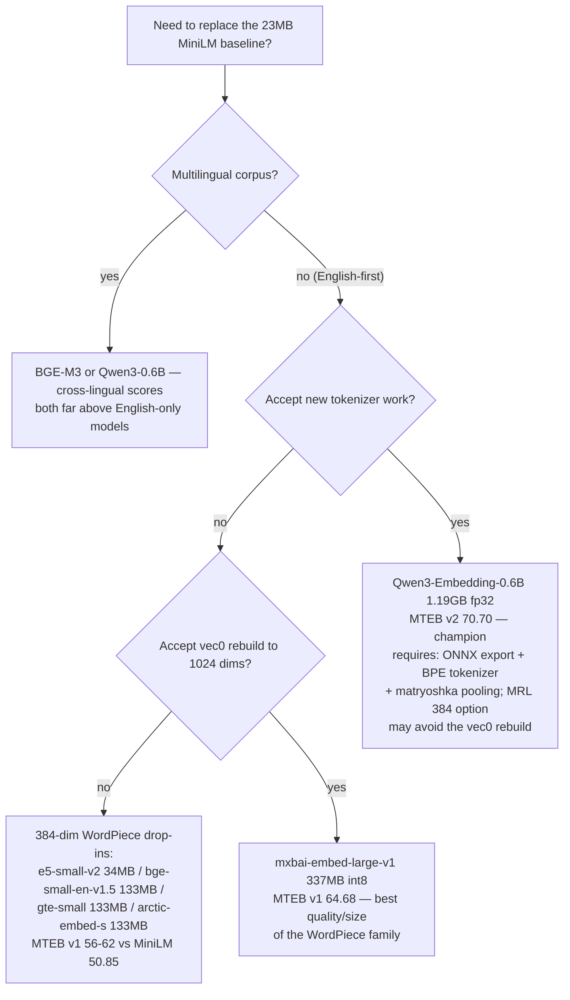

# Research: embedding model replacement for AiRaccoon

**Date:** 2026-08-21
**Question:** Which local embedding model offers the best retrieval quality per size for AiRaccoon's on-device ONNX pipeline, and what is the minimal surface for downloading a Hugging Face model on demand?

## Findings

### F1 — The Milvus CCKM benchmark compares 10 embedding models on production scenarios MTEB misses [READ]

Cross-modal (Qwen3-VL-2B 0.945 > Gemini Embed 2 0.928), cross-lingual (Gemini 0.997; English-only lightweight models score near zero: mxbai 0.120, nomic 0.154), needle-in-a-haystack (models <335M degrade sharply at 4K+ chars: mxbai 0.660/58% degradation, nomic 0.633/56%; BGE-M3 slips at 8K), MRL compression (Voyage/Jina v4 lose <1% at 256 dims). The article's own advice: public benchmarks shortlist; the durable investment is your own evaluation pipeline on your own data.

**Evidence:** https://milvus.io/blog/choose-embedding-model-rag-2026.md (Cheney Zhang, 2026-03-26; read in full 2026-08-21)

### F2 — Qwen3-Embedding-0.6B is the quality/size champion among open models [READ]

MTEB Eng v2 Mean(Task) **70.70** at 0.6B params / 1024 dims (MRL 32+); multilingual aggregate 64.33 (beats mxbai's 64.68 on the harder multilingual track); 32K context; Apache-2.0. The Eng-v2 table puts it above multilingual-e5-large-instruct (65.53) and gte-Qwen2-1.5B (67.20) at a fraction of the params.

**Evidence:** HF model card `Qwen/Qwen3-Embedding-0.6B` README "MTEB (Eng v2)" table (snapshot May 24, 2025); morphllm Ollama table (June 2026) for the multilingual number.

### F3 — English v1 track: mxbai-embed-large 64.68, nomic-embed-text v1.5 62.28 [READ]

MTEB tracks differ and are NOT cross-comparable: qwen3/embeddinggemma report multilingual v2; mxbai/nomic report English v1. Context windows: mxbai 512 tokens (AiRaccoon chunks at 256 — fits), nomic 8K, Qwen3 32K.

**Evidence:** morphllm.com/ollama-embedding-models table (verified against Ollama library + HF cards, June 2026).

### F4 — Measured download sizes of the candidate ONNX/safetensors files [MEASURED]

| Model | Params | Dims | File | Size |
|---|---|---|---|---|
| all-MiniLM-L6-v2 (current) | 22M | 384 | onnx/model_qint8_arm64.onnx | 23.0 MB |
| intfloat/e5-small-v2 | 33M | 384 | onnx/model_qint8_avx512_vnni.onnx | 34.1 MB |
| BAAI/bge-small-en-v1.5 | 33M | 384 | onnx/model.onnx | 133.1 MB |
| thenlper/gte-small | 33M | 384 | onnx/model.onnx | 133.1 MB |
| Snowflake/snowflake-arctic-embed-s | 33M | 384 | onnx/model.onnx | 133.1 MB |
| mixedbread-ai/mxbai-embed-large-v1 | 335M | 1024 | onnx/model_quantized.onnx | 337.0 MB |
| nomic-ai/nomic-embed-text-v1.5 | 137M | 768 | onnx/model.onnx | 547.3 MB |
| Qwen/Qwen3-Embedding-0.6B | 600M | 1024 | model.safetensors | 1191.6 MB |

**Evidence:** `curl -sIL` Content-Length on each HF `resolve/main` URL, 2026-08-21 (macOS, arm64).

### F5 — Output dimension is the hard schema constraint, and the BERT-small family matches it exactly [MEASURED]

`MemorySchema.cs` declares `vec_entries`/`vec_structure` as vec0 tables with `embedding float[384]`; `EmbeddingMath.Dimension = 384`. Config check: all-MiniLM-L6-v2, gte-small, bge-small-en-v1.5, arctic-embed-s, e5-small-v2 all output **384** dims (hidden_size=384) → swap without schema migration. mxbai (1024), nomic (768), Qwen3 (1024) → vec0 rebuild + full re-embed required.

**Evidence:** `src/AiRaccoon.Infrastructure/Sqlite/MemorySchema.cs:137-141`; `src/AiRaccoon.Core/Embedding/EmbeddingMath.cs:12`; `config.json` hidden_size per model via HF API.

### F6 — The tokenizer is BERT WordPiece built from the bundled vocab.txt — the drop-in boundary [READ]

`LocalTokenizer` (docs/adr/0036) builds a `Microsoft.ML.Tokenizers` `BertTokenizer` from the bundled vocab.txt. Any swap model must be WordPiece-vocab compatible: the whole BERT-small family qualifies; Qwen3 (BPE/Qwen2 tokenizer), nomic (BPE + matryoshka pooling) do not.

**Evidence:** `src/AiRaccoon.Infrastructure/Embedding/LocalTokenizer.cs:1-35`.

### F7 — The download machinery is half-built: verified URL fetch exists; general repo targeting does not [MEASURED]

`scripts/src/bundle.py` pins name+URL+SHA-256 for the ONNX model, vocab.txt and a GGUF variant; `scripts/download-embedding-model.py` fetches with SHA verification (`fetch_verified`) into either the bundle (`src/AiRaccoon/Models`, onnx) or the data-root models dir (gguf). The server already accepts a custom model path via `ai-raccoon model set local /path/to/model.onnx` (writes the `embedding.model` settings row). What does NOT exist: an arbitrary-HF-repo download verb (repo id + file selection + vocab pairing + SHA pinning on first fetch).

**Evidence:** `scripts/src/bundle.py:3-13`; `scripts/download-embedding-model.py:26-52`; script's own help text.

### F8 — Re-embedding machinery exists and is the real cost of any swap [READ]

The merge-reindex path invalidates rows by resetting `embed_state='pending'` (triggers `vec_entries_pending`, deleting old vectors) and re-embeds; a new engine can fire the same invalidation. A swap therefore costs a full re-embed of the bank (22,514 entries in the current copy) plus — for non-384 models — a vec0 table rebuild.

**Evidence:** `src/AiRaccoon.Infrastructure/Sqlite/MemorySql.cs:357` (doc comment on the invalidation trigger); MemorySchema.cs triggers.

### F9 — Qwen3-Embedding-0.6B has no official ONNX export — the "~300 MB Qwen model" remains a spec [MEASURED]

The HF tree lists `model.safetensors` (1.19 GB fp32) only; no onnx/ directory; no onnx-community variant found. ONNX export (optimum-cli or onnx-community contribution) is prerequisite work, matching the prior research finding "the ~300 MB Qwen model is a spec that was never implemented; download-on-enable was never built".

**Evidence:** HF tree API for `Qwen/Qwen3-Embedding-0.6B` and `onnx-community/Qwen3-Embedding-0.6B`, 2026-08-21; project memory (session 20260813_215928_121ef6).

### F10 — MRL truncation may dodge the schema migration for Qwen3 [INFERRED]

Qwen3-Embedding-0.6B supports output dimensions 32..1024 (MRL). Truncating to 384 dims would fit the existing float[384] schema with no vec0 rebuild. The Milvus MRL measurements (Voyage/Jina lose <1% at 256; mxbai 2.5% at 256) suggest modest loss at 384 for models TRAINED for MRL — Qwen3 is MRL-trained, so 384-dim output is legitimate. Reasoning from F2 + the article's MRL section; NOT verified on the actual model — a measurement step is required before relying on it.

### F11 — Actual quality delta on AiRaccoon's own corpus is unmeasured [UNVERIFIED]

All numbers above are public-benchmark tracks. The project now owns the instrument to answer this: the eval harness from the tuning task (eval-set-100 + test-set-10 + evaluate.py, scratch server on a bank copy). The honest next step is: download 2-3 candidates (bge-small, e5-small qint8, mxbai), swap on a copy, re-embed, run the harness, compare mean nDCG@5 against the 0.6105 defaults baseline. Not done in this pass.

## Logic flows

### Model selection flow (AiRaccoon constraints applied)



### Download-on-demand flow (the proposed 'download model' option)

```mermaid
flowchart TD
    A[badger / user passes an HF model URL or repo id] --> B[download tool resolves repo + revision\npicks model.onnx + vocab.txt (or tokenizer.json)]
    B --> C[fetch_verified: download + SHA-256 pin\nstored beside the file - never trusted unverified]
    C --> D[onnx compatible with\nMicrosoft.ML.OnnxRuntime?]
    D -- no --> E[reject with reason — no half-installed model]
    D -- yes --> F{dims == 384?}
    F -- yes --> G[write embedding.model settings row\npointing at the new model + vocab]
    F -- no --> H[flag: vec0 rebuild required\n384->N migration + full re-embed]
    G --> I[re-embed maintenance job\n(merge-reindex invalidates embed_state)]
    H --> I
    I --> J[harness verification on a bank copy:\neval-set-100 nDCG@5 vs 0.6105 baseline]
```

### Swap-migration flow (non-384 model)

```mermaid
flowchart TD
    A[new model dim N != 384] --> B[stop writes / drain]
    B --> C[rebuild vec_entries + vec_structure\nvec0 tables with float[N]]
    C --> D[full re-embed: every row embed_state -> pending,\nold vectors leave the index via vec_entries_pending]
    D --> E[verify: entry count + embedded count parity\n+ harness metrics on a bank copy]
    E --> F[switch embedding.model settings row]
```

## Still open

- **Measured quality on our corpus** — the one number that decides: run bge-small-en-v1.5 and e5-small-v2 (qint8) and mxbai-embed-large-v1 through the eval harness on a bank copy. Public tracks (v1 vs v2) are not directly comparable; our own eval-set-100 is.
- **Qwen3-0.6B at MRL-384** — would combine the best quality with zero schema migration IF the truncation keeps quality; needs a real measurement (ONNX export first).
- **Tokenizer abstraction** — the new-tokenizer-work option (BPE for Qwen3, matryoshka pooling) is scoped but unspecified: is it a new `ITokenizer` interface + `OnnxEmbeddingGenerator` pooling change, or a separate pre-embedding service? Docs/adr/0036 pins the WordPiece design; an ADR would be required.
- **ONNX export pipeline** — build-time (optimum-cli in CI) vs trusting a community export; SHA pinning policy for externally-exported artifacts.
- **e5-small qint8 (34MB) vs bge-small (133MB)** — both 384-dim WordPiece; the 34MB qint8 is closest to the current 23MB bundle's size profile; quality delta (56.19 vs 62.17 v1) is the deciding measurement.
