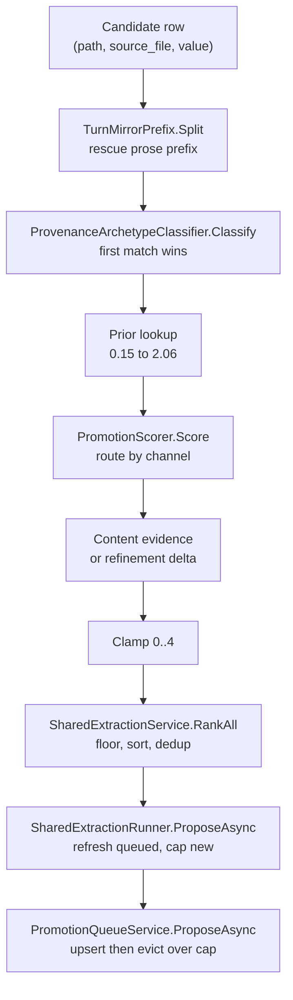
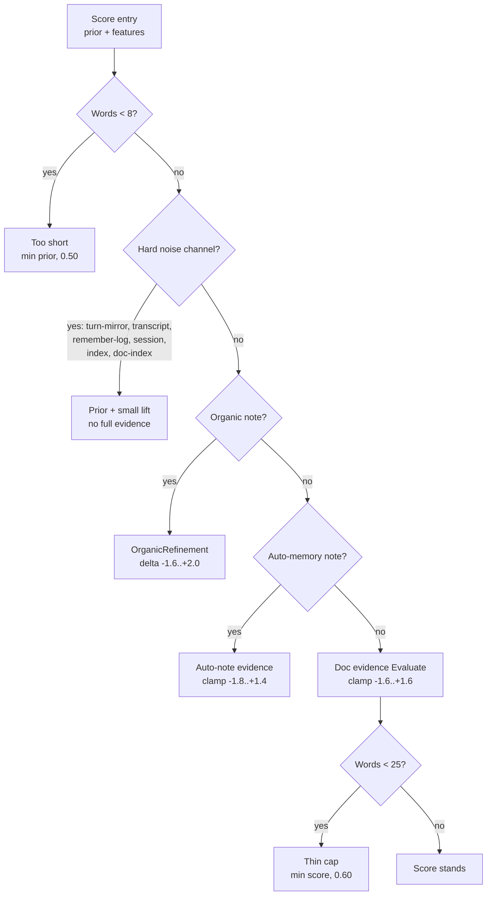
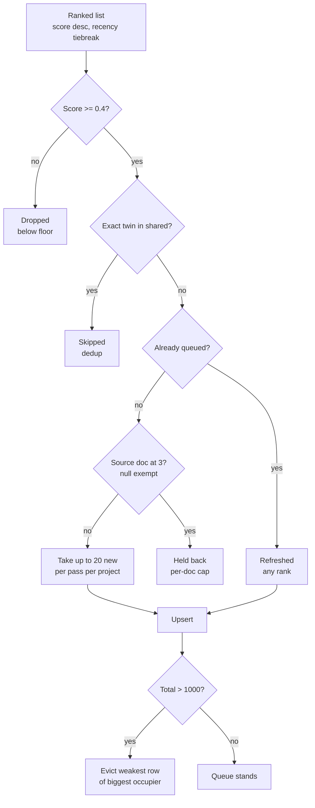

# Promotion scoring rules catalog

**Date:** 2026-09-03
**Scope:** scorer v2 as shipped (`PromotionScorer.Version = 2`), plus the admission and queue steps around it.
**Sources:** `src/AiRaccoon.Core/Memory/ProvenanceArchetype.cs`, `PromotionContentEvidence.cs`, `OrganicRefinement.cs`, `PromotionScorer.cs`, `CandidateFeatures.cs` (feature extractor), `TurnMirrorPrefix.cs`, `SharedExtractionService.cs`, `SharedExtractionRunner.cs`, `PromotionQueueService.cs` (in `src/AiRaccoon.Infrastructure/Promotion/`), `PromotionQueueSql.cs`, `IEvictionPolicy.cs`, `PromotionCapacityPolicy.cs`, `ExtractionConfigKeys.cs`. Priors pinned by `ProvenanceArchetypeClassifierTests.Prior_MatchesTheEvalReport`.

This doc has two halves. Before shows what runs today. After repeats the same tables with the proposed adjustments marked. The After half is a proposal only. No scorer code changed under it.

Marks used in the After half: **[KEPT]** (no change), **[CHANGED]** (same rule, new numbers or conditions), **[ADDED]** (new rule), **[REMOVED]** (rule gone). Old values appear struck through where they help.

## How the pieces fit

Short version. Every candidate gets a channel from its path shape. The channel picks a prior number. Content evidence then moves the score off that prior inside fixed clamps. Admission filters, sorts, dedups, caps per document, then the queue keeps the set under a global cap by dropping the weakest row of the biggest occupier.

Five sentences, and the diagrams below say the same thing in pictures.

## Before: channel priors and routing

Routing runs first-match-wins down this table. Order matters more than any single row. A transcript id as source beats an organic-looking path. A hex filename means an agent write, not a document chunk, so it routes organic before any source_file shape is read.

| # | Channel | Prior | Routes when | Tag |
|---|---|---|---|---|
| 1 | turn-mirror | 0.25 | value carries transcript markup early and twice, or markup before 300 chars with repeats | turn-mirror |
| 2 | transcript | 0.15 | source_file matches a Hermes conversation id (`hermes/` + timestamp or uuid) | (channel tag, hard noise) |
| 3 | organic-note | 2.00 | source_file empty, or path basename is hex (agent write) | organic-note |
| 4 | remember-log | 0.30 | source path under `.remember/` | remember-log |
| 5 | auto-memory-index | 0.35 | `.claude/.../memory/MEMORY.md` | auto-memory-index |
| 6 | auto-memory-session | 0.30 | `.claude/.../memory/` + session, status or handoff in name | auto-memory-session |
| 7 | auto-memory-note | 2.06 | other named files under `.claude/.../memory/` (the curated gotcha shape) | auto-memory-note |
| 8 | doc-index | 0.30 | basename is readme, changelog or index | doc-index |
| 9 | adr | 1.42 | path has `/adr/` or `/decisions/`, or a numeric prefix that is not a date | adr |
| 10 | charter | 1.70 | name holds "charter", unless dated (then review) | charter |
| 11 | explanation | 1.61 | `/explanation/`, `/design/`, or "architecture" in name | explanation |
| 12 | plan | 1.20 | `/plans/`, plan/backlog/checkpoint/dev-review in name | plan |
| 13 | review | 1.27 | `/reviews/`, review/moe-/findings/incident/diagnosis in name, dated charter | review |
| 14 | measurement | 1.03 | sweep/benchmark/-perf in name | measurement |
| 15 | research-synthesis | 1.48 | `/archive/`, or research/synthesis/report in name | research-synthesis |
| 16 | reference | 1.47 | `/reference/`, `/how-to/`, `/tutorial/` | reference |
| 17 | changelog-entry | 1.37 | `/changelog/`, `/releases/` | changelog-entry |
| 18 | catalog-page | 1.26 | `/guide`, or skills/getting-started/glossary | catalog-page |
| 19 | work-note | 1.44 | `/docs/work/` (fallback for unknown shapes too) | work-note |
| 20 | other-doc | 1.17 | `/docs/` but none of the above | other-doc |

The six priors at or under 0.35 sit under the 0.4 admission floor on purpose. They never enter the queue without a lift, and most get no lift at all.

Prose rescue comes before all of it. When transcript markup starts at or after char 300, only the prose before the markup is scored and the row is not a mirror. When markup starts early, two or more hits mark a true mirror. One early hit alone does not.

## Before: scorer dispatch gates

These run in `PromotionScorer.Score` after features are extracted from the rescued value.

| Rule | What it checks | Influence on result |
|---|---|---|
| too-short | fewer than 8 words | Score becomes the smaller of prior and 0.50. Tags `too-short`. Nothing else runs. A one-line fact cannot ride a high prior. |
| hard-noise return | channel in turn-mirror, transcript, remember-log, auto-memory-session, auto-memory-index, doc-index | Score is prior plus a small lift only. No full evidence, no refinement. transcript, turn-mirror, remember-log and session get zero lift and stay under the floor. |
| index-rule-lift | auto-memory-index with rule density at or above 1.0 per 100 words | Adds 0.15. Tags `index-rule-lift`. An index row that points at a real rule can reach 0.50. The rest stay out. |
| doc-index-lift | doc-index channel | Adds `0.25 × rule density + substance`, clamped to −0.30..+0.60. Tags `doc-index-lift`. Ceiling is 0.90, so prose quality cannot lift an index into contention. |
| organic branch | organic-note channel | Hands off to OrganicRefinement (next table but one). Prior 2.00 is only the start. |
| auto-memory-note branch | auto-memory-note channel | Hands off to the auto-note evidence. Clamp −1.8..+1.4 around the 2.06 prior. |
| doc branch | every other channel | Hands off to Evaluate. Clamp −1.6..+1.6. Then the thin cap below. |
| thin-cap | doc branch with fewer than 25 words | Score capped at 0.60. Tags `thin-cap`. Short chunks cannot outrank full ones on phrasing alone. |

## Before: doc-channel evidence (`Evaluate`)

Order is fixed. Each row adds to one running adjustment, then the total clamps to −1.6..+1.6. Tags accumulate even when the matching bonus is small, which is why the reasons table overcounts style.

| Rule | What it checks | Influence on result |
|---|---|---|
| rule-language | rule regex density per 100 words (must, never, always, cannot, prefer, invariant, trap, gotcha, contract, semantics, precedence, by design, silently, fails open, root cause, recorded here, future session/reader, and kin; `I/we cannot` excluded) | Adds `0.38 × density − 0.20`, floored at −0.20, capped at 1.00 (plan channel 0.45). Tags on any density above zero. This is the overweight. One imperative sentence tags the row. |
| measured-values | measure words (measured, benchmark, observed, verified, p95/p99, throughput, nDCG, recall@, MRR) with number+unit (`12 ms`, `3 files`, `40%`) | Full hit adds up to 0.50 scaled by counts. Two measure words without units add 0.15. Tags only on a hit. Needs a conjunction, so it fires rarely (177/1000). |
| portability | doc family only (adr, charter, explanation, measurement, research-synthesis, reference): distinct tech names minus cross-reference density | Adds `0.28 × min(tech, 5) − 0.55 − min(0.15 × xref density, 0.45)`. Centred near two techs, so it lifts and demotes in equal measure. Always tags `portability` in the family. |
| durable-rule-language | impersonal rule density (is/are/means/requires/holds/applies … never/always/only/not within 50 chars) | Adds up to 0.40 minus a 0.08 centre. Tags on any density above zero. Stricter than rule-language and the better durability tell. |
| substance | word count vs a 110-word pivot over a 90-word span | Adds `0.55 × clip((words − 110)/90, −1, +1)`. Fragments sink toward −0.55, full chunks rise toward +0.55. Median prose scores near zero. |
| heading-start | value starts with `#` after trim | Adds 0.10. Section openers get a nudge. |
| foreign-subject | another project's id or alias in the first 250 chars (jsaa covers job-search-ai-assistant, ai-raccoon covers airaccoon, and so on) | Adds 0.15. The genuinely sharing-shaped tag (152/1000). Position-gated so a passing mention at the end does not count. |
| mid-sentence | first non-space char is lowercase, `)`, `,` or `;` | Adds 0.15. Body prose outranks openers. |
| pointer-density | table-row fraction ≥ 0.55, link density ≥ 1.5, doc-name density ≥ 2.0, version rows ≥ 3 | Subtracts the sum (0.30 / 0.45 / 0.35 / 0.35), clamped to 1.00. Tags on any hit. Pointers sink even when they name tech. |
| finding-rows | finding-register table rows (`| A1 ...`) | Subtracts 0.20 for 3+, 0.12 for 1+. Review tables are not shareable facts. |
| ephemera | in-flight markers (AC:, Gate:, Effort:, worktree, Wave N, sub-agent, closes:, dispatched, owner ruling, risk if deferred, and kin) per 100 words | Subtracts up to 0.65 at 0.22 per hit. Coordination chatter sinks fast. |
| first-person | `I`, `my`, `me` per 100 words | Subtracts up to 0.55 at 0.18 per hit. Reports sink, rules do not. |
| metadata-header | `Task:/Project:/Date:` style header lines | Subtracts 0.75 for 4+, 0.45 for 2+. Frontmatter-shaped rows sink. |
| imperative-checklist | 3+ checklist lines starting with run/fix/verify/merge/check and kin | Subtracts 0.30. Checklists read as rules but carry no durable claim. This is the counterweight to rule-language, and it triggers late. |
| verified-contract | at least 1 measure word with rule density ≥ 0.8 | Adds 0.35. The strongest combination in the table: a rule with a measurement behind it. Rare by construction (295/1000 carry the tag, mostly with portability). |
| superseded | superseded/no-longer/was reversed/historical-note and kin | Subtracts 0.40. Dead decisions sink. |
| frontmatter-only | leading `---` frontmatter block | Subtracts 0.55 when under 900 chars, 0.25 above. Header-only chunks sink. |

## Before: auto-memory-note evidence

Smaller table, same idea. Clamp −1.8..+1.4 around the 2.06 prior.

| Rule | What it checks | Influence on result |
|---|---|---|
| rule-language (note) | same rule density | Adds up to 0.60 at 0.20 per density. Tags on any bonus above zero. Capped lower than the doc channel because notes already start high. |
| measured-values (note) | measure word plus number+unit | Adds 0.30. Same conjunction requirement. |
| foreign-subject (note) | same 250-char head check | Adds 0.25, stronger than the doc channel. Cross-project notes are the point of this channel. |
| substance, durability | same ramps as doc channel | Same shapes, shared helpers. |
| status-vocabulary | merged/pushed/in-flight/worktree/gate chain/suite green/passed/exit 0/dispatched and kin | Subtracts up to 1.20 at 0.12 per hit. Session-dump language sinks the note. |
| status-opener | head (first 80 chars after stripping `#*>-`) matches Done/Fixed/Verified/Merged/Status/Task closed/Cleanup complete and kin, or a generic `<X> complete/done/closed/finished/delivered` shape | Subtracts 0.80. A status report misfiled as a note sinks hard. |
| superseded | same markers | Subtracts 0.40. |

## Before: organic refinement

Runs only for organic-note. Produces a delta clamped to −1.6..+2.0, added to the 2.00 base, then clamped 0..4. Test-result counts (`174 passed`, `exit 0`, `3/4`) are stripped before real measures are counted, so a status dump cannot pose as a measurement.

| Rule | What it checks | Influence on result |
|---|---|---|
| status-opener | same opener match as auto-note | −1.20. The single biggest organic penalty. |
| status-vocabulary | same status words | −0.15 each up to −1.50. Dumps sink under their own word count. |
| second-person | your/you will/you can/as instructed/per your | −0.50. Addressed text is a reply, not a fact. |
| commit-hashes | 2+ hex hashes of 7–10 chars | −0.30. Commit logs are not durable knowledge. |
| real-measurements | 2+ loose measures after test-count stripping | +0.50. Real numbers with units survive the strip. |
| durable-fact-language | loose durable markers (facts, gotcha, root cause, must/never/always, convention, holds, by design, contract, precedence) | +0.35 each up to +1.00. The organic counterpart to durable-rule-language. |
| dated-fact | `(2026-09-01):` or `verified 2026-09` inside the first 120 chars | +0.50. Dated framing marks a kept fact. |
| foreign-subject | same head check | +0.20. |
| tech-breadth | 3+ distinct tech names | +0.25. Named-world breadth travels across projects. |
| durability | same impersonal-rule ramp | Same shape as doc channel, plus tag. |
| pointer-density | link density ≥ 1.5 or doc-name density ≥ 2.5 | −0.40. |
| table-shaped | table rows ≥ 55% of lines | −0.50. |
| contents-index | `## Contents` header | −1.20. An index is not a fact. |
| link-heavy | 3+ urls with at most 2 durable markers | −0.50. Link lists without claims sink. |
| docname-heavy | doc-name density ≥ 4 with no durable markers and rule density under 0.5 | −0.30. Filename soup sinks. |
| metadata-header | 1+ header lines | −0.35. Lower bar than the doc channel. |
| imperative-checklist | 3+ imperative items | −0.40. Stronger than the doc channel version. |
| directory-readme | value is a bare `# dir/` heading | −0.80. |
| finding-rows | 3+ finding rows | −0.70. |
| superseded | same markers | −0.40. |
| substance | same word-count ramp | Same ±0.55 shape. |
| short-definitional-floor | under 45 words with a durable marker, at most 1 status word, no status opener | Base raised to at least 2.40. Tags `short-definitional-floor`. A one-line contract survives the length ramp. |
| very-short-penalty | under 15 words | −0.30 on top. Even a definition needs a few words. |

## Before: admission and queue

Scoring picks numbers. These steps decide what the numbers buy.

| Rule | What it checks | Influence on result |
|---|---|---|
| candidate floor | score ≥ 0.4 | Below-floor rows never reach the queue. The floor sits between the hard-noise ceiling (0.35) and the weakest real channel (plan 0.70). |
| sort | score desc, then newest first | Recency breaks ties only. An old fact outranks a new anecdote at any score gap. |
| dedup | whitespace-stripped value, or `shared/<sha256(value)>.md` path, already in shared | Exact twins skip. Near-duplicates and rephrasings pass, which is why one idea can hold several slots. |
| refresh vs insert | hash already queued or not | Queued rows refresh at any rank. New rows face the per-doc cap and the per-pass limit. One pass cannot flood the queue. |
| per-doc cap | 3 chunks per source_file, highest scores first | The 4th chunk of a document waits. Null source_file (organic) is exempt and always admitted. |
| per-pass limit | 20 new rows per project per propose pass | Bounds each 30-minute loop and each tool call default. Review inflow stays steady instead of spiking. |
| global cap | 1000 rows total (`extract.queue-capacity.global`) | Over-cap proposes evict. The queue never grows past the cap. |
| eviction target | project with the most queued rows (ordinal-smallest id breaks ties) | The biggest occupier pays for every insert over cap, even its own. Small projects keep their rows. |
| eviction victim | lowest score, then oldest, in the target project | The weakest row of the biggest occupier leaves. Today that means the sub-2.0 band absorbs all churn. |
| residue sweep | queued value now in shared, or hash in `promotion_discards` | Pruned before each propose and promote. Rejected rows never return; promoted rows leave the queue. |
| scorer-version clear | row stamp vs `PromotionScorer.Version` (2) | Stale rows clear at the next propose for their project, then re-enter on merit only. A model change resets the queue without manual work. |

## After: proposed adjustments (proposal only, nothing applied)

I take the mushy-middle diagnosis seriously and I would change the scorer before touching queue plumbing. The head is good and the tail self-cleans through eviction, so every change below aims at the 2.0–3.0 band where tone currently beats durability. Read each row against its Before twin. Unmarked rows stay as they are.

### After: scorer dispatch gates

| Rule | Status | What changes |
|---|---|---|
| too-short | [KEPT] | Same 8-word trip, same 0.50 cap. |
| hard-noise return | [KEPT] | Same six channels, same zero-lift default. |
| thin-cap | [CHANGED] | Cap moves ~~0.60~~ → **0.75**, and the word bar moves ~~25~~ → **20**. Short chunks still cannot win, but a tight two-sentence contract no longer needs 25 words to breathe. |

### After: doc-channel evidence

| Rule | Status | What changes |
|---|---|---|
| rule-language | [CHANGED] | Tags only at density ≥ **0.5** per 100 words (today: any match). Bonus becomes ~~`0.38 × density − 0.20`, cap 1.00~~ → **`0.30 × density − 0.25`, cap 0.70** (plan stays lower at **0.35**). One imperative sentence no longer tags or pays; sustained rule prose still does. Expected effect: the 743 tag count falls toward the durable-rule count, and the middle spreads instead of bunching. |
| durable-rule-language | [CHANGED] | Cap moves ~~0.40~~ → **0.55**, centre stays 0.08. The stricter impersonal shape now outpays generic imperatives at every density that matters. |
| measured-values | [CHANGED] | Full-hit ceiling moves ~~0.50~~ → **0.65**. The unit-less fallback (≥2 measure words, 0.15) stays. Measurements with units should beat phrasing, full stop. |
| verified-contract | [CHANGED] | Bonus moves ~~+0.35~~ → **+0.50**, and the rule-density gate loosens ~~≥ 0.8~~ → **≥ 0.6**. A rule with a number behind it is the head shape; price it like one. |
| foreign-subject | [CHANGED] | Bonus moves ~~+0.15~~ → **+0.30**. Still head-gated at 250 chars. Cross-project aboutness is the sharing test, so it should move the number. |
| portability | [KEPT] | Same tech-minus-xref shape. It already centres near zero. |
| substance | [KEPT] | Same pivot and span. Length is the strongest content feature on the training set; leave it. |
| heading-start | [KEPT] | Same +0.10. |
| mid-sentence | [KEPT] | Same +0.15. |
| pointer-density | [KEPT] | Same penalties and clamp. |
| finding-rows | [KEPT] | Same −0.20/−0.12. |
| ephemera | [KEPT] | Same 0.22 rate, 0.65 cap. |
| first-person | [KEPT] | Same 0.18 rate, 0.55 cap. |
| metadata-header | [KEPT] | Same −0.75/−0.45. |
| imperative-checklist | [CHANGED] | Penalty moves ~~−0.30~~ → **−0.45**, and the trip moves ~~≥ 3~~ → **≥ 2** items. Checklists are the main rule-language mimic; the counterweight should trigger earlier and hit harder. |
| superseded | [KEPT] | Same −0.40. |
| frontmatter-only | [KEPT] | Same −0.55/−0.25. |
| status-vocabulary (doc) | [ADDED] | New: subtract **up to 0.50 at 0.10 per status word** in the doc channel too (today only organic and auto-note have it). Status dumps filed as docs are the leak the current table misses. Tags `status-vocabulary`. |

### After: auto-memory-note evidence

| Rule | Status | What changes |
|---|---|---|
| rule-language (note) | [CHANGED] | Same 0.5 density gate as the doc channel (today: any bonus above zero). Cap stays 0.60. |
| measured, foreign, substance, durability, status, superseded | [KEPT] | No change. This branch already prices the right shapes. |

### After: organic refinement

| Rule | Status | What changes |
|---|---|---|
| status-opener, status-vocabulary, second-person, commit-hashes | [KEPT] | The dump detectors work. Leave them. |
| real-measurements | [CHANGED] | Bonus moves ~~+0.50~~ → **+0.65** (still needs 2+ post-strip measures). Real numbers are the scarcest good signal in organic; pay them. |
| durable-fact-language | [KEPT] | Same 0.35 rate, 1.00 cap. |
| dated-fact | [KEPT] | Same +0.50. |
| short-definitional-floor | [KEPT] | Same 2.40 floor and conditions. |
| everything else | [KEPT] | Pointer, index, link-heavy, docname-heavy, metadata, checklist, readme, finding, superseded, substance and very-short rules unchanged. |

### After: admission and queue (needs a decision before code)

| Rule | Status | What changes |
|---|---|---|
| candidate floor | [CHANGED] | Static 0.4 stays as the absolute bar, but a **dynamic floor** joins it near cap: when the queue sits above 90% full, a new row must also beat the current eviction victim's score or wait for the next pass. No more churning the sub-2.0 buffer with 2.1s. |
| per-doc cap | [CHANGED] | Null source_file loses its exemption: organic rows get a **per-project per-pass cap of 5** (documents keep 3). Flood protection should not depend on having a filename. |
| project identity | [ADDED] | Canonicalize **jsaa = job-search-ai-assistant** (and any twin the `min/max(created_at)` query turns up) before fair-share accounting, or fair-share splits one project into two small ones that never pay eviction. Which id survives needs the owner call. |
| sort, dedup, refresh, limits, caps, eviction, sweep, version clear | [KEPT] | Untouched. The plumbing is sound; the scorer was the problem. |

## What I would do next

Validate the After numbers against the lane-A fixtures before merging anything (`score_round.py` over train/validation/holdout, plus the parity check against the C# port). The rule-language gate and the verified-contract bump are the two that could move Spearman either way, so run them as an ablation pair first. The queue half (dynamic floor, organic cap, id canonicalization) can land separately; none of it needs the scorer to land first.
