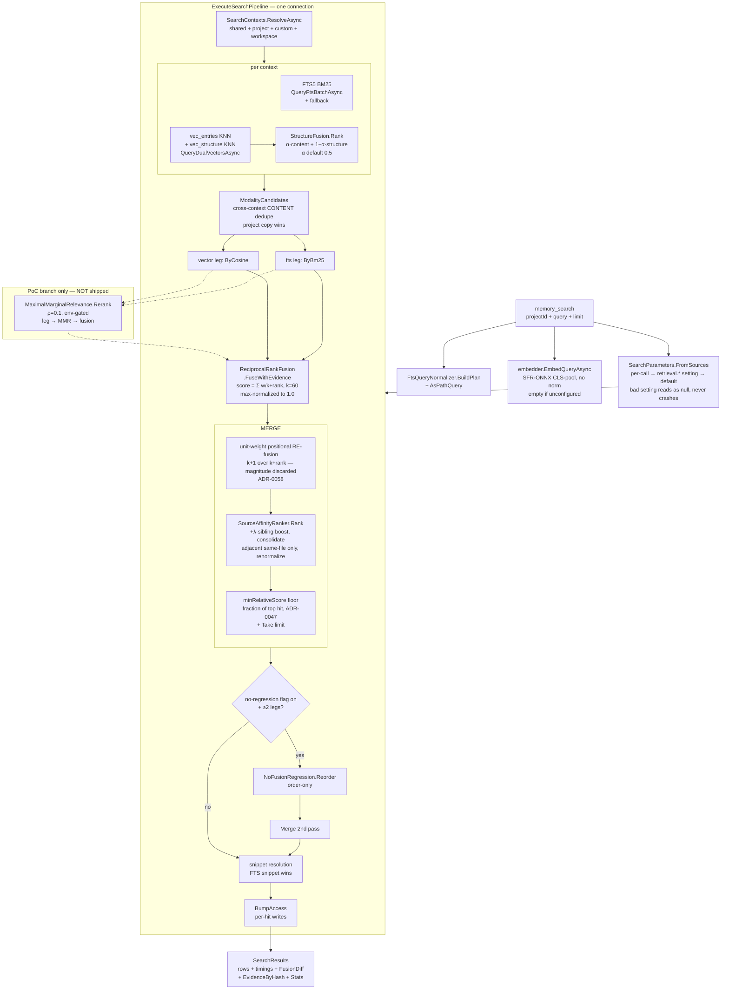
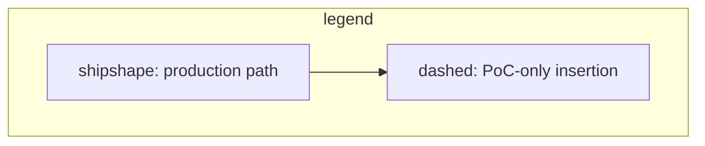

# Our retriever — block diagram (memory search path, base 95b612c2)

`memory_search` → `SqliteMemoryStore.SearchAsync` → `ExecuteSearchPipeline`.
Code: `src/AiRaccoon.Infrastructure/Sqlite/Memory/SqliteMemoryStore.cs`
(`:174 SearchAsync`, `:595 ExecuteSearchPipeline`). All defaults: limit 8, floor 0.6
(`SearchDefaults`), rrfK 60, weights 1:1, sourceLambda 0.1, threshold 0.1, Max
(`SearchParameterSettingsKeys`), structureAlpha 0.5.



Notes:

- Relevance entering `MERGE` is pure rank position (the re-fusion at RF); absolute
  match magnitude is discarded before the caller sees it (ADR-0058, ADR-0078:39).
- Dedup at DEDUP is exact-content only; consolidation at AFF is same-`SourceFile`
  adjacency only. Cross-source near-dupes pass both — the gap MMR was meant to fill
  (P0a found the served population nearly empty: `2026-09-08-mmr-bank-redundancy-probe.md`).
- The PoC leg-MMR (dashed) reorders LEGF/LEGV by `rel − ρ·sim` before FUSE at ρ=0.1;
  measured effect on 5 queries × k=8: answer-chunks 29→11/40
  (`task/air-mmr-leg-level-poc-branch`, `poc/eval-report.md`).
```


