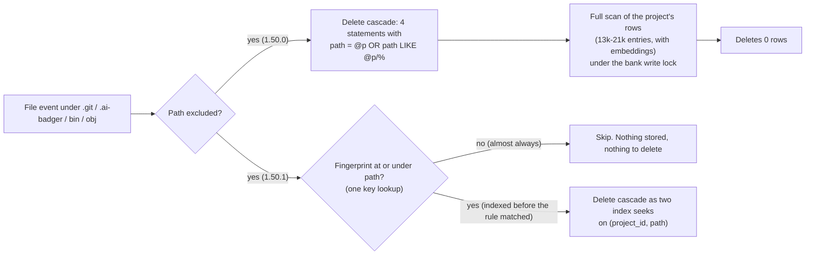
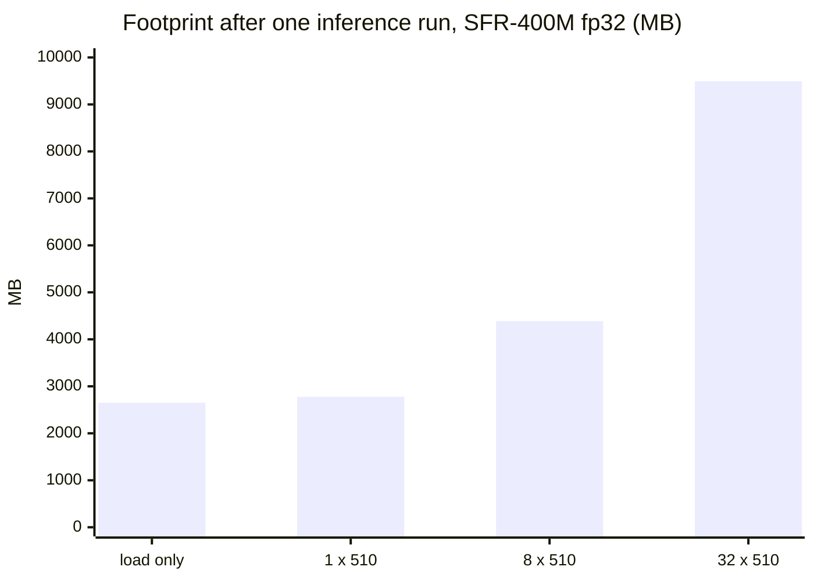
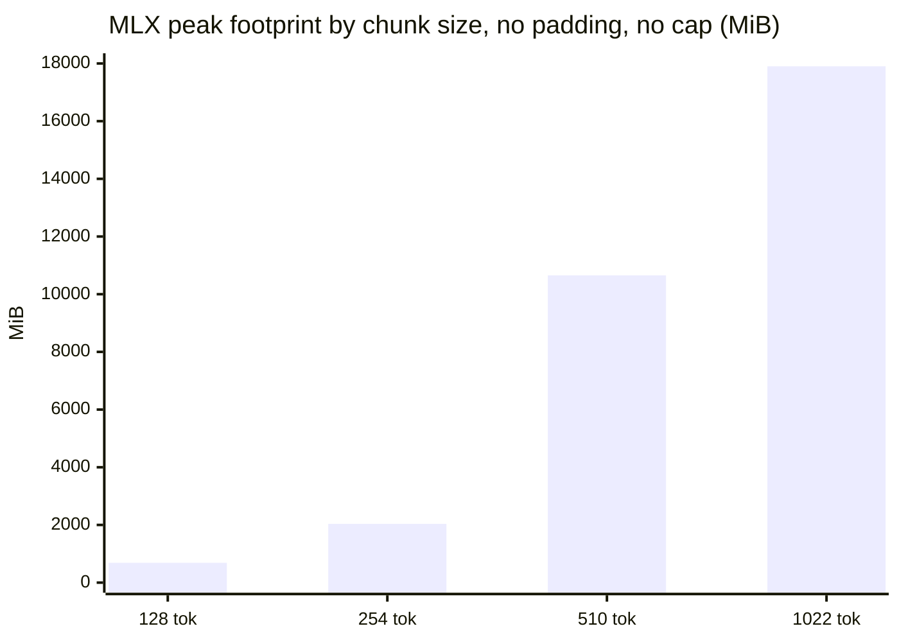
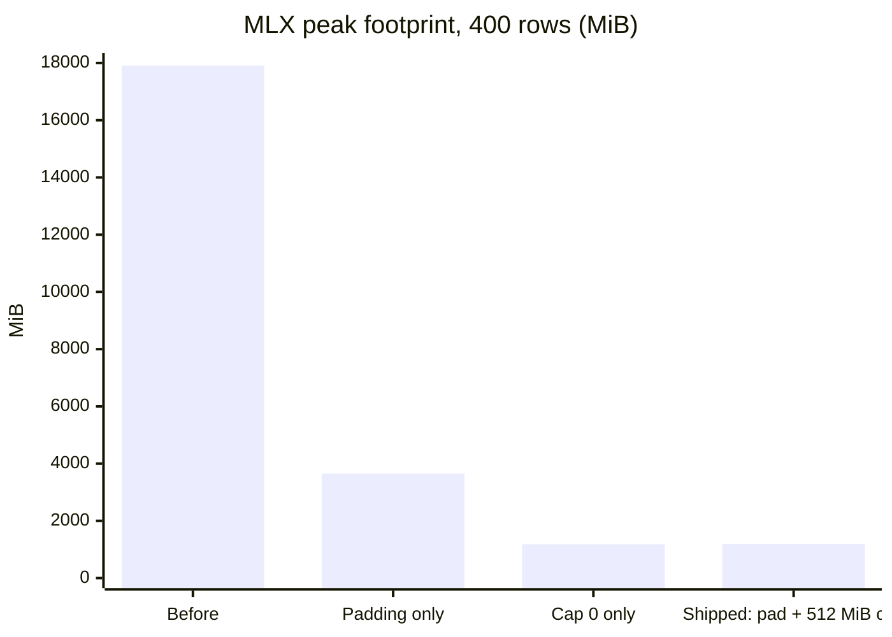
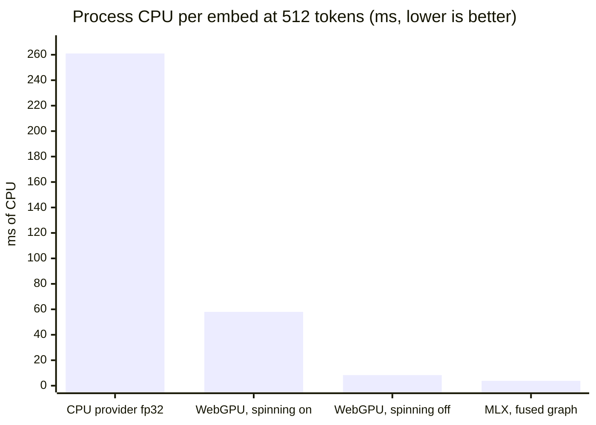
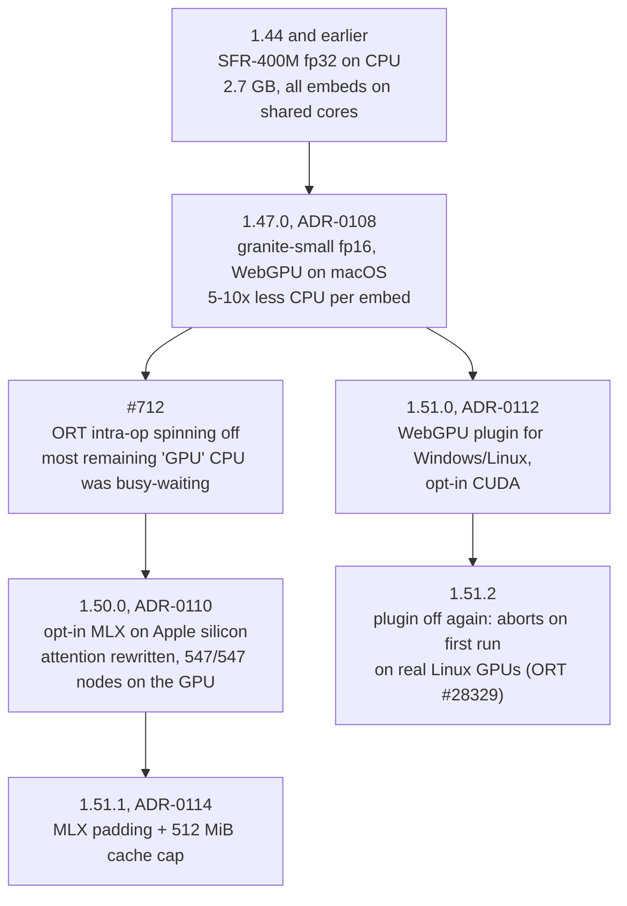

# Performance report: CPU, memory footprint and the move to the GPU

Date: 2026-09-25. Covers releases 1.44.3 through 1.51.2. A dated snapshot, like everything in
`docs/work/`: the numbers are what was measured on the day, on the machines named below.

## At a glance

| What | Before | After | Change | Release |
|---|---|---|---|---|
| Server CPU while other sessions build and commit in watched repos (same live events, 120 s windows) | 24.8-117.1 CPU-s | 1.2-2.8 CPU-s | about 40-100x less | 1.50.1 |
| Server CPU at idle, 60 s | 5.84 CPU-s | 0.42-0.64 CPU-s | -89 to -93% | 1.50.1 |
| Cost of 300 writes under `.git`/`bin`/`obj` in a watched repo | 14.17 CPU-s | 0.86-1.13 CPU-s | -92 to -94% | 1.50.1 |
| Live server physical footprint | 6.8 GB (peak 7.4 GB) | 1.75 GB (peak 1.9 GB) | 4x smaller | 1.44.3, 1.47.0 |
| Live server resident memory (RSS) | 537 MB, with 5.1 GB more in swap | 277-586 MB, nothing pushed to swap | - | 1.44.3, 1.47.0 |
| Embedding model in memory | 2.7 GB | 0.25 GB | 11x smaller | 1.47.0 |
| MLX engine footprint on a long ingest | 17.9 GB | 1.1-1.2 GB | 15x smaller | 1.51.1 |
| Process CPU per embed, 512 tokens | 253-261 ms (CPU provider) | 2.8-8.3 ms (GPU) | 30-90x less | 1.47.0-1.50.0 |

**The owner's server right now** (1.51.2, measured 2026-09-25 after 12 minutes of normal agent
use): 0.3% CPU in `ps`, 2.55 CPU-s over a 2-minute window (about 2% of one core, well under 1% of
the 10-core machine), 277-586 MB resident and a 1.75 GB physical footprint. The same server on
1.50.0 had averaged 69% of a core over its first 14 minutes.

Search quality did not move through any of this: every GPU path scores within bootstrap noise of
the CPU reference (see [Test results](#test-results)).

## Why this work was needed

ai-raccoon is a background server. It runs all day next to an IDE, a build and several agent
sessions, and nobody watches it until it gets in the way. By September it was getting in the way
in three places.

1. **CPU.** A freshly started server sat at around 10% CPU. After a machine restart that lasted
   more than an hour; on a warm machine it still lasted about a minute, and with agent sessions
   building in watched repos it never really stopped.
2. **Memory.** Activity Monitor showed the server at 6.8 GB on a 24 GB laptop, with only 537 MB of
   it resident: the rest had been pushed to swap. Later, the opt-in MLX engine reached 17.9 GB,
   three quarters of the machine's RAM.
3. **Contention.** Embedding runs on whatever it is given. On the CPU provider every embed
   competes with the compiler and the IDE for the same cores.

The three problems share a cause: work that nobody asked for, done over and over. The fixes below
each remove one repetition.

## 1. CPU: stop paying for files nobody indexes

### What was happening

Profiling the live server (macOS `sample`, `dotnet-trace`, `dotnet-counters`) showed three costs,
all driven by the file watcher.

- **Excluded-path deletes.** Every write under `.git`, `.ai-badger`, `bin` or `obj` ran the full
  path-delete cascade. Those paths are never indexed, so it deleted nothing. In a 3-minute trace
  there were 110 deletes, 106 of them for excluded paths, removing 4 rows in total. Each one took
  32 ms at the median, 358 ms at p95 and up to 863 ms, and together they held the bank's write lock
  for 10.5 s. Other writers queued behind it, which is the busy-wait that showed up in the samples.
- **Unindexable deletes.** The cascade matched `path = @path OR path LIKE @prefix`. SQLite cannot
  answer that OR from an index, so it read every row of the project. On a cold page cache, right
  after a reboot, every one of those reads went to disk. That is the hour.
- **Connection re-initialisation.** The watch loop reconciles once a second and opened the bank
  about 29 times per second. Every open reloaded the `vec0` extension (a `dlopen` with its path
  syscalls) and re-ran the schema pass, including a watch-overlap check that resolves symlinks.

### What changed (1.50.1, [PR #741](https://github.com/Arasz/ai-raccoon/pull/741))

1. An excluded path takes the delete cascade only when a fingerprint exists at or under it.
   That is the one case where something is stored: a file indexed before its ignore rule appeared.
2. Every path cascade is two index seeks, `rowid IN (… path = @p UNION ALL … path >= @p/ AND path < @p0)`,
   on a new `idx_entries_project_path` index.
3. A pooled SQLite handle loads `vec0` once. The version and digest checks re-run only when the
   bank changed underneath it (`data_version`, `schema_version`, `user_version` or
   `application_id` moved). The three steps documented as "every open" still run every open;
   an earlier version of the patch skipped them and review blocked it.

### Results

Both builds ran side by side on separate copies of the live bank (14 watches, about 50k entries),
receiving the same real file events while other agent sessions formatted, built and committed:

```mermaid
xychart-beta
    title "Server CPU per 120 s window, same live file events"
    x-axis ["Window 1", "Window 2", "Window 3"]
    y-axis "CPU seconds" 0 --> 120
    bar [106.07, 117.09, 24.82]
    bar [2.80, 1.15, 1.59]
```

*First bar in each window: 1.50.0. Second bar: 1.50.1 (nuget.org package).*

Controlled A/B on identical bank copies, after a 150 s startup settle:

```mermaid
xychart-beta
    title "Controlled A/B (CPU seconds, lower is better)"
    x-axis ["Idle 60 s", "300 hidden-dir writes"]
    y-axis "CPU seconds" 0 --> 15
    bar [5.84, 14.17]
    bar [0.64, 1.13]
```

*First bar: 1.50.0. Second bar: the shipped 1.50.1 code. An earlier cut of the patch measured
0.42 and 0.86; the shipped version keeps the every-open schema steps and costs slightly more.*

The owner's own server, after upgrading to 1.51.0, settled at 2.2 CPU-s per 2 minutes (about
1.8% of one core). On 1.50.0 it had been averaging about 69% of a core over its first 14 minutes.

## 2. Memory footprint

### What was happening

Physical footprint (Activity Monitor's Memory column) was 6.8 GB on 1.44.0, but only 537 MB of it
was resident. `vmmap` put 6.0 GB in native `malloc`, most of it swapped out. The managed .NET heap
was only 213 MB live. So the memory was going to the ONNX Runtime, not to .NET:

| Component (1.44.0, `vmmap` + `dotnet-counters`) | Measured |
|---|---|
| Physical footprint | 6.8 GB (peak 7.4 GB), 537 MB resident |
| Native `malloc` | 6.0 GB in 636k allocations, 5.1 GB of it swapped out |
| Managed .NET heap | 213 MB live, 1.45 GB committed |
| Model weights on disk (SFR-400M fp32) | 1.75 GB |
| Fresh process with only the model loaded | 2.6-2.7 GB |

Two things drove it. The model, SFR-Embedding-Code-400M in fp32, took 2.6-2.7 GB just to load.
And each embedding call ran a batch of 32 rows of 510 tokens. On the CPU a batch is not faster per
item than a single row, but it is far larger:

| Batch x tokens | Footprint after run | Time per item |
|---|---|---|
| load only | 2,564-2,743 MB | - |
| 1 x 510 | 2,776 MB | ~0.46 s |
| 8 x 510 | 4,388 MB | ~0.50 s |
| 32 x 510 | 5,948-9,492 MB | ~0.5-0.7 s |

macOS `malloc` keeps freed large blocks, so one 32-row peak stays in the process for its lifetime.

### What changed

1. **One row per session call** (1.44.3, [#669](https://github.com/Arasz/ai-raccoon/pull/669)).
   The database side still pages 32 rows at a time; only the ONNX `Run` shape changed.
2. **A smaller bundled model** (1.47.0, [ADR-0108](../adr/0108-one-bundled-engine-granite-small-fp16-on-the-gpu.md)).
   granite-embedding-small-english-r2 in fp16 is 97 MB on disk and holds 252 MB after inference,
   against 2,742-2,776 MB for SFR-400M, and it wins or ties on every retrieval eval.
3. **A bounded MLX cache** (1.51.1, [ADR-0114](../adr/0114-mlx-length-buckets-and-a-capped-buffer-cache.md)).
   See below.

### The MLX cache

The opt-in MLX engine brought its own memory problem. MLX keeps a free-buffer cache for every
distinct sequence length it has run, and ingest produces hundreds of distinct lengths. Active
memory stayed at 92 MiB while the cache grew to 17 GB. RSS never showed it; only the physical
footprint did.

The fix pads every row to the next multiple of 64 tokens (masked, so vectors are unchanged at
cosine 0.999998 or better), which collapses hundreds of shapes to a few, and caps the cache at
512 MiB with `mlx_set_cache_limit`. Measured on 400 rows of 300-1022 tokens:

| Cache cap | Padding | Row p50 | CPU-s for 400 rows | Peak footprint |
|---|---|---|---|---|
| none | none (before) | 51-68 ms | 17.8-20.7 | 17,813-17,911 MiB |
| none | x64 | 36-46 ms | 2.1-2.5 | 3,570-3,649 MiB |
| 0 | none | 39-56 ms | 5.9-12.0 | 1,038-1,181 MiB |
| **512 MiB** | **x64 (shipped)** | **35-37 ms** | **5.2-5.4** | **1,144-1,190 MiB** |

The cap costs some CPU (about 6 ms per row becomes about 13 ms, roughly 2.5 CPU-s over a 383-chunk
ingest) and no latency. Unbounded memory was the worse trade.

### Where it stands now

The owner's live server on 1.51.2, 10-12 minutes after a restart, measured with `footprint`:
**1,751-1,787 MB** (peak 1,895 MB), against 6.8 GB on 1.44.0. Its resident set was 277-586 MB,
rising and falling with activity, where 1.44.0 held 537 MB resident with 5.1 GB more swapped out.
The footprint counts memory the process owns wherever it lives (resident, compressed, swapped or
GPU-mapped), so it is the number to compare; RSS alone hid the 1.44.0 problem entirely. The 1.51.1 release checklist measured a
scratch MLX server at 866 MB (peak 909 MB) after embedding 200 notes.

## 3. Moving embedding to the GPU

### Why

A laptop's CPU is shared by everything; its GPU mostly sits idle. Every embed on the CPU provider
takes cores from the build and the IDE. Measured on an Apple M4 (ONNX Runtime 1.30.0,
granite-small, one row per run):

| Provider | Latency, 128 tok | Latency, 512 tok | CPU per embed, 512 tok |
|---|---|---|---|
| CPU, fp32 | ~12 ms | ~50 ms | 253-261 ms |
| WebGPU, fp16 (1.47.0) | 9 ms | 29 ms | 52-58 ms |
| WebGPU, intra-op spinning off | 8.3-13.0 ms | 24.2-28.8 ms | 5.2-8.3 ms |
| MLX, fully fused graph (opt-in, 1.50.0) | 6.4-7.7 ms | 21.4-23.5 ms | 2.8-3.8 ms |

### How it got there

- **fp16, not int8.** An int8 graph on the GPU reproduced its own CPU vectors only at cosine
  0.944-0.966, which would silently shift search results. fp16 WebGPU matches fp16 CPU at 0.9998.
- **Spinning.** After the move, WebGPU still used 44-47 ms of CPU per 512-token embed. Nearly all
  of it was ONNX Runtime's thread pool spinning while it waited for the GPU. Turning spinning off
  dropped it to 3.5-4.1 ms with no latency change.
- **MLX.** The stock MLX plugin rejected all 12 attention nodes, sending attention back to the CPU
  across 15 graph islands; that made it 3.4x slower than WebGPU. A graph rewrite into ops the
  plugin supports put all 547 nodes on the GPU in one fused subgraph. End to end, a 1,376-chunk
  code drain took 32.1-34.2 s on MLX against 34.1 s on WebGPU, because chunking and full-text work
  do not change with the device. MLX stays opt-in.
- **Windows and Linux.** The standard ONNX Runtime package has no WebGPU implementation off
  macOS. 1.51.0 added the WebGPU plugin (D3D12, Vulkan). Its first run on a real Linux GPU aborted
  the process (`Invalid memory type: -1`, upstream bug onnxruntime#28329). An abort cannot be
  caught, so 1.51.2 turned the plugin off. Windows and Linux run on the CPU provider today; CUDA
  is opt-in and unmeasured.

## Test results

| Check | Result | Where |
|---|---|---|
| Unit + integration suite on the CPU change | 5,571 tests; the 15 that encoded "re-open re-runs the schema pass" are kept passing by the narrowed cache | PR #741 |
| Path cascades never scan | `EXPLAIN QUERY PLAN` on every cascade statement: index seeks only, no `SCAN` | `PathSubtreeCascadeDeleteTests` |
| A path range never reaches a sibling | `docs-old`, `docs.v2`, `note_1` vs `noteX1`, non-ASCII: only the subtree matches, checked in SQLite itself | `PathSubtreeSqliteBehaviourTests` |
| Excluded path with no fingerprint skips the cascade; with one, it still cleans | red before the change, green after | `WatchDigestExecutorTests` |
| Pooled handle skips version/digest checks, but re-runs when another connection commits | both halves pinned | `SqliteConnectionFactoryTests` |
| One row per ONNX call is bit-identical to a batched row | red before the change | `OnnxEmbeddingRowIsolationTests` |
| MLX padding keeps vectors | padded length % 64 == 0, cosine >= 0.99999 | `BundledEngineBucketPaddingTests` (4/4) |
| MLX cache cap applied | cap set, fallback logged | `MlxCacheLimitTests` (3/3) |
| Release checklist, 1.51.1, nuget.org package | 25 pass, 3 substituted, 0 fail | [checklist](checklist/2026-09-25-1.51.1-release.json) |
| Checklist: 300 excluded-path events | 0.49 CPU-s, entry counts unchanged; deleting a visible file still removes its rows | `watch-excluded-path-churn-skips-cascade` |
| Checklist: MLX live | cap event 434 "512 MiB (was 23347 MiB)", footprint 866 MB after 200 notes | `mlx-bucketed-rows-and-cache-cap` |

Search quality through the product's own hybrid search, CPU vs WebGPU vs MLX:

| Corpus | CPU | WebGPU | MLX |
|---|---|---|---|
| Memory, nDCG@10 | 0.6844 | 0.6863 | 0.6839 |
| Code, nDCG@5 | 0.8247 | 0.8238 | 0.8225 |

All three are inside the bootstrap confidence interval ([-0.0171, 0.0073] for CPU vs WebGPU).

## Caveats

- **CPU-provider latency depends on machine load.** ADR-0108 measured ~12 ms / ~50 ms for the CPU
  provider at 128/512 tokens. A later session on the same M4 under a load average of 25-55 measured
  30.9-243.5 ms and 135.0-1011.8 ms. The GPU numbers agree across both. That is the argument for the
  GPU: its cost barely moves when the machine is busy.
- **The CPU A/B has no clean baseline for "idle".** Real file events kept arriving throughout, so
  the side-by-side windows (24.8-117.1 CPU-s) vary with what other sessions were doing. The
  controlled A/B holds the load equal and gives the -89 to -94% figures.
- **Different footprints for different shapes.** 1.1-1.2 GB is 400 rows of 300-1022 tokens; 866 MB
  is 200 short notes. Quote them with their shapes.
- **Windows and Linux GPU latency is unmeasured.** No machine was available; CI has no real GPU.

## Sources

- CPU: [PR #741](https://github.com/Arasz/ai-raccoon/pull/741) body and review thread,
  [changelog 1.50.1](../changelog/1.50.1-watch-cpu.md).
- Memory: [server memory usage](2026-09-23-server-memory-usage.md) (F1-F12),
  [embedding model survey](2026-09-23-embedding-model-survey.md) (F4).
- MLX memory: [ADR-0114](../adr/0114-mlx-length-buckets-and-a-capped-buffer-cache.md),
  [chunk size vs attention window](2026-09-25-chunk-size-vs-attention-window-mlx.md),
  [MLX cache limit and buckets](2026-09-25-mlx-cache-limit-and-buckets.md).
- GPU: [ADR-0108](../adr/0108-one-bundled-engine-granite-small-fp16-on-the-gpu.md),
  [ADR-0110](../adr/0110-opt-in-mlx-execution-provider-for-the-bundled-engine.md),
  [ADR-0112](../adr/0112-webgpu-plugin-off-macos-and-opt-in-cuda.md),
  [ONNX Runtime providers: GPU and MLX](2026-09-24-onnx-runtime-providers-gpu-mlx.md) (F10, F17, F25-F28, F38-F49),
  [WebGPU off macOS](2026-09-25-webgpu-off-macos.md), [changelog 1.51.2](../changelog/1.51.2-webgpu-plugin-off.md).
- Tests: [1.51.1 release checklist](checklist/2026-09-25-1.51.1-release.json).
