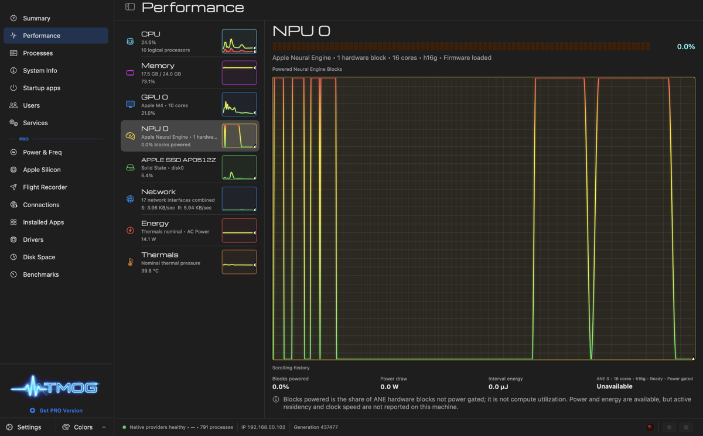

# Research: coreml against auto, cpu and mlx on an M4, through the product

**Date:** 2026-09-26
**Issue:** #764
**Follows:** ADR-0118 ("Before it can become the default", gate 2) and `scripts/device-benchmark.py` (#770).
**Question:** On the same corpus, embedded through the shipped product, does `embedding.device coreml` beat `auto` (WebGPU) on CPU-seconds by range separation, and does it lose on p95 search latency?

**Answer:** It wins on CPU-seconds, and the ranges don't touch: 24.6 to 27.1 CPU-s per drain against 41.8 to 43.9 for `auto`. It also drains in half the time and at roughly a quarter of the system energy. The p95 half of the gate is answered in F4.

Evidence: `docs/work/device-benchmark/2026-09-26-m4/` (`result.json`, `result.md`, `corpus-manifest.json`). The 217 MB powermetrics plist and the 3 MB ioreg trace stayed on the owner's machine.

## Setup

- Apple M4 (Mac16,12), AiRaccoon 1.53.0 (`43138aa9`), run by the owner with `--devices auto,cpu,mlx,coreml --repeats 3`.
- Corpus: `docs/adr`, `docs/plans`, `docs/reviews`, `docs/reference` and `docs/research` at `43138aa9`, 225 files, 4914 chunks (tier 1, picked by the calibration drain).
- Every run gets its own bank copy and server on a scratch port. The slots are interleaved, so no device owns a thermal window.
- SoC energy comes from `sudo powermetrics` (cpu, gpu, ane rails). System energy comes from the AppleSmartBattery SystemLoad accumulator. Both are net of the idle baseline.

## Findings

### F1: coreml wins on CPU-seconds, with separated ranges [MEASURED]

| device | CPU-s per repeat | median |
|---|---|---|
| coreml | 24.6, 27.1, 26.2 | 26.2 |
| auto (WebGPU) | 43.9, 41.8, 42.0 | 42.0 |
| mlx | 40.4, 36.3, 37.3 | 37.3 |
| cpu | 947.3, 863.3, 846.7 | 863.3 |

The worst coreml repeat is 14.7 CPU-s below the best `auto` repeat. That clears the first half of gate 2. Against MLX, coreml costs 70% of the CPU here, not the 6-8% the isolated encoder A/B showed (`docs/work/2026-09-25-ane-layout-reexport.md`), because this number is the whole server: HTTP, chunking, SQLite writes and the vector index, not just the encoder.

### F2: time and energy follow the same order [MEASURED]

| device | median wall s | system net J | SoC net J | system mJ/chunk |
|---|---|---|---|---|
| coreml | 33.1 | 379 | 214 | 77 |
| mlx | 48.8 | 1146 | 759 | 233 |
| auto | 70.4 | 1389 | 936 | 283 |
| cpu | 169.6 | 4076 | 2493 | 830 |

All three per-device comparisons against `auto` come out separated on system energy, SoC energy and wall time.

### F3: one slow coreml repeat, and it was idle, not busy [MEASURED, cause INFERRED]

The first warm coreml repeat took 45.7 s against 32.3 and 33.1 s for the other two. Its CPU-seconds (24.6) and SoC energy (209 J) match the fast repeats, so the extra 12 s did no work. The likeliest cause is the first load of the compiled model onto the Neural Engine after the cold compile, where `aned` pages the program in. That is unverified. The median hides it; a later run should show whether it repeats.

The cold compile itself took 37.3 s, 30.4 compiler CPU-s and 948 J of system energy. Every warm start after it loaded in 1.0 s.

### F4: p95 search latency

Pending. The benchmark above measures drains, not searches.

### F5: the owner's live server runs on the Neural Engine after opting in [MEASURED]

On 2026-09-27 the owner's own server (1.53.1, port 7721) was switched with `settings model device coreml` and restarted. `doctor` then went from `CompilingNeuralEngine` (10:04:07Z) to `NeuralEngineServing` with 4 buckets loaded, every probe row at cosine 0.999, and an 808 MiB cache (10:04:44Z). A system monitor shows the Neural Engine blocks powered in bursts during that compile and during later embedding work, and power-gated at idle.

"Blocks powered" is the share of the engine that is not power-gated, not its utilization. `powermetrics --samplers ane_power` is the stronger check (1276 mW under load in `docs/work/2026-09-25-ane-layout-reexport.md`, F6).

## What this does not settle

- Gate 1 (a second chip) and gate 3 (one release of opt-in use) are untouched.
- One machine, one run of three repeats. The CPU separation is wide enough that noise is unlikely to close it, but it has not been reproduced.
