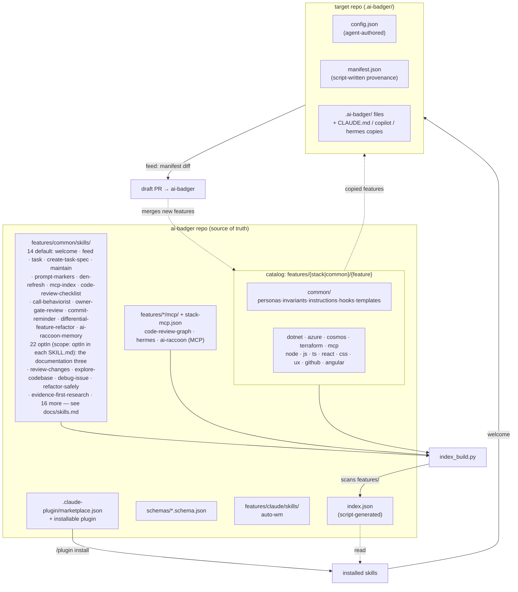

<p align="center">
  
</p>

# ai-badger

**ai-badger** is the source of truth for custom coding agent skills, personas, invariants, and
instructions used across projects. It is three things in one repo:

1. **A catalog** of reusable framework features (skills, personas, invariants, instructions,
   curated plugin bundles) organized by technology stack.
2. **An agent plugin** — install it once for Claude Code, Copilot, or Hermes, and it
   hands you the tooling to use the catalog.
3. **A project scaffolder** — `welcome-ai-badger` reads a target repo, proposes a profile, and
   materializes a tailored slice of the catalog into it; `feed-badger` harvests generalizable
   improvements a project made back into the catalog via a draft PR; `den-refresh` pulls
   framework updates into an already-scaffolded project.

Badger-themed name, professional-grade contents: the badger digs the framework into your repo
and digs improvements back out.

## Two things it does that instruction files don't

### It measures where your tokens actually go

Of 205 agent dispatches in this repository, **101 named no model** and silently inherited the
session's — which is the expensive one. Nobody chose that. It simply was not recorded, so it
was not visible.

The `/task` skill now reads the session transcript, including `<session-id>/subagents/*.jsonl`
where dispatched work actually lives, and records which model produced each task's output,
how many dispatches ran, and how many declared a model. `task_tracker.py status` prints
`mix=opus-5:69%`, so "delegate the mechanical work" stops being advice and becomes something
you can check afterwards.

The reason to track model mix rather than the obvious alternative: **cache efficiency is
saturated.** Across 1250 sessions it measured 0.975–0.986 — on every single one, including
the most expensive. It cannot separate a cheap task from a costly one. Model mix can.

How much it matters, with the conditions attached, because a coefficient without them is
decoration:

```
24 project-days, one developer's machine, three repositories, July 2026
delegation ratio = share of output tokens on non-top-tier models

    $/M output  ≈  237  −  188 × delegation_ratio        r = −0.813  (r² = 0.66)
```

So roughly $19 per million output tokens for every 10 points of delegation. That is a
correlation over a small, single-source sample, and work type is an obvious confound — hard
reasoning legitimately needs the expensive tier, so 100% is not the target. Treat it as a
before/after instrument on comparable work, not a forecast.

Measuring the leak was the first half. Since 0.60.0 it is also closed up front: every persona
in the catalog carries a `model:` lane, and a `PreToolUse` gate denies a dispatch that names
neither a model of its own nor a persona that has one — see
[ADR-0015](docs/adr/0015-delegation-needs-a-mechanism-not-more-prose.md).

### Its gates refuse, rather than warn

Agent-written changes fail quietly: a doc drifts from the code, a test stops being able to
fail, a release ships untagged. ai-badger's gates run in CI and in the pre-push hook, and they
exit non-zero.

Every row below is a real refusal from one day of work on this repo — all of them catching an
agent, several of them catching this framework's own maintainer:

| Gate | What it caught |
|---|---|
| `index_build` | a `$schema` key in `stack.json`, which is folded wholesale into `index.json` |
| `release_guard` | 0.58.0 had a changelog entry and no git tag |
| `scaffold_freshness_guard` | a scaffolded script left stale by an edit to its source |
| `docs_guard` | a documented command missing the path that makes it copy-pasteable |
| MCP catalog tests | invented tool tags outside the closed vocabulary; a `server.md` 21 lines against a 15-line budget |
| `tdd_guard` | shipped code changed with no test beside it |

The budget one is the flavour of the whole thing. `server.md` lands verbatim in every agent
file, every session, so it is capped at 15 lines — policy, not a manual.

What none of this covers yet: the gates check the artefacts, not the reasoning. A confidently
wrong claim in a PR body passes every one of them. That still needs a reviewer.

## Supported agents

| Agent | Status | Notes |
|---|---|---|
| **Claude Code** | Full | Plugin hooks, `CLAUDE.md`, task extensions |
| **Hermes Agent** | Full | `HERMES.md`/`.hermes.md`, `delegate_task`, skill auto-discovery |
| **GitHub Copilot** | Scaffolded | `.github/copilot-instructions.md`, scoped instructions |

## Supported stacks

`ai-raccoon`, `angular`, `aspire`, `azure`, `changelog`, `cosmos`, `css`, `dotnet`, `github`, `js`,
`mcp`, `node`, `python`, `react`, `terraform`, `ts`, `ux` — plus **`common`** for stack-agnostic content and
agent-specific stacks (`claude`, `copilot`, `hermes`). Derive it rather than quoting this line:
`ls features/`.

## Install

```
/plugin marketplace add https://github.com/Arasz/ai-badger
/plugin install ai-badger
```

This installs the fourteen `default` skills: `welcome-ai-badger`, `feed-badger`, `den-refresh`,
`task`, `create-task-spec`, `maintain-agent-instructions`, `prompt-markers`, `mcp-index`,
`code-review-checklist`, `call-behaviorist`, `owner-gate-review`, `commit-reminder`,
`differential-feature-refactor`, and `ai-raccoon-memory` — plus `auto-wm`, which is stack-local
to Claude.

Eight more are catalogued but withheld until a project names them in `config.include.skills`
(ADR-0005). See [`docs/skills.md`](docs/skills.md) for what each one does, when to reach for it,
and which arrive unasked.

## Quickstart

New here? [`docs/getting-started.md`](docs/getting-started.md) walks one project from "found the
repo" to a committed scaffold — the plugin-vs-clone decision, the literal commands with their real
output, and the failures that actually bite.

Run **`welcome-ai-badger`** inside a project you want to scaffold:

1. It detects stacks, present agents (`claude`, `copilot`, `hermes`), and commands from
   the repo and asks you to confirm/refine a `.ai-badger/config.json` profile (project summary,
   domain, persona routing, plugin scope).
2. It materializes `.ai-badger/` — selected skills, personas, invariants, instructions, an
   assembled `CLAUDE.md` (or `HERMES.md`), and plugin installs — recording exactly what it wrote
   in `.ai-badger/manifest.json`.
3. Essential agent-discovery files (`CLAUDE.md`, `.github/copilot-instructions.md`,
   `HERMES.md`/`.hermes.md`) are copied into their conventional locations
   with a header pointing back at `.ai-badger/` as the source of truth, since some agent CLIs
   only look there.

Once you've customized things and want to contribute agnostic improvements back, run
**`feed-badger`**: it diffs the project's `.ai-badger/` tree against `manifest.json`, classifies
each change as project-specific or generalizable, generalizes the generalizable ones, and opens
a draft PR against `ai-badger` with the rationale.

To pull framework updates into an already-scaffolded project, run **`den-refresh`**: it checks
what changed upstream, re-scaffolds with your existing `config.json`, and reports the result.
Seed-once files (`state.json`, `markers-context.json`) are preserved.

See [`docs/README.md`](docs/README.md) for the full documentation map,
[`docs/dictionary.md`](docs/dictionary.md) for how ai-badger concepts map to each agent's
native terminology, or [`docs/changelog/`](docs/changelog/) for version history.

## The 3-layer model: `features/{stack | common}/{feature}`

Everything in the catalog is filed under a **stack** (a technology) and a **feature** (a kind
of asset: `personas`, `invariants`, `instructions`, `skills`, `hooks`, `adjustments`, `templates`,
`mcp`).

```
features/<stack>/<feature>/<item>
```

- **personas**, **invariants**, and **instructions** are individual `*.md` files, named by
  filename stem. A project can add its own invariants: `*.md` files in the scaffolded
  `.ai-badger/invariants/local/` render after the catalog ones and are never overwritten.
- **skills** — the installable operational skills live at `features/common/skills/` (each
  containing a `SKILL.md` plus scripts/references). Config-gated *extensions* live inline at
  `features/common/skills/<skill>/extensions/<ext>/` with `extension.json` activation
  conditions. Skills may carry a `project-local.md` for project-specific additions (seed-once).
  Skills with a `<!-- MERGE_EXTENSIONS -->` marker in SKILL.md have their extensions merged
  into the skill file at scaffold time; others keep extensions as separate files.
- **hooks** — Claude Code and Hermes Agent hook scripts at `features/common/hooks/` with a
  `hooks-manifest.json` mapping hooks to agents.
- **adjustments** — per-agent scaffold adjustments at `features/{agent}/adjustments/`.
- **mcp** — one directory per MCP server at `features/{stack}/mcp/{server}/`, each carrying a
  `meta.json`. What a server is *for* travels with the catalog whatever route the server itself
  arrived by; `features/{stack}/stack-mcp.json` separately declares the ones ai-badger may
  launch (see [ADR-0014](docs/adr/0014-mcp-support-is-configuration-not-retrieval.md)).

A script-generated `index.json` at the repo root scans this tree and is the single source of
truth the scaffolder and feed tooling read — see
[`docs/framework-architecture.md`](docs/framework-architecture.md) for the full model.

### Scaffolding.json — declarative agent file generation

Each agent has a `features/<agent>/scaffolding.json` that declares what files to scaffold into
a target project. This replaces hardcoded agent-specific logic in `scaffold.py` — all agents
are data-driven. See [`schemas/scaffolding.schema.json`](schemas/scaffolding.schema.json) for
the schema.

## Skills

| Skill | What it does |
|---|---|
| **welcome-ai-badger** | Bootstrap a new project: detect stacks → config → scaffold |
| **feed-badger** | Harvest project improvements back into the framework |
| **den-refresh** | Pull framework updates into an already-scaffolded project |
| **task** | Orchestrate backlog tasks with TDD, delegation, and PR workflow; owns a git worktree per task |
| **create-task-spec** | Interrogate an idea into a Gherkin specification plus a manifest `task` consumes |
| **maintain-agent-instructions** | Keep agent instruction files in sync with the catalog |
| **auto-wm** | Autonomous working mode: partner/away/disable transitions |
| **prompt-markers** | Structured prompt markers (`h:`, `f:`, `e:`) for agent communication |
| **mcp-index** | MCP tool index with tag + intent semantic matching |
| **code-review-checklist** | Aviation-style preflight checks for a PR or diff |
| **call-behaviorist** | Debug audit log for ai-badger's own hooks, and a health report |
| **owner-gate-review** | A per-decision review form whose answers stay bound to their decision |
| **commit-reminder** | A `PostToolUse` hook that commands a commit once work sits uncommitted |
| **differential-feature-refactor** | Separate design intent from accumulated cruft before scoping a refactor |
| **ai-raccoon-memory** | Project memory server: search memory first, write durable facts with source paths, watch a docs directory |

What each one does in detail, and the situation that calls for it: [`docs/skills.md`](docs/skills.md).

## Bundled MCP servers

In addition to skills, ai-badger bundles MCP servers that are auto-scaffolded into
your project during `welcome-ai-badger` or `den-refresh`:

| Server | What it does |
|---|---|
| [**code-review-graph**](https://github.com/tirth8205/code-review-graph) | Local-first code intelligence graph for MCP. Builds a persistent map of your codebase so AI coding tools read only what matters — used for code review, impact analysis, and architecture exploration. |
| [**hermes**](https://hermes-agent.nousresearch.com/docs/user-guide/features/mcp#running-hermes-as-an-mcp-server) | Hermes Agent's stdio MCP bridge: list conversations, read history, poll live events, send messages, manage approvals. Declared only when `hermes` is on PATH. |
| [**ai-raccoon**](https://github.com/Arasz/ai-raccoon) | Project memory server: semantic search, durable-fact writes, workspaces, docs watching. Declared only when `ai-raccoon` is on PATH. |

Each server is a catalog item under `features/<stack>/mcp/<server>/`, carrying the prose
injected into every agent file. `features/common/stack-mcp.json` says which servers a stack
wants and which of them are written into `.mcp.json` during scaffold (ADR-0014);
`hermes` and `ai-raccoon` are conditional on their CLI being on PATH.

> **Hermes users:** Hermes reads MCP servers only from `~/.hermes/config.yaml`
> (`mcp_servers:`) — it has no project route, so a server written to `.mcp.json` is
> invisible to Hermes sessions. ai-badger prints the block to merge instead of writing
> user-global config (ADR-0014 decision 6); run `hermes mcp add <name> --command <cmd>`
> once per machine (or merge the printed block) to make a server available to Hermes.

## Architecture overview

```
ai-badger/
  index.json                     # SOURCE OF TRUTH: every feature for every stack (script-generated)
  README.md   LICENSE (MIT)   VERSION   BREAKING_VERSIONS
  CONTRIBUTING.md   SECURITY.md   CODE_OF_CONDUCT.md   RELEASING.md
  .claude-plugin/marketplace.json   # ai-badger is itself installable, plugin source "./"
  .claude-plugin/plugin.json        # the installable plugin wrapping the root skills
  skills/                        # What the plugin exposes to Claude Code (generated from features/)
  schemas/                       # JSON Schema for every *.json model
  engine/                        # The library every bootstrap shim imports (badger_lib)
  tooling/                       # Maintainer catalog and release tooling (no LLM, no network)
  gates/                         # Repo quality gates, run only by CI and the pre-push hook
  docs/                          # Architecture, authoring guides, ADRs
  features/
    common/
      skills/                    # 36 skills; the 14 with scope: default are
        task/ welcome-ai-badger/ feed-badger/ den-refresh/
        create-task-spec/ maintain-agent-instructions/ prompt-markers/ mcp-index/
        code-review-checklist/ call-behaviorist/ owner-gate-review/
        commit-reminder/ differential-feature-refactor/ ai-raccoon-memory/
      personas/{architect, test-engineer, code-reviewer, delegator}.md
      invariants/*.md            # Agnostic invariant snippets
      instructions/*.md          # Agnostic scoped instructions
      hooks/                     # Claude + Hermes hooks with hooks-manifest.json
      skills-source.json         # External skill sources
      skills.json                # External skills to install
      mcp/                       # MCP server catalog (code-review-graph, …)
      stack-mcp.json             # Which MCP servers this stack wants, and how to launch them
      templates/                 # CLAUDE.md.tmpl, HERMES.md.tmpl, delegation.md.tmpl,
                                 # state.json, agent-instructions
    dotnet/ azure/ cosmos/ terraform/ mcp/ changelog/  {personas,invariants,instructions}/…
    github/    (stack-specific features; extensions now inline in skills/)
    claude/    skills/auto-wm/, adjustments/   # agent-specific, not common
    hermes/ copilot/   adjustments/     # per-agent scaffolding tweaks
    angular/ node/ js/ ts/ react/ css/  {personas,invariants,instructions}/…
    hermes/    {personas,instructions,adjustments}/…
    claude/ copilot/     Agent-specific templates + plugins-instructions.json
```

### Framework overview — structure & data flow



## Requirements

The framework scripts (`index_build.py`, `validate.py`, `detect.py`, `scaffold.py`, …) are
mechanical Python with one dependency:

```bash
python3 -m pip install -r engine/requirements.txt   # jsonschema
```

## Logo

The mark at the top of this file is a badger whose stripes are circuit traces, peeking over a
terminal with its paws on the edge — the name and the "digs into your repo" line, drawn. It is
hand-authored SVG, so no third-party image licence attaches to it.
[`docs/brand/`](docs/brand/README.md) has the palette, the usage rules, and the variants not yet
drawn.

## Contributing

Read [`CONTRIBUTING.md`](CONTRIBUTING.md) first — it covers setup, the failing-test-first
workflow this repo actually enforces, and every gate CI runs. The short version: branch (never
push to `main`), write the failing test before the code, one task per PR, and let
`gates/release_guard.py` tell you whether a `VERSION` bump and a `docs/changelog/` entry are
due.

Releases are a separate, deliberate step — [`RELEASING.md`](RELEASING.md). Decisions that would
otherwise get re-litigated are recorded as ADRs in [`docs/adr/`](docs/adr/README.md).

Participation is governed by [`CODE_OF_CONDUCT.md`](CODE_OF_CONDUCT.md).

## Security

Do not open a public issue for a security problem — report it privately through GitHub's
**Security → Report a vulnerability** tab. [`SECURITY.md`](SECURITY.md) has the threat model, the
supported-version policy, and what hardening is already in place.

## License

MIT — see [`LICENSE`](LICENSE). Copyright (c) 2026 Rafał Araszkiewicz.
