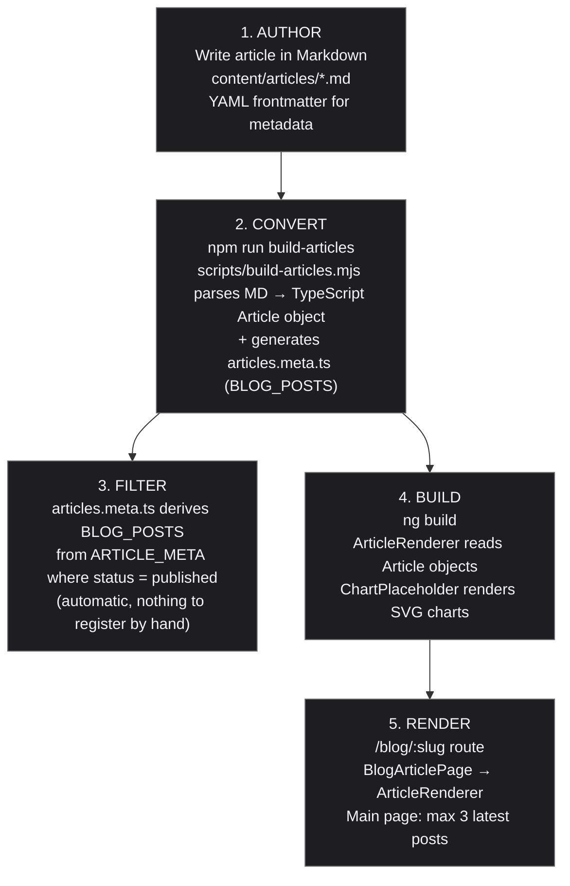
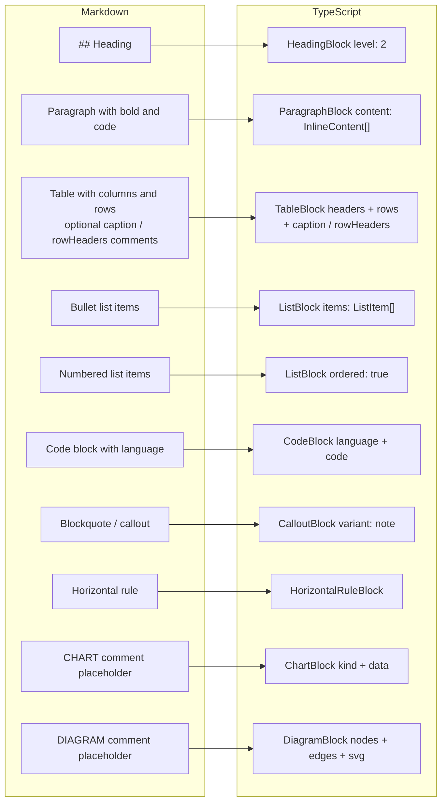

# Article Pipeline

How blog articles flow from authoring to rendering on arasz-home-page.

## Flowchart



## MD → TS Mapping



## Table caption and row headers

A table may be followed by metadata comments, the same convention `CHART` and `DIAGRAM` use:

```markdown
| Provider | Cost |
| --- | --- |
| Xiaomi | $0.003 |
<!-- caption: Cost per call by provider -->
<!-- rowHeaders: true -->
```

`caption` renders as the table's `<caption>`; `rowHeaders: true` renders each row's first cell
as a `<th>` instead of a `<td>`. Both are optional and omitted entirely when absent.

## Collapsible details

A side story — a methodology note, a long table of raw numbers — can be folded behind a label,
using the same comment convention:

```markdown
<!-- DETAILS: methodology -->
Prices were read from each provider's invoice, not its pricing page.

| Provider | Source |
| --- | --- |
| Anthropic | invoice |
<!-- /DETAILS -->
```

The text after `DETAILS:` is the summary label and is required. It renders as a native
`<details>` element: closed on arrival, opened by keyboard or pointer with no JavaScript, and
present in the prerendered HTML whether or not anyone opens it.

Inside, anything the other block parsers produce works — paragraphs, lists, tables, code
blocks, callouts, `---`. A chart, a diagram, or another `DETAILS` block **fails the build**,
naming the article and the construct, rather than disappearing from the page in silence.

## Images

A screenshot that isn't a build-time chart or diagram goes in as an image block, using the same
comment convention:

```markdown
<!-- IMAGE: owner-gate-review -->
<!-- src: /screenshots/owner-gate-review.webp -->
<!-- alt: A generated review page listing fourteen decisions, each with approve/change/reject/defer buttons -->
<!-- caption: One review page, fourteen decisions, one reviewer. -->
<!-- width: 1500 -->
<!-- height: 1788 -->
```

`src` and `alt` are required — a block missing either **fails the build**, naming the image id
and the missing field, the same refusal `DETAILS` already uses rather than shipping a broken
``. `caption`, `width` and `height` are optional; when given, `width`/`height` must be a
**positive whole number of intrinsic pixels**. Non-numeric, zero, negative, fractional and blank
values all fail the build — each of them renders while reserving no space, which is the one thing
the attribute is there to do.

Unlike `CHART`/`DIAGRAM`, an image has no build-time layout step, so it is allowed inside a
`DETAILS` block.

The renderer emits a `<figure>` with a lazily-loaded, async-decoded `` — `width`/`height`
reserve its layout space before the image loads, so it can't cause a layout shift — and a
`<figcaption>` when a caption is given.

## Adding a block type

`parseBlocks` is a dispatch loop over `BLOCK_PARSERS`. Each parser takes `(lines, i)` and
either claims the block — returning `{block, next}`, where `next` is the line to resume at —
or returns `null` so the next one can try. Order in the array decides precedence, and the
paragraph fallback must stay last because it claims whatever is left.

To add a block type: write the parser, insert it before `parseParagraph`, add a `case` to
`tsInline`/`tsBlock` so it serializes, list its helper in `allHelpers` so the generated import
includes it, and render it in `article-renderer.html`. Missing any one of those four is silent —
the two most recent parser bugs were exactly that shape.

## Files

| File                                                | Purpose                                          |
|-----------------------------------------------------|--------------------------------------------------|
| `content/articles/*.md`                             | Source Markdown articles with YAML frontmatter   |
| `frontend/scripts/build-articles.mjs`               | Converter: MD → TypeScript Article object        |
| `frontend/scripts/tests/test-build-articles.mjs`    | TDD tests for the converter                      |
| `frontend/scripts/diagram-layout.mjs`               | Dagre layout + SVG rendering for DiagramBlock    |
| `frontend/src/app/models/article.ts`                | TypeScript types + helper functions              |
| `frontend/src/app/models/blog-category.ts`          | `BLOG_CATEGORIES` taxonomy + derived `BlogCategory` type |
| `frontend/src/app/data/articles/*.data.ts`          | Generated Article objects (one per article)      |
| `frontend/src/app/data/articles/articles.provider.ts` | Generated barrel over full articles (reader route only) |
| `frontend/src/app/data/articles/articles.meta.ts`   | Generated metadata + `BLOG_POSTS` for listings   |
| `frontend/src/app/components/article-renderer/`     | Renders Article objects to HTML                  |
| `frontend/src/app/components/chart-renderer/`       | Renders ChartBlock via ApexCharts                |
| `frontend/src/app/components/diagram-renderer/`     | Renders DiagramBlock's build-time SVG            |

## Creating a New Article

1. Write the article in `content/articles/my-article.md` with YAML frontmatter:

```markdown
---
title: My Article Title
slug: my-article
publishedAt: 2026-07-23
author: Rafał Araszkiewicz
description: Short description for SEO
tags: [AI, Angular, TypeScript]
status: draft
categories: [agent-frameworks]
---
```

`categories` is required, non-empty, and closed to the taxonomy defined by `BLOG_CATEGORIES` in
`frontend/src/app/models/blog-category.ts`. `npm run build-articles` refuses to build an article
with a missing/empty/unknown list, or with the legacy singular `category` key.

Reading time is not frontmatter: `calculateReadingTimeMinutes` in `frontend/src/app/models/article.ts`
computes it at render time from the article's blocks (200 wpm, code blocks excluded), so there is no
stored number to drift out of sync.

```markdown

## Section Heading

Content with **bold**, `code`, and [links](https://example.com).

| Column A | Column B |
|----------|----------|
| Cell 1   | Cell 2   |

- List item 1
- List item 2

<!-- CHART: my-chart-id -->
<!-- kind: bar-horizontal -->
<!-- title: Cost comparison -->

> **Note:** This is a callout block.

\`\`\`typescript
const x = 1;
\`\`\`
```

2. Run the converter, from `frontend/`:

```bash
npm run build-articles
```

This runs `frontend/scripts/build-articles.mjs`, which parses every file under `content/articles/`
and (re)generates the `.data.ts` files under `frontend/src/app/data/articles/`, including
`articles.meta.ts`.

3. Nothing to register by hand. `articles.meta.ts` derives `BLOG_POSTS` from `ARTICLE_META`,
   filtered to `status === 'published'`. An article with `status: draft` is generated and
   reachable by direct URL (the route resolver reads the unfiltered `ARTICLE_META`), but it is
   left out of `BLOG_POSTS`, and everything that draws from `BLOG_POSTS` follows: it does not
   appear in listings, `app.routes.server.ts` does not prerender it (`getPrerenderParams` maps
   over `BLOG_POSTS`), and it is absent from the generated RSS feed and sitemap. Flip `status` to
   `published` and rerun the build when the article is ready.

4. Build and verify:

```bash
cd frontend && npm run build && npm run test:single && npm run lint
```

## Chart Placeholders

Charts are specified in Markdown as HTML comments:

```
<!-- CHART: unique-id -->
<!-- kind: bar-horizontal | bar-vertical | donut | scatter | timeline -->
<!-- title: Human-readable chart title -->
<!-- data: Label1 $value1, Label2 $value2 -->
<!-- lowerIsBetter: true -->
<!-- xLabel: $/MTok -->
```

The converter creates a `ChartBlock` node. The `ChartPlaceholderComponent` renders it as an inline SVG. Chart colors are monochrome (design tokens only — no hue).

## Currency & VAT Rules

- Claude/Anthropic: **EUR**, includes 23% Polish VAT. Convert to USD at noted rate.
- OpenRouter, Copilot, Qwen: **USD**.
- Always state: "All figures in USD unless noted."
